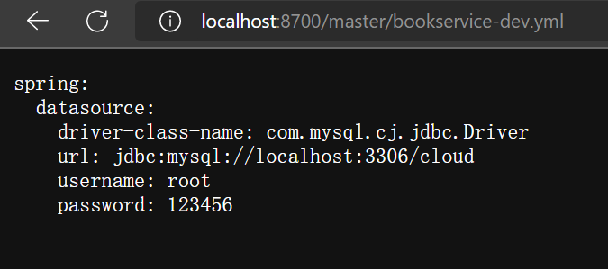
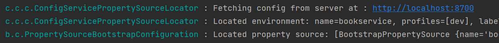

[Config 配置中心官方文档](https://docs.spring.io/spring-cloud-config/docs/current/reference/html/)

### 部署配置中心服务端

创建一个config微服务
添加依赖

```xml
<dependencies>
  <dependency>
    <groupId>org.springframework.cloud</groupId>
    <artifactId>spring-cloud-config-server</artifactId>
  </dependency>
  <dependency>
    <groupId>org.springframework.cloud</groupId>
    <artifactId>spring-cloud-starter-netflix-eureka-client</artifactId>
  </dependency>
</dependencies>
```

<!-- truncate -->

添加配置

```yaml
server:
  port: 8700
spring:
  application:
    name: "ConfigServer"
  cloud:
    config:
      server:
        git:
          # 这里填写的是本地仓库地址，远程仓库直接填写远程仓库地址 http://git...
          uri: file://${user.home}/Desktop/Mi/config-repo
          # 默认分支设定为你自己本地或是远程分支的名称
          default-label: master
eureka:
  client:
    service-url:
      defaultZone: http://localhost:8801/eureka, http://localhost:8802/eureka
```

编写启动类

```java
@EnableConfigServer
@SpringBootApplication
public class ConfigApplication {
    public static void main(String[] args) {
        SpringApplication.run(ConfigApplication.class,args);
    }
}

```

在远端或者本地创建一个git仓库 编写配置文件进行提交
注意这里的仓库地址要与`spring.cloud.config.server.git.uri`一致
[访问配置中心master分支的bookservice-dev.yml文件](http://localhost:8700/master/bookservice-dev.yml)


### 配置客户端

我们将微服务客户端的配置文件改名为`bootstrap.yml`这是一个系统级别的参数配置，会在应用级别配置`application.yml`之前加载，如果保留的话，如果出现相同属性，将会覆盖
客户端添加依赖

```xml
<dependency>
  <groupId>org.springframework.cloud</groupId>
  <artifactId>spring-cloud-starter-config</artifactId>
</dependency>

<dependency>
  <groupId>org.springframework.cloud</groupId>
  <artifactId>spring-cloud-starter-bootstrap</artifactId>
</dependency>
```

客户端添加配置文件`bootstrap.yml`

```yaml
spring:
  cloud:
    config:
      # 名称，其实就是文件名称
      name: "bookservice"
      # 配置服务器的地址
      uri: http://localhost:8700
      # 环境
      profile: dev
      # 分支
      label: master
```

保留的`application.xml`这个文件没有配置数据源

```yaml
server:
  port: 8081
spring:
  application:
    name: "BookService"
eureka:
  client:
    # 跟上面一样，需要指向Eureka服务端地址，这样才能进行注册 默认端口8761
    service-url:
      defaultZone: http://localhost:8801/eureka, http://localhost:8802/eureka
```

启动微服务客户端

