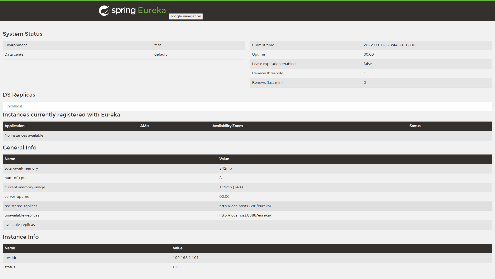
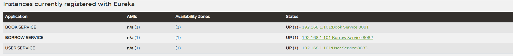
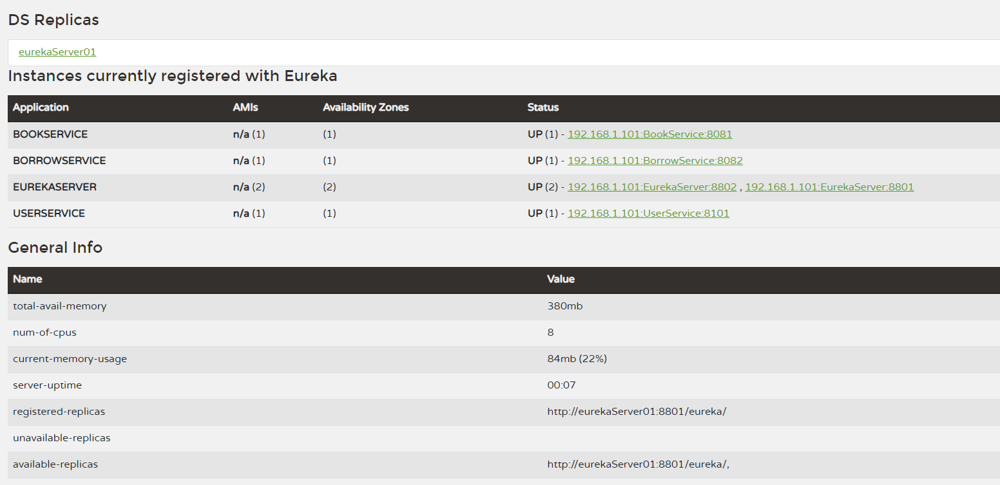

[Eureka和ZooKeeper的区别](https://blog.csdn.net/java_xth/article/details/82621776)
Eureka能够自动注册并发现微服务，然后对服务的状态、信息进行集中管理,保证AP
> 在分布式领域有一个很著名的CAP定理：C：数据一致性。A：服务可用性。P：分区容错性（服务对网络分区故障的容错性）。

在父工程pom中

```xml
<dependency>
  <groupId>org.springframework.cloud</groupId>
  <artifactId>spring-cloud-dependencies</artifactId>
  <version>2021.0.3</version>
  <type>pom</type>
  <scope>import</scope>
</dependency>
```
<!-- truncate -->

接着我们为新创建的项目(eureka-server)添加依赖：

```xml
<dependencies>
    <dependency>
        <groupId>org.springframework.cloud</groupId>
        <artifactId>spring-cloud-starter-netflix-eureka-server</artifactId>
    </dependency>
</dependencies>
```

eureka-server 配置

```yaml
server:
  port: 8888
eureka:
  # 开启之前需要修改一下客户端设置（虽然是服务端
  client:
    # 由于我们是作为服务端角色，所以不需要获取服务端，改为false，默认为true
    fetch-registry: false
    # 暂时不需要将自己也注册到Eureka
    register-with-eureka: false
    # 将eureka服务端指向自己
    service-url:
          defaultZone: http://localhost:8888/eureka
```

访问 [本地Eureka服务](http://localhost:8888)

将微服务都注册进来

```xml
<dependency>
  <groupId>org.springframework.cloud</groupId>
  <artifactId>spring-cloud-starter-netflix-eureka-client</artifactId>
</dependency>
```

```yaml
eureka:
  client:
    # 跟上面一样，需要指向Eureka服务端地址，这样才能进行注册 默认端口8761
    service-url:
          defaultZone: http://localhost:8888/eureka
```

再次访问 [本地Eureka服务](http://localhost:8888)


### 集群

创建两个配置文件
`eureka.instance.hostname`使用localhost无效果 需修改hosts文件让该hostname指向127.0.0.1

```yaml
server:
  port: 8801
spring:
  application:
    name: "EurekaServer"
eureka:
  instance:
    hostname: eurekaServer01
    # 开启之前需要修改一下客户端设置（虽然是服务端
  client:
    # 由于我们是作为服务端角色，所以不需要获取服务端，改为false，默认为true
    fetch-registry: false
    # 暂时不需要将自己也注册到Eureka
    # register-with-eureka: false
    # 将eureka服务端指向自己
    service-url:
      defaultZone: http://eurekaServer02:8802/eureka
```

```yaml
server:
  port: 8802
spring:
  application:
    name: "EurekaServer"
eureka:
  instance:
    hostname: eurekaServer02
    # 开启之前需要修改一下客户端设置（虽然是服务端
  client:
    # 由于我们是作为服务端角色，所以不需要获取服务端，改为false，默认为true
    fetch-registry: false
    # 暂时不需要将自己也注册到Eureka
    # register-with-eureka: false
    # 将eureka服务端指向自己
    service-url:
      defaultZone: http://eurekaServer01:8801/eureka
```

在其他微服务中修改配置`eureka.client.service-url.defaultZone`

```yaml
eureka:
  client:
    # 跟上面一样，需要指向Eureka服务端地址，这样才能进行注册 默认端口8761
    service-url:
      defaultZone: http://localhost:8801/eureka,http://localhost:8802/eureka
```

效果
eurekaServer01:[本地Eureka服务1](http://localhost:8801/)

eurekaServer02: [本地Eureka服务2](http://localhost:8802/)

