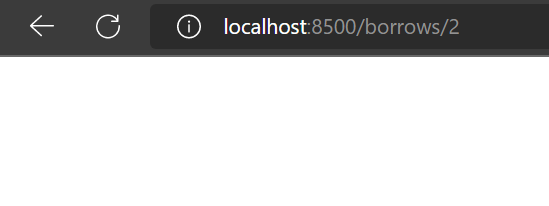
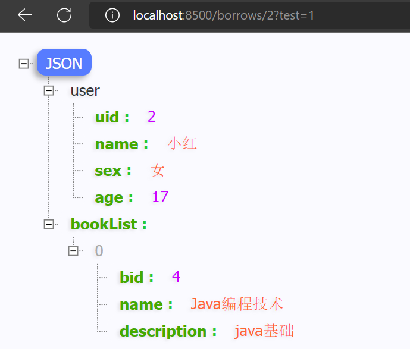

[Gateway官方文档](https://docs.spring.io/spring-cloud-gateway/docs/current/reference/html/)

### 部署网关

创建一个网关微服务，添加依赖

```xml
<dependencies>
  <dependency>
    <groupId>org.springframework.cloud</groupId>
    <artifactId>spring-cloud-starter-gateway</artifactId>
  </dependency>
  <dependency>
    <groupId>org.springframework.cloud</groupId>
    <artifactId>spring-cloud-starter-netflix-eureka-client</artifactId>
  </dependency>
</dependencies>
```
<!-- truncate -->

添加配置文件

```yaml
server:
  port: 8500
eureka:
  client:
   service-url:
    defaultZone: http://localhost:8801/eureka, http://localhost:8802/eureka
spring:
  application:
   name: gateway
  cloud:
   gateway:
    # 配置路由，注意这里是个列表，每一项都包含了很多信息
    routes:
    - id: borrow-service   # 路由名称
      uri: lb://BorrowService  # 路由的地址，lb表示使用负载均衡到微服务，也可以使用http正常转发
      predicates: # 路由规则，断言什么请求会被路由
      - Path=/borrows/**  # 只要是访问的这个路径，一律都被路由到上面指定的服务
```

启动类

``` java
@SpringBootApplication
public class GatewayApplication {
    public static void main(String[] args) {
        SpringApplication.run(GatewayApplication.class,args);
    }
}
```

访问以下接口`http://localhost:8500/borrows/1`
将路由到 `http://BorrowService/borrows/1`

### 路由过滤器

[Spring Cloud Gateway 路由过滤器文档](https://docs.spring.io/spring-cloud-gateway/docs/current/reference/html/#gatewayfilter-factories)
路由筛选器允许以某种方式修改传入 HTTP 请求或传出 HTTP 响应。
尝试给请求添加一个Header

``` yaml
server:
  port: 8500
eureka:
  client:
   service-url:
    defaultZone: http://localhost:8801/eureka, http://localhost:8802/eureka
spring:
  application:
   name: gateway
  cloud:
   gateway:
    # 配置路由，注意这里是个列表，每一项都包含了很多信息
    routes:
    - id: borrow-service   # 路由名称
      uri: lb://BorrowService  # 路由的地址，lb表示使用负载均衡到微服务，也可以使用http正常转发
      predicates: # 路由规则，断言什么请求会被路由
      - Path=/borrows/**  # 只要是访问的这个路径，一律都被路由到上面指定的服务
    - id: book-service
      uri: lb://BookService
      predicates:
      - Path=/books/**
      filters: # 添加过滤器
      - AddRequestHeader=Test, HelloWorld!
      # AddRequestHeader 就是添加请求头信息，其他工厂请查阅官网
```

在路由对应微服务的controller层中获取header

```java
@GetMapping("/{bid}")
Book findBookById(@PathVariable("bid") int bid,
                  HttpServletRequest request){
    System.out.println(request.getHeader("Test"));
    return bookService.getBookById(bid);
}
```

我们也可以自定义全局过滤器`判断是否包含test参数，且参数值包含 1`

```java
@Component   //需要注册为Bean
public class TestFilter implements GlobalFilter {
    @Override
    public Mono<Void> filter(ServerWebExchange exchange, GatewayFilterChain chain) {
        //先获取ServerHttpRequest对象，注意不是HttpServletRequest
        ServerHttpRequest request = exchange.getRequest();
        //打印一下所有的请求参数
        System.out.println(request.getQueryParams());
        //判断是否包含test参数，且参数值包含 1
        List<String> value = request.getQueryParams().get("test");
        if(value != null && value.contains("1")) {
            //将ServerWebExchange向过滤链的下一级传递（跟JavaWeb中介绍的过滤器其实是差不多的）
            return chain.filter(exchange);
        }else {
            //直接在这里不再向下传递，然后返回响应
            return exchange.getResponse().setComplete();
        }
    }
}
```



手动指定过滤器优先级 `Ordered` 接口 **getOrder方法的返回值值越小优先级越高**

```java
@Component   //需要注册为Bean
public class TestFilter implements GlobalFilter , Ordered {
    @Override
    public Mono<Void> filter(ServerWebExchange exchange, GatewayFilterChain chain) {
        //先获取ServerHttpRequest对象，注意不是HttpServletRequest
        ServerHttpRequest request = exchange.getRequest();
        //打印一下所有的请求参数
        System.out.println(request.getQueryParams());
        //判断是否包含test参数，且参数值为 1
        List<String> value = request.getQueryParams().get("test");
        if(value != null && value.contains("1")) {
            //将ServerWebExchange向过滤链的下一级传递（跟JavaWeb中介绍的过滤器其实是差不多的）
            return chain.filter(exchange);
        }else {
            //直接在这里不再向下传递，然后返回响应
            return exchange.getResponse().setComplete();
        }
    }
    @Override
    public int getOrder() {
        return 0;
    }
}
```

> 单个路由的过滤器Order值按从上往下的顺序从1开始递增
> 当Order值一样时 全局路由过滤器执行 `优于` 单独的路由过滤器执行。

系统全局过滤器执行顺序（名称、order）
