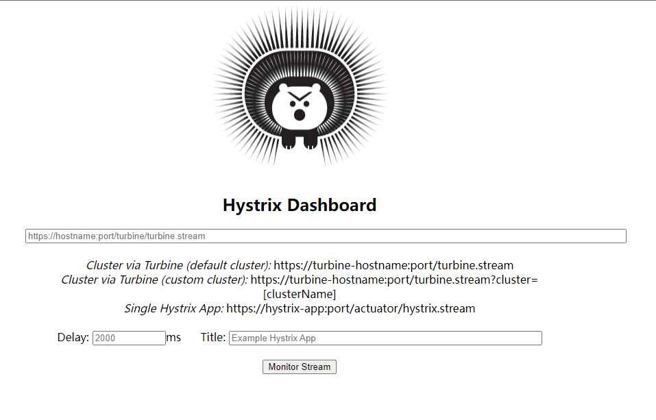
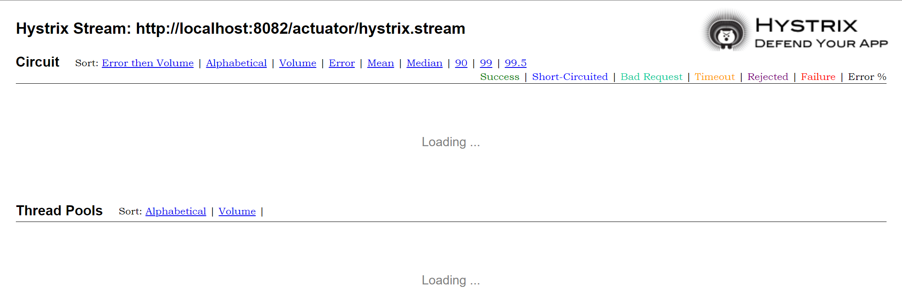
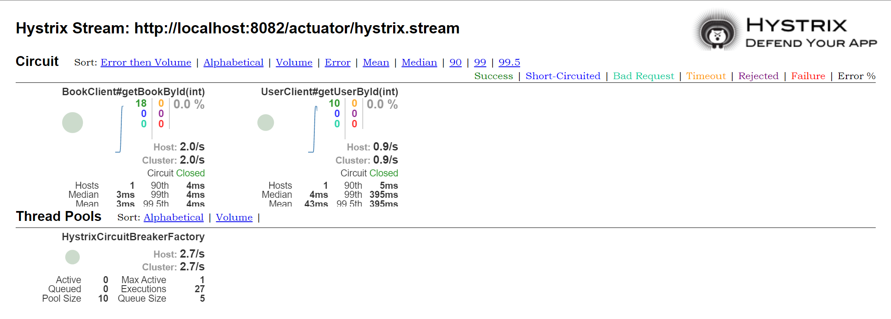
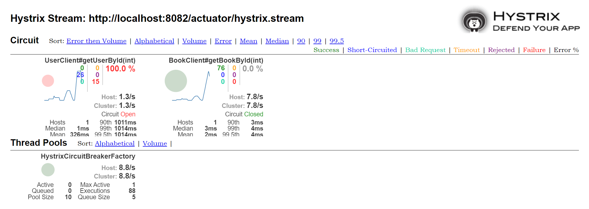

[Hystrix官方文档](https://cloud.spring.io/spring-cloud-static/spring-cloud-netflix/1.3.5.RELEASE/single/spring-cloud-netflix.html#_circuit_breaker_hystrix_clients)
在需要进行服务熔断的服务pom文件添加依赖

```xml
<dependency>
  <groupId>org.springframework.cloud</groupId>
  <artifactId>spring-cloud-starter-netflix-hystrix</artifactId>
  <version>2.2.10.RELEASE</version>
</dependency>
```
<!-- truncate -->

启动类添加注解 `@EnableHystrix`

### 服务降级  _@HystrixCommand_

```java
@RestController
@RequestMapping("/borrows")
public class BorrowController {
    @Resource
    private BorrowService borrowService;

    @HystrixCommand(fallbackMethod = "onError")    //使用@HystrixCommand来指定备选方案
    @GetMapping("/{uid}")
    public UserBorrowDetail findUserBorrowDetailByUid(@PathVariable int uid){
        return borrowService.getUserBorrowDetailByUid(uid);
    }

    //备选方案，这里直接返回空列表了
    //注意参数和返回值要和上面的一致
    UserBorrowDetail onError(int uid){
        return new UserBorrowDetail(null, Collections.emptyList());
    }
}
```

### 服务熔断 Circuit Breaker

在一段时间内多次调用失败，那么从服务降级直接升级为熔断。

### 使用OpenFeign实现降级  _@FeignClient_

[Feign](https://www.yuque.com/arce/glxhka/krza54?view=doc_embed)
给需要添加服务的 Client 添加`fallback` 属性
`@FeignClient(value = "UserService",fallback = UserFallbackClient.class)`
实现Client类

```java
@Component   //注意，需要将其注册为Bean，Feign才能自动注入
public class UserFallbackClient implements UserClient{
    @Override
    public User getUserById(int uid) {   //这里我们自行对其进行实现，并返回我们的替代方案
        User user = new User();
        user.setName("我是替代方案");
        return user;
    }
}
```

在该服务的`application.xml`中配置feign ，可以取消`BorrowController` 的`@HystrixCommand`注解

```yaml
feign:
  circuitbreaker:
    enabled: true
```

此时如果`UserService` 挂掉，会执行`UserFallbackClient`的替代方案

### 监控面板 Hystrix Dashboard

新建一个 `Hystrix Dashboard` 服务
添加依赖

```xml
<dependency>
  <groupId>org.springframework.cloud</groupId>
  <artifactId>spring-cloud-starter-netflix-hystrix-dashboard</artifactId>
  <version>2.2.10.RELEASE</version>
</dependency>
```

添加配置文件 application.yml

```yaml
server:
  port: 8900
hystrix:
  dashboard:
    # 将localhost添加到白名单，默认是不允许的
    proxy-stream-allow-list: "localhost"
```

访问服务：[本地 Hystrix Dashboard 服务](http://localhost:8900/hystrix)

为需要监控的微服务添加`actuator`依赖

```yaml
<dependency>
    <groupId>org.springframework.boot</groupId>
    <artifactId>spring-boot-starter-actuator</artifactId>
</dependency>
```

> Actuator是SpringBoot程序的监控系统，可以实现健康检查，记录信息等

并添加暴露配置

```yaml
management:
  endpoints:
    web:
      exposure:
        include: '*'
```

访问指定微服务的监控面板 [本地BorrowService服务监控面板](http://localhost:8900/hystrix/monitor?stream=http%3A%2F%2Flocalhost%3A8082%2Factuator%2Fhystrix.stream)


未处理请求时都是显示`Loading`状态

当我们的某个服务挂掉时，多次访问会造成开启服务熔断

> 吞吐量越大，红色（绿色）圆圈越大
