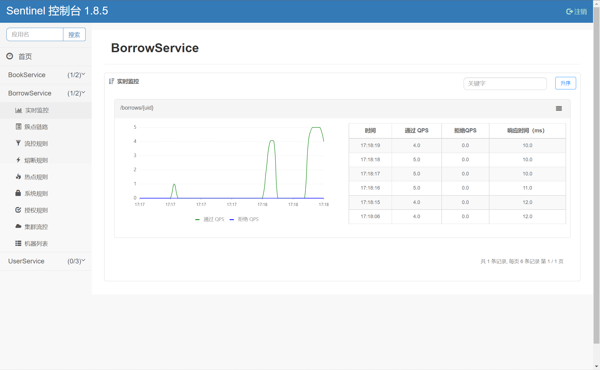
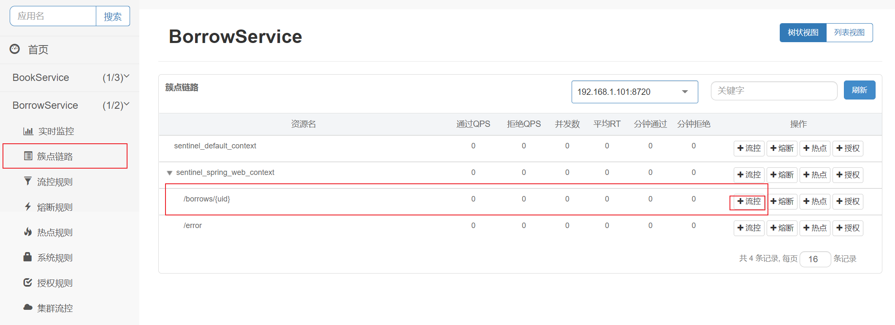
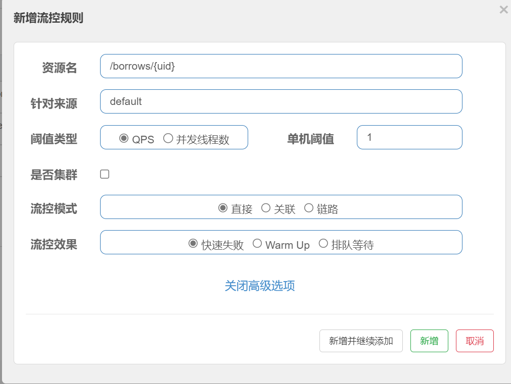
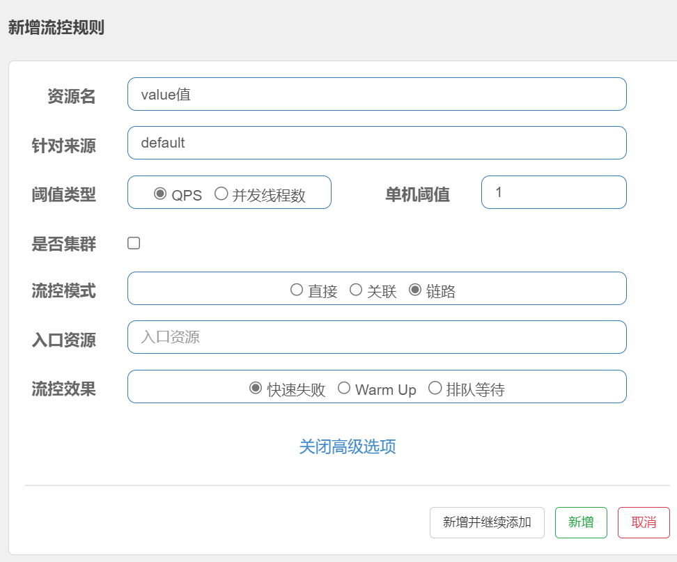
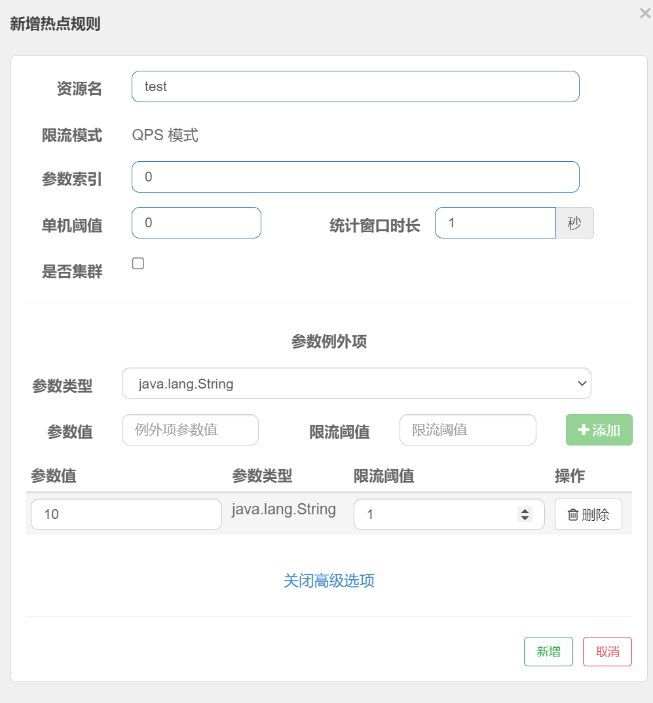
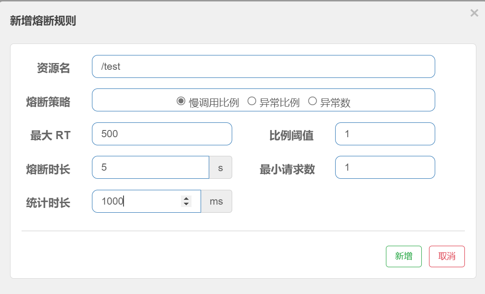
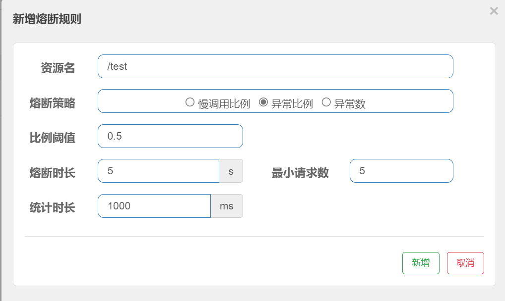
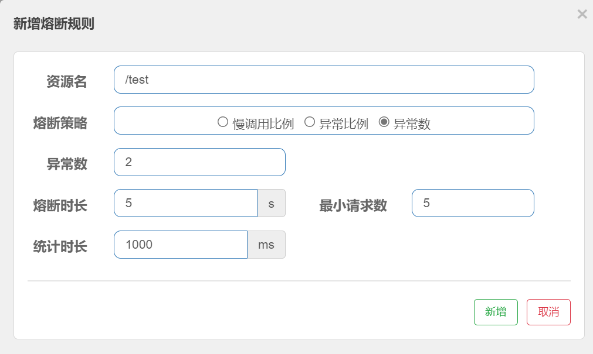

[官方文档](https://github.com/alibaba/Sentinel/wiki/%E4%BB%8B%E7%BB%8D)
[下载地址](https://github.com/alibaba/Sentinel/releases)
在微服务中引入依赖

```xml
<dependency>
    <groupId>com.alibaba.cloud</groupId>
    <artifactId>spring-cloud-starter-alibaba-sentinel</artifactId>
</dependency>
```
在配置文件中

```yaml
spring:
  cloud:
    sentinel:
      transport:
        # 添加监控页面地址即可
        dashboard: localhost:8858
```

[访问控制面板](http://localhost:8858/#/dashboard)


<!-- truncate -->

### 流量控制

限流的方案

- 快速拒绝
- 预热（缓慢提高阈值）
- 排队等待

判断是否超过流量阈值的算法

- 漏桶算法
- 令牌桶算法
- 固定时间窗口算法
- 滑动时间窗口算法

对图书借阅接口进行流控

流控效果分别对应限流的三种方案

> QPS = req/sec = 请求数/秒。. 它代表的是服务器的机器的性能最大吞吐能力。
> 并发线程数是按服务当前使用的线程数据进行统计的
> 流控模式：
>
> - 直接：只针对于当前接口。
> - 关联：当关联的其他接口超过单机阈值时，会导致当前接口被限流。
> - 链路：更细粒度的限流，能精确到具体的方法。


链路流控模式可以在方法上加上`@SentinelResource(value="xxx")`注解，value值就是这个方法的资源名，使用链路模式要配置关闭Context收敛`spring.cloud.sentinel.web-context-unify=false`

入口资源可以指定对某一个接口进行流控

### 限流和异常处理

可以修改限流状态返回的数据，默认是`Blocked by sentinel （flow limiting）`
修改`spring.cloud.sentinel.block-page="资源名称"`，如下方法资源名`/blocked`

```java
@RequestMapping("/blocked")
JSONObject blocked(){
    JSONObject object = new JSONObject();
    object.put("code", 403);
    object.put("success", false);
    object.put("massage", "您的请求频率过快，请稍后再试！");
    return object;
}
```

对于链路流控模式，我们可以添加`@SentinelResource`的`blockHandler`参数，为其指定一个限流处理方法

```java
@Override
@SentinelResource(value = "getBorrow", blockHandler = "blocked")   //指定blockHandler，也就是被限流之后的替代解决方案，这样就不会使用默认的抛出异常的形式了
public UserBorrowDetail getUserBorrowDetailByUid(int uid) {

    List<Borrow> borrowsByUid = borrowMapper.getBorrowsByUid(uid);
    User user = userClient.getUserById(uid);
    List<Book> bookList = borrowsByUid
        .stream()
        .map(borrow ->bookClient.getBookById(borrow.getBid()))
        .collect(Collectors.toList());
    return new UserBorrowDetail(user,bookList);
}
//替代方案，注意参数和返回值需要保持一致，并且参数最后还需要额外添加一个BlockException
public UserBorrowDetail blocked(int uid, BlockException e) {
    return new UserBorrowDetail(null, Collections.emptyList());
}
```

`blockHandler`只能处理限流情况下抛出的异常
`@SentinelResource`注解还有`fallback`和`exceptionsToIgnore`参数
> fallback指定出现异常时的替代方案
> exceptionsToIgnore忽略那些异常，也就是说这些异常出现时不使用替代方案

```java
@RequestMapping("/test")
@SentinelResource(value = "test",
                  fallback = "except",    //fallback指定出现异常时的替代方案
                  exceptionsToIgnore = IOException.class)  //忽略那些异常，也就是说这些异常出现时不使用替代方案
String test(){
    throw new RuntimeException("HelloWorld！");
}

//替代方法必须和原方法返回值和参数一致，最后可以添加一个Throwable作为参数接受异常
String except(Throwable t){
    return t.getMessage();
}
```

当同一资源同时使用`fallback`和`blockHandler`时，在出现限流时会执行`blockHandler`，当未出现限流但方法出现其他异常时执行`fallback`。

### 热点参数限流

可以对请求参数进行限流

```java
@RequestMapping("/test")
@SentinelResource("test")   //注意这里需要添加@SentinelResource才可以，用户资源名称就使用这里定义的资源名称
String findUserBorrows2(@RequestParam(value = "a", required = false) int a,
                        @RequestParam(value = "b", required = false) int b,
                        @RequestParam(value = "c",required = false) int c) {
    return "请求成功！a = "+a+", b = "+b+", c = "+c;
}
```


这个规则表示对资源名为test进行热点参数限流，参数索引为0，单机阈值为0就是每秒允许请求数为0，参数额外项时可选配置项，如果参数索引为0的参数值为0，可以每秒进行1次请求

### 服务降级和服务熔断

三种熔断规则

- 慢调用比例
- 异常比例
- 异常数

#### 慢调用比例


访问资源名为`/test`的接口，如果一次请求的处理时间超过了指定的500毫秒，将开启熔断，时长为5秒，比例阈值表示在1（统计时长）秒内最小请求数中请求的处理时间超过了500毫秒（最大RT）的比例

#### 异常比例


访问资源名为`/test`的接口，在统计时长内最小请求数有超过50%的请求出现异常，将进行熔断，时长为5秒

#### 异常数


访问资源名为`/test`的接口，在`统计时长`内`最小请求数`有超过`异常数`的请求出现异常，将进行熔断，时长为5秒
