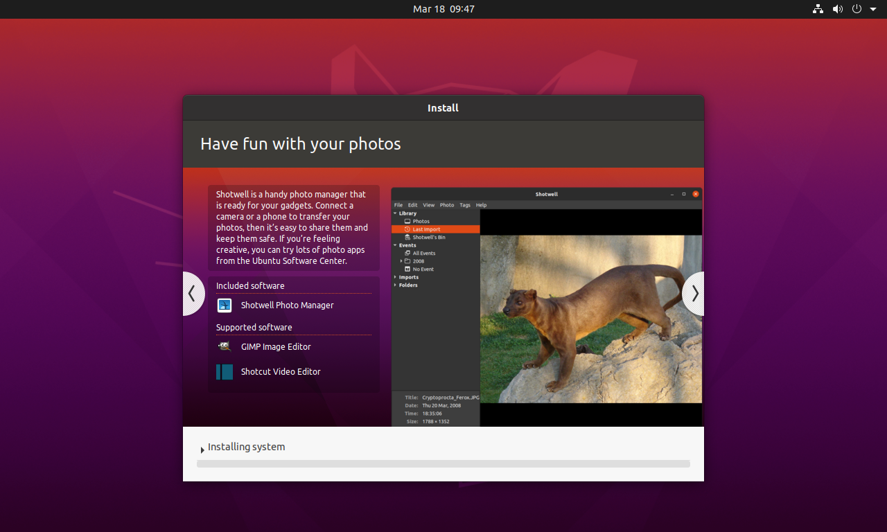

# 环境配置



## 更新 apt

```shell
sudo apt-get update
sudo apt-get upgrade
sudo apt-get install wget gnupg2 git
```

<!-- truncate -->

:::caution 注意 本文无有营养的内容，请退出，抱歉 :::

## 安装 AMD GPU 驱动

```shell
sudo usermod -a -G video $LOGNAME
echo 'ADD_EXTRA_GROUPS=1' | sudo tee -a /etc/adduser.conf
echo 'EXTRA_GROUPS=video' | sudo tee -a /etc/adduser.conf
echo 'EXTRA_GROUPS=render' | sudo tee -a /etc/adduser.conf
wget https://repo.radeon.com/amdgpu-install/22.20/ubuntu/focal/amdgpu-install_22.20.50200-1_all.deb
sudo apt-get install ./amdgpu-install_22.20.50200-1_all.deb
```

## 更改 AMD Rocm 源

```shell
sudo amdgpu-install --usecase=hiplibsdk,rocm --no-dkms
```

```shell
sudo usermod -a -G video $LOGNAME
sudo usermod -a -G render $LOGNAME
echo 'export PATH=$PATH:/opt/rocm/bin:/opt/rocm/profiler/bin:/opt/rocm/opencl/bin' | sudo tee -a /etc/profile.d/rocm.sh
```

```shell
rocm-smi
sudo /opt/rocm/bin/rocminfo
sudo /opt/rocm/opencl/bin/clinfo
```

根据显示的信息安装 (gfx1030)

```shell
sudo apt-get install miopenkernels-gfx1030-36kdb
```
