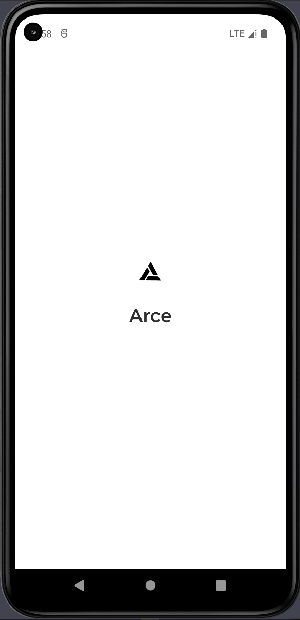

<div style={{textAlign: 'center'}}>



</div>

思路：Getx的updateLocale 以及本地缓存

<!-- truncate -->

Locale支持以下两种构造方式

```dart
Locale(languageCode,languageCountryCode)  // eg: Locale('en','US')
    Locale.fromSubtags(languageCode:languageCode,scriptCode: languageScriptCode,countryCode: languageCountryCode);   // eg:  Locale.fromSubtags('zh','Hans','CN')  countryCode 可空
```


:::caution 注意
 案例代码不完全，但不影响你的观看是尝试
:::

## 原理分析

跟随系统语言 缓存中存一个flag    在多语言初始化的时候从缓存中获取flag值

- if flag = true
  - 使用 Getx 的 deviceLocale 属性值获取到设备的 Locale
- else
  - 获取缓存中的 languageCode , languageScriptCode , languageCountryCode 并构造Locale
  - 这里可能会有人直接存在一个key里  但是我没办法分辨 有的时候是 zh_Hans 的情况 有的是 zh_Hans_CN  也有 en_Us 或者  en

使用 Getx 的 updateLocale(Locale) 进行更换

## 案例代码

核心代码  TranslationService

```dart
class TranslationService extends GetxService{
  static TranslationService get to => Get.find();
  // 当前系统语言
  // static Locale? get locale => Get.deviceLocale;
  late final locale;
  final translations = TranslationLanguages();
  // //如果找不到对应字典，默认值
  static const fallbackLocale = Locale('en', 'US');

  Future<TranslationService> init() async{
    locale = TranslationStore.to.initialLocale;
    return this;
  }
  void setLocale(Locale locale)async{
    await TranslationStore.to.setLocale(locale);
    Get.updateLocale(locale);
  }
}
```

核心代码 TranslationStore 初始化：

```dart
@override
void onInit() {
    super.onInit();
    // 是否选择跟随系统
    bool followSystem = StorageService.to.getBool(STORAGE_LANGUAGE_FOLLOW_SYSTEM);
    // Locale 参数
    String languageCode = StorageService.to.getString(STORAGE_LANGUAGE_CODE);
    String languageCountryCode = StorageService.to.getString(STORAGE_LANGUAGE_COUNTRY_CODE);
    String languageScriptCode = StorageService.to.getString(STORAGE_LANGUAGE_SCRIPT_CODE);
    print("是否跟随系统 ${followSystem}");
    print("Getx中的locale: ${Get.locale}    手机系统语言 ${Get.deviceLocale}");
    print('缓存： ${languageCode} | ${languageCountryCode} | ${languageScriptCode}');
    if(followSystem){
        initialLocale = Get.deviceLocale ?? const Locale('en_US');
    }else{
        if(languageScriptCode == '') {
            initialLocale = Locale(languageCode,languageCountryCode);
        }else if(languageCountryCode==''){
            initialLocale = Locale.fromSubtags(languageCode:languageCode,scriptCode: languageScriptCode);
        }else {
            initialLocale = Locale.fromSubtags(languageCode:languageCode,scriptCode: languageScriptCode,countryCode: languageCountryCode);
        }
    }
    print("当前初始化语言 ${initialLocale}");

}
```

需要自己写一个多语言键值列表 TranslationLanguages 继承 flutter的 Translations

```dart
class TranslationLanguages extends Translations {
//  字典列表
  @override
  Map<String, Map<String, String>> get keys => {
    'en_US': en_US,
    'zh_Hans': zh_Hans,
    'zh_HK': zh_HK,
  };
}
```

语言映射Map对象我选择根据语言的不同分不同文件

``` dart
// en_US.dart
const Map<String, String> en_US = {
  'title': 'This is Title!',
  'login': 'logged in as @name with email @email',
};
```

GetMaterialApp

```dart
GetMaterialApp(
    title: "Material App",
    // ... 其他配置省略
    locale: TranslationService.to.locale,git
    fallbackLocale: TranslationService.fallbackLocale,
    translations: TranslationService.to.translations,
    // ...
);
```

总结：看了一些其他的实现方法 比如 Provider + 缓存 + i18n插件 ，也看了以下[官方文档](https://flutter.cn/docs/development/accessibility-and-localization/internationalization#setting-up)中的 flutter_localizations 以及一些开源项目的多语言  几乎没看见有做跟随系统语言来切换的方案，抛砖引玉
