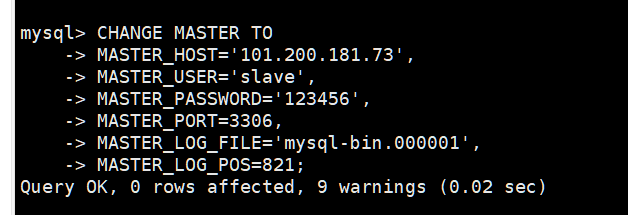

---

slug: shardingsphere-replication-of-database-and-table-shards
title: shardingsphere分库分表主从复制
author: Arce
author_title: 独立游戏开发者
author_url: https://github.com/charles0122
author_image_url: https://avatars.githubusercontent.com/u/70085736?v=4
description: 测试
tags: [Java,SpringCloud,ShardingSphere]
---

:::caution 注意
 本文含双主互从、双主双从方式 配置需要将HOST改成你的主机ip POSSWORD 改成你的数据库密码
:::

# CentOS7安装docker

官网：[Docker官网](http://www.docker.com)

安装手册：[docker-ce 社区版](https://docs.docker.com/install/linux/docker-ce/centos（CE-社区版）)

## 1、安装需要的软件包

yy -utils提供了yy-config-manager相关功能，device-mapper-persistent-data和lvm2是设备映射器驱动程序所需要的。

```shell
yum install -y yum-utils \
               device-mapper-persistent-data \
               lvm2
```

## 2、设置docker下载镜像

推荐阿里云下载地址

```shell
yum-config-manager --add-repo http://mirrors.aliyun.com/docker-ce/linux/centos/docker-ce.repo
```
<!-- truncate -->
## 3、更新yum软件包索引

我们在更新或配置yum源之后，通常都会使用yum makecache 生成缓存，这个命令是将软件包信息提前在本地缓存一份，用来提高搜索安装软件的速度

```shell
yum makecache fast
```

## 4、安装docker ce

```shell
yum install -y docker-ce
```

## 5、启动docker

```shell
systemctl start docker

```

## 6、版本验证

```shell
docker version
```

##  7、设置开机启动

```shell
#查看服务是否自动启动（是：enabled | 否：disabled）
systemctl list-unit-files|grep docker.service

#设置开机启动：如不是enabled可以运行如下命令设置自启动
systemctl enable docker
#重新加载服务配置
systemctl daemon-reload

#如果希望不进行自启动，运行如下命令设置
systemctl disable docker
#重新加载服务配置
systemctl daemon-reload
```

卸载

```shell
systemctl stop docker
yum remove -y docker-ce
rm -rf /var/lib/docker
```

开关防火墙

```shell
##关闭docker
systemctl stop docker
##关闭防火墙
systemctl stop firewalld
##启动docker
systemctl start docker
```

## 二主二从配置

主服务器 arce-mysql-master1 端口 3306

主服务器 arce-mysql-master2 端口 3307

从服务器 arce-mysql-slave1 端口 13306

从服务器 arce-mysql-slave2 端口 13307

两个主服务器互为主从

准备主服务器

创建本机挂载目录

```shell
mkdir -p /usr/local/docker/arce-mysql-master1/data
mkdir -p /usr/local/docker/arce-mysql-master1/mysql-files
mkdir -p /usr/local/docker/arce-mysql-master1/cnf
mkdir -p /usr/local/docker/arce-mysql-master1/log
```

启动docker 容器

```shell
docker run  \
--restart=always \
--name arce-mysql-master1 \
-v /usr/local/docker/arce-mysql-master1/cnf:/etc/mysql/conf.d \
-v /usr/local/docker/arce-mysql-master1/data:/var/lib/mysql \
-v /usr/local/docker/arce-mysql-master1/log:/var/log/mysql \
-v /usr/local/docker/arce-mysql-master1/mysql-files:/var/lib/mysql-files \
-p 3306:3306 \
-e MYSQL_ROOT_PASSWORD=PASSWORD \
-d mysql
```

编写配置文件

```she
vim /usr/local/docker/arce-mysql-master1/cnf/my.cnf
```

```
#Apply this config only on the master.
[client]
port = 3306
default-character-set = utf8mb4

[mysql]
port = 3306
default-character-set = utf8mb4

[mysqld]
# bind-address = 0.0.0.0
# port = 3306

max_connections=10000

character-set-server = utf8mb4
collation-server = utf8mb4_unicode_ci

# 设置时区和字符集
# default-time-zone='+8:00'
character-set-client-handshake=FALSE
init_connect='SET NAMES utf8mb4 COLLATE utf8mb4_unicode_ci'

gtid-mode=ON
enforce-gtid-consistency = ON
```

进入容器bash

```shell
docker exec -it arce-mysql-master1 bash
```

测试远程连接

进入mysql

```shell
mysql -uroot -pPASSWORD
```

将root用户从只能localhost登录改为 % 支持远程

```shell
update user set host='%' where user='root';
FLUSH PRIVILEGES;
```

更改密码插件

```shell
##如果plugin 的加密方式为caching_sha2_password，表示需要更改
##更改root用户加密方式
ALTER USER 'root'@'localhost' IDENTIFIED WITH mysql_native_password by 'PASSWORD';
ALTER USER 'root'@'%' IDENTIFIED WITH mysql_native_password BY 'PASSWORD';
FLUSH PRIVILEGES;
```

查看权限信息

```shell
use mysql;
select host, user, authentication_string, plugin from user;
```


准备主服务器2

创建本机挂载目录

```shell
mkdir -p /usr/local/docker/arce-mysql-master2/data
mkdir -p /usr/local/docker/arce-mysql-master2/mysql-files
mkdir -p /usr/local/docker/arce-mysql-master2/cnf
mkdir -p /usr/local/docker/arce-mysql-master2/log
```

启动docker 容器

```shell
docker run  \
--restart=always \
--name arce-mysql-master2 \
-v /usr/local/docker/arce-mysql-master2/cnf:/etc/mysql/conf.d \
-v /usr/local/docker/arce-mysql-master2/data:/var/lib/mysql \
-v /usr/local/docker/arce-mysql-master2/log:/var/log/mysql \
-v /usr/local/docker/arce-mysql-master2/mysql-files:/var/lib/mysql-files \
-p 3307:3306 \
-e MYSQL_ROOT_PASSWORD=PASSWORD \
-d mysql
```

编写配置文件

```shell
vim /usr/local/docker/arce-mysql-master2/cnf/my.cnf
```

```shell
#Apply this config only on the master.
[client]
port = 3306
default-character-set = utf8mb4

[mysql]
port = 3306
default-character-set = utf8mb4


[mysqld]
#skip-grant-tables
## 服务器唯一id，默认值1
server-id=2000
## 设置日志格式，默认值ROW
binlog_format=STATEMENT
## 二进制日志名，默认binlog
## log-bin=binlog
## 设置需要复制的数据库，默认复制全部数据库
##binlog-do-db=mytestdb
## 设置不需要复制的数据库
##binlog-ignore-db=mysql
##binlog-ignore-db=infomation_schema
# bind-address = 0.0.0.0
# port = 3306

max_connections=10000

character-set-server = utf8mb4
collation-server = utf8mb4_unicode_ci

# 设置时区和字符集
default-time-zone='+8:00'
character-set-client-handshake=FALSE
init_connect='SET NAMES utf8mb4 COLLATE utf8mb4_unicode_ci'

gtid-mode=ON
enforce-gtid-consistency = ON
```

进入容器bash

```shell
docker exec -it arce-mysql-master2 bash
```

设置双主互从

主1

```shell
#Apply this config only on the master.
[client]
port = 3306
default-character-set = utf8mb4

[mysql]
# bind-address = 0.0.0.0
port = 3306
default-character-set = utf8mb4


[mysqld]
#skip-grant-tables
## 服务器唯一id，默认值1
server-id=1000
## 设置日志格式，默认值ROW
binlog_format=STATEMENT
#开启及设置二进制日志文件名称
log_bin = mysql-bin
binlog_format = MIXED
sync_binlog = 1
#二进制日志自动删除/过期的天数。默认值为0，表示不自动删除。
expire_logs_days =7

## 设置需要复制的数据库，默认复制全部数据库
##binlog-do-db=mytestdb
# 不需要同步的数据库
binlog-ignore-db = mysql
binlog_ignore_db = information_schema
binlog_ignore_db = performation_schema
binlog_ignore_db = sys


max_connections=10000

character-set-server = utf8mb4
collation-server = utf8mb4_unicode_ci

# 设置时区和字符集
default-time-zone='+8:00'
character-set-client-handshake=FALSE
init_connect='SET NAMES utf8mb4 COLLATE utf8mb4_unicode_ci'

gtid-mode=ON
enforce-gtid-consistency = ON
```

主2

```shell
#Apply this config only on the master.
[client]
port = 3306
default-character-set = utf8mb4

[mysql]
port = 3306
default-character-set = utf8mb4
# bind-address = 0.0.0.0
# port = 3306

[mysqld]
#skip-grant-tables
## 服务器唯一id，默认值1
server-id=2000
## 设置日志格式，默认值ROW
binlog_format=STATEMENT
#开启及设置二进制日志文件名称
log_bin = mysql-bin
binlog_format = MIXED
sync_binlog = 1
#二进制日志自动删除/过期的天数。默认值为0，表示不自动删除。
expire_logs_days =7
## 设置需要复制的数据库，默认复制全部数据库
##binlog-do-db=mytestdb
## 设置不需要复制的数据库
binlog-ignore-db = mysql
binlog_ignore_db = information_schema
binlog_ignore_db = performation_schema
binlog_ignore_db = sys


max_connections=10000

character-set-server = utf8mb4
collation-server = utf8mb4_unicode_ci

# 设置时区和字符集
default-time-zone='+8:00'
character-set-client-handshake=FALSE
init_connect='SET NAMES utf8mb4 COLLATE utf8mb4_unicode_ci'

gtid-mode=ON
enforce-gtid-consistency = ON
```

重启两个主服务器

进行主1 bash

```shell
docker exec -it arce-mysql-master1 bash
mysql -uroot -p
```

创建slave用户并授权,两个master节点都创建

```shell
#创建用户
ALTER USER 'root'@'localhost' IDENTIFIED WITH mysql_native_password by 'PASSWORD';
ALTER USER 'root'@'%' IDENTIFIED WITH mysql_native_password BY 'PASSWORD';
CREATE USER 'slave'@'%' IDENTIFIED WITH mysql_native_password BY 'PASSWORD';
#分配权限
GRANT REPLICATION SLAVE ON *.* TO 'slave'@'%';
#刷新权限
flush privileges;
```

查看master状态：`SHOW MASTER STATUS`，记录二进制文件名(mysql-bin.000001)和位置(821)

master1


master2


设置连接

master1连接master2

```shell
CHANGE MASTER TO
MASTER_HOST='HOST',
MASTER_USER='slave',
MASTER_PASSWORD='PASSWORD',
MASTER_PORT=3307,
MASTER_LOG_FILE='mysql-bin.000001',
MASTER_LOG_POS=821;
```


master2连接master1

```shell
CHANGE MASTER TO
MASTER_HOST='HOST',
MASTER_USER='slave',
MASTER_PASSWORD='PASSWORD',
MASTER_PORT=3306,
MASTER_LOG_FILE='mysql-bin.000001',
MASTER_LOG_POS=821;
```



启动 slave 进程

master1


master2


二主二从，一主一丛

注意需取消之前的双主互从

```shell
docker exec -it arce-mysql-master1 bash
docker exec -it arce-mysql-master2 bash
mysql -u root -p
```

```shell
stop slave;
```

slave1

创建本机挂载目录

```shell
mkdir -p /usr/local/docker/arce-mysql-slave1/data
mkdir -p /usr/local/docker/arce-mysql-slave1/mysql-files
mkdir -p /usr/local/docker/arce-mysql-slave1/cnf
mkdir -p /usr/local/docker/arce-mysql-slave1/log
```

启动docker 容器

```shell
docker run  \
--restart=always \
--name arce-mysql-slave1 \
-v /usr/local/docker/arce-mysql-slave1/cnf:/etc/mysql/conf.d \
-v /usr/local/docker/arce-mysql-slave1/data:/var/lib/mysql \
-v /usr/local/docker/arce-mysql-slave1/log:/var/log/mysql \
-v /usr/local/docker/arce-mysql-slave1/mysql-files:/var/lib/mysql-files \
-p 13306:3306 \
-e MYSQL_ROOT_PASSWORD=PASSWORD \
-d mysql
```

编写配置文件

```she
vim /usr/local/docker/arce-mysql-slave1/cnf/my.cnf
```

```
#Apply this config only on the master.
[client]
port = 3306
default-character-set = utf8mb4

[mysql]
port = 3306
default-character-set = utf8mb4


[mysqld]
#skip-grant-tables
## 服务器唯一id，默认值1
server-id=1001
## 设置日志格式，默认值ROW
binlog_format=STATEMENT
## 二进制日志名，默认binlog
## log-bin=binlog
## 设置需要复制的数据库，默认复制全部数据库
##binlog-do-db=mytestdb
## 设置不需要复制的数据库
##binlog-ignore-db=mysql
##binlog-ignore-db=infomation_schema
# bind-address = 0.0.0.0
# port = 3306

max_connections=10000

character-set-server = utf8mb4
collation-server = utf8mb4_unicode_ci

# 设置时区和字符集
default-time-zone='+8:00'
character-set-client-handshake=FALSE
init_connect='SET NAMES utf8mb4 COLLATE utf8mb4_unicode_ci'

gtid-mode=ON
enforce-gtid-consistency = ON
```

进入容器bash

```shell
docker exec -it arce-mysql-slave1 bash
```

salve1 连接 master1

```shell
CHANGE MASTER TO
MASTER_HOST='HOST',
MASTER_USER='slave',
MASTER_PASSWORD='PASSWORD',
MASTER_PORT=3306,
MASTER_LOG_FILE='mysql-bin.000001',
MASTER_LOG_POS=821;
```

```shell
 start slave;
```

```shell
show slave status\G;
```


slave2 重复slave1


