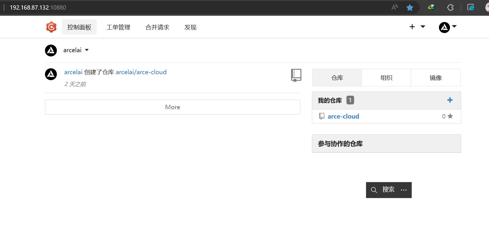
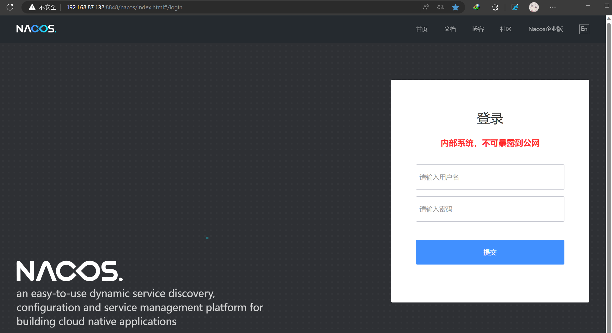
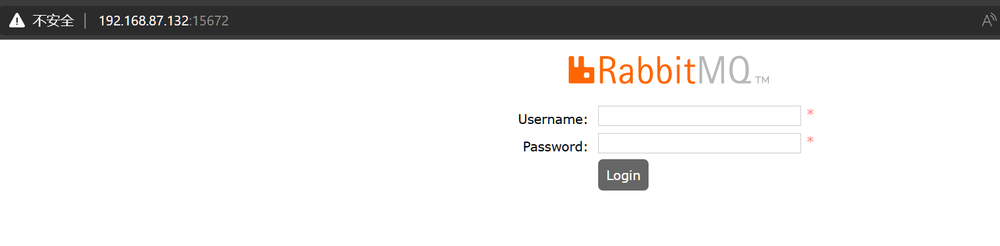
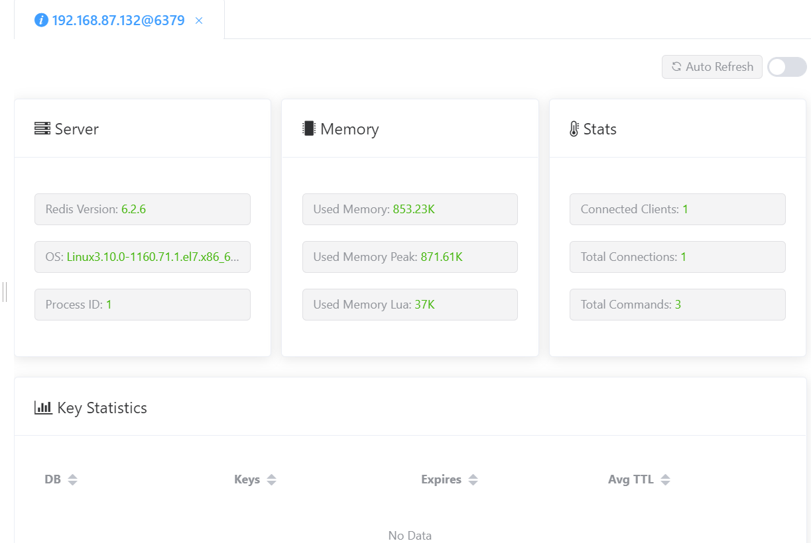
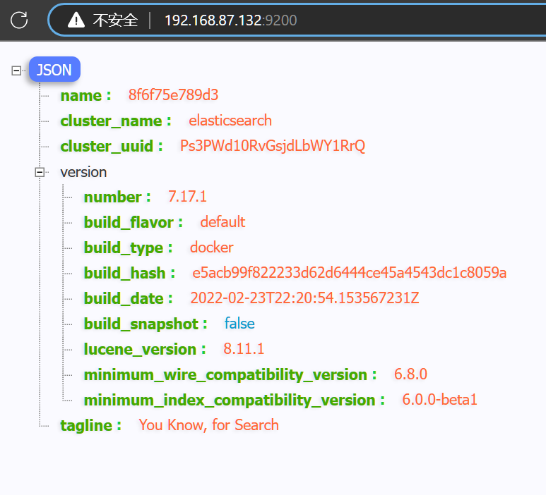
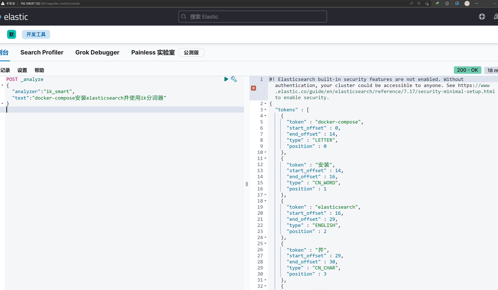

## 安装docker compose

```shell
curl -SL https://github.com/docker/compose/releases/download/v2.17.2/docker-compose-linux-x86_64 -o /usr/local/bin/docker-compose
```

因为是在本地的虚拟机 可以放心直接关闭防火墙

```shell
# 停止防火墙服务
systemctl stop firewalld.service
# 禁用防火墙服务
systemctl disable firewalld.service
```

<!-- truncate -->

## 安装 gogs

mysql-gogs 这里单独使用一个mysql服务给gogs 为了隔离环境

docker-compose.yml

```yaml
version: "3"
services:
  gogs:
    restart: always # 自动重启
    image: gogs/gogs
    container_name: gogs
    ports:
      - "10022:22" # ssh 端口
      - "10880:3000" # Web 访问端口
    volumes:
      - ./gogs-data:/data # 数据存储
    depends_on:
      - mysql-gogs
  mysql-gogs:
    restart: always
    image: mysql:latest
    container_name: mysql-gogs
    environment:
      MYSQL_ROOT_PASSWORD: 123456
      MYSQL_USER: gogs # gogs 访问数据库用的账号
      MYSQL_PASSWORD: gogs123456
    ports:
      - "10006:3306"
    volumes:
      - ./conf/my.cnf:/etc/mysql/my.cnf
      - ./mysql-data:/var/lib/mysql
      - ./mysql-log:/var/log/mysql
      - ./mysql-files:/var/lib/mysql-files
      - ./etc/localtime:/etc/localtime:ro
    # 一般会对 MySQL 进行配置，所以上面采用了 cnf 文件的形式，如果只是修改字符集，也可以使用 command 的形式，如下面所示
    # command: --character-set-server=utf8mb4 --collation-server=utf8mb4_unicode_ci
```

my.conf  放在docker-compose.yml同级的conf目录下

```shell
[client]
default-character-set=utf8mb4

[mysql]
default-character-set=utf8mb4

[mysqld]
character-set-server=utf8mb4
collation-server=utf8mb4_unicode_ci
```



运行 docker-compose up -d

## 安装nacos

```yaml
version: "3"
services:
  nacos:
    image: nacos/nacos-server:v2.1.0
    container_name: nacos
    environment:
      # 支持主机名可以使用hostname,否则使用ip，默认ip
      - PREFER_HOST_MODE=ip
      # 单机模式
      - MODE=standalone
      # 数据源平台 支持mysql或不保存empty
      - SPRING_DATASOURCE_PLATFORM=mysql
      # mysql配置，!!!attention必须是mysql所在主机IP
      - MYSQL_SERVICE_HOST=192.168.87.132
      - MYSQL_SERVICE_PORT=10006
      - MYSQL_SERVICE_USER=root
      - MYSQL_SERVICE_PASSWORD=123456
      - MYSQL_SERVICE_DB_NAME=nacos
    volumes:
      - ./logs:/home/nacos/logs
      - ./conf:/home/nacos/conf
    ports:
      - 8848:8848
    restart: always

```

运行 docker-compose up -d



## 安装rabbitMQ

```yaml
version: '3'
services:
  rabbitmq:
    image: rabbitmq:3.8.3-management
    container_name: rabbitmq
    restart: always
    hostname: rabbitmq_host
    ports:
      - 15672:15672   # web UI 管理接口
      - 5672:5672 # 生产者和消费者连接使用的接口
    volumes:
      - ./log:/var/log/rabbitmq #挂载 RabbitMQ日志
      - ./data:/var/lib/rabbitmq #挂载 RabbitMQ数据
    environment:
      - RABBITMQ_DEFAULT_USER=root
      - RABBITMQ_DEFAULT_PASS=123456

```

运行 docker-compose up -d



## 安装redis

```yaml
version: '3'
services:
  redis:
    image: redis:6.2.6-alpine # 指定服务镜像，最好是与之前下载的redis配置文件保持一致
    container_name: my_redis # 容器名称
    restart: on-failure # 重启方式
    environment:
      - TZ=Asia/Shanghai # 设置时区
    volumes: # 配置数据卷
      - ./data:/data
      - ./conf/redis.conf:/etc/redis/redis.conf
    ports: # 映射端口
      - "6379:6379"
    sysctls: # 设置容器中的内核参数
      - net.core.somaxconn=1024
   #  - vm.overcommit_memory=1
    command: /bin/sh -c "echo 'vm.overcommit_memory = 1' >> /etc/sysctl.conf
            && redis-server /etc/redis/redis.conf --appendonly yes" # 指定配置文件并开启持久化
    privileged: true # 使用该参数，container内的root拥有真正的root权限。否则，container内的root只是外部的一个普通用户权限
```

```shell
### 指定redis绑定的主机地址，注释掉这部分，使redis可以外部访问
    # bind 127.0.0.1 -::1
### 指定访问redis服务端的端口
    port 6379
### 指定客户端连接redis服务器时，当闲置的时间为多少（如300）秒时关闭连接（0表示禁用）
    timeout 0
### 默认情况下，Redis不作为守护进程运行。如果需要，请使用“yes”
    daemonize no
### 给redis设置密码，不需要密码的话则注释
    # requirepass foobared
### 开启redis持久化，默认为no
    appendonly yes
### 防止出现远程主机强迫关闭了一个现有的连接的错误 默认是300
    tcp-keepalive 300
### 指定redis数据库的日志级别，常用的日志级别有debug、verbose、notice、warning，不进行修改的情况下默认的是notice
    loglevel debug
### 指定redis数据库多长时间内（s）有多少次（c）更新操作时就把缓存中的数据同步到本地库，比如：save 600 2，指的是10分钟内有2次更新操作，就同步到本地库
    save 600 2
### 指定redis的最大内存。由于Redis 在启动时会把数据加载到内存中，当数据达到最大内存时，redis会自动把已经到期和即将到期的key值。所以可以根据需求调整自己的所需的最大内存
    maxmemory 500mb
### 设置了maxmemory的选项，redis内存使用达到上限。可以通过设置LRU算法来删除部分key，释放空间。默认是按照过期时间的,如果set时候没有加上过期时间就会导致数据写满maxmemory
    maxmemory-policy volatile-lru
### 设置外部网络连接redis服务，开启需配置bind ip或者设置访问密码，关闭此时外部网络可以直接访问
    # protected-mode yes
```



## 安装es

创建目录 plugins data  plugins kibana config

chmod 777 ./data

plugins 放入ik分词器zip包

config/elasticsearch.yml

```yaml
network.host: 0.0.0.0
```

kibana/kibana.yml

```yam
elasticsearch.hosts: http://elasticsearch:9200
server.host: "0.0.0.0"
server.name: kibana
xpack.monitoring.ui.container.elasticsearch.enabled: true
i18n.locale: zh-CN
```

docker-compose.yml

```yaml
version: '3.2'
services:
  elasticsearch:
    image: elasticsearch:7.17.1
    ports:
      - "9200:9200"
      - "9300:9300"
    container_name: "elasticsearch"
    environment:
      - discovery.type=single-node
      - ES_JAVA_OPTS="-Xms2G -Xmx4G"
    volumes:
      - ./config/elasticsearch.yml:/usr/share/elasticsearch/config/elasticsearch.yml
      - ./data:/usr/share/elasticsearch/data
      - ./plugins:/usr/share/elasticsearch/plugins
  kibana:
    image: kibana:7.17.1
    ports:
      - "5601:5601"
    container_name: "kibana"
    #restart: always
    depends_on:
      - elasticsearch
    volumes:
      - ./kibana/kibana.yml:/usr/share/kibana/config/kibana.yml
```

访问9200端口



访问5601端口


测试功能


