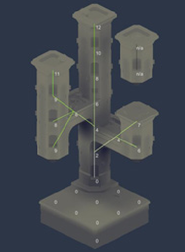

# Voxel House（体素屋）

分解体素屋演示 作者：Oskar Stålberg

**[Voxel House 试玩地址](https://oskarstalberg.com/game/house/index.html)**

## 介绍

我的项目通常围绕着我想探索的一些中心思想展开。在这里，这个中心思想是模块化图块集的一种特定的内容驱动方法，我已经想到了一段时间。
此项目可以在 Maya 中创建为 Python 脚本，也可以在 Houdini 中创建为节点图。但是，由于我不希望我的最终演示材料是以灰盒 Maya 场景为背景的沉闷叙述的 youtube 剪辑，因此我创建了一个交互式 Web 演示。
作为一名技术艺术家，我的技能范围至关重要;我不是一个大师级的艺术家，也不是一个合格的程序员，但我两者都有一部分。我最擅长艺术与科技的交汇处;程序和工艺。
网络演示是展示这些技能的完美媒介。

## 弄清楚瓷砖

**核心概念是这样的：瓷砖是放置在方块之间的角落，而不是方块的中心。**
图块由它们周围的方块定义：与角落中一个方块相邻的方块的方块将是 1,0,0,0,0,0,0;表示直墙的瓷砖将是 1,1,1,1,0,0,0,0。

<!-- truncate -->

由于每个角被 8 个可能的方块包围，每个方块可以是存在或不存在的 2 种可能状态，因此可能的方块数量为 2^8= 256。这比我想要建模的块要多得多，所以我写了一个脚本来弄清楚这些图块中哪些是真正独特的，哪些图块只是其他图块的旋转。
脚本告诉我，我必须对 67 个独特的图块进行建模 - 这个数字要容易得多。

我也可以排除其他瓷砖的翻转版本，这将使数字进一步下降。但是，我决定保留这些，以便我可以制作一些不对称的平铺功能。
您在建筑物凹角处看到的排水管就是一个例子。

## Maya 中的布尔设置

作为技术艺术家，我经常花更多的时间在工作流程上，而不是花在实际工作上。即使考虑到旋转排列，这个项目仍然涉及大量的 3D 网格需要手动创建和跟踪。
该项目的模块化特性也使得在 Maya 之外的适当上下文中持续查看和评估模型非常重要。导出过程必须快速简便，我决定编写一个小的 python 脚本来帮助我。
首先，脚本将我所有的网格合并为一个整体。其次，每个图块的边界框继续使用 Maya 的布尔运算剪切出此合并网格的特定切片。
所有切口块都继承其边界框中的名称和变换，并一起导出为 fbx。

这不仅使导出过程成为一键式解决方案，还意味着我不必保持 Maya 场景的整洁。网格的名称、它们的父级或它们是否正确合并并不重要。
我调整了我的 Maya 脚本，以允许相同图块类型的多个变体。然后，我的 Unity 脚本从该变体池中随机选择它存在的地方。在下图中，您可以看到某些边界框比其他边界框大。
这些适用于顶点超出其分配体积的图块。

## 环境遮蔽

照明对于传达 3D 形状和良好的空间感至关重要。由于免费版Unity的技术限制，我无法访问实时阴影或ssao，也无法编写自己的阴影，因为免费的Unity不允许渲染目标。
解决方案是在该项目的块状性质中找到的。每个块都表示 3D 纹理中的体素。虽然 Unity 不允许我在 GPU 上绘制渲染目标，但它确实允许我在 CPU 上从脚本操作纹理。
（当然，每个像素的速度要慢得多，但对于我的目的来说已经足够快了。只需在法线的大方向上对该像素进行采样，就可以获得不错的环境光遮蔽近似值。

我试图在未点亮的颜色纹理上乘以这个AO，但结果太暗太无聊了。
我决定采用一种方法，利用我新获得的 3D 纹理经验：AO 不仅使像素变暗，还使像素朝向 3D LUT，使其更蓝、饱和度更低。
结果给了我很大的色调变化，而没有太苛刻的值变化。这个照明模型给了我在这个项目中所追求的柔和和宁静的感觉。

## 特殊件

当您启动演示时，它将自动为您生成一个随机结构。根据设计，该结构不包含任何松散或悬挂的块。

我知道，一个经验丰富的工具使用者会试图通过观察它如何处理这些类型的异常结构来立即破坏工具。我决定通过让这些瓷砖更加特别，展示弧线、通道和柱子等特征来炫耀。

## 漂浮件

在我的项目中，没有任何内容可以阻止用户创建自由浮动的块，这就是我想要保留它的方式。但我也想向用户展示，我确实考虑过这种可能性。
我的解决方案是让自由浮动的块慢慢地上下摆动。这需要我创建一个有趣的小算法来实时确定哪些块连接到底座，哪些没有：

每个基本块的逻辑距离均为 0。另一个块检查它们的任何邻居的逻辑距离是否比它们自己短;如果他们这样做，他们会采用该值并为其添加 1。
因此，如果断开一个块的连接，则不会有任何内容将这些块接地到基本块的 0，并且它们的逻辑距离将很快穿过屋顶。那是他们开始摇晃的时候。

浮动块的缓慢摆动为场景增添了一些漂亮的环境动画。

## 艺术选择

选择一种风格是任何项目中有趣且重要的一部分。样式应突出显示与特定项目相关的功能。在这个项目中，我想要一种强调块状和模块化的风格，而不是隐藏它。

清晰的绿色线条勾勒出梯田的轮廓，墙壁是素色的，每层楼都有深色砖块标记，窗户均匀分布，底部的污垢光滑并呈直线沉积。
拐角采用大量斜面设计，以强调瓷砖无缝衔接。露台应该看起来像一个舒适的秘密空间，您可以在安静的周日早晨享用慢速早午餐。
总的来说，这件作品是和平而友好的——如果你愿意的话，这是对资产阶级生活的宁静的致敬。

## 动画

与作品互动应该是有趣且反应灵敏的。我创建了一个用于添加和删除块的动画效果。该效果是顶点着色器的简单组合，前者沿顶点的法线将顶点推出，后者随时间推移分解表面。
一个很好的转折点是，我能够使用为 AO 创建的 3D 纹理来限制沿效果边缘的顶点 - 这就是在图片中看到的中间凸起的原因。

## 结论

最终的结果就像一个工具，但不是。这是一件在浏览器中运行的交互式艺术作品。可以评估它的技术方面，它作为关卡编辑器工具的潜力，它的着色器工作，它的执行和完成，或者只是作为一个有趣的玩法。
我希望它能吸引开发人员和外行。

在某种程度上，像这样的网络演示只是一种恶作剧的方式，可以诱骗人们看你的艺术作品的时间比他们本来要长。

## 关于作者

我是奥斯卡·斯塔尔伯格。我在瑞典乌普萨拉的大学城长大。我有两个兄弟。我们三个人都热爱数学、科学和解决问题。
然而，我确实在绘画方面击败了他们，所以对我来说，从很小的时候起，我就很明显，我必须做一些与此相关的事情。中学毕业后，我在 The Game Assembly 度过了两年压力很大但又富有成效的时光，学习了游戏美术的所有基础知识。
Ubisoft Massive 把我当成技术美术师，从那以后我就一直在那里。我喜欢创造美观、互动和响应迅速的东西。我重视优雅的解决方案。
在科技和艺术的交汇点上，我是最舒服的，我一直在寻找新的交汇点。

作者个人页：www.oskarstalberg.com

文章来源： [VERTEX3 (gumroad.com)](https://ryanhawkins.gumroad.com/l/Nivt) （170-176）
