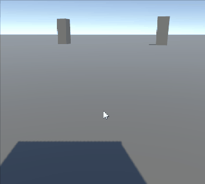
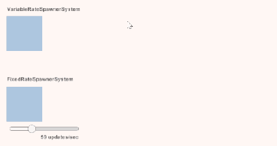
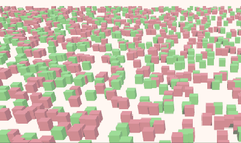

import Tabs from '@theme/Tabs';
import TabItem from '@theme/TabItem';

# HelloCube

官方项目地址：**[Unity-Technologies/EntityComponentSystemSamples (github.com)](https://github.com/Unity-Technologies/EntityComponentSystemSamples)**

<!-- truncate -->

## Main Thread Sample

<div style={{textAlign: 'center'}}>


</div>

## IJobEntity Samples
<div style={{textAlign: 'center'}}>


</div>

## Aspects sample
<div style={{textAlign: 'center'}}>


</div>

## Prefabs sample
<div style={{textAlign: 'center'}}>


</div>

创建大量cube prefab在随机位置，并让它们逐渐下落，当位置y小于0时销毁，当所有的cube都被销毁那么再重新创建它们

<Tabs>
  <TabItem value="SpawnerAuthoring" label="SpawnerAuthoring" default>

在Spawner 下挂载脚本 SpawnerAuthoring 创建spawner的entity

```csharp
// An authoring component is just a normal MonoBehavior that has a Baker<T> class.
// authoring 组件只是具有 Baker 类的普通 MonoBehavior<T>。
public class SpawnerAuthoring : MonoBehaviour
{
    public GameObject Prefab;

    // In baking, this Baker will run once for every SpawnerAuthoring instance in a subscene.
    // 在烘焙中，此 Baker 将为子场景中的每个 SpawnerAuthoring 实例运行一次。
    // (Note that nesting an authoring component's Baker class inside the authoring MonoBehaviour class
    // is simply an optional matter of style.)
    // （请注意，将创作组件的 Baker 类嵌套在创作 MonoBehaviour 类中只是一个可选的样式问题。
    // Baker<T> 将 T Mono class bake 成 entity
    class Baker : Baker<SpawnerAuthoring>
    {
        public override void Bake(SpawnerAuthoring authoring)
        {
            var entity = GetEntity(TransformUsageFlags.None);
            AddComponent(entity, new Spawner
                         {
                             Prefab = GetEntity(authoring.Prefab, TransformUsageFlags.Dynamic)
                         });
        }

    }
}
```

  </TabItem>
  <TabItem value="SpawnSystem" label="SpawnSystem">
    SpawnSystem 用来生成所有的cube

```csharp
public partial struct SpawnSystem : ISystem
{
    uint updateCounter;

    [BurstCompile]
    public void OnCreate(ref SystemState state)
    {
        // This call makes the system not update unless at least one entity in the world exists that has the Spawner component.
        state.RequireForUpdate<Spawner>();
        state.RequireForUpdate<ExecutePrefabs>();
    }

    [BurstCompile]
    public void OnUpdate(ref SystemState state)
    {
        // Create a query that matches all entities having a RotationSpeed component.
        // 创建一个query来查找所有 Entities 包含 RotationSpeed component 也就是 cubes
        // (The query is cached in source generation, so this does not incur a cost of recreating it every update.)
        // query 会被缓冲到source generation，所以不会每次update都重新创建
        var spinningCubesQuery = SystemAPI.QueryBuilder().WithAll<RotationSpeed>().Build();

        // Only spawn cubes when no cubes currently exist.
        // 只在所有的cube都被销毁才创建
        if (spinningCubesQuery.IsEmpty)
        {
            // GetSingleton<T>()将获得instance的单例，我们只需要一个spawner在场景中
            // 这个函数在场景中不存在或者存在一个以上的包含Spawner component的entity时就会报错
            // 因此需要在OnCreate上加上对Spawner的依赖，确保至少有一个Spawner时才update
            var prefab = SystemAPI.GetSingleton<Spawner>().Prefab;

            // Instantiating an entity creates copy entities with the same component types and values.  // 创建 entities -> cube 500个
            var instances = state.EntityManager.Instantiate(prefab, 500, Allocator.Temp);

            // Unlike new Random(), CreateFromIndex() hashes the random seed
            // so that similar seeds don't produce similar results.
            var random = Random.CreateFromIndex(updateCounter++);

            // Update the entity's LocalTransform component with the new position.
            // 对 component 的乱序查询是非常消耗性能的，一般尽量query component得到entity，然后迭代访问component
            // 最推荐的做法还是先query再访问每个transform ???
            // TODO: SystemAPI.GetComponentRW 可以指定从实体中获取组件    SystemAPI.Query 好像不行
            foreach (var (trans,speed) in SystemAPI.Query<RefRW<LocalTransform>,RefRO<RotationSpeed>>()) {
                trans.ValueRW.Position = (random.NextFloat3() - new float3(0.5f, 0, 0.5f)) * 20;
            }

            foreach (var entity in instances)
            {
                var transform = SystemAPI.GetComponentRW<LocalTransform>(entity);
                transform.ValueRW.Position = (random.NextFloat3() - new float3(0.5f, 0, 0.5f)) * 20;
            }
        }
    }
}

```

</TabItem>

<TabItem value="FallAndDestroySystem" label="FallAndDestroySystem">
    FallAndDestroySystem cube的下落和销毁

```csharp
public partial struct FallAndDestroySystem : ISystem
{
    [BurstCompile]
    public void OnCreate(ref SystemState state) {

        state.RequireForUpdate<ExecutePrefabs>();
    }

    [BurstCompile]
    public void OnUpdate(ref SystemState state)
    {
        // rotation
        float deltaTime = SystemAPI.Time.DeltaTime;
        foreach (var (transform, speed) in
                 SystemAPI.Query<RefRW<LocalTransform>, RefRO<RotationSpeed>>())
        {
            // ValueRW and ValueRO both return a ref to the actual component value.
            // The difference is that ValueRW does a safety check for read-write access while
            // ValueRO does a safety check for read-only access.
            // ValueRW 和 ValueRO 都返回对实际组件值的引用。区别在于，ValueRW 对读写访问进行安全检查，而 ValueRO 对只读访问进行安全检查。
            transform.ValueRW = transform.ValueRO.RotateY(
                speed.ValueRO.RadiansPerSecond * deltaTime);
        }

        // An EntityCommandBuffer created from EntityCommandBufferSystem.Singleton will be
        // played back and disposed by the EntityCommandBufferSystem when it next updates.
        // 从 EntityCommandBufferSystem.Singleton 创建的 EntityCommandBuffer 将在 EntityCommandBufferSystem 下次更新时运行并释放。
        var ecbSingleton = SystemAPI.GetSingleton<BeginSimulationEntityCommandBufferSystem.Singleton>();
        var ecb = ecbSingleton.CreateCommandBuffer(state.WorldUnmanaged);

        // Downward vector
        var movement = new float3(0, -SystemAPI.Time.DeltaTime * 5f, 0);

        // WithAll() includes RotationSpeed in the query, but
        // the RotationSpeed component values will not be accessed.
        // WithEntityAccess() includes the Entity ID as the last element of the tuple.
        // WithAll（） 在查询中包含 RotationSpeed，但不会访问 RotationSpeed 组件值。WithEntityAccess（） 将实体 ID 作为元组的最后一个元素包含在内。
        foreach (var (transform, entity) in
                 SystemAPI.Query<RefRW<LocalTransform>>()
                 .WithAll<RotationSpeed>()
                 .WithEntityAccess())
        {
            transform.ValueRW.Position += movement;
            if (transform.ValueRO.Position.y < 0)
            {
                // Making a structural change would invalidate the query we are iterating through,
                // so instead we record a command to destroy the entity later.
                // 进行结构更改会使我们正在迭代的查询失效，因此我们稍后会记录一个命令以销毁实体。
                ecb.DestroyEntity(entity);
            }
        }
    }
}
```

</TabItem>
</Tabs>

## IJobChunk
<div style={{textAlign: 'center'}}>


</div>
IJobChunk代替IJobEntity来处理 cube 的旋转

:::info IJobEntity 和 IJobChunk 的区别:

IJobEntity 为与查询匹配的每个`实体`调用一次

IJobChunk 为与查询匹配的每个`区块`调用一次
:::

<Tabs>

<TabItem value="RotationJob" label="RotationJob">


```csharp
[BurstCompile]
struct RotationJob : IJobChunk
{
    // 比较 IJobEntity, 这里的变量是ComponentTypeHandle<T> ; 而IJobEntity可以在Execute使用ref T
    public ComponentTypeHandle<LocalTransform> TransformTypeHandle;
    [ReadOnly] public ComponentTypeHandle<RotationSpeed> RotationSpeedTypeHandle;
    public float DeltaTime;

    // v128 表示 128 位 SIMD 值
    public void Execute(in ArchetypeChunk chunk, int unfilteredChunkIndex, bool useEnabledMask,
                        in v128 chunkEnabledMask)
    {
        // The useEnableMask parameter is true when one or more entities in
        // the chunk have components of the query that are disabled.
        // If none of the query component types implement IEnableableComponent,
        // we can assume that useEnabledMask will always be false.
        // However, it's good practice to add this guard check just in case
        // someone later changes the query or component types.
        // 当区块中的一个或多个实体具有 disable 的查询组件时，useEnableMask 参数为 true。如果查询组件类型均未实现 IEnableComponent，
        // 则可以假定 useEnabledMask 将始终为 false。但是，最好添加此保护检查，以防以后有人更改查询或组件类型。
        Assert.IsFalse(useEnabledMask);

        var transforms = chunk.GetNativeArray(ref TransformTypeHandle);
        var rotationSpeeds = chunk.GetNativeArray(ref RotationSpeedTypeHandle);
        for (int i = 0, chunkEntityCount = chunk.Count; i < chunkEntityCount; i++)
        {
            transforms[i] = transforms[i].RotateY(rotationSpeeds[i].RadiansPerSecond * DeltaTime);
        }
    }
}
```

</TabItem>

<TabItem value="RotationSystem" label="RotationSystem">

```csharp
public partial struct RotationSystem : ISystem
{
    [BurstCompile]
    public void OnCreate(ref SystemState state)
    {
        state.RequireForUpdate<ExecuteIJobChunk>();
    }

    [BurstCompile]
    public void OnUpdate(ref SystemState state)
    {
        var spinningCubesQuery = SystemAPI.QueryBuilder().WithAll<RotationSpeed, LocalTransform>().Build();

        var job = new RotationJob
        {
            TransformTypeHandle = SystemAPI.GetComponentTypeHandle<LocalTransform>(),
            RotationSpeedTypeHandle = SystemAPI.GetComponentTypeHandle<RotationSpeed>(true),
            DeltaTime = SystemAPI.Time.DeltaTime
        };

        // Unlike an IJobEntity, an IJobChunk must be manually passed a query.
        // Furthermore, IJobChunk does not pass and assign the state.Dependency JobHandle implicitly.
        // (This pattern of passing and assigning state.Dependency ensures that the entity jobs scheduled
        // in different systems will depend upon each other as needed.)
        //与 IJobEntity 不同，必须手动向 IJobChunk 传递查询。此外，IJobChunk 不会传递和分配状态。
        //隐式依赖项 JobHandle。（这种传递和分配状态的模式。依赖关系可确保在不同系统中调度的实体作业将根据需要相互依赖。
        state.Dependency = job.Schedule(spinningCubesQuery, state.Dependency);
    }
}
```

</TabItem>

</Tabs>

## Reparenting sample
<div style={{textAlign: 'center'}}>


</div>
让子Cube周期性的挂载和卸载在父Cube上，挂载时跟随旋转

## EnableableComponents Sample
<div style={{textAlign: 'center'}}>


</div>

## GameObjectSync
<div style={{textAlign: 'center'}}>


</div>

## CrossQuery

<div style={{textAlign: 'center'}}>


</div>

## RandomSpawn

<div style={{textAlign: 'center'}}>


</div>

## FirstPersonController

<div style={{textAlign: 'center'}}>


</div>

## FixedTimestep

<div style={{textAlign: 'center'}}>



</div>

实例化每个系统更新的一个实体。每个显示的帧更新一次。（取决于帧速率）

实例化每个系统更新的一个实体。更新速率由下面的滑块控制。（与帧速率无关）

## CustomTransforms

<div style={{textAlign: 'center'}}>


</div>

## StateChange

## ClosestTarget

<div style={{textAlign: 'center'}}>



</div>
