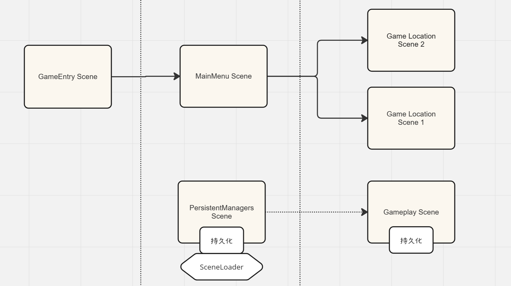
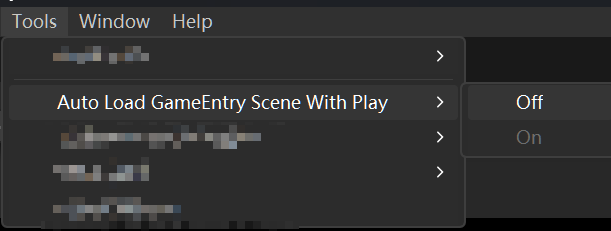
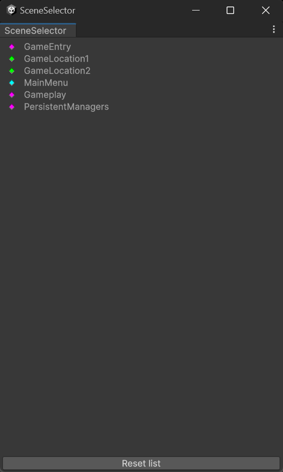

# Unity编辑模式自启动游戏入口场景



:::note 笔记

适用场景：适用于场景较多，启动较复杂的项目

最佳实践：有一个游戏入口场景做初始化

:::

<!-- truncate -->

## 场景启动器



此类在编辑器中工作时自动加载引导程序屏幕（构建设置中的第一个场景）。它还添加了用于切换行为的菜单项。

```csharp

[InitializeOnLoad]
public class SceneBootstrapper
{
    // 将这些键用于“编辑器”首选项
    private const string k_PreviousScene = "PreviousScene";
    private const string k_ShouldLoadBootstrap = "GameEntry";

    // 显示为菜单名称
    private const string k_LoadBootstrapMenu = "Tools/Auto Load GameEntry Scene With Play/On";
    private const string k_DontLoadBootstrapMenu = "Tools/Auto Load GameEntry Scene With Play/Off";

    // 这将获取引导场景，该场景必须是构建设置中的第一个场景
    private static string BootstrapScene => EditorBuildSettings.scenes[0].path;

    // 此字符串是我们进入播放模式的场景名称
    private static string PreviousScene
    {
        get => EditorPrefs.GetString(k_PreviousScene);
        set => EditorPrefs.SetString(k_PreviousScene, value);
    }

    // 是否启用了场景自启动？
    private static bool ShouldLoadBootstrapScene
    {
        get => EditorPrefs.GetBool(k_ShouldLoadBootstrap, true);
        set => EditorPrefs.SetBool(k_ShouldLoadBootstrap, value);
    }

    // 静态构造函数使用 InitializeOnLoad 属性运行
    static SceneBootstrapper()
    {
        // 侦听编辑器更改播放状态
        EditorApplication.playModeStateChanged += OnPlayModeStateChanged;
    }

    // 当编辑器更改播放状态（例如进入播放模式，退出播放模式）时，这将运行
    private static void OnPlayModeStateChanged(PlayModeStateChange playModeStateChange)
    {
        // 如果从菜单中禁用，则不执行任何操作
        if (!ShouldLoadBootstrapScene)
        {
            return;
        }

        switch (playModeStateChange)
        {
            // 这将在进入播放模式时加载引导场景
            case PlayModeStateChange.ExitingEditMode:

                PreviousScene = EditorSceneManager.GetActiveScene().path;

                if (EditorSceneManager.SaveCurrentModifiedScenesIfUserWantsTo() && IsSceneInBuildSettings(BootstrapScene))
                {
                    EditorSceneManager.OpenScene(BootstrapScene);
                }
                break;

            // This restores the PreviousScene when exiting Play mode
            case PlayModeStateChange.EnteredEditMode:

                if (!string.IsNullOrEmpty(PreviousScene))
                {
                    EditorSceneManager.OpenScene(PreviousScene);
                }
                break;
        }
    }

    // 这些菜单项切换行为。

    // 这会将一个名为“Tools/Auto Load GameEntry Scene With Play/On”的菜单项添加到 GameSystems 菜单中，并
    // 如果选中，则启用该行为。
    [MenuItem(k_LoadBootstrapMenu)]
    private static void EnableBootstrapper()
    {
        ShouldLoadBootstrapScene = true;
    }

    // 验证上述函数和菜单项，如果 ShouldLoadBootstrapScene 为 true，则该函数和菜单项显示为灰色。
    [MenuItem(k_LoadBootstrapMenu, true)]
    private static bool ValidateEnableBootstrapper()
    {
        return !ShouldLoadBootstrapScene;
    }

    // 将名为“Tools/Auto Load GameEntry Scene With Play/Off”的菜单项添加到 GameSystems 菜单中，并
    // 如果选中，则禁用该行为。
    [MenuItem(k_DontLoadBootstrapMenu)]
    private static void DisableBootstrapper()
    {
        ShouldLoadBootstrapScene = false;
    }

    //验证上述函数和菜单项，如果 ShouldLoadBootstrapScene 为 false，则该函数和菜单项将变灰。
    [MenuItem(k_DontLoadBootstrapMenu, true)]
    private static bool ValidateDisableBootstrapper()
    {
        return ShouldLoadBootstrapScene;
    }

    // scenePath 是 BuildSettings 中的有效场景吗？
    private static bool IsSceneInBuildSettings(string scenePath)
    {
        if (string.IsNullOrEmpty(scenePath))
            return false;

        foreach (var scene in EditorBuildSettings.scenes)
        {
            if (scene.path == scenePath)
            {
                return true;
            }
        }

        return false;
    }
}

```

## 场景快速选择器

编辑器脚本来源 [unity开放项目ChopChop](https://github.com/UnityTechnologies/open-project-1)


