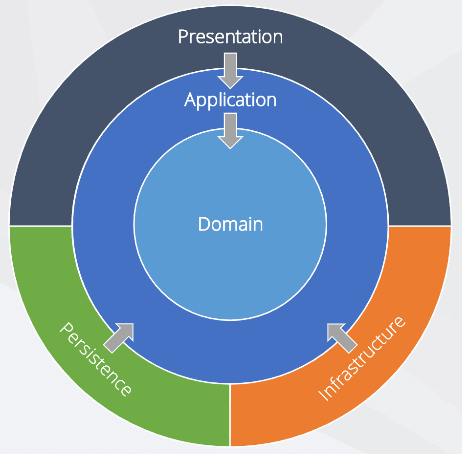

# Flutter 项目架构合集

## Clean Architecure

在CA，我们遵循一个有三层的架构

- 数据层
- 域层
- 功能层

> 我们还有 2 个额外的支持层，即资源层和共享库层


调用流如下所示。


### 示例结构

```
├── core
|   ├── user
│   │   ├── data
│   │   │   ├── dto
│   │   │   │   └── user_dto.dart
│   │   │   │   └── user_response_dto.dart
│   │   │   ├── datasource
│   │   │   │   └── user_remote_datasource.dart
│   │   │   │   └── user_local_datasource.dart
│   │   │   ├── mapper
│   │   │   │   └── user_mapper.dart
│   │   │   ├── repository
│   │   │   │   └── user_repository.dart
│   │   │   ├── di
│   │   │   │   └── dependency.dart
│   │   ├── domain
│   │   │   ├── repository
│   │   │   │   └── user_repository_impl.dart
│   │   │   ├── entity
│   │   │   │   └── user_entity.dart
│   │   │   ├── usecase
│   │   │   │   └── get_user_list_usecase.dart
│   │   │   │   └── get_user_detail_usecase.dart
│   │   │   ├── di
│   │   │   │   └── dependency.dart
├── feature
|   ├── user
│   │   ├── page
│   │   │   └── user_list_page.dart
│   │   │   └── user_details_page.dart
│   │   ├── controller
│   │   │   └── user_list_controller.dart
│   │   │   └── user_details_controller.dart
│   │   ├── widget
│   │   │   └── user_card_widget.dart
```


## Very Good Architecture

在VGV，我们遵循一个有四层的架构。

- 数据层：这一层负责与API交互。
- 域层：这是负责转换来自数据层的数据的层。
- 业务逻辑层：这一层管理状态（通常使用flutter_bloc）。
- 表示层：基于状态呈现UI组件。

域层将原始数据转换为业务逻辑层使用的特定于域的模型。业务逻辑层保持存储库提供的域模型的不可变状态。此外，业务逻辑层对来自 UI 的输入做出反应，并在需要根据状态进行更改时与存储库进行通信。


### 示例结构

```
├── lib
|   ├── posts
│   │   ├── bloc
│   │   │   └── post_bloc.dart
|   |   |   └── post_event.dart
|   |   |   └── post_state.dart
|   |   └── models
|   |   |   └── models.dart
|   |   |   └── post.dart
│   │   └── view
│   │   |   ├── posts_page.dart
│   │   |   └── posts_list.dart
|   |   |   └── view.dart
|   |   └── widgets
|   |   |   └── bottom_loader.dart
|   |   |   └── post_list_item.dart
|   |   |   └── widgets.dart
│   │   ├── posts.dart
│   ├── app.dart
│   ├── simple_bloc_observer.dart
│   └── main.dart
├── pubspec.lock
├── pubspec.yaml

```

```

```

## Onion Architecture

在OA，我们遵循一个有四层的架构。

- 表示层：包括用户界面和通知程序（Provider）。Ui 层负责页面和模板、生物体、原子（我们采用原子设计），通知器层负责状态管理。
- 应用层：包括 dto 和 usecase（*_service.dart）。Dto 层负责从基础架构层传输数据对象。Usecase 负责表示层的 usecase（用户的操作）。
- 域层：包括模型和服务。模型层负责价值对象和域对象、存储库接口。服务层负责域服务。
- 基础架构层：包括存储库、firebase 和 sqflite。仓库层负责仓库接口的实现。Firebase 图层和 Sqflight 图层负责这些数据库的初始设置。

此图显示了洋葱架构的工作原理。域是中心，包括实体和值对象。包括用户界面和状态管理、基础结构和持久性在内的表示取决于应用程序，而应用程序取决于域。它是单向的。





数据流和调用流如下所示。


示例结构

```
├── application
│   ├── dto
│   ├── *_service.dart
├── domain
│   ├── model
│   └── service
├── infrastructure
│   ├── firebase
│   ├── repository
│   └── sqflite
├── main.dart
└── presentation
    ├── notifier
    └── ui
        └── pages
        └── templates
        └── organisms
        └── atoms
```


## Domain Driven Design

采用领域驱动设计的优点如下

- 责任变得清晰（尤其是在模型层）
- 其他成员可以很容易地理解架构。

AppFlowy的操作流程 https://docs.appflowy.io/docs/documentation/software-contributions/architecture/domain-driven-design#operation-flow

```
       presentation       │          Application                      domain                        Infrastructure
                                                      │                                   │
                             7                                 Data Model
               ┌──────────────────────────────┐       │       ┌────────────────────────┐  │     ┌─────────────────────┐
               │          │                   │               │ ┌─────────────┐        │        │   Network Service   │
               ▼             Bloc             │       │       │ │  Aggregate  │        │  │     └─────────────────────┘
        ┌─────────────┐   │ ┌─────────────────┴─────┐         │ └─────────────┘        │                   ▲
────────▶   Widget    │     │ ┌────────┐ ┌────────┐ │    2    │ ┌────────┐             │  │                │ 6
        └─────────────┘   │ │ │ Event  │ │ State  │ │────┬───▶│ │ Entity │             │        ┌─────────────────────┐
User           │            │ └────────┘ └────────┘ │ │  │    │ └────────┘             │  │     │ Persistence Service │
interaction    │          │ └──────▲────────────────┘    │    │ ┌─────────────────┐    │        └─────────────────────┘
               │                   │                  │  │    │ │  Value Object   │    │  │                ▲
               └──────────┼────────┘                     │    │ └─────────────────┘    │                   │ 5
                     1                                │  │    └────────────◈───────────┘  │     ┌─────────────────────┐
                          │                              │                 │contain             │    Unit of Work     │
                                                      │  │      ┌────────────────────┐    │     └─────────────────────┘
                          │                              │      │      Service       │                     ▲
                                                      │  │      └────────────────────┘    │                │
                          │                              │                                                 │ 4
                                                      │  │     Repository                 │                │
                          │                              │   ┌─────────────────────────────────────────────┴───────────────┐
                                                      │  │   │ ┌ ─ ─ ─ ─ ─ ─ ─ ─ ─ ─ ─ ┐  3  ┌ ─ ─ ─ ─ ─ ─ ─ ─ ─ ─ ─ ─ ─ ┐ │
                          │                              └───┤         Interface        ────▶       Implementation         │
                                                      │      │ └ ─ ─ ─ ─ ─ ─ ─ ─ ─ ─ ─ ┘     └ ─ ─ ─ ─ ─ ─ ─ ─ ─ ─ ─ ─ ─ ┘ │
                          │                                  └─────────────────────────────────────────────────────────────┘
                                                      │
```


## Modern Architecure


## Model View Controller

## Model View Presenter

## Model View View-Model

参考资料：

[Flutter中非常好的分层架构 --- Very good layered architecture in Flutter](https://verygood.ventures/blog/very-good-flutter-architecture)

https://medium.com/@ushimaru/beginners-guide-to-flutter-with-ddd-87d4c476c3cb
