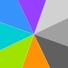

## 区域划分shader

最近在研究数独的一个填色标记功能,一眼看去面积均分，一直以为是采用什么区域划分算法或者是Voronoi算法简单版,又或者是德劳内三角剖分算法，之后发现角度是均分的，简单实现思路是找到目标中点，根据颜色的填充个数x对2Pi均分，获得一个扇形区域，用扇形区域填充ui，实现效果支持动态颜色列表，是否填充采用位掩码的方式。



<!-- truncate -->

## shadertoy 实例

ui轮盘shader

```mdx-code-block

import ShaderToyEmbed from '@site/src/components/ShaderToyEmbed'

<ShaderToyEmbed id="WXlGRj" title="A random dynamic, noisy background." />

```


## unity6000 实现相同效果


需要实现填充颜色动态修改材质属性即可，初始化颜色列表，如有需要可以配置几个调色版，供主题切换使用，填充颜色函数伪代码:

```

initColors(colors)
  for k,v in colors:
    mat.setData("_Color[k]") = v 

fillcolor(bitmask) # 0b11010 or 124
  mat.setData("_ColorMask") = bitmask

```

以下是shader代码

```shader

Shader "UI/FullColorWheel"
{
    Properties
    {
        [PerRendererData] _MainTex("Sprite Texture", 2D) = "white" {}
        _Color("Tint", Color) = (1,1,1,1)
        
        // 颜色控制参数
        [IntRange] _ColorMask("Active Colors", Range(0,4095)) = 1
        _StartAngle("Start Angle", Range(0,360)) = 0
        _Smoothness("Edge Smoothness", Range(0,0.2)) = 0.05
        
        // 12种颜色定义
        _Color0("Color 0", Color) = (1,0,0,1)
        _Color1("Color 1", Color) = (0,1,0,1)
        _Color2("Color 2", Color) = (0,0,1,1)
        _Color3("Color 3", Color) = (1,1,0,1)
        _Color4("Color 4", Color) = (1,0,1,1)
        _Color5("Color 5", Color) = (0,1,1,1)
        _Color6("Color 6", Color) = (0.5,0,0,1)
        _Color7("Color 7", Color) = (0,0.5,0,1)
        _Color8("Color 8", Color) = (0,0,0.5,1)
        _Color9("Color 9", Color) = (0.5,0.5,0,1)
        _Color10("Color 10", Color) = (0.5,0,0.5,1)
        _Color11("Color 11", Color) = (0,0.5,0.5,1)

        // UI必要参数
        [HideInInspector] _StencilComp("Stencil Comparison", Float) = 8
        [HideInInspector] _Stencil("Stencil ID", Float) = 0
        [HideInInspector] _StencilOp("Stencil Operation", Float) = 0
        [HideInInspector] _StencilWriteMask("Stencil Write Mask", Float) = 255
        [HideInInspector] _StencilReadMask("Stencil Read Mask", Float) = 255
        [HideInInspector] _ColorMaskUI("UI Color Mask", Float) = 15
    }

    SubShader
    {
        Tags
        {
            "Queue"="Transparent"
            "IgnoreProjector"="True"
            "RenderType"="Transparent"
            "PreviewType"="Plane"
            "CanUseSpriteAtlas"="True"
        }

        Stencil
        {
            Ref [_Stencil]
            Comp [_StencilComp]
            Pass [_StencilOp]
            ReadMask [_StencilReadMask]
            WriteMask [_StencilWriteMask]
        }

        Cull Off
        Lighting Off
        ZWrite Off
        ZTest [unity_GUIZTestMode]
        Blend SrcAlpha OneMinusSrcAlpha
        ColorMask [_ColorMaskUI]

        Pass
        {
            Name "COLOR_WHEEL"
            CGPROGRAM
            #pragma vertex vert
            #pragma fragment frag
            #pragma target 3.0
            #pragma multi_compile __ UNITY_UI_CLIP_RECT
            #pragma multi_compile __ UNITY_UI_ALPHACLIP

            #include "UnityCG.cginc"
            #include "UnityUI.cginc"

            struct appdata
            {
                float4 vertex : POSITION;
                float2 uv : TEXCOORD0;
                float4 color : COLOR;
                UNITY_VERTEX_INPUT_INSTANCE_ID
            };

            struct v2f
            {
                float2 uv : TEXCOORD0;
                float4 vertex : SV_POSITION;
                float4 color : COLOR;
                float2 worldPos : TEXCOORD1;
                UNITY_VERTEX_OUTPUT_STEREO
            };

            sampler2D _MainTex;
            fixed4 _Color;
            float4 _ClipRect;
            int _ColorMask;
            float _StartAngle;
            float _Smoothness;
            fixed4 _Color0, _Color1, _Color2, _Color3, _Color4, _Color5;
            fixed4 _Color6, _Color7, _Color8, _Color9, _Color10, _Color11;

            v2f vert(appdata v)
            {
                v2f o;
                UNITY_SETUP_INSTANCE_ID(v);
                UNITY_INITIALIZE_VERTEX_OUTPUT_STEREO(o);
                o.vertex = UnityObjectToClipPos(v.vertex);
                o.uv = v.uv;
                o.color = v.color * _Color;
                o.worldPos = mul(unity_ObjectToWorld, v.vertex).xy;
                return o;
            }

            fixed4 GetColorByIndex(int index)
            {
                switch(index)
                {
                    case 0: return _Color0;
                    case 1: return _Color1;
                    case 2: return _Color2;
                    case 3: return _Color3;
                    case 4: return _Color4;
                    case 5: return _Color5;
                    case 6: return _Color6;
                    case 7: return _Color7;
                    case 8: return _Color8;
                    case 9: return _Color9;
                    case 10: return _Color10;
                    case 11: return _Color11;
                    default: return fixed4(1,1,0,1); // 黄色表示错误
                }
            }

            fixed4 frag(v2f i) : SV_Target
            {
                // UI裁剪处理
                half4 color = i.color;
                #ifdef UNITY_UI_CLIP_RECT
                color.a *= UnityGet2DClipping(i.worldPos, _ClipRect);
                #endif
                #ifdef UNITY_UI_ALPHACLIP
                clip(color.a - 0.001);
                #endif

                // 转换到圆形坐标系 [-1,1]
                float2 coord = (i.uv - 0.5) * 2.0;
                
                // 计算角度并应用起始偏移（移除半径检查）
                float angle = fmod(degrees(atan2(coord.y, coord.x)) - _StartAngle + 720, 360);

                // 收集激活的颜色索引
                int colorIndices[12];
                int activeCount = 0;
                
                for(int bit = 0; bit < 12; bit++)
                {
                    if(_ColorMask & (1 << bit))
                    {
                        colorIndices[activeCount++] = bit;
                    }
                }

                if(activeCount == 0) return fixed4(0,0,0,0);

                // 计算扇区（保持扇形分布逻辑）
                float sectorSize = 360.0 / activeCount;
                int sectorIndex = min(activeCount - 1, floor(angle / sectorSize));
                int colorIndex = colorIndices[sectorIndex];

                // 边缘混合（保留扇形之间的平滑过渡）
                float blend = 0;
                if(_Smoothness > 0)
                {
                    float sectorEdge = sectorIndex * sectorSize;
                    blend = smoothstep(0, _Smoothness * sectorSize, 
                        fmod(angle - sectorEdge + 360, 360));
                }

                // 获取最终颜色（不再受半径限制）
                fixed4 finalColor = GetColorByIndex(colorIndex);
                finalColor.a *= color.a;
                return finalColor;
            }
            ENDCG
        }
    }
    FallBack "UI/Default"
}

```
