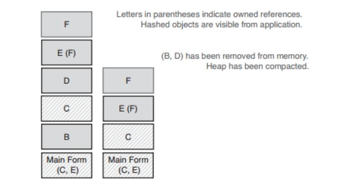
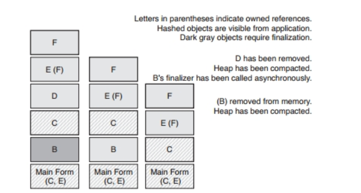

<!-- import { RoughNotation, RoughNotationGroup } from "react-rough-notation"; -->

import Notation from '@site/src/components/Notation'

<!-- truncate -->

<!-- <Notation type="underline" show >1111111</Notation> -->

## 第1章　C#语言的编程习惯

能用的东西为什么要改？因为改了之后效果更好。开发者换用其他工具或语言来编程也是这个道理，因为换了之后工作效率更高。如果不肯改变现有的习惯，那么就体会不到新技术的好处，但如果这种新的技术与你熟悉的技术看上去很像，那么改起来就特别困难。例如C#语言就与C++或Java语言相似，由于它们都用一对花括号来表示代码块，因此，开发者即便切换到了C#语言，也总是会把使用那两门语言时所养成的习惯直接带过来，这样做其实并不能发挥出C#的优势。这门语言的首个商用版本发布于2001年，经过这些年的演变，当前这一版C#语言与C++或Java之间的差别已经远远大于那个年代。如果你是从其他语言转入C#的，那么需要学习C#语言自己的编程习惯，使得这门语言能够促进你的工作，而不是阻碍你的工作。本章会提醒大家把那些与C#编程风格不符的做法改掉，并培养正确的编程习惯。

### 第1条：优先使用隐式类型的局部变量

隐式类型的局部变量是为了支持匿名类型机制而加入C#语言的。之所以要添加这种机制，还有一个原因在于：某些查询操作所获得的结果是IQueryable\<T>，而其他一些则返回IEnumerable\<T>。如果硬要把前者当成后者来对待，那就无法使用由IQueryProvider所提供的很多增强功能了（参见第42条）。用var来声明变量而不指明其类型，可以令开发者把注意力更多地集中在名称上面，从而更好地了解其含义。例如，jobsQueuedByRegion这个变量名本身就已经把该变量的用途说清楚了，即便将它的类型Dictionary\<int，Queue\<string>>写出来，也不会给人提供多少帮助。

对于很多局部变量，笔者都喜欢用var来声明，因为这可以令人把注意力放在最为重要的部分，也就是变量的语义上面，而不用分心去考虑其类型。如果代码使用了不合适的类型，那么编译器会提醒你，而不用你提前去操心。变量的类型安全与开发者有没有把变量的类型写出来并不是同一回事。在很多场合，即便你费心去区分IQueryable与IEnumerable之间的差别，开发者也无法由此获得有用的信息。如果你非要把类型明确地告诉编译器，那么有时可能会改变代码的执行方式（参见第42条）。在很多情况下，完全可以使用var来声明隐式类型的局部变量，因为编译器会自动选择合适的类型。但是不能滥用这种方式，因为那样会令代码难于阅读，甚至可能产生微妙的类型转换bug。

局部变量的类型推断机制并不影响C#的静态类型检查。这是为什么呢？首先必须了解局部变量的类型推断不等于动态类型检查。用var来声明的变量不是动态变量，它的类型会根据赋值符号右侧那个值的类型来确定。var的意义在于，你不用把变量的类型告诉编译器，编译器会替你判断。

笔者现在从代码是否易读的角度讲解隐式类型的局部变量所带来的好处和问题。其实在很多情况下，局部变量的类型完全可以从初始化语句中看出来：

```csharp
var foo = new MyType();
```

懂C#的开发者只要看到这条语句，立刻就能明白foo变量是什么类型。此外，如果用工厂方法的返回值来初始化某个变量，那么其类型通常也是显而易见的：

```csharp
var thing = AccountFactory.CreateSavingsAccount();
```

某些方法的名称没有清晰地指出返回值的类型，例如

```csharp
var result = somebObject.DoSomeWork(anotherParameter);
```

这个例子当然是笔者刻意构造的，大家在编写代码的时候应该把方法的名字起好，使得调用方可以据此推断出返回值的类型。对于刚才那个例子来说，其实只需要修改变量的名称，就能令代码变得清晰：

```csharp
var HighestSellingProduct = somebObject.DoSomeWork(anotherParameter);
```

尽管方法名本身没有指出返回值的类型，但是像这样修改之后，很多开发者就可以通过变量的名称推断出该变量的类型应该是Product。

HighestSellingProduct变量的真实类型当然要由DoSomeWork方法的签名来决定，因此，它的类型可能并不是Product本身，而是继承自Product的类，或是Product所实现的接口。总之，编译器会根据DoSomeWork方法的签名来认定HighestSellingProduct变量的类型。无论它在运行期的实际类型是不是Product，只要没有明确执行类型转换操作，那么一律以编译器判断的类型为准。

用var来声明变量可能会令阅读代码的人感到困惑。比方说，如果像刚才那样用方法的返回值来给这样的变量做初始化，那么就会造成此类问题。查看代码的人会按照自己的理解来认定这个变量的类型，而他所认定的类型可能恰好与变量在运行期的真实类型相符。但是编译器却不会像人那样去考虑该对象在运行期的类型，而是会根据声明判定其在编译期的类型。如果声明变量的时候直接指出它的类型，那么编译器与其他开发者就都会看到这个类型，并且会以该类型为准，反之，若用var来声明，则编译器会自行推断其类型，而其他开发者却看不到编译器所推断出的类型。因此，他们所认定的类型可能与编译器推断出的类型不符。这会令代码在维护过程中遭到错误地修改，并产生一些本来可以避免的bug。

如果隐式类型的局部变量的类型是C#内置的数值类型，那么还会产生另外一些问题，因为在使用这样的数值时，可能会触发各种形式的转换。有些转换是宽化转换（widening conversion），这种转换肯定是安全的，例如从float到double就是如此，但还有一些转换是窄化转换（narrowing conversion），这种转换会令精确度下降，例如从long到int的转换就会产生这个问题。如果明确地写出数值变量所应具备的类型，那么就可以更好地加以控制，而且编译器也会把有可能因转换而丢失精度的地方给你指出来。

现在看这段代码：

```csharp
var f = GetMagicNumber();
var total = 100 * f / 6;
Console.WriteLine($"Declared Type: {total.GetType().Name},Value:{total}");
```

<Notation></Notation>

请问total的值是多少？这个问题取决于GetMagicNumber方法的返回值是什么类型。下面这5种输出结果分别对应5个GetMagicNumber版本，每个版本的返回值类型都不一样：

```console
Declared Type: Double,Value: 166.666666666667
Declared Type: Single,Value: 166.6667
Declared Type: Int32,Value: 166
Declared Type: Int64,Value: 166
```

total变量在这5种情况下会表现出5种不同的类型，这是因为该变量的类型由变量f来确定，而变量f的类型又是编译器根据GetMagicNumber（）的返回值类型推断出来的。计算total值的时候，会用到一些常数，由于这些常数是以字面量的形式写出的，因此，编译器会将其转换成和f一致的类型，并按照那种类型的规则加以计算。于是，不同的类型就会产生不同的结果。

这并不是C#编译器的缺陷，因为它只是按照代码的含义照常完成了任务而已。由于代码采用了隐式类型的局部变量，因此编译器会自己来设定变量的类型，也就是根据赋值符号右侧的那一部分做出最佳的选择。用隐式类型的局部变量来表示数值的时候要多加小心，因为可能会发生很多隐式转换，这不仅容易令阅读代码的人产生误解，而且其中某些转换还会令精确度下降。

这个问题当然也不是由var所引发的，而是因为阅读代码的人不清楚GetMagic-Number（）的返回值究竟是什么类型，也不知道运行过程中会发生哪些默认的数值转换。把变量f的声明语句拿掉之后，问题依然存在：

```csharp
var total = 100 * f / 6;
Console.WriteLine($"Declared Type: {total.GetType().Name},Value:{total}");
```

就算明确指出total变量的类型，也无法消除疑惑：

```csharp
double total = 100 * GetMagicNumber() / 6;
Console.WriteLine($"Declared Type: {total.GetType().Name},Value:{total}");
```

total的类型虽然是double，但如果GetMagicNumber（）返回的是整数值，那么程序就会按照整数运算的规则来计算100*GetMagicNumber（）/6的值，而无法把小数部分也保存到total中。

代码之所以令人误解，是因为开发者看不到GetMagicNumber（）的实际返回类型，也无法轻易观察出计算过程中所发生的数值转换。

如果把GetMagicNumber（）的返回值保存在类型明确的变量中，那么这段代码就会好读一点，因为编译器会把开发者所犯的错误指出来。当GetMagicNumber（）的返回值类型可以隐式地转换为变量f所具备的类型时，编译器不会报错。例如当方法返回的是int且变量f的类型是decimal时，就会发生这样的转换。反之，若不能执行隐式转换，则会出现编译错误，这会令开发者明白自己原来理解得不对，现在必须修改代码。这样的写法使得开发者能够仔细审视代码，从而看出正确的转换方式。

刚才那个例子说明局部变量的类型推断机制可能会给开发者维护代码造成困难。与不使用类型推断的情况相比，编译器在这种情况下的运作方式其实并没有多少变化，它还是会执行自己应该完成的类型检查，只是开发者不太容易看出相关的规则与数值转换行为。在这些场合中，局部变量的类型推断机制起到了阻碍作用，使得开发者难以判断相关的类型。

但是在另外一些场合里面，编译器所选取的类型可能比开发者手工指定的类型更为合适。下面这段简单的代码会把客户姓名从数据库里面拿出来，然后寻找以字符串start开头的那些名字，并把查询结果保存到变量q2中：

```csharp
public IEnumerable<string> FindCustomerStartingWith1(string start){
  IEnumerable<string> q = from c in db.Customers select c.ContactName;
  var q2 =  q.Where(s => s.StartsWith(start));
  return q2;
}
```

这段代码有严重的性能问题。第一行查询语句会把每一个人的姓名都从数据库里取出来，由于它要查询数据库，因此，其返回值实际上是IQueryable\<string>类型，但是开发者却把保存该返回值的变量q声明成了IEnumerable\<string>类型。由于IQueryable\<T>继承自IEnumerable\<T>，因此编译器并不会报错，但是这样做将导致后续的代码无法使用由IQueryable所提供的某些特性。接下来的那行查询语句，就受到了这样的影响，它本来可以使用Queryable.Where去查询，但是却用了Enumerable.Where。如果开发者不把变量q的类型明确指定为IEnumerable\<string>，那么编译器就可以将其设为更加合适的IQueryable\<string>类型了。假如IQueryable\<string>不能隐式地转换成IEnumerable\<string>，那么刚才那种写法会令编译器报错。但实际上是可以完成隐式转换的，因此编译器不会报错，这使得开发者容易忽视由此引发的性能问题。

第二条查询语句调用的并不是Queryable.Where，而是Enumerable.Where，这对程序性能有很大影响。第42条会讲到，IQueryable能够把与数据查询有关的多个表达式树组合成一项操作，以便一次执行完毕，而且通常是在存放数据的远程服务器上面执行的。刚才那段代码的第二条查询语句相当于SQL查询中的where子句，由于执行这部分查询时所针对的数据源是IEnumerable\<string>类型，因此，程序只会把第一条查询语句所涉及的那部分操作放在远程电脑上面执行。接下来，必须先把从数据库中获取到的客户姓名全都拿到本地，然后才能执行第二条查询语句（相当于SQL查询中的where子句），以便从中搜索指定的字符串，并返回与之相符的结果。

下面这种写法比刚才那种写法要好：

```csharp
public IEnumerable<string> FindCustomerStartingWith(string start){
  var q = from c in db.Customers select c.ContactName;
  var q2 =  q.Where(s => s.StartsWith(start));
  return q2;
}
```

这次的变量q是IQueryable\<string>类型，该类型是编译器根据第一条查询语句的返回类型推断出来的。C#系统会把接下来那条用于表示Where子句的查询语句与第一条查询语句相结合，从而创建一棵更为完备的表达式树。只有调用方真正去列举查询结果里面的内容时，这棵树所表示的查询操作才会得到执行。由于过滤查询结果所用的那条表达式已经传给了数据源，因此，查到的结果中只会包含与过滤标准相符的联系人姓名，这可以降低网络流量，并提高查询效率。这段范例代码是笔者特意构造出来的，现实工作中如果遇到此类需求，直接把两条语句合起来写成一条就行了，不过这个例子所演示的情况却是真实的，因为工作中经常遇到需要连续编写多条查询语句的地方。

这段代码与刚才那段代码相比，最大的区别就在于变量q的类型不再由开发者明确指定，而是改由编译器来推断，这使得其类型从原来的IEnumerable\<string>变成了现在的IQueryable\<string>。由于扩展方法是静态方法而不是虚方法，因此，编译器会根据对象在编译期的类型选出最为匹配的调用方式，而不会按照其在运行期的类型去处理，也就是说，此处不会发生后期绑定。即便运行期的那种类型里面确实有实例成员与这次调用相匹配，编译器也看不到它们，因而不会将其纳入候选范围。

一定要注意：由于扩展方法可以看到其参数的运行期类型，因此，它能够根据该类型创建另一套实现方式。比方说，Enumerable.Reverse（）方法如果发现它的参数实现了IList\<T>或ICollection\<T>接口，那就会改用另一种方式执行，以求提升效率（关于这一点，请参见本章稍后的第3条）。

写程序的时候，如果发现编译器自动选择的类型有可能令人误解代码的含义，使其无法立刻看出这个局部变量的准确类型，那么就应该把类型明确指出来，而不要采用var来声明。反之，如果读代码的人根据代码本身的语义所推测出的类型与编译器自动选择的类型相符，那就可以用var来声明。比方说，在刚才那个例子里面，变量q用来表示一系列联系人的姓名，看到这条初始化语句的人肯定会把q的类型理解成字符串，而实际上，编译器所判定的类型也正是字符串。像这样通过查询表达式来初始化的变量，其类型通常是较为明确的，因此，不妨用var来声明。反之，若是初始化变量所用的那条表达式无法清晰地传达出适当的语义，从而令阅读代码的人容易误解其类型，那么就不应该用var来声明该变量了，而是应该明确指出其类型。

总之，除非开发者必须看到变量的声明类型之后才能正确理解代码的含义，否则，就可以考虑用var来声明局部变量（此处所说的开发者也包括你自己在内，因为你将来也有可能要查看早前写过的代码）。注意，笔者在标题里面用的词是优先，而非总是，这意味着不能盲目地使用var来声明一切局部变量，例如对int、float、double等数值型的变量，就应该明确指出其类型，而对其他变量则不妨使用var来声明。有的时候，即便你多敲几下键盘，把变量的类型打上去，也未必能确保类型安全，或是保证代码变得更容易读懂。如果你选用了不合适的类型，那么程序的效率就有可能会下降，这样做的效果还不如让编译器自动去选择。

### 第2条：考虑用readonly代替const

C#有两种常量，一种是编译期（compile-time）的常量，另一种是运行期（runtime）的常量，它们的行为大不相同。常量如果选得不合适，那么程序开发工作可能会受影响。编译期的常量虽然能令程序运行得稍快一点，但却远不如运行期的常量那样灵活。只有当程序性能极端重要且常量取值不会随版本而变化的情况下，才可以考虑选用这种常量。

运行期的常量用readonly关键字来声明，编译期的常量用const关键字来声明：

```cs
// 编译时常数
public const int Millennium = 2000;

// 运行时常数
public static readonly int ThisYear = 2004;
```

上面这段代码演示了怎样在class（类）或struct（结构体）的范围之内声明这两种常量。此外，编译期的常量还可以在方法里面声明，而readonly常量则不行。

这两种常量在行为上面的区别可以在访问常量的时候体现出来。编译期的常量其取值会嵌入目标代码。比方说，下面这种写法：

```cs
if(myDateTime.Year == Millennium)
```

编译成Microsoft Intermediate Language（微软中间语言，简称MSIL或IL）之后，就与直接使用字面量2000的写法是一样的：

```cs
if(myDateTime.Year == 2000)
```

运行期常量与之不同，如果代码里面用到了这种常量，那么由该代码所生成的IL也同样会通过引用的方式来使用这个readonly常量，而不会像刚才那样直接使用字面量2000。

这两种常量所支持的值也不一样。编译期的常量只能用来表示内置的整数、浮点数、枚举或字符串，也就是说，在初始化语句里面设定这种常量的时候，只能使用这些值来为其赋值，而且在生成IL的过程中，也只有用来表示这些原始类型的编译期常量才会替换成字面量。因此，下面这条语句是无法编译的，因为它试图用new操作符来给编译期的常量做初始化，即便初始化的是数值类型，编译器也不允许：

```cs
// 不能编译，要改成readonly
private const DateTime classCreation = new DateTime(2000,1,1,0,0,0);
```

编译期常量只能用数字、字符串或null来初始化。readonly常量在执行完构造函数（constructor）之后，就不能再修改了，但和编译器常量不同，它的值是在程序运行的时候才得以初始化的。这种常量比编译期的常量灵活。其中一个好处在于，它的类型不受限制，例如刚才的DataTime型常量，虽然不能用const来声明，但却可以改用readonly来声明。这种常量可以在构造器里初始化，也可以在声明的时候直接初始化。

两者的另一个区别在于：readonly可以用来声明实例级别的常量，以便给同一个类的每个实例设定不同的常量值，而编译期的常量则是静态常量。

与刚才提到的两项区别相比，它们之间最为重要的区别还在于：readonly常量是在程序运行的时候才加以解析的，也就是说，如果代码里面用到了这样的常量，那么由这段代码所生成的IL码会通过引用的方式来使用这个readonly量，而不会直接使用常量值本身。这对代码的维护工作有很大影响，因为在生成IL的时候，代码中的编译期常量会直接以字面值的形式写进去，如果你在制作另外一个程序集（assembly）的时候用到了本程序集里面的这个常量，那么它会直接以字面值的形式写到那个程序集里面。

由于编译期常量的求值方式与运行期常量不同，因此，这可能导致程序在运行的时候出现不兼容的问题。比方说，在名为Infrastructure的程序集中，同时出现了用const和readonly来定义的两个字段：

```cs
public class UsefulValues{
  public static readonly int StartValue = 5;
  public connst innt EndValue =10;
}
```

而另外一个名为Application的程序集引用了这两个字段：

```cs
for(int i = UsefulValues.StartValues;i<UsefulValues.EndValue;i++)
  ConSole.WriteLine("Value is {0}",i);
```

现在运行测试，可以看到下面这样的结果：

```log
Value is 5
Value is 6
...
Value is 9
```

过了一段时间，你修改了源代码：

```cs
public class UsefulValues{
  public static readonly int StartValue = 105;
  public connst innt EndValue =120;
}
```

此时，如果你只发布新版的Infrastructure程序集，但不去重新构建Application程序集，那么程序就会出问题。你本来想看到的结果是：

```log
Value is 105
Value is 106
...
Value is 119
```

然而运行之后却发现它并没有输出任何内容。for循环的起始值（StartValue）是105，这没有错，但是终止值（EndValue）却不是120，而是旧版源代码中的那个10，这是因为早前制作Application程序集时，C#编译器直接写入了10这个字面量，而没有去引用存放EndValue的那块空间。StartValue常量就不同了，由于它是用readonly声明的，因此要到运行的时候才加以解析，这使得Application程序集无须重新编译，即可看到新版的Infrastructure给该常量所设定的值。只需把新版的Infrastructure程序集安装好，就可以令所有使用StartValue常量的程序都体现出这一变化。修改访问级别为public的const常量相当于修改接口，因此，凡是使用该常量的代码都必须重新编译，而修改访问级别为public的readonly常量则相当于修改实现细节，这并不影响现有的客户端。

有的时候，开发者确实想把某个值在编译期固定下来。比方说，有个计税程序会为其他很多程序集所使用，但是该程序所用的计税方式又要随着税务规则的变化而修改。由于规则所发生的变化不一定会影响所有的算法，因此，有些程序集可能会按照自己的开发周期来更新，而未必会与这个计税程序一起更新。于是，这些算法就应该把税务规则的版本号记录下来，以便告诉使用该算法的人自己所依据的是哪个版本。该需求可以用编译期的常量来实现，以确保每个算法都能保留各自的版本号。

把税务规则的修订信息放到下面这样的类里面：

```cs
public class ReVisionnInfo{
  public const string RevisionString = "1.1.R9";
  public const string RevisionMessage = "Updated Fall 2015";
}
```

各种算法类都可以使用该类中的常量来表示自身的版本信息：

```cs
public class ComputationEngine{
  public string Revision = RevisionInfo.RevidionString;
  public string RevisionMessage = RevisionInfo.RevisionMessage;

  // 省略其他API
}
```

如果重新构建整个项目，那么每个算法类里面的版本号就都会变成最新的值，但如果仅以补丁的形式来更新其中的某些程序集，那么只有这些程序集里面的版本号才会变为最新值，而其他程序集则不受影响。

const常量还有一个地方要比readonly常量好，那就是性能。由于程序可以直接访问已知的值，而不用通过变量去查询，因此其性能会稍微高一些。但是，开发者需要考虑是否值得为了这一点点性能而令代码变得僵化。在决定这样做之前，应该先通过profile工具做性能测试（如果你还没有找到自己喜欢的profile工具，那么可以试试BenchmarkDotNet，该工具的网址是\<https://github.com/dotnet/BenchmarkDotNet）。>

在使用命名参数与可选参数时，开发者也需要像面对运行期常量与编译期常量这样做出类似的权衡。可选参数的默认值是放在调用点（call site）的，这与用const所声明的编译期常量相似。因此，如果修改了可选参数的默认值，那么也需要考虑和刚才一样的问题，即修改后的效果能否正确地反映在程序中（参见本章第10条）。

const关键字用来声明那些必须在编译期得以确定的值，例如attribute的参数、switch case语句的标签、enum的定义等，偶尔还用来声明那些不会随着版本而变化的值。除此之外的值则应该考虑声明成更加灵活的readonly常量。

### 第3条：优先考虑is或as运算符，尽量少用强制类型转换

既然选择了C#，那么就必须适应静态类型检查机制，该机制在很多情况下都会起到良好的作用。静态类型检查意味着编译器会把类型不符的用法找出来，这也令应用程序在运行期能够少做一些类型检查。然而有的时候还是必须在运行期检查对象的类型，比方说，如果你所使用的框架已经在方法签名里面把参数类型写成了object，那么可能就得先将该参数转成其他类型（例如其他的类或接口），然后才能继续编写代码。有两种办法能够实现转换，一是使用as运算符，二是通过强制类型转换（cast）来绕过编译器的类型检查。在这之前，可以先通过is判断该操作是否合理，然后再使用as运算符或执行强制类型转换。

在这两种办法中，应该优先考虑第一种办法，也就是采用as运算符来实现类型转换，因为这样做要比盲目地进行类型转换更加安全，而且在运行的时候也更有效率。as及is运算符不会考虑由用户所定义的转换，只有当运行期的类型与要转换到的类型相符时，该操作才能顺利地执行。这种类型转换操作很少会为了类型转换而构建新的对象（但若用as运算符把装箱的值类型转换成未装箱且可以为null的值类型，则会创建新的对象）。

下面来看一个例子。如果需要把object对象转换为MyType实例，那么可以这样写：

```cs
obect o = Factory.GetObject();

// 第一版
Mytype t = o as Mytype;
if(t!=null){
  // t 是个MyType
}else{
  // 转换失败
}
```

此外，也可以这样来写：

```cs
obect o = Factory.GetObject();

// 第二版
try{
  Mytype t = (Mytype)o;
}catch(InvalidCastException){
  // 捕获转换异常
}
```

大家应该会觉得第一种写法比第二种更简单，而且更好理解。由于它不需要使用try/catch结构，因此程序的开销与代码量都比较低。如果采用第二种写法，那么不仅要捕获异常，而且还得判断t是不是null。强制类型转换在遇到null的时候并不抛出异常，这导致开发者必须处理两种特殊情况：一种是o本来就为null，因此强制转换后所得的t也是null；另一种是程序因o无法类型转换为MyType而抛出异常。如果采用第一种写法，那么由于as操作在这两种特殊情况下的结果都是null，因此，只需要用if（t！=null）语句来概括地处理就可以了。

as运算符与强制类型转换之间的最大区别在于如何对待由用户所定义的转换逻辑。as与is运算符只会判断待转换的那个对象在运行期是何种类型，并据此做出相应的处理，除了必要的装箱与取消装箱操作，它们不会执行其他操作。如果待转换的对象既不属于目标类型，也不属于由目标类型所派生出来的类型，那么as操作就会失败。反之，强制类型转换操作则有可能使用某些类型转换逻辑来实现类型转换，这不仅包含由用户所定义的类型转换逻辑，而且还包括内置的数值类型之间的转换。例如可能发生从long至short的转换，这种转换可能导致信息丢失。

下面举个例子来演示这两种类型转换方式怎样处理开发者在自己定义的类型中所写的类型转换。假设写了这样一个类：

```cs
  public class SecondType {

    private MyType _value;
    // other details elided
    // Conversion operator.
    // This converts a SecondType to
    // a MyType, see item 9\.
    public static implicit operator MyType(SecondType t)
    {
        return t._value;
    }
  }
```

假设在早前那段代码里面由Factory.GetObject（）函数所返回的对象o实际上是个SecondType类型的对象。现在来看下面这两种写法：

```cs
object o = Factory.GetObject();
// o is a SecondType: // Version one:
MyType t = o as MyType; // Fails. o is not MyType
if (t != null){
  // work with t, it's a MyType.
}else{
  // report the failure.
}
```

```cs
// Version two:
try {
  MyType t1;
  t1 = (MyType)o; // Fails. o is not MyType
  // work with t1, it's a MyType.
} catch (InvalidCastException){
  // report the conversion failure.
}
```

这两种写法都无法完成类型转换。你也许觉得第二种写法可以完成类型转换，因为强制类型转换操作会把由用户所定义的转换逻辑也考虑进去。没错，确实会考虑进去，只不过它针对的是源对象的编译期类型，而不是实际类型。具体到本例来说，由于待转换的对象其编译期的类型是object，因此，编译器会把它当成object看待，而不考虑其在运行期的类型。查看了object与MyType类的定义之后，编译器发现用户并没有在这两种类型之间定义类型转换逻辑，于是，就直接据此来编译（而不理会开发者在SecondType类里面定义的那段逻辑）。编译好的程序在运行期要判断对象o的运行期类型与MyType是否相符，由于o的运行期类型是SecondType，与MyType不相符，因此，强制类型转换操作会失败。编译器所考虑的是对象o的编译期类型与目标类型MyType之间有没有转换逻辑，而不是该对象的运行期类型与MyType之间的关系。

要想把对象o从SecondType强制类型转换为MyType，可以将代码改成下面这个样子：

```cs
object o = Factory.GetObject();
// Version three:
SecondType st = o as SecondType;
try{
  MyType t;
  t = (MyType)st;
  // work with T, it's a MyType.
}catch (InvalidCastException){
// report the failure.
}
```

这段代码虽然可以实现强制类型转换，但是显得相当别扭，因为开发者应该可以通过适当的检查语句来避免无谓的异常处理。尽管现实工作中很少有人这么写，但这段代码所暴露的问题却比较常见，因为开发者在编写某些函数时，可能要把参数类型设为object，然后在函数里面把该参数转换成自己想要的类型：

```cs
object o = Factory.GetObject();
DoStuffWithObject(o);
private static void DoStuffWithObject(object o)
{
  try{
    MyType t;
    t = (MyType)o; // Fails. o is not MyType
    // work with T, it's a MyType.
  }catch (InvalidCastException)
  {
    // report the conversion failure.
  }
}
```

用户自定义的转换逻辑针对的是对象的运行期类型，而非编译期类型。因此，即便o的运行期类型与MyType之间确实有转换关系，编译器也是不知道的（或者说，编译器也是不会顾及的）。下面这种写法其效果要根据st的声明类型来定。（在SecondType类里面不包含用户自定义转换逻辑的前提下，如果把st声明成object，那么可以编译，但是运行的时候会抛出异常，反之，若声明成SecondType，则无法编译。）

```cs
t = (MyTpe)st
```

假如换用下面这种写法，那么当st声明成object时可以编译，但是运行的时候，t的结果是null。反之，若声明成SecondType，则无法编译。由此可见，应该尽量采用as来进行类型转换，因为这么做不需要编写额外的try/catch结构来处理异常。对于SecondType与MyType这样两个在继承体系中没有上下级关系的类来说，即便SecondType类确实含有由用户所定义的转换逻辑，但只要把st声明成了SecondType类型，as语句就依然会产生编译错误。

```cs
t = st as MyType;
```

讲述了应该优先考虑as的原因之后，接下来看看在什么样的情况下不能使用as。下面这种写法就无法通过编译：

```cs
object o = Factory.GetValue();
int i = o as int; // Does not compile.
```

这是因为int是值类型，无法保存null。当o不是int的时候，as语句的执行结果应该是null，但由于i是int，因此，无论选择什么样的整数，都无法表示这个null，因为它的每一种取值都是有效的整数，无法理解成null这个特殊的值。有些人可能觉得，要实现这样的类型转换，就必须执行强制类型转换操作，并编写异常捕获结构。其实不用那样做，只需用as运算符把o转换成一种值可以为null的类型就可以了（具体到本例，就是int？类型），然后判断变量i是不是null：

```cs
object o = Factory.GetValue();
int i = 0;
try{
  i = (int)o;
}catch (InvalidCastException){
  i = 0;
}
```

如果as运算符所在的赋值语句的赋值符号左侧的变量是值类型或可以为null的值类型，那么可以运用这项技巧来实现类型转换。

明白了is、as与cast（强制类型转换）之间的区别之后，现在考虑一个问题：foreach循环在转换类型的时候用的是as还是cast？这种循环所针对的是非泛型的IEnumerable序列，它会在迭代过程中自动转换类型。（其实在可以选择的情况下，还是应该尽量采用类型安全的泛型版本。之所以使用非泛型的版本，是为了顾及某些历史原因以及某些需要执行后期绑定的场合。）

```cs
public void UseCollection(IEnumerable theCollection)
{
  foreach (MyType t in theCollection)
    t.DoStuff( );
}
```

foreach语句是用cast实现类型转换的，它会把对象从object类型转换成循环体所需要的类型。下面这段手工编写的代码可以用来模拟foreach语句所执行的类型转换操作：

```cs
public void UseCollectionV2(IEnumerable theCollection)
{
  IEnumerator it = theCollection.GetEnumerator();
  while (it.MoveNext())
  {
    MyType t = (MyType)it.Current;
    t.DoStuff();
  }
}
```

foreach语句需要同时应对值类型与引用类型，而这种采用cast的类型转换方式使得它在处理这两种类型时，可以展示出相同的行为。但是要注意，由于是通过cast方式来转换类型的，因此可能抛出InvalidCastException异常。

IEnumerator.Current返回的是System.Object型的对象，该类型并没有定义类型转换操作符，因此，如果以一系列SecondType对象为参数来执行刚才那段代码，那么其中的cast就会失败，这是因为cast并不考虑it.Current的运行期类型，而只会判断它的编译期类型（System.Object）与循环变量的声明类型（MyType）之间有没有用户所定义的类型转换逻辑。（由于并没有这种逻辑，因此，它不会调用开发者定义在SecondType类里面的那一段类型转换代码，这导致程序在运行期会试着直接把SecondType对象转换为MyType对象，从而抛出异常。）

最后还要注意：如果想判断对象是不是某个具体的类型而不是看它能否从当前类型转换成目标类型，那么可以使用is运算符。该运算符遵循多态规则，也就是说，如果变量fido所属的类型Dog继承自Animal，那么fido is Animal的值就是true。此外，GetType（）方法可以查出对象的运行期类型，从而令开发者写出比is或as更具体的代码，因为该方法所返回的对象类型能够与某种特定的类型做比较。

依然以下面这个函数为例：

```cs
public void UseCollectionV3(IEnumerable theCollection)
{
  foreach (MyType t in theCollection)
  t.DoStuff();
}
```

假设MyType类有个名为NewType的子类，那么用一系列NewType对象来当参数是可以正常调用UseCollection函数的：

```cs
public class NewType : MyType
{
  // contents elided.
}
```

如果该函数是面向MyType及它的各种子类而编写的，那么这样做的效果自然没有问题。但有的时候，开发者编写这样的函数仅仅是为了处理类型恰好为MyType的那些对象，而不想把MyType的子类对象也一并加以处理。针对这种需求，可以在foreach循环中以GetType（）来判断循环变量的准确类型。这样的需求最常出现在那些需要执行相等测试的场合。除此之外的其他场合则可以考虑使用as与is，因为它们在那些场合之下的语义是正确的。

.NET Base Class Library（BCL，基类库）里面有个方法能够把序列中的各元素分别转换成同一种类型，这个方法就是Enumerable.Cast\<T>（），它必须在支持IEnumerable接口的序列上面调用：

```cs
IEnumerable collection = new List<int>()
{1,2,3,4,5,6,7,8,9,10};

var small = from int item in collection
where item < 5
select item;
var small2 = collection.Cast<int>().Where(item => item < 5).
Select(n => n);
```

上面这段代码中的查询语句其实也是用这个方法实现出来的，因此，它与最后那条直接调用Cast\<T>方法的语句实际上是同一个意思，它们都会利用该方法把序列中的对象转换成目标类型T。与as运算符不同，该方法是采用旧式的cast方式来完成转换的，这意味着Cast\<T>不考虑类型参数所应受到的约束。使用as运算符会受到一定的制约，而针对不同的类型来实现不同的Cast\<T>方法又显得比较麻烦，因此，BCL团队决定把所有的类型转换操作都用这样一个旧式的cast运算符来完成。你在编写自己的代码时也需要做出类似的权衡，如果你想转换的那个对象，其源类型是通过某个泛型参数指定的，那么就要考虑：是给泛型参数施加类型约束（class constraint），还是采用cast运算符来转换类型？如果用后者，那么就需要编写额外的代码来处理不同的情况。

此外还要注意，涉及泛型的cast操作是不会使用转换运算符的。因此，在由整数所构成的序列上面无法执行Cast\<double>（）。在4.0及后续版本的C#语言里面，开发者可以通过动态类型检查及运行期类型检查进一步绕过C#类型系统，如果要分别处理不同类型的对象，那么可以根据对象的行为来划分，而不一定非要去判断该对象是否属于某个类型或是否提供某个接口，因为有很多种办法都可以判断出它能不能表现出你想要的行为。

使用面向对象语言来编程序的时候，应该尽量避免类型转换操作，但总有一些场合是必须转换类型的。此时应该采用C#语言的as及is运算符来更为清晰地表达代码的意图。至于那些自动执行的类型转换（coercing type）操作，则各有其不同的规则，但一般来说，采用is及as运算符几乎总是可以写出含义正确的代码，这两种运算符只会在受测对象确实可以进行类型转换时才给出肯定的答案，而cast则与之相反，这种运算符经常会产生违背开发者预期的效果。

### 第4条：用内插字符串取代string.Format（）

自从有了编程这门职业，开发者就需要把计算机里面所保存的信息转换成更便于人类阅读的格式。C#语言中的相关API可以追溯到几十年前所诞生的C语言，但是这些老的习惯现在应该改变，因为C#6.0提供了内插字符串（Interpolated String）这项新的功能可以用来更好地设置字符串的格式。

与设置字符串格式所用的旧办法相比，这项新功能有很多好处。开发者可以用它写出更容易阅读的代码，编译器也可以用它实现出更为完备的静态类型检查机制，从而降低程序出错的概率。此外，它还提供了更加丰富的语法，令你可以用更为合适的表达式来生成自己想要的字符串。

String.Format（）函数虽然可以运作，但是会导致一些问题，开发者必须对生成的字符串进行测试及验证，才有可能发现这些问题。所有的替换操作都是根据格式字符串里面的序号来完成的，而编译器又不会去验证格式字符串后面的参数个数与有待替换的序号数量是否相等。如果两者不等，那么程序在运行的时候就会抛出异常。

还有一个更为隐晦的问题：格式字符串中的序号与params数组中的位置相对应，而阅读代码的人却不太容易看出来数组中的那些字符串是不是按照正确顺序排列的。必须运行代码，并仔细检查程序所生成的字符串，才能够确认这一点。

这些困难当然都是可以克服的，但会花费较多的时间，因此，不妨改用C#语言所提供的新特性来简化编写代码工作。这项新特性指的就是内插字符串。

内插字符串以$开头，它不像传统的格式字符串那样把序号放在一对花括号里面，并用其指代params数组中的对应元素，而是可以直接在花括号里面编写C#表达式。这使得代码更便于阅读，因为开发者可以直接在字符串里面看到这些有待替换的内容分别对应于什么样的表达式。采用这种办法来生成字符串是很容易验证其结果的。由于表达式直接出现在字符串中而不用单独写在字符串后面，因此，每一个有待替换的部分都能与替换该部分所用的那条表达式对应起来，不会出现双方的总数量不相符的情况。此外，这种写法也使得开发者不太会把表达式之间的顺序写错。

这样的语法糖（syntactic sugar）是很好的。将这种新特性融入日常的编程工作之后，你就会看到内插字符串是多么强大了。

首先，还是谈谈可以嵌入花括号里的那些表达式在写法上有什么样的限制。

之所以把花括号里的代码叫作表达式而不泛称为语句，是因为不能使用if/else或while等控制流语句来做替换。如果需要根据控制流做替换，那么必须把这些逻辑写成方法，然后在内插字符串里面嵌入该方法的调用结果。

字符串内插机制是通过库代码来完成的，那些代码与当前的string.Format（）类似（至于如何实现国际化，请参见本章第5条）。内插字符串会在必要的时候把变量从其他类型转为string类型。比方说，下面这个内插字符串就是如此：


由字符串内插操作所生成的代码会调用一个参数为params对象数组的格式化方法。Math.PI是double类型，而double是值类型，因此，必须将其自动转为Object才可以。这种转换需要执行装箱操作，如果刚才那行代码运行得很频繁，或是需要在短小的循环中反复执行，那么就会严重影响性能（关于这个问题，请参见本章第9条）。这种情况下，开发者应该自己去把它转换成字符串，这样就不用给表达式中的数值装箱了：


如果ToString（）直接返回的文本不符合你的要求，那么可以修改其参数，以创建你想要的文本：


制作字符串的时候，可能还需要对该字符串做一些处理，或是把表达式所返回的对象加以格式化。下面来看看怎样在内插字符串里面使用标准的格式说明符（也就是C#语言内建的说明符）来调整字符串的格式。要实现该功能，只需在大括号中的表达式后面加上冒号，并将格式说明符写在右侧。


警觉的读者可能会发现，由于条件表达式也使用冒号，因此，如果在内插字符串里面用冒号，那么C#可能会把它理解成格式说明符的前导字符，而不将其视为条件表达式的一部分。比方说，下面这行代码可能无法编译：


这个问题很好解决，只需迫使编译器将其理解为条件表达式即可。将整个内容括起来之后，编译器就不会再把冒号视为格式字符串的前一个字符了：


字符串内插机制为C#语言带来了很多强大的功能。只要是有效的C#表达式，就可以出现在这种字符串里面。刚才大家看到了怎样把变量和条件表达式放进去，其实这只是其中的一小部分功能，除此之外，还可以通过null合并运算符（null-coalescing operator）与null条件运算符（null-conditional operator，也称为null propagation operator（null传播运算符））来更为清晰地处理那些可能缺失的值：


通过这个例子可以看到，花括号里面还可以嵌入字符串，凡是位于“和”之间的字符，就都会被当成这条表达式中的C#代码加以解析。（冒号例外，它用来表示其右侧的内容是格式说明符。）

这是个很好的特性，深入研究之后，你就会发现它实在是太奇妙了。例如在内插字符串里面还可以继续编写内插字符串。合理运用这种写法可以极大地简化编程工作。比方说，下面这种写法就能够在可以找到记录的情况下把这条记录中的信息显示出来，并在找不到记录的情况下打印出与之相应的序号：


如果要找的这条记录不存在，那么就会执行条件表达式的false部分，从而令那个小的内插字符串生效，该字符串会返回一条消息，并在其中指出要查的是哪个位置上的记录。

在内插字符串里面，还可以使用LINQ查询操作来创建内容，而且这种查询操作本身也可以利用内插字符串来调整查询结果所具备的格式：


上面这种写法可能不太会用在正式的产品代码中，但是由此可以看出，内插字符串与C#语言之间结合得相当密切。ASP.NET MVC框架中的Razor View引擎也支持内插字符串，这使得开发者在编写Web应用程序时能够更便捷地以HTML的形式来输出信息。默认的MVC应用程序本身就演示了怎样在Razor View中使用内插字符串。下面这个例子节选自controller部分，它可以显示当前登入的用户名：


构建应用程序中的其他HTML页面时，也可以采用这个技巧来更为精确地表达你想要输出的内容。

上面这些例子展示了内插字符串所具备的强大功能，这些功能虽然也可以用传统的格式化字符串来实现，但是却比较麻烦。值得注意的地方在于，内插字符串本身其实也会解析成一条普通的字符串，因为把其中有待填写的那些部分填好之后，它就和其他字符串没有区别了。如果某个字符串是用来创建SQL命令的，那么尤其要注意这一点，因为内插字符串并不会创建出参数化的SQL查询（parameterized SQL query），而只会形成一个普通的string对象，那些参数值全都已经写入该string中了。由此可见，用内插字符串创建SQL命令是极其危险的。其实不只是SQL命令，凡是需要留到运行的时候再去解读的信息就都有这个风险，开发者需要特别小心才是。

把计算机内部所用的表示形式转换成便于我们阅读的形式，这在很多年前就已经是程序开发中的常见任务了，而当前的许多编程语言里面依然留有C语言诞生时所引入的那套旧方法，那些方法会导致很多潜在的错误，而内插字符串这项新的特性则不太会出现这种错误。因此，在当前的编程工作中，应该多用这种功能强大且简单易行的写法。

### 第5条：用FormattableString取代专门为特定区域而写的字符串

上一条讲解了C#语言中的一项新特性，也就是内插字符串，开发者可以通过这种字符串更加便捷地把变量的值与某些信息结合起来，从而构建出格式良好的文本信息。有些程序还需要根据区域和语言做出不同的处理，为此，开发者必须更加深入地了解内插字符串的用法，以便更好地应对这些需求。

语言设计团队其实仔细地考虑过如何才能令字符串支持不同的区域。他们想要创建一套能够支持任意地区（culture）的文本生成系统，同时还要令这套系统可以方便地用在那种只针对单一地区的场合中。权衡了这两方面的目标之后，可以看出，如果按照地区对内插字符串分别加以处理，那么会令系统变得更加复杂。

开发者使用内插字符串的时候，其实只是想用以$开头的字符串来生成另一个字符串，C#的字符串机制也正是这样运作的。它会把内插字符串的解读结果隐式地转换成string或FormattableString。

比方说，如果采用下面这种最为简单的写法，那么内插字符串就会解读为string：


接下来的这行代码会令C#系统根据内插字符串的解读结果来创建一个对象，该对象所属的类型继承自FormattableString：


最后这行代码声明了隐式类型的局部变量，该变量的类型应该是string。编译好的程序码会生成相应的string对象，并将其赋给该变量：


编译器会根据应该输出的信息所具有的运行期类型来产生不同的程序码，其中，用来创建字符串的那一部分程序码会根据执行该程序的计算机当前所在的区域来设定字符串的格式。如果在美国运行代码，那么double值的整数与小数之间会用句点（.）来分隔，如果在欧洲国家运行，那么分隔符则是逗号（，）。

开发者可以利用编译器的类型判定机制来直接生成string或Formattable-String，也可以编写方法，把内插字符串的解读结果转换成适用于某个地区的字符串。比方说下面这两个方法就可以把FormattableString转换成针对特定语言与特定地区的string。


这两个方法都只接受一个参数，也就是类型为FormattableString的src。如果以FormattableString对象为实参来调用，它们就会分别采用特定的区域及语言设置（第一个方法采用德国和德语，第二个方法采用加拿大和法语），把参数转换成string。你也可以在内插字符串的解读结果上面直接调用这两个方法。

首先要注意，不要给这些方法编写以string为参数的重载版本，否则，编译器在面对既可以选string版本又可以选FormattableString版本的情况下，会创建出生成string的程序码，进而调用以string为参数的那个版本。

此外还要注意，这两个方法都没有设计成扩展方法，因为编译器在判断自己应该生成string还是FormattableString的时候，会考虑生成的这个字符串是否位于点（.）运算符的左侧。如果是这样，那么就会生成string，而非FormattableString。内插字符串的一项设计目标是想令开发者能够将其与现有的string类顺畅地结合起来，同时，还必须能够应对全球各地的多种语言。在后面这种情况下，开发者虽然需要多写一点代码，但这些代码写起来应该比较简单。

单凭字符串内插功能还不足以使应用程序能够应对世界上的所有语言，或是能够专门为某种语言做出特殊的处理。如果程序只是针对当前区域而生成文本，那么直接使用内插字符串就够了，这样反而可以避免多余的操作。反之，如果需要针对特定的地区及语言来生成字符串，那么就必须根据内插字符串的解读结果来创建FormattableString，并将其转换成适用于该地区及该语言的字符串。

### 第6条：不要用表示符号名称的硬字符串来调用API

需要编写分布式程序的场合越来越多了，这些程序要在不同的系统之间移动大量的数据，使得开发者必须采用各种各样的程序库来应对此类需求。这些库可能会通过数据的名称与字符串标识符来运作，这在跨平台与跨语言的环境中确实是个很方便的做法。然而这种办法也是有代价的，因为类型安全无法得到保证，而且无法获得相关工具的支持，静态类型的语言所带来的很多好处也都发挥不出来。

C#语言的设计团队意识到了这个问题，并在6.0版本里面添加了nameof（）表达式。这个关键字可以根据变量来获取包含其名称的字符串，使得开发者不用把变量名直接写成字面量。实现INotifyPropertyChanged接口时，经常要用到nameof：


用nameof运算符来写代码的好处是，如果属性名变了，那么用来构造Property-ChangedEventArgs对象的参数也会随之变化。这是nameof（）的基本用法。

nameof（）会根据符号求出表示该符号名称的字符串，这个符号可以指类型、变量、接口及命名空间。符号既可以写成非限定的形式，也可以写成完全限定的形式。针对泛型类来使用nameof时，会受到一些限制，因为nameof只支持封闭的泛型类，也就是说，开发者必须把所有的类型参数全都指定出来。

nameof运算符需要应对各种各样的符号，然而它在面对这些符号时也应该表现出协调一致的行为，为此，该操作符总是返回局部名称。即使变量是用完全限定的方式传给nameof的，它也依然会返回局部名称。例如把System.Int.MaxValue传给它，会得到MaxValue。

这种基本的用法许多开发者是明白的，而且在调用那些以变量名称为参数的API时，都能够正确地运用nameof来获取该名称。但还有一些地方也可以用nameof来写，只是很多人没有意识到这一点，而是沿用了固有的写法。

某些异常类型的构造函数可以接受string参数，使得开发者能够把该异常所涉及的变量名传给这个参数，从而构造更为明确的异常信息。调用这样的构造函数时，不应该把变量的名字写成硬字符串，而应该使用nameof来获取其名称，以便使代码在变量名改变之后，依然能够正常运作：


用了这种写法之后，静态分析工具就可以判断出开发者在调用ArgumentNull-Exception的构造函数时有没有把相关变量的名称放在正确的位置上。由于构造函数的两个参数都是string，因此容易写错地方。

在指定attribute的参数（无论是位置参数还是命名参数）时，可能会用到字符串，这种字符串可以通过nameof运算符来构造。在定义MVC应用程序或Web API应用程序的route时，也可以考虑用nameof将某个命名空间的名称设置成route的名称。

使用nameof运算符的好处是，如果符号改名了，那么用nameof来获取符号名称的地方也会获取到修改之后的新名字。各种静态分析工具可以借此找到参数名称与参数位置方面的错误，这些工具包括运行在编辑器或IDE（集成开发环境）中的诊断工具、构建与持续集成（Continuous Integration，CI）工具以及重构工具等。这种写法可以保留较多的符号信息，使得自动化工具能够多发现并多修复一些错误，从而令开发者可以专心解决那些更为困难的问题。如果不这样做，那么有些错误就只能通过自动化测试及人工检查才能寻找出来。

### 第7条：用委托表示回调

我：“Scott，把院子里的草剪一下，我看会儿书。”

Scott：“爸，我把院子打扫干净了。”

Scott：“爸，我给割草机加油。”

Scott：“爸，割草机怎么不动了？”

我：“我来看看。”

Scott：“爸，弄好了。”

上面这段对话可以说明什么叫作回调。笔者给儿子Scott交代了一项任务，他每完成其中的一部分，就会把任务的进度告诉我，在这个过程中，我依然可以继续做自己的事情。如果发生了重要的情况，或是需要帮忙，那么他可以随时叫我（即便有些情况不太重要，也可以说给我听）。回调就是这样一种由服务端向客户端提供异步反馈的机制，它可能会涉及多线程（multithreading），也有可能只是给同步更新提供入口。C#语言用委托来表示回调。

通过委托，可以定义类型安全的回调。最常用到委托的地方是事件处理，然而除此之外，还有很多地方也可以用。如果想采用比接口更为松散的方式在类之间沟通，那么就应该考虑委托。这种机制可以在运行的时候配置回调目标，并且能够通知给多个客户端。委托是一种对象，其中含有指向方法的引用，这个方法既可以是静态方法，又可以是实例方法。开发者可以在程序运行的时候配置一个或多个客户对象，并与之通信。

由于经常需要使用回调与委托，因此，C#语言提供了一种简便的写法，可以直接用lambda表达式来表示委托。此外，.NET Framework库也用Predicate\<T>、Action\<>及Func\<>定义了很多常见的委托形式。predicate（谓词）是用来判断某条件是否成立的布尔（Boolean）函数，而Func\<>则会根据一系列的参数求出某个结果。其实Func\<T，bool>与Predicate\<T>是同一个意思，只不过编译器会把两者分开对待而已，也就是说，即便两个委托是用同一套参数及返回类型来定义的，也依然要按照两个来算，编译器不允许在它们之间相互转换。Action\<>接受任意数量的参数，其返回值的类型是void。

LINQ就是用这些机制构建起来的。List\<T>类也有很多方法用到了回调。比方说下面这段代码：

```cs
List<int> numbers = Enumerable.Range(1, 200).ToList();
var oddNumbers = numbers.Find(n => n % 2 == 1); 
var test = numbers.TrueForAll(n => n < 50);
numbers.RemoveAll(n => n % 2 == 0);
numbers.ForEach(item => Console.WriteLine(item));
```

Find（）方法定义了Predicate\<int>形式的委托，以便检查列表中的每个元素。这是个很简单的回调，Find（）方法用它来判断每个元素，并把能够通过测试的元素返回给调用方。编译器会将lambda表达式转换成委托，并以此来表示回调。

TrueForAll（）与Find（）类似，也要检查列表中的每个元素，只有当所有的元素均满足谓词时，它才会返回true。RemoveAll（）可以把符合谓词的元素全都从列表里删掉。

List.ForEach（）方法会在列表中的每个元素上面执行指定的操作。编译器会和处理前几条语句时一样，把lambda表达式转换成方法，并创建指向该方法的委托。

.NET Framework里面有很多地方用到了委托与回调。整个LINQ都构建在委托的基础上，而回调则用于处理Windows Presentation Foundation（WPF）及Windows Forms的跨线程封送（cross-thread marshalling）。只要.NET框架需要调用方提供某个方法，它就会使用委托，从而令调用方能以lambda表达式的形式来提供该方法。你自己在设计API时，也应该遵循同样的惯例，使得调用这个API的人能够以lambda表达式的形式指定回调。

由于历史原因，所有的委托都是多播委托（multicast delegate），也就是会把添加到委托中的所有目标函数（target function）都视为一个整体去执行。这就导致有两个问题需要注意：第一，程序在执行这些目标函数的过程中可能发生异常；第二，程序会把最后执行的那个目标函数所返回的结果当成整个委托的结果。

多播委托在执行的时候，会依次调用这些目标函数，而且不捕获异常。因此，只要其中一个目标抛出异常，调用链就会中断，从而导致其余的那些目标函数都得不到调用。

在返回值方面也有类似的问题。开发者可能会定义返回值类型不是void的回调函数。比方说，可以编写这样一段代码，在回调的时候，用CheckWithUser（）来判断用户是否要求退出：

```cs
public void LengthyOperation(Func<bool> pred) 
{
    foreach (ComplicatedClass cl in container) 
    {
        cl.DoLengthyOperation(); 
        // Check for user abort: 
        if (false == pred())
            return; 
    }
}
```

如果委托只涉及CheckWithUser（）这一项回调，那么上面这段代码是可行的，但如果后面还有其他的回调，那就会出问题：

```cs
Func<bool> cp = () => CheckWithUser(); 
cp += () => CheckWithSystem();
c.LengthyOperation(cp);
```

整个委托的执行结果是多播链（multicast chain）中最后那个函数的返回值，而早前那些函数的返回值则会遭到忽略。因此，CheckWithUser（）这个谓词的返回值是不起作用的。

异常与返回值这两个问题可以通过手动执行委托来解决。由于每个委托都会以列表的形式来保存其中的目标函数，因此只要在该列表上面迭代，并把这些目标函数轮流执行一遍就可以了：

```cs
public void LengthyOperation2(Func<bool> pred) 
{
    bool bContinue = true; 
    foreach (ComplicatedClass cl in container) 
    {
        cl.DoLengthyOperation(); 
        foreach (Func<bool> pr in pred.GetInvocationList())
            bContinue &= pr();
        if (!bContinue) 
            return;
    } 
}
```

笔者所用的这种写法只要发现有一个函数返回false，就不再执行列表中的其他函数了。

总之，如果要在程序运行的时候执行回调，那么最好的办法就是使用委托，因为客户端只需编写简单的代码，即可实现回调。委托的目标可以在运行的时候指定，并且能够指定多个目标。在.NET程序里面，需要回调客户端的地方应该考虑用委托来做。

### 第8条：用null条件运算符调用事件处理程序

刚接触事件处理的人可能会觉得触发事件是很容易的，只需要把事件定义好，并在需要触发的时候调用相关的事件处理程序就可以了，底层的多播委托对象会依次执行这些处理程序。实际上，触发事件并不是这样简单，因为其中有很多陷阱要注意。如果根本就没有处理程序与这个事件相关联，那会出现什么情况？如果有多个线程都要检测并调用事件处理程序，而这些线程之间相互争夺，那又会出现什么情况？C#6.0新引入的null条件运算符可以用更加清晰的写法来解决这些问题。你应该改变原来的习惯，尽快适应这种新的写法。

首先看看怎样用旧式的写法来安全地触发事件处理程序。下面是个很简单的例子：


这种写法有个明显的问题：如果在对象上面触发Updated事件时并没有事件处理程序与之相关，那么就会发生NullReferenceException，因为C#会用null值来表示这种没有处理程序与该事件相关的情况。

于是，在触发事件之前，必须先判断事件处理程序是不是null：


这种写法基本上可以应对各种状况，但还是有个隐藏的bug。因为当程序中的线程执行完那行if语句并发现Updated不等于null之后，可能会有另一个线程打断该线程，并将唯一的那个事件处理程序解除订阅，这样的话，等早前的线程继续执行Updated（this，counter）；语句时，事件处理程序就变成了null，调用这样的处理程序会引发NullReferenceException。当然，这种情况较为少见，而且不容易重现。

这个bug很难诊断，也很难修复，因为代码看上去是没有错误的。要想重现该错误，就必须令线程按照刚才所说的那种顺序来执行。有些开发老手曾经在这个问题上面吃过亏，他们知道这种写法很危险，于是改用另外一种写法：


如果要在.NET及C#里面触发事件，那么很多人都会推荐你采用这种写法。这确实是可行的，而且也是线程安全的，但从阅读代码的角度看，还是有些问题，因为看代码的人不太容易明白为什么改成这样之后就可以确保线程安全。

我们先来看看这种写法的原理以及它为什么能在多线程环境下正确地运行。

counter++；之后的第一行代码会把当前的事件处理程序赋给新的局部变量handler，于是，handler里面就包含多播委托，该委托可以引用原来那个成员变量里面的所有事件处理程序。

这样的赋值会对赋值符号右侧的内容做浅拷贝（shallow copy），也就是创建新的引用，并令其指向原来的事件处理程序。如果Updated字段里面没有事件处理程序，那么赋值符号右侧就是null，赋值语句会把这个null值保存到左侧的变量中。

当另外一条线程把事件处理程序注销掉的时候，它只会修改类实例中的Updated字段，而不会把该处理程序同时从局部变量handler里面移走，因此，handler中还是保存着早前执行浅拷贝时所记录的那些事件订阅者。

于是，这段代码实际上是通过浅拷贝给事件订阅者做了一份快照。等到触发事件的时候，它所通知的那些事件处理程序其实是早前做快照时记录下来的。

这种写法没有错，但是.NET开发新手却很难看懂，而且以后凡是要触发事件的地方就都得按这种写法重复一遍才行。当然你也可以将其放在private（私有）方法里面，并用该方法来触发事件。

触发事件是一项简单的任务，似乎不该用这么冗长而费解的方式去完成。

有了null条件运算符之后，可以改用更为清晰的写法来实现：


这段代码采用null条件运算符（也就是？.）安全地调用事件处理程序。该运算符首先判断其左侧的内容，如果发现这个值不是null，那就执行右侧的内容。反之，若为null，则跳过该语句，直接执行下一条语句。

从语义上来看，这与早前的if结构类似，但区别在于？.运算符左侧的内容只会计算一次。

由于C#语言不允许？.运算符右侧直接出现一对括号，因此，必须用Invoke方法去触发事件。每定义一种委托或事件，编译器就会为此生成类型安全的Invoke（）方法，这意味着，通过调用Invoke方法来触发事件，其效果与早前那种写法是完全相同的。这段代码可以安全地运行在多线程环境下，而且篇幅更为短小。因为只有一行代码，所以根本不用专门创建辅助方法，那样反而会扰乱类的设计。只用一行代码就能触发事件，这正是我们想要的效果。

旧的习惯固然很难改掉，但对于写了很多年.NET程序的人来说，还是应该努力培养新的习惯才对。早前那种写法可能已经用在你们公司目前的代码中了，要想把那些地方改成新的写法，开发团队可能要做出很大的转变。如果你在触发事件的时候头一次碰到NullReferenceException问题，然后上网求助，那么会搜索到很多推荐旧式写法的文章，那些经验是根据十几年前的情况而总结的。

有了这种简单而清晰的新写法之后，原来的老习惯就需要改一改了。以后在触发事件的时候，都应该采用这种写法。

### 第9条：尽量避免装箱与取消装箱这两种操作

值类型是盛放数据的容器，它们不应该设计成多态类型，但另一方面，.NET Framework又必须设计System.Object这样一种引用类型，并将其放在整个对象体系的根部，使得所有类型都成为由Object所派生出的多态类型。这两项目标是有所冲突的。为了解决该冲突，.NET Framework引入了装箱与取消装箱的机制。装箱的过程是把值类型放在非类型化的引用对象中，使得那些需要使用引用类型的地方也能够使用值类型。取消装箱则是把已经装箱的那个值拷贝一份出来。如果要在只接受System.Object类型或接口类型的地方使用值类型，那就必然涉及装箱及取消装箱。但这两项操作都很影响性能，有的时候还需要为对象创建临时的拷贝，而且容易给程序引入难于查找的bug。因此，应该尽量避免装箱与取消装箱这两种操作。

装箱操作会把值类型转换成引用类型，新创建的这个引用对象就相当于箱子，它是分配在堆上面的，其中含有原值的一份拷贝。图1.1描述了装箱对象怎样保存原值以及外界如何来访问装箱之后的值。该对象不仅会把原值拷贝一份，而且会把那种值类型所实现的接口也实现出来。当外界要查询箱中的内容时，系统就会把箱子里面的原值拷贝一份，并返回给调用方。这就是装箱与解除装箱的基本概念，也就是说，装箱的时候，要给有待装箱的原值做拷贝，每次访问箱中的内容时，要对已经装箱的值做拷贝。


图1.1　位于箱中的值类型。为了把值类型转换成System.Object引用，系统需要创建未命名的（unnamed）引用类型，并把值类型以内联的形式保存在该引用类型中。需要访问值类型的那些方法会穿过箱体到达其中所保存的值那里

自从.NET 2.0引入泛型之后，有很多装箱与解除装箱操作都可以用泛型类及泛型方法来取代。这当然是使用值类型的好办法，因为无须再执行多余的装箱操作了。然而.NET Framework里面依然有许多方法接受的是System.Object类型的参数，如果你要以值类型为参数来使用这些API，那么仍会涉及装箱与解除装箱。这是自动发生的，编译器会在需要使用System.Object等引用类型的地方生成相关的指令，以完成装箱与解除装箱操作。此外，如果以接口指针的形式来使用值类型，那么也会涉及这两种操作。就连下面这条简单的语句都会用到装箱：


为了解读内插字符串，系统需要创建由System.Object引用所构成的数组，以便将调用方所要输出的值放在这个数组里面，并交给由编译器所生成的方法去解读。但firstNumber等变量却是整数变量，整数属于值类型，要想把它当成System.Object来用，就必须装箱。此外，该方法的代码还需要调用ToString（），而这实际上相当于在箱子所封装的原值上面调用，也就是说，相当于生成了这样的代码：


对于需要打印的每一个数字来说，都会发生装箱与解除装箱的操作。那个根据Object数组来创建字符串的方法会用与下面这段代码相似的逻辑来处理这些Object：


尽管开发者不太会写出这样的代码，但如果所写的代码使得编译器要把某种值类型转换成System.Object，那么编译器就要执行类似的逻辑，以便令代码能够顺利编译。在值类型的值与System.Object类型的实例之间相互转换会促使编译器生成必要的程序码，以完成装箱与解除装箱的操作。如果想避开这一点，就需要提前把这些值手工地转换成string，然后传给WriteLine：


上面这种写法会把整数（属于值类型）明确转换成字符串，以防编译器将其隐式地转换成System.Object。该写法也揭示出了避免装箱操作的第一条原则，就是要注意那些会隐式转换成System.Object的地方。尽量不要在需要使用System.Object的地方直接使用值类型的值。

还有一个常见的问题也容易令开发者在本来应该使用System.Object的地方直接放入值类型的值。这个问题与.NET 1.x风格的集合（collection）有关。由于.NET 2.0版本的BCL（基类库）已经添加了泛型集合，因此，开发者应该优先考虑这种写法，然而.NET BCL里面还是有一些组件在使用1.x风格的集合，因此需要理解这个问题的详细情况，并知道如何避开此问题。

.NET Framework初次实现的那种集合所保存的是指向System.Object实例的引用。如果给集合里面放入值类型的值，就会发生装箱操作，而从集合里面移除对象时，则需给箱中的值做拷贝，因为凡是从箱子中获取对象都需要给对象做拷贝。这会为应用程序带来一些难以察觉的bug，这些bug其实是由装箱操作的规则所导致的。下面来看一个简单的结构体，开发者可以修改其中的字段，并且可以把这样的结构体对象放入集合：


由于Person是值类型，因此JIT编译器（Just-in-time compiler，即时编译器）会据此创建List\<Person>这样一个封闭的泛型类型，使得Person对象能够以未装箱的形式放置在attendees集合中。但是，当从集合里面取出Person对象的时候，取出来的却是原对象的一份拷贝，因此，所修改的Name属性实际上是拷贝出来的这个对象所具备的Name，而不是原来那个Person的Name。此外，接下来在attendees[0]上面调用ToString（）函数时，还得再创建一份拷贝。基于这个问题以及其他各种原因，建议把值类型设计成不可变的类型。

值类型可以转换成指向System.Object或其他接口的引用，但由于这种转换是默默发生的，因此一旦出现问题就很难排查。运行环境以及C#语言本身设置了一些规则，使得程序有可能在开发者意想不到的地方执行装箱与解除装箱等操作，于是，就有可能引发一些bug。把值类型当成多态体系中的类型使用还会影响程序的性能。因此，要注意那些会把值类型转换成System.Object类型或接口类型的地方，例如把值类型的值放入集合、用值类型的值做参数来调用参数类型为System.Object的方法以及将这些值转为System.Object等。这些做法都应该尽量避免。

### 第10条：只有在应对新版基类与现有子类之间的冲突时才应该使用new修饰符

new修饰符可以重新定义从基类继承下来的非虚成员，但这并不意味着你要处处使用它。重新定义非虚方法可能会使程序表现出令人困惑的行为。下面举个例子。假设MyClass与MyOtherClass在继承体系中是上下级的关系，那么很多开发者就会认为下面这两种写法的效果相同：

```cs
object c = MakeObject();

// 通过MyClass的引用调用
MyClass cl = c as MyClass;
c1.MagicMethod();

// 通过MyOtherClass cl2的引用调用
MyOtherClass cl2 = c as MyOtherClass;
cl2.MagicMethod();
```

但若用了new修饰符，则未必如此：

```cs
public class MyClass 
{
    public void MagicMethod() 
    {
        // details elided. 
    }
}
public class MyOtherClass : MyClass 
{
    // Redefine MagicMethod for this class. 
    public new void MagicMethod() 
    {
        // details elided 
    }
}
```

这样写出来的代码是令人困惑的，因为在同一个对象c上面调用同一个方法MagicMethod（）居然产生了不同的结果。无论是用cl还是用cl2来指代这个对象，MagicMethod（）的行为都应该保持一致才对，但实际上，该方法的行为却取决于你是用MyClass类型的引用来指代这个MyOtherClass对象还是用MyOtherClass类型的引用来指代它。new修饰符并不会把本来是非虚的方法转变成虚方法，而是会在类的命名空间里面另外添加一个方法。

非虚的方法是静态绑定的，也就是说，凡是引用MyClass.MagicMethod（）的地方到了运行的时候执行的都是MyClass类里面的那个MagicMethod，即便派生类里面还有其他版本的同名方法也不予考虑。反之，虚方法则是动态绑定的，也就是说，要到运行的时候才会根据对象的实际类型来决定应该调用哪个版本。

笔者不推荐用new修饰符重新定义非虚的方法，但这并非是在鼓励你把基类的每个方法都设置成虚方法。程序库的设计者如果把某个函数设置成虚函数，那相当于在制定契约，也就是要告诉使用者：该类的派生类可能会以其他的方式来实现这个虚函数。虚函数应该用来描述那些子类与基类可能有所区别的行为。如果直接把类中的所有函数全都设置成虚函数，那么就等于在说这个类的每一种行为都有可能为子类所修改。这表现出类的设计者根本就没有仔细去考虑其中到底有哪些行为才是真正可能会由子类来修改的。认真的设计者应该花时间想想：究竟有哪些方法与属性是应该设置成多态的，然后仅仅把这些内容用virtual加以修饰。这不是给该类的使用者施加限制，而是在引导其正确地使用这个类，因为这些标注成virtual的方法与属性会令他们意识到，只有这些行为才是可以在子类中定制的。

唯一一种应该使用new修饰符的情况是：新版的基类里面添加了一个方法，而那个方法与你的子类中已有的方法重名了。在这种情况下，你所写的代码里面可能已经有很多地方都用到了子类里面的这个方法，而且其他程序集或许也用到了这个方法，因此，想要给子类的方法改名可能比较麻烦。比方说，你在自己的程序库里面创建了下面这个类，该类继承自另一个程序库中的BaseWidget类：

```cs
public class MyWidget : BaseWidget 
{
    public void NormalizeValues() 
    {
        // details elided. 
    }
}
```

写好这个widget之后，客户代码就开始使用它了。过了一阵，制作BaseWidget的那个公司发布了新的版本，于是你立刻买来，想看看这个版本里面有哪些新的功能。但这次在构建MyWidget类的时候却发现代码无法编译，因为BaseWidget里面恰好也加入了名为NormalizeValues的方法：

```cs
public class BaseWidget 
{
    public void Normalizevalues() 
    {
        // details elided. 
    }
}
```

这确实是个问题，基类在你那个类的命名空间里面悄悄塞入了一个同名的方法。该问题有两种解决办法。第一是把自己的类所具备的NormalizeValues方法改成NormalizeAllValues。如果该方法在语义上面会把基类的BaseWidget.Normalize-Values（）方法所做的操作也执行一遍，那么应该在实现代码里面调用基类的版本，否则，就不要调用。

```cs
public class MyWidget : BaseWidget 
{
    public void NormalizeAllValues() 
    {
        // details elided. 
        // Call the base class only if (by luck) 
        // the new method does the same operation.
        base.NormalizeValues(); 
    }
}
```

第二种办法，是用new修饰符来修饰子类的同名方法：

```cs
public class MyWidget : BaseWidget 
{
    public void new NormalizeValues() 
    {
        // details elided. 
        // Call the base class only if (by luck) 
        // the new method does the same operation.
        base.NormalizeValues(); 
    }
}
```

如果使用MyWidget类的所有客户端其代码都受你控制，那么就应该把那些代码里面所调用的方法从NormalizeValues改成NormalizeAllValues，以便令将来的开发工作能够容易一些。反之，如果MyWidget已经公开发布了，那么很难要求所有的用户都去修改方法名，因为那样会牵涉大量的代码。此时，new修饰符就显得很方便，因为用了这个修饰符之后，客户端就无须修改代码了，而是可以继续沿用子类的NormalizeValues（）方法。它们不可能去调用基类的BaseWidget.NormalizeValues（）方法，因为编写那些代码的时候，基类里面还没有加入这个方法。在这种情况下使用new修饰符是为了解决新版基类与现有子类之间的冲突，因为基类里面新加入的成员其名称与子类中现有的成员相重复。

当然了，这并非长久之计，因为用户以后还是会逐渐用到基类的BaseWidget.NormalizeValues（）方法，到了那个时候，老问题又会出现，那就是：在同一个对象上面，通过不同类型的引用来调用同一个方法会表现出不同的行为。因此，使用new修饰符之前，要把将来可能出现的后果考虑清楚。修改子类的方法名虽然在短期之内需要做大量的工作，但是从长远来看，其效果要比使用new修饰符更好。

new修饰符一定要慎重地使用，如果不假思索地滥用，就会给在对象上面调用这种方法的开发者造成困惑。只有当基类所引入的新成员与子类中的现有成员冲突时，才可以考虑运用该修饰符，但即便在这种特殊的情况下，也得仔细想想使用它所带来的后果。除此之外的其他情况决不应该使用new修饰符。

## 第2章　.NET的资源管理

.NET程序运行在托管环境（managed environment）中，这对C#程序的高效设计方式有很大的影响。开发者必须从.NET CLR（Common Language Runtime，公共语言运行时）的角度来思考，才可以充分发挥这套环境的优势，而不能完全沿用其他开发环境下的想法。这意味着必须理解.NET的垃圾回收器（garbage collector，GC）与对象生存期（object lifetime）等概念，并了解怎样控制非托管资源（unmanaged resource）。本章将讲解这些话题，以帮助你充分利用.NET环境及其特性来创建更为高效的软件。

### 第11条：理解并善用.NET的资源管理机制

要想写出高效的程序，开发者就需要明白程序所在的这套环境是如何处理内存与其他重要资源的。对于.NET程序来说，这意味着必须理解.NET环境的内存管理与垃圾回收机制。

与资源管理功能较少的环境相比，.NET环境会提供垃圾回收器（GC）来帮助你控制托管内存，这使得开发者无须担心内存泄漏、迷途指针（dangling pointer）、未初始化的指针以及其他很多内存管理问题。然而有些时候，如果能够把自己应该执行的那些清理工作做好，那么垃圾回收器会表现得更为出色。非托管的资源是需要由开发者控制的，例如数据库连接、GDI+对象、COM对象以及其他一些系统对象。此外，某些做法可能会令对象在内存中所待的时间比你预想的更长，例如通过事件处理程序或委托在对象之间创建链接。还要注意的是，query（查询请求）是在程序需要获取结果的时候才执行的，这也有可能导致对象被引用的时间比开发者预想的更长（参见第41条）。

由于内存是由GC来控制的，因此，与那种必须由开发者管理全部内存事务的环境相比，某些设计方案在.NET环境之下实现起来更为容易。例如循环引用（circular reference）就可以在.NET环境下正确地得到处理，无论它是由简单的关系所形成还是由复杂的对象网所形成的，都不需要开发者手工去管理，因为GC的Mark and Compact算法会迅速地检测这些关系，并把那些不可达的对象视为一个整体从内存中清理出去。GC的检测过程是从应用程序的根对象出发，把与该对象之间没有通路相连的那些对象判定为不可达的对象。这种做法的好处在于，它不用像COM系统那样要求每个对象都必须把指向自己的引用记录下来，而是可以用较为简单的方式来判定对象的所有权（object ownership），EntitySet类正可以说明这一点。实体（entity）是从数据库中加载进来的一组对象。每个实体都有可能包含指向其他实体对象的引用，而那些实体对象又有可能链接到另外一些实体。与关系型数据的实体集模型类似，这些链接与引用可能会形成循环。

各种实体集都相当于对象网，它们之间形成了很多引用，但由于这些对象所占据的内存不需要由.NET Framework的设计者来释放，而是会交给GC去做，因此，这些引用对它们来说并不是问题。设计者无须担心网状结构中的这些对象应该按照什么样的顺序释放，这是GC的工作。GC会用简单的方式来判断对象网里面的哪些对象是垃圾，也就是说，凡是无法从应用程序中的活动对象（live object）出发而到达的那些对象都应该得到回收。应用程序如果不再使用某个实体，那么就不会继续引用它，于是，GC就会发现这个实体是可以回收的。

垃圾回收器每次运行的时候，都会压缩托管堆，以便把其中的活动对象安排在一起，使得空闲的内存能够形成一块连续的区域。图2.1对比了托管堆在垃圾回收器运行之前与运行之后的情况。每次执行完GC操作之后，空闲的内存都会连在一起。

正如刚才所说，针对托管堆的内存管理工作完全是由垃圾回收器负责的，但是除此之外的其他资源则必须由开发者来管理，也就是要由编写这个类的人以及该类的用户来管理。有两种机制可以控制非托管资源的生存期，一种是finalizer（终结器/终止化器），另一种是IDisposable接口。finalizer是一种防护机制，可以确保对象总是能够把非托管资源释放掉，但这种机制有很多缺陷，于是，应该考虑通过IDisposable接口来更为顺畅地将资源及时返还给系统。



图2.1　垃圾回收器不仅会把无用的对象移走，而且还会把活动的对象安排在一起，以便尽可能大地腾出一整块连续的空闲区域

当垃圾回收器把对象判定为垃圾之后，它会择机调用该对象的finalizer，但开发者并不知道具体的时机，你只能确认在绝大多数情况下，当对象变得不可达之后，其finalizer就会得到调用。该机制与C++的析构函数有很大区别，这种区别对C#程序的设计方式有重要影响。有经验的C++程序员会把关键的资源放在构造函数（constructor）里面来分配，并在析构函数（destructor）中释放：

```cs
// Good C++, bad C#:
class CriticalSection
{
    // Constructor acquires the system resource.
    public CriticalSection()
    {
        EnterCriticalSection();
    }
    // Destructor releases system resource.
    ~CriticalSection()
    {
        ExitCriticalSection();
    }
    private void ExitCriticalSection()
    {
        throw new NotImplementedException();
    }
    private void EnterCriticalSection()
    {
        throw new NotImplementedException();
    }
}

// usage:
void Func()
{
    // The lifetime of s controls access to
    // the system resource.
    CriticalSection s = new CriticalSection();
    // Do work.
    //...
    // compiler generates call to destructor.
    // code exits critical section.
}
```

这种常见的C++编程范式可以确保资源总是能够解除分配（deallocation），即便在发生异常的情况下也是如此。但是，该写法却不适用于C#，或者说，在C#中起不到同样的作用，因为确定性的终结（deterministic finalization）并不是.NET环境或C#语言的一部分。把C++语言的确定终结范式强行套用到C#程序上面是起不到良好效果的。C#的finalizer在绝大多数情况下都会得以执行，但执行得并不及时。就刚才那个例子来说，程序虽然会退出Critical Section（临界区块），但并不是一执行完Func（）函数就立刻退出，而是要在稍后的某个时间点上才退出。问题是，开发者不知道也无法知道这个时间点具体在哪里。因此，finalizer只能保证由某个类型的对象所分配的非托管资源最终可以得到释放，但并不保证这些资源能够在确定的时间点上得到释放，因此，设计与编写程序的时候，尽量不要创建finalizer，即便创建了，也不要过多地依赖于它的执行时机。本章将会讲解一些技巧，告诉你怎样才能在不创建finalizer的前提下正确释放资源，以及如何在必须创建finalizer的情况下尽量降低其负面影响。

依赖finalizer会降低程序的性能，因为垃圾回收器需要执行更多的工作才能终结这些对象。如果GC发现某个对象已经成为垃圾，但该对象还有finalizer需要运行，那么就无法立刻把它从内存中移走，而是要等调用完finalizer之后，才能将其移除。调用finalizer的那个线程并不是GC所在的线程。GC在每一个周期里面会把包含finalizier但是尚未执行的那些对象放在队列中，以便安排其finalizer的运行工作，而不含finalizer的对象则会直接从内存中清理掉。等到下一个周期，GC会把已经执行了finalizer的那些对象删掉。图2.2演示了GC在三个周期中所完成的操作以及这段时间的内存占用情况。由该图可以看出，具备finalizer的对象需要在内存里面多待一段时间才能被GC清理掉。



图2.2　这张图演示了finalizer对垃圾回收器的工作流程所造成的影响。这种对象在内存中停留的时间会长一些，而且必须多开一条线程来运行其finalizer

这张图可能会令你觉得带有finalizer的那种对象只不过是在内存里面多停留了一个周期而已。实际上未必如此，因为GC在检测垃圾对象的时候，还有一条规则需要遵循，但笔者在图里把它简化掉了。为了优化垃圾收集工作，.NET的垃圾回收器定义了世代（generation）这样一个概念，以便尽快确定那些最有可能变成垃圾的对象。上一次收集完垃圾之后才创建出来的对象叫作第0代（generation 0）对象，如果其中的某些对象在这次清扫垃圾之后依然留在内存里面，那就变成第1代对象，若经过两次或更多次的清理之后它还留在内存里面，则变为第2代对象。把对象分成不同的世代可以将生存期较短的对象与全程伴随着应用程序的对象区隔开。第0代对象基本上都是短期的变量，成员变量与全局变量很快就会演化成第1代对象，进而变为第2代对象。

为了优化垃圾收集工作，GC会以较低的频率来检测第1代与第2代的对象，也就是说，每次循环，都会判断第0代的这些对象是不是垃圾，但每执行10次循环，才会把第1代的对象连同第0代的对象检测一遍，而第2代的那些对象则是每100次循环才检测一遍。重新思考一下finalizer就会发现，与不带finalizer的对象相比，这种对象要在内存里面多待9个周期，如果到了那时还是没有得以终结，那会就进入第2代，从而需要再等100个周期，才能由GC来收集它。

尽管笔者花了很多时间来解释finalizer的缺点，但有些场合还是需要释放资源，这可以用IDisposable接口及标准的dispose（释放/处置）模式来解决（参见本章第17条）。

总之，由于C#程序运行在托管环境中，因此垃圾回收器会帮你把内存管理好，令你无须担心内存泄漏以及与指针有关的很多问题。但是，为了防止资源泄漏，非内存型的资源（nonmemory resource）必须由开发者释放，于是会促使其创建finalizer来完成该工作。然而finalizer会严重影响程序的性能，因此，应该考虑实现并运用IDisposable接口，以便在不给GC增加负担的前提下把这些资源清理干净。下一节将会讲解一些具体的技巧，帮助你在托管环境下创建出更为高效的程序。

### 第12条：声明字段时，尽量直接为其设定初始值

类的构造函数通常不止一个，构造函数变多了之后，开发者就有可能忘记给某些成员变量设定初始值。为了避免这个问题，最好是在声明的时候直接初始化，而不要等实现每个构造函数的时候再去赋值。无论是静态变量还是实例变量，其取值都应该在声明的时候得以初始化。

声明成员变量并直接把它的初始值写出来在C#代码里面是很自然的做法：

```csharp
public class MyClass
{
      // declare the collection, and initialize it.
      private List<string> labels = new List<string>();
}
```

无论MyClass类型将来有多少个构造函数，其labels变量都能够正确地初始化，因为编译器会在每个构造函数的开头放入适当的程序码，以便把你在定义成员字段时所指定的初始值设置给这些实例变量。添加新的构造函数之后，编译器会帮它把labels变量的初始值设定好。因此，定义成员变量时，应该把它的初始值同时指定出来，而不要在每个构造函数里面去赋值。如果没有给类定义构造函数，那么C#编译器会创建默认的构造函数，并向其中添加初始化代码，使得这样的构造函数也能把字段的初始值设定好，这是个很重要的特性。

成员变量的初始化语句可以方便地取代那些本来需要放在构造函数里面的代码，此外还有一个好处，就是编译器会把由这些语句所生成的程序码放在本类的构造函数之前。这些语句的执行时机比基类的构造函数更早，它们会按照本类声明相关变量的先后顺序来执行。

开发者声明自己的类型时，可能会忘记给其中的变量设定初始值，而通过初始化语句，则可以简单地避开此类问题，但是，这并不意味着必须随处使用它。有三种情况是不应该编写初始化语句的。第一种情况是把对象初始化为0或null。系统在执行开发者所编写的代码之前，本身就会生成初始化逻辑，以便把相关的内容全都设置成0，这是通过底层CPU指令来做的。这些指令会把整块内存全都设置成0，因此，你如果还要编写初始化语句，那就显得多余了。C#编译器会按照你的要求添加相关指令，把那些内存再度清零，这虽然没错，但会使代码变得脆弱。

```cs
MyValType myVal1; // initialized to 0
MyValType myVal2 = new MyValType(); // also 0
```

这两种写法都能把变量清零。第一条语句是把包含myVal1变量的那块内存设置成0，而第二条语句则是采用initobj这条IL（Intermediate Language，中间语言）指令来清零，这会触发针对myVal2变量的装箱与解除装箱操作，因而还要多花一些时间（参见第9条）。

如果不同的构造函数需要按照各自的方式来设定某个字段的初始值，那么这种情况下就不应该再编写初始化语句了，因为该语句只适用于那些总是按相同方式来初始化的变量。这是不宜使用初始化语句的第二种情况。比方说，如果按照下面这种写法来编写MyClass2类，那么就有可能在构造该类实例的过程中创建出两个不同的List对象：

```cs
public class MyClass2
{
    // declare the collection, and initialize it.
    private List<string> labels = new List<string>();
    MyClass2()
    {
    }
    MyClass2(int size)
    {
    labels = new List<string>(size);
    }
}
```

新建MyClass2类的实例时，如果指定了集合的大小，那么就会创建出两个List，而且先创建出来的那个List马上就会被后创建的List取代，因此实际上等于是白创建了。这是因为字段的初始化语句会先于构造函数而执行，于是，程序在初始化labels字段时，会根据其初始化语句的要求创建出一个List，然后，等到执行构造函数时，又会根据其中的赋值语句创建出另一个List，并导致前一个List失效。编译器所生成的代码相当于下面这样，当然，开发者绝对不会自己写出这样的代码来。（这个问题的处理办法参见本章稍后的第14条。）

```cs
public class MyClass2
{
        // declare the collection, and initialize it.
        private List<string> labels;
        MyClass2()
       {
               labels = new List<string>();
       }
       MyClass2(int size)
      {
              labels = new List<string>();
              labels = new List<string>(size);
      }
}
```

使用隐式属性（implicit property）的时候也会有这个问题，如果某些数据适合用隐式属性来表示，那么请参阅第14条，以了解在给此类数据设定初始值时怎样才能尽量减少重复的代码。

如果初始化变量的过程中有可能出现异常，那么就不应该使用初始化语句，而是应该把这部分逻辑移动到构造函数里面。这是不宜使用初始化语句的第三种情况。由于成员变量的初始化语句不能包裹在try块中，因此，初始化过程中一旦发生异常，就会传播到对象之外，从而令开发者无法在类里面加以处理。应该把这种初始化代码放在构造函数中，以便通过适当的代码将异常处理好，并令程序恢复正常（参见第47条）。

要想保证成员变量总是能够得到初始化，最简单的办法就是为其编写初始化语句，这样的话，无论使用者通过哪个构造函数来创建对象，这些成员都会得到初始化，而且其时机还比所有的构造函数都早。如果采用了初始化语句，那么开发者就无须担心将来编写新的构造函数时会忘记给字段设定初始值，因为初始化工作是交给这些语句来做的。对于总是按照相同方式来初始化的那些成员变量来说，用初始化语句来设定其初始值是一种既容易看懂又便于维护的做法。

### 第13条：用适当的方式初始化类中的静态成员

创建某个类型的实例之前，应该先把静态的成员变量初始化好，这在C#语言中可以通过静态初始化语句及静态构造函数来做。静态构造函数是特殊的函数，会在初次访问该类所定义的其他方法、变量或属性之前执行，可以用来初始化静态变量、实现单例（singleton）模式，或是执行其他一些必要的工作，以便使该类能够正常运作。这些涉及静态变量的初始化操作不应该放在实例的构造函数里面进行，也不应该通过特殊的私有函数或其他写法来进行。如果静态字段的初始化工作比较复杂或是开销比较大，那么可以考虑运用Lazy\<T>机制，将初始化工作推迟到首次访问该字段的时候再去执行。

与实例成员的初始化语句类似，静态成员的初始化语句也需要和静态构造函数搭配起来使用才好。比方说，如果只需给静态成员分配内存即可将其初始化，那么用一条简单的初始化语句就足够了，反之，若是必须通过复杂的逻辑才能完成初始化，则应考虑创建静态构造函数。

```cs
public class MySingleton 
{
    private static readonly MySingleton theOneAndOnly = new MySingleton();
    public static MySingleton TheOnly 
    {
        get { return theOneAndOnly; } 
    }
    private MySingleton() 
    { 
    }
    // remainder elided 
}
```

在C#程序里面，静态初始化语句最为常见的用途是实现单例模式。开发者可以把实例级别的构造函数设为私有，并添加静态初始化语句，在其中调用这个私有的实例构造函数。

只需要像上面这样写，就能够轻松地实现出单例模式。如果初始化单例时所用的逻辑较为复杂，那么可以改用另一种写法：

```cs
public class MySingleton2 
{
    private static readonly MySingleton2 theOneAndOnly;
    static MySingleton2()
    {
        theOneAndOnly = new MySingleton2();
    }
    public static MySingleton2 TheOnly 
    {
        get { return theOneAndOnly; } 
    }
    private MySingleton2() 
    { 
    }
    // remainder elided 
}
```

与实例字段的初始化语句一样，静态字段的初始化语句也会先于静态构造函数而执行，并且有可能比基类的静态构造函数执行得更早。

当程序码初次访问应用程序空间（application space，也就是AppDomain）里面的某个类型之前，CLR会自动调用该类的静态构造函数。这种构造函数每个类只能定义一个，而且不能带有参数。由于它是由CLR自动调用的，因此必须谨慎处理其中的异常。如果异常跑到了静态构造函数外面，那么CLR就会抛出TypeInitialization-Exception以终止该程序。调用方如果想要捕获这个异常，那么情况将会更加微妙，因为只要AppDomain还没有卸载，这个类型就一直无法创建，也就是说，CLR根本就不会再次执行其静态构造函数，这导致该类型无法正确地加以初始化，并导致该类及其派生类的对象也无法获得适当的定义。因此，不要令异常脱出静态构造函数的范围。

用静态构造函数取代静态初始化语句一般是为了处理异常，因为静态初始化语句无法捕捉异常，而静态构造函数却可以（参见第47条）：

```cs
 static MySingleton2() 
{
    try 
    {
        theOneAndOnly = new MySingleton2(); 
    } 
    catch 
    {
        // Attempt recovery here. 
    }
}
```

要想为类中的静态成员设定初始值，最干净、最清晰的办法就是使用静态初始化语句及静态构造函数，因为这两种写法比较好懂，而且不容易出错。其他编程语言在给静态成员设定初始值的时候，可能会遇到一些困难，而C#语言特意提供了这两种机制来克服这些困难。

### 第14条：尽量删减重复的初始化逻辑

编写构造函数时，经常会遇到重复的代码。由于类的接口可能定义了各种版本的构造函数，因此开发者必须把它们全都实现出来，为了方便，许多人会先写好其中一个构造函数，然后把代码复制并粘贴到其他构造函数里面。笔者觉得你应该不是这种人吧？如果你也这么做，那可要立刻改正。有些有经验的C++程序员还喜欢把算法中的共用代码提取到私有的辅助方法里面，但是在编写C#程序的构造函数时，也请改掉这个习惯。如果这些构造函数都会用到相同的逻辑，那么应该把这套逻辑提取到共用的构造函数中（并且令其他构造函数直接或间接地调用该函数）。这样既可以减少重复的代码，又能够令C#编译器根据这些初始化命令生成更为高效的目标代码。由于编译器知道这是一种特殊的写法，因此会去掉那些重复的变量初始化语句，而且不会重复地调用基类的构造函数。这使得程序只需执行少量的代码就可以把对象的初始值设定好，而且开发者所要编写的代码量也会比较少，因为重复的代码都可以写在那个共用的构造函数里面。

编写构造函数时，可以通过初始化命令来调用另一个构造函数。下面这段代码演示了这种用法：

```cs
public class MyClass 
{
    // collection of data 
    private List<ImportantData> coll; 
    // Name of the instance: 
    private string name;
    public MyClass() :
        this(0, "") 
    { 
    }
    public MyClass(int initialCount) :
        this(initialCount, string.Empty) 
    { 
    }
    public MyClass(int initialCount, string name) 
    {
        coll = (initialCount > 0) ? 
        new List<ImportantData>(initialCount) : 
        new List<ImportantData>();
        this.name = name; 
    }
}
```

C#4.0添加了默认参数，这可以进一步缩减构造函数的代码。例如在刚才那个例子中，只需要为参数指定默认值，就可以把MyClass类的三个构造函数缩减为两个：

```cs
public class MyClass 
    {
    // collection of data 
    private List<ImportantData> coll; 
    // Name of the instance: 
    private string name;
    // Needed to satisfy the new() constraint. 
    public MyClass() :
        this(0, string.Empty) 
    { 
    }
    public MyClass(int initialCount = 0, string name = "") 
    {
        coll = (initialCount > 0) ? 
        new List<ImportantData>(initialCount) : 
        new List<ImportantData>();
        this.name = name; 
    }
}
```

开发者需要考虑是应该编写带有默认值的构造函数还是应该编写多个相互重载的构造函数。如果采用前一种做法，那么用户使用起来会比较灵活。以MyClass类的第二个构造函数为例，用户在调用它的时候，既可以只提供initialCount参数的值，也可以只提供name参数的值，还可以同时提供这两个参数的值。假如改用相互重载的多个构造函数来做，那就必须把这两个参数所形成的四种组合全都考虑到，也就是说，需要提供无参数的构造函数、只具备initialCount参数的构造函数、只具备name参数的构造函数以及同时具备这两个参数的构造函数。如果给类中添加了新的成员，那么构造函数的参数也会随之增加，而这些参数之间则会形成更多的组合方式，从而迫使开发者编写更多版本的构造函数。由此可见，给参数指定默认值是一种很强大的机制，使得开发者能够尽量少创建几种构造函数。

对于每一个参数都具备默认值的那种构造函数来说，用户可以直接以new MyClass（）的写法调用该函数。如果这正是开发者想要的效果，那么就应该像刚才那段代码那样，在MyClass类中明确地编写无参数的构造函数，因为带有new（）约束的泛型类或泛型方法必须看到这样的构造函数才会允许用户把MyClass当作泛型参数。假如只提供那种所有参数都具备默认值的构造函数，那么代码就无法编译。为此，开发者需要专门创建无参数的版本，使得用户在使用带有new（）约束的泛型类或方法时，可以把该类当作类型参数。当然，这并不是说每个类型都必须支持无参数的构造函数，而是说，如果开发者允许用户这样来调用构造函数，那就必须确保这种用法在所有的场合都能够成立，即便对于带有new（）约束的泛型类也不例外。

请注意，第二个构造函数给name参数指定的默认值是""，而不是通常所用的string.Empty，因为后者是string类中定义的静态属性，而非编译期常量。由于参数的默认值只能使用编译期常量，因此，不能将其设为string.Empty。

然而，使用带有默认值的参数来编写构造函数也是有缺点的，因为与编写重载版本相比，这种做法会令客户代码与本类耦合得更加紧密，尤其是会令形式参数的名称及其默认值也成为公共接口的一部分。如果修改了默认值，那么必须把客户代码重新编译一遍，才能够令那些使用旧默认值的代码转而使用新的默认值。用重载的办法来编写构造函数更能适应将来的变化，即便以后添加新的构造函数，或是修改不带默认值的构造函数，也不会影响客户代码。

对于刚才那个例子来说，采用参数默认值机制来编写构造函数是比较好的做法。但有些API会使用反射（reflection）来创建对象，它们需要依赖于无参数的构造函数，这种函数与那种所有参数都具备默认值的构造函数并不是一回事，因此可能需要单独提供。构造函数变多了之后，就有可能出现重复的代码，要想避免这个问题，开发者应该链式地调用，也就是用一个构造函数去调用本类的另一个构造函数，而不应该把共用的代码提取出来，然后让所有的构造函数都调用这段代码，因为这样做有很多缺陷：

```cs
public class MyClass 
{
    // collection of data 
    private List<ImportantData> coll; 
    // Name of the instance: 
    private string name;
    public MyClass() 
    {
        commonConstructor(0, ""); 
    }
    public MyClass(int initialCount) 
    {
        commonConstructor(initialCount, ""); 
    }
    public MyClass(int initialCount, string Name) 
    {
        commonConstructor(initialCount, Name); 
    }
    private void commonConstructor(int count, 
    string name)
    {
        coll = (count > 0) ? 
            new List<ImportantData>(count) : 
            new List<ImportantData>();
        this.name = name; 
    }
}
```

这样写的效果与链式调用似乎相同，但其目标代码的效率却要差很多，因为编译器会在每个构造函数里面都执行同一套操作，也就是要添加语句来设定各变量的初始值（参见本章早前的第12条），并调用基类的构造函数。由于没有采用链式调用，而是把相同的代码提取到工具函数里面，并且令每一个构造函数都去调用它，因此，编译器也只好把这套操作在每个构造函数里面执行一遍，而无法将其合并到一起。如果用IL来描述这种写法，那么相当于在说：

```cs
public class MyClass 
{
    private List<ImportantData> coll; 
    private string name;
    public MyClass() 
    {
        // Instance Initializers would go here. 
        object(); // Not legal, illustrative only. 
        commonConstructor(0, "");
    }
    public MyClass(int initialCount) 
    {
        // Instance Initializers would go here. 
        object(); // Not legal, illustrative only. 
        commonConstructor(initialCount, "");
    }
    public MyClass(int initialCount, string Name) 
    {
        // Instance Initializers would go here. 
        object(); // Not legal, illustrative only. 
        commonConstructor(initialCount, Name);
    }
    private void commonConstructor(int count, 
    string name)
    {
        coll = (count > 0) ? 
        new List<ImportantData>(count) : 
        new List<ImportantData>();
        this.name = name; 
    }
}
```

反之，如果改用链式调用，那么代码的逻辑就变成：

```cs
// Not legal, illustrates IL generated: 
public class MyClass 
{
    private List<ImportantData> coll; 
    private string name;
    public MyClass() 
    {
        // No variable initializers here. 
        // Call the third constructor, shown below. 
        this(0, ""); // Not legal, illustrative only.
    }
    public MyClass(int initialCount) 
    {
        // No variable initializers here.
        // Call the third constructor, shown below. 
        this(initialCount, "");
    }
    public MyClass(int initialCount, string Name) 
    {
        // Instance Initializers would go here. 
        object(); // Not legal, illustrative only. 
        coll = (initialCount > 0) ?
        new List<ImportantData>(initialCount) : 
        new List<ImportantData>();
        name = Name; 
    }
}
```

与依赖辅助函数的那种写法相比，这种采用链式调用的写法有一个好处，就是编译器不会在每一个构造函数里面都去调用基类的构造函数，也不会把初始化成员变量所用的那些语句在每一个构造函数开头重复一遍。这样只会在最后那个构造函数里面调用基类的构造函数，这是个相当重要的特点。构造函数可以通过初始化命令把一部分工作委派给另一个构造函数，但只能委派一次，也就是说，要么通过this（）委派给本类的其他构造函数，要么通过base（）委派给基类的构造函数，但不能同时委派给双方。

如果你还是不觉得构造函数初始化命令有多大好处，那么可以想想只读的常量应该怎样去初始化。假设MyClass对象的名称（也就是其name字段）在程序运行期间不会发生变化，那就应该将其设置成readonly，但若采用辅助函数来完成初始化，则无法这样做，因为编译器会报错：

```cs
public class MyClass 
{
    // collection of data 
    private List<ImportantData> coll; 
    // Number for this instance 
    private int counter; 
    // Name of the instance: 
    private readonly string name;
    public MyClass() 
    {
        commonConstructor(0, string.Empty); 
    }
    public MyClass(int initialCount) 
    {
        commonConstructor(initialCount, string.Empty); 
    }
    public MyClass(int initialCount, string Name) 
    {
        commonConstructor(initialCount, Name); 
    }
    private void commonConstructor(int count, 
    string name)
    {
        coll = (count > 0) ? 
        new List<ImportantData>(count) : 
        new List<ImportantData>();
        // ERROR changing the name outside of a constructor. 
        this.name = name;
    } 
}
```

由于编译器要确保this.name是只读的，因此，不允许构造函数以外的代码修改它。要想为其指定初始值，可以考虑通过构造函数初始化命令来实现。除了那种极为简单的类之外，其他的类基本上都有不只一个构造函数，这些构造函数必须给对象中的各成员设定正确的初始值，而且设定初始值所用的逻辑也应该相似，或者说，最好能够相同。开发者可以把这套算法提取到其中一个构造函数里面，并通过构造函数初始化命令使其他的构造函数调用这个函数。

无论是用带默认值的参数来实现构造函数，还是提供相互重载的多个版本，都有其合理的地方，然而一般来说，还是应该优先考虑前一种办法。如果允许客户端的开发者去指定参数值，那么在编写构造函数时，就必须把他们有可能指定的各种值都处理好。同时要注意，你所选的默认值必须能产生合理的效果，而不应该令构造函数出现异常。即便这个程序将来会因为默认值发生改变而在技术上出现较大的变化，其客户端也依然不应该受到影响，而是可以沿用修改之前的那套默认值并得出正常的结果。也就是说，尽量不要令默认值所发生的变动给程序带来负面影响。

书中有很多条谈到了C#对象的初始化工作，而本条是其中最后一条，因此，不妨在这里把构建某个类型的对象时所经历的步骤梳理一遍，以回顾这些操作的先后顺序，并理解对象在默认情况下是怎样初始化的。程序在构建对象的过程中，应该把每一个成员的初始值都设定好，而且只应该设定一次。为了尽量达到这种效果，最好的办法就是及早设定初始值。下面列出构建某个类型的首个实例时系统所执行的操作：

1. 把存放静态变量的空间清零。
2. 执行静态变量的初始化语句。
3. 执行基类的静态构造函数。
4. 执行（本类的）静态构造函数。
5. 把存放实例变量的空间清零。
6. 执行实例变量的初始化语句。
7. 适当地执行基类的实例构造函数。
8. 执行（本类的）实例构造函数。

以后如果还要构造该类型的实例，那么会直接从第5步开始执行，因为类级别的初始化工作只执行一次就够了。此外，可以通过链式调用构造函数的办法来优化第6、7两步，使得编译器在制作程序码时不再生成重复的指令。

C#语言的编译器可以保证对象创建出来的那一刻，其所有内容均以某种方式得到了初始化。你至少可以认为，该对象所使用的内存已经清零了，无论是静态成员还是实例成员都是如此。你的目标是把相关的成员设置成你想要的值，并确保这些设置工作只会执行一次。对于简单的资源来说，使用初始化语句就够了。若是初始化逻辑较为复杂，则可以考虑用构造函数来实现，此时要注意把这些逻辑放在其中一个构造函数中，并令其他构造函数直接或间接地调用该函数，以尽量减少重复的代码。

### 第15条：不要创建无谓的对象

垃圾回收器可以帮你把内存管理好，并高效地移除那些用不到的对象，但这并不是在鼓励你毫无节制地创建对象，因为创建并摧毁一个基于堆（heap-based）的对象无论如何都要比根本不生成这个对象耗费更多的处理器时间。在方法中创建很多局部的引用对象可能会大幅降低程序的性能。

因此，开发者不应该给垃圾回收器（GC）带来太多负担，而是应该利用一些简单的技巧，尽量降低GC的工作量。所有引用类型的对象都需要先分配内存，然后才能够使用，即便是局部变量也不例外。如果根对象与这些对象之间没有路径可通，那么它们就变成了垃圾，具体到局部变量来看，如果声明这些变量的那个方法不再活跃于程序中，那么很可能导致这些变量成为垃圾。例如很多人喜欢在窗口的paint handler里面分配GDI对象，这样做容易出现这个问题：

```cs
// Sample one 
protected override void OnPaint(PaintEventArgs e) 
{
    // Bad. Created the same font every paint event. 
    using (Font MyFont = new Font("Arial", 10.0f)) 
    {
        e.Graphics.DrawString(DateTime.Now.ToString(), MyFont, Brushes.Black, new PointF(0, 0));
    } 
    base.OnPaint(e);
}
```

系统会频繁调用OnPaint（）方法，而每次调用时，都会创建新的Font对象，但实际上，这些对象采用的是同一套设定，因此使得垃圾回收器总是要回收旧的Font。GC的执行时机与程序所分配的内存数量以及分配的频率有关，如果总是分配内存，那么GC的工作压力就比较大，从而会运行得更加频繁，这自然要降低程序的效率。

反之，如果把Font对象从局部变量改为成员变量，那么每次绘制窗口时，就可以重复使用同一个Font：

```cs
private readonly Font myFont = new Font("Arial", 10.0f);
protected override void OnPaint(PaintEventArgs e) 
{
    e.Graphics.DrawString(DateTime.Now.ToString(), myFont, Brushes.Black, new PointF(0, 0));base.OnPaint(e); 
}
```

改版之后的程序不会在每次处理paint事件时都新建Font对象，因而也就不会频繁地制造垃圾，这能够令程序运行得稍快一点。对于像本例的Font这样实现了IDisposable接口的类型来说，把该类型的局部变量提升为成员变量之后，需要在类中实现这个接口。具体的做法请参见第17条。

如果局部变量是引用类型而非值类型，并且出现在需要频繁运行的例程（routine）中，那就应该将其提升为成员变量。刚才那个OnPaint例程中的myFont就是如此。请注意，只有当例程调用得较为频繁时才值得这样做，如果不太频繁，那么就不用考虑这个问题。要避免的是频繁创建相同的对象，而不是说必须把每个局部变量都转化为成员变量。

早前那段代码用到了Brushes.Black这个静态属性，该属性采用另一种技术来避免频繁创建相似的对象。如果程序中有很多地方都要用到某个引用类型的实例，那么可以把它创建成静态的成员变量。刚才那个例子所用到的黑色画笔就是这样的实例。每次用黑色绘制窗口时，都要使用这样的画笔，但是如果每次绘制时都重新去分配，那么程序在执行过程中就要创建并销毁大量的Brush对象。即便按照刚才那条技巧将这个对象从局部变量提升为成员变量，也还是无法避免该问题，不过，这距离真正的办法已经很近了。由于程序会创建很多窗口与控件，而且在绘制这些内容时会用到大量的黑色画笔，因此，.NET框架的设计者决定，只创建一支黑色的画笔给程序中的各个地方共用。Brushes类里面有大量的Brush对象，每个对象对应于一种颜色，这种颜色的画笔是程序中的每个例程都可以使用的。Brushes类在其内部采用惰性求值算法（lazy evaluation algorithm）来创建画笔，这种算法的逻辑可以表示成下面这样：

```
private static Brush blackBrush; 
public static Brush Black 
{
    get 
    {
        if (blackBrush == null) 
            blackBrush = new SolidBrush(Color.Black);
        return blackBrush; 
    }
}
```

首次请求获取黑色画笔时，Brushes类会创建该画笔，并把指向它的引用保存起来。以后如果还要获取这种颜色的画笔，那么Brushes类就把早前保存的引用直接返回给你，而不再去重新创建。因此，画笔创建好之后是可以反复使用的，而且还有一个好处：如果程序自始至终都没有用到某种颜色的画笔（例如暗黄绿色，lime green），那么Brushes类就根本不去创建该画笔。按照这种思路来设计框架能够尽量少创建一些对象，也就是只会把真正用到的那些对象创建出来。在编程工作中使用该技术会有正反两方面的效果，其正面效果是可以令程序少创建一些对象，而负面效果则是有可能导致对象在内存中待得比较久，这还意味着开发者无法释放非托管资源，因为你不知道什么时候调用Dispose（）方法才好。

前面讲的这两项技巧都可以令程序在运行过程中尽量少分配一些对象，第一项技巧是把经常使用的局部变量提升为成员变量，第二项技巧是采用依赖注入（dependency injection）的办法创建并复用那些经常使用的类实例。此外，还有一项针对不可变类型（immutable type）的技巧，该技巧可以把这种类型的对象最终所应具备的取值分步骤地构建好。比方说，System.String类就是不可变的，这种字符串创建好之后，其内容无法修改。某些代码看上去好像是修改了字符串的内容，但其实还是创建了新的string对象，并用它来替换原有的string，从而导致后者变为垃圾。下面这种写法看起来似乎没有问题：

```cs
string msg = "Hello, "; 
msg += thisUser.Name; 
msg += ". Today is "; 
msg += System.DateTime.Now.ToString();
```

但这样写是很没有效率的，因为它相当于

```cs
string msg = "Hello, "; 
// Not legal, for illustration only: 
string tmp1 = new String(msg + thisUser.Name); 
msg = tmp1; // "Hello " is garbage. 
string tmp2 = new String(msg + ". Today is "); 
msg = tmp2; // "Hello <user>" is garbage. 
string tmp3 = new String(msg + DateTime.Now.ToString()); 
msg = tmp3; // "Hello <user>. Today is " is garbage.
```

tmp1、tmp2、tmp3以及刚开始构建的那个msg（"Hello"）全都成了垃圾，因为在string类的对象上面运用+=运算符会导致程序创建出新的字符串对象，并且令指向原字符串的那个引用指向这个新对象。程序并不会把这两个字符串中的字符连接起来并将其保存在原来那个字符串的存储空间中。如果想用效率较高的办法完成刚才那个例子所执行的操作，那么可以考虑通过内插字符串来实现：

```cs
string msg = string.Format("Hello, {0}. Today is {1}",thisUser.Name, DateTime.Now.ToString());
```

如果要执行更为复杂的操作，那么可以使用StringBuilder类：

```cs
StringBuilder msg = new StringBuilder("Hello, "); 
msg.Append(thisUser.Name); 
msg.Append(". Today is "); 
msg.Append(DateTime.Now.ToString()); 
string finalMsg = msg.ToString();
```

由于这个例子很简单，因此用内插字符串来做就足够了（内插字符串的用法参见第4条）。如果最终要构建的字符串很复杂，不太方便用内插字符串实现，那么可以考虑改用StringBuilder处理，这是一种可变的字符串，提供了修改其内容的机制，使得开发者能够以此来构建不可变的string对象。与StringBuilder类本身的功能相比，更值得学习的是它所体现的设计思路，也就是说，如果要设计不可变的类型，那就应该考虑提供相应的builder（构建器），令开发者能够以分阶段的形式来指定不可变的对象最终所应具备的取值。这既可以保证构建出来的对象不会遭到修改，又能够给开发者提供较大的余地，使其可以将整个构建过程划分为多个步骤。

垃圾回收器能够有效地管理应用程序所使用的内存，但是要注意，在堆上创建并销毁对象仍需耗费一定的时间，因此，不要过多地创建对象，也不要创建那些根本不用去重新构建的对象。此外，在函数中以局部变量的形式频繁创建引用类型的对象也是不合适的，应该把这些变量提升为成员变量，或是考虑把最常用的那几个实例设置成相关类型中的静态对象。最后还有一条技巧，就是要考虑给不可变的类型设计相应的builder类，以供用户通过可变的builder对象来构建不可变的对象。

### 第16条：绝对不要在构造函数里面调用虚函数

在构建对象的过程中调用虚函数会令程序表现出奇怪的行为，因为该对象此时并没有完全构造好，而且虚函数的效果与开发者所想的也未必相同。考虑下面这个简单的程序：


程序打印出来的是“Constructed in main”、“VFunc in B”还是“Set by initializer”？有经验的C++程序员可能认为是“VFunc in B”，某些C#程序员可能认为是“Constructed in main”，但实际上却是“Set by initializer”。

基类的构造函数调用了一个定义在本类中但是为派生类所重写的（overriden）虚函数，于是程序在运行的时候调用的就是派生类的版本，因为对象的运行期类型是Derived，而非B。根据C#语言的规范，系统会认为这个对象是一个可以正常使用的对象，因为程序在进入构造函数的函数体之前，已经把该对象的所有成员变量全都初始化好了，也就是说，开发者在声明每一个成员变量时所写的初始化语句都得到了执行。尽管如此，但这并不意味着这些成员变量的值与开发者最终想要的结果相符，因为程序仅仅执行了成员变量的初始化语句，而尚未执行构造函数中与这些变量有关的逻辑。

在构建对象的过程中调用虚函数总是有可能令程序中的数据混乱。C++语言的设计者认为，虚函数应该解析到正在构建的这个对象所具备的运行期类型上面，而他们同时又认为，该对象的运行期类型应该尽快明确。

根据前一点可以推知：由于要创建的对象是Derived类型，因此，相关的虚函数应该解析成Derived版本。但后一点却并不适用于C#语言。C++对象的运行期类型会在调用各构造函数的过程中发生变化，但是C#对象的运行期类型却是一开始就定好的，这样的话，即便基类是抽象类也依然可以调用其中的虚方法，而不会出现null指针的问题。仍以刚才那段代码为例：


即便将B改为抽象类，这段代码也依然可以编译，因为程序根本就不会创建出类型为B的对象，它所创建出的对象其类型只能是B的某个具体（concrete）子类，而那个类肯定实现了VFunc（）方法。于是，C#调用的就是那个具体子类的VFunc（）函数，只有这样做才不会令程序因为在构造函数里面调用抽象类中的方法而抛出运行时异常（runtime exception）。反之，如果在C++里面这样做，那么当程序运行到B类的构造函数时，就会因为调用VFunc（）而崩溃。

C#语言采用的这种办法虽然不会使程序崩溃，但还是有缺陷的，因为它使得msg这个不可变的对象在整个生存期中无法保持恒定的取值。在构造函数尚未把该对象初始化好之前，它的取值是由初始化语句设定的，而执行完构造函数之后，其值却变成了由构造函数所设置的那个值。一般来说，派生类的对象所具有的那些成员变量其默认取值由初始化语句或系统来确定，如果开发者想在构造函数中给这些变量赋值，那么只有等程序运行到该函数时，其效果才能得以显现。

在（基类的）构造函数里面调用虚函数会令代码严重依赖于派生类的实现细节，而这些细节是无法控制的，因此，这种做法很容易出问题。如果要保证该做法不出错，那么派生类必须通过初始化语句把所有的实例变量都设置好，这使得开发者无法运用很多编程技巧，例如无法根据构造函数的参数来给该对象设定合适的内部状态。换句话说，这要求派生类必须定义默认的构造函数，而且不能带有别的构造函数，这对派生类的开发者来说是很大的负担。你觉得每一位开发者都会按照这套规则来编程吗？我看不太可能。这样写出来的代码以后或许会出现很多错误。由于这种写法难以达到正确的效果，因此，Visual Studio所附带的FxCop及Static Code Analyzer等工具都会将其视为潜在的问题。

### 第17条：实现标准的dispose模式

前面说过，如果对象包含非托管资源，那么一定要正确地加以清理。现在就来谈谈应该怎样编写自己的资源管理代码，才能把这些非内存型的资源管理好。对于非托管资源来说，.NET Framework会采用一套标准的模式来完成清理工作，因此，如果你所编写的类里面也用到了非托管资源，那么该类的使用者就会认为这个类同样遵循这套模式。标准的dispose（释放/处置）模式既会实现IDisposable接口，又会提供finalizer（终结器/终止化器），以便在客户端忘记调用IDisposable.Dispose（）的情况下也可以释放资源。这样做虽然有可能令程序的性能因执行finalizer而下降，但毕竟可以保证垃圾回收器能够把资源回收掉。这是处理非托管资源的正确方式，开发者应该透彻地理解该方式。实际上，.NET中的非托管资源还可以通过System.Runtime.Interop.SafeHandle的派生类来访问，那个类也正确地实现了这套标准的dispose模式。

在类的继承体系中，位于根部的那个基类应该做到以下几点：

- 实现IDisposable接口，以便释放资源。
- 如果本身含有非托管资源，那就添加finalizer，以防客户端忘记调用Dispose（）方法。若是没有非托管资源，则不用添加finalizer。
- Dispose方法与finalizer（如果有的话）都把释放资源的工作委派给虚方法，使得子类能够重写该方法，以释放它们自己的资源。

继承体系中的子类应该做到以下几点：

- 如果子类有自己的资源需要释放，那就重写由基类所定义的那个虚方法，若是没有，则不用重写该方法。
- 如果子类自身的某个成员字段表示的是非托管资源，那么就实现finalizer，若没有这样的字段，则不用实现finalizer。
- 记得调用基类的同名函数。

首先要注意，如果你的类本身不包含非托管资源，那就不用编写finalizer，但若是包含这种资源的话，则必须提供finalizer，因为你不能保证该类的使用者总是会调用Dispose（）方法。如果他们忘了，就会造成资源泄漏，尽管这是他们的错，但受责备的却是你（因为你没有提前防范这种情况）。只有提供了finalizer，才能够确保非托管资源总是能够得以释放。因此，只要你的类本身包含非托管资源，就一定要提供finalizer。

垃圾回收器每次运行的时候，都会把不带finalizer的垃圾对象立刻从内存中移走，而带有finalizer的对象则会继续留在内存里面，而且会添加到队列中。GC会安排线程在这些对象上面运行finalizer，运行完毕之后，通常就可以像那些不带finalizer的垃圾对象一样从内存中移走。然而与那些对象相比，它们属于老一代的对象，只有当其finalizer执行过一次之后，GC才会将其视为可以直接释放的对象，这意味着它们需要在内存中停留更长的时间。这也是没有办法的事情，因为你必须通过finalizer这种防范机制来确保非托管资源可以得到释放。尽管程序性能或许会因此而有所下降，但这并不值得过分担忧，只要客户代码能够像平常那样记得调用Dispose（）方法，就不会有这个问题。

如果你所编写的类使用了某些必须及时释放的资源，那就应该按照惯例实现IDisposable接口，以提醒本类的使用者与运行期系统注意。该接口只包含一个方法：

```cs
public interface IDisposable 
{
    void Dispose(); 
}
```

实现IDisposable.Dispose（）方法时，要注意以下四点：

1. 把非托管资源全都释放掉。
2. 把托管资源全都释放掉（这也包括不再订阅早前关注的那些事件）。
3. 设定相关的状态标志，用以表示该对象已经清理过了。如果对象已经清理过了之后还有人要访问其中的公有成员，那么你可以通过此标志得知这一状况，从而令这些操作抛出ObjectDisposedException。
4. 阻止垃圾回收器重复清理该对象。这可以通过GC.SuppressFinalize（this）来完成。

正确实现IDisposable接口是一举两得的事情，因为它既提供了适当的机制使得托管资源能够及时释放，又令客户端可以通过标准的Dispose（）方法来释放非托管型的资源。这是相当好的效果。如果你所编写的类实现了IDisposable接口，并且客户端又能够记得调用其Dispose（）方法，那么程序就不必执行finalizer了，其性能也不会因此而下降，这使得该类能够顺利融入.NET环境中。

但是这种机制依然有漏洞，因为子类在清理自身的资源时还必须保证基类的资源也能得到清理。如果子类要重写finalizer或是想根据自己的需要给IDisposable.Dispose（）添加新的逻辑，那就必须调用基类的版本，否则，基类的资源就无法正确释放。此外，由于finalizer与Dispose（）都有一些类似的任务需要完成，因此，这两方法几乎总是会包含重复的代码。直接重写接口中的函数可能无法达成你想要的效果，因为这些函数在默认情况下是非虚的。为此，还需要再做一点工作来解决这些问题：也就是要把finalizer与Dispose（）中的重复代码提取到protected级别的虚函数里面，使得子类能够重写该函数，以释放它们自己所分配的那些资源，而基类则应该在接口方法里面把核心的逻辑实现好。这个辅助的虚函数可以声明成下面这个样子供子类去重写，使它们能够在Dispose（）方法或finalizer得以执行时把相关的资源清理干净：

```cs
protected virtual void Dispose(bool isDisposing)
```

IDisposable.Dispose（）与finalizer都可以调用该方法来清理相关的资源。这个方法与IDisposable.Dispose（）相互重载，然而由于它是个虚方法，因此，子类可以重写该方法，以便用适当的代码来清理自身的资源并调用基类的版本。如果isDisposing参数是true，那么应该同时清理托管资源与非托管资源（因为这表明该方法是在IDisposable.Dispose（）中调用的）。反之，若为false，则只应清理非托管资源（因为这表明该方法是在finalizer中调用的）。无论是哪一种情况，都要调用基类的Dispose（bool）方法，使得基类有机会清理其资源。

下面这个简单的范例演示了实现该模式所用的代码框架，其中的MyResourceHog类实现了IDisposable接口，并创建了Dispose（bool）这个虚方法：

```cs
public class MyResourceHog : IDisposable 
{
    // Flag for already disposed 
    private bool alreadyDisposed = false;
    // Implementation of IDisposable. 
    // Call the virtual Dispose method. 
    // Suppress Finalization. 
    public void Dispose() 
    {
        Dispose(true);
        GC.SuppressFinalize(this);
    }
    // Virtual Dispose method 
    protected virtual void Dispose(bool isDisposing) 
    {
        // Don't dispose more than once. 
        if (alreadyDisposed)
        return; 
        if (isDisposing) 
        {
        // elided: free managed resources here. 
        } 
        // elided: free unmanaged resources here. 
        // Set disposed flag: 
        alreadyDisposed = true;
    }
    public void ExampleMethod() 
    {
        if (alreadyDisposed) 
            throw new ObjectDisposedException("MyResourceHog","Called Example Method on Disposed object");
        // remainder elided. 
    }
}
```

DerivedResourceHog类继承了MyResourceHog，并重写了基类中的protected Dispose（bool）方法：

```cs
public class DerivedResourceHog : MyResourceHog 
{
    // Have its own disposed flag. 
    private bool disposed = false;
    protected override void Dispose(bool isDisposing) 
    {
        // Don't dispose more than once. 
        if (disposed)
        return; 
        if (isDisposing) 
        {
            // TODO: free managed resources here.
        } 
        // TODO: free unmanaged resources here.
        // Let the base class free its resources. 
        // Base class is responsible for calling 
        // GC.SuppressFinalize( ) 
        base.Dispose(isDisposing);
        // Set derived class disposed flag: 
        disposed = true;
    } 
}
```

请注意，基类与子类对象采用各自的disposed标志来表示其资源是否得到释放，这么写是为了防止出错。假如共用同一个标志，那么子类就有可能在释放自己的资源时率先把该标志设置成true，而等到基类运行Dispose（bool）方法时，则会误以为其资源已经释放过了。

Dispose（bool）与finalizer都必须编写得很可靠，也就是要具备幂等（idempotent）的性质，这意味着多次调用Dispose（bool）的效果与只调用一次的效果应该是完全相同的。由于各对象的dispose操作之间可能没有明确的顺序，因此在执行自身的Dispose（bool）时，或许会发现其中某个成员对象已经dispose（释放）过了。这并不表示程序出了问题，因为Dispose（）方法本来就有可能多次得到调用。对于该方法以外的其他public方法来说，如果在对象已经遭到释放之后还有人要调用该对象，那就应该抛出ObjectDisposedException，然而Dispose（）是个例外。在对象遭到释放之后调用该方法不应该有任何效果。当系统执行某个对象的finalizer时，该对象所引用的某些资源可能已经释放过了，或是从来就没有得到初始化。对于前者来说是不用检查其是否为null的，因为它所引用的那个资源肯定还可以继续引用，只不过有可能已经释放掉了，甚至其finalizer都有可能已经执行过了。

MyResourceHog与DerivedResourceHog这两个类都没有编写finalizer，由于笔者所举的这段范例代码并未直接包含非托管资源，因此用不着编写finalizer，这就是说，范例代码根本不会以false为参数来调用Dispose（bool）。这是正确的，因为只有当该类型直接含有非托管资源时，才应该实现finalizer。否则的话，即便不调用，也会给这个类型增加负担，因为它毕竟是有较大开销的。如果类里面确实有非托管资源，那就必须添加finalizer才能够正确地实现dispose模式，此时的finalizer应该与Dispose（bool）一样，都可以适当地将非托管资源释放掉。

在编写Dispose或finalizer等资源清理的方法时，最重要的一点是：只应该释放资源，而不应该做其他的处理，否则，就会产生一些涉及对象生存期的严重问题。按道理来说，对象应该在构造时诞生，并在变成垃圾且遭到回收时消亡。如果程序不再访问某个对象，那么可以认为该对象已经昏迷（comatose），对象中的方法也不会得到调用，这实际上就等于已经消亡了。然而如果它包含finalizer，那么系统在正式宣告其消亡之前，会给它留一个机会，使之能够将非托管资源清理掉。此时，如果finalizer令该对象可以重新为程序所引用，那么它就复活了，可是这种从昏迷中醒过来的对象活得并不好。下面举一个很明显的例子：

```cs
public class BadClass 
{
    // Store a reference to a global object: 
    private static readonly List<BadClass> finalizedList =
    new List<BadClass>(); 
    private string msg;
    public BadClass(string msg) 
    {
        // cache the reference: 
        msg = (string)msg.Clone();
    }
    ~BadClass() 
    {
        // Add this object to the list. 
        // This object is reachable, no 
        // longer garbage. It's Back! 
        finalizedList.Add(this);
    } 
}
```

BadClass对象执行其finalizer时，会把指向自身的引用添加到全局列表中，使得程序能够再度访问该对象，从而令这个对象得以复活。这会造成很大的问题。首先，由于对象的finalizer已经执行过了，因此垃圾回收器不会再执行其finalizer，于是，这个复活的对象就不会为系统所终结（finalize）。其次，该对象所引用的资源可能已经无效了。对于那些只能够由finalizer队列中的对象所访问的资源来说，GC并不会将其从内存中移走，然而这些资源的finalizer或许已经执行过了，如果是这样，那么这些资源基本上就不能再使用了。由此可见，尽管BadClass对象的某些成员依然位于内存中，但或许已经为系统所释放或终结了，而其终结的顺序是开发者所无法控制的。由于C#语言并没有提供相应的控制机制，因此，这样写出来的程序是不可靠的。请大家不要采用这种写法。

除了课程练习之外，笔者还从没见过有谁会像这样故意把正在终结的对象复活过来。但是，现实工作中会出现另一种错误的用法，也就是有人想在对象的finalizer中调用函数以执行某些工作，可是那个函数却把指向该对象的引用保存了起来。笔者想说的是，编写finalizer时，一定要仔细检查代码，而且最好能把Dispose方法的代码也一起检查一遍。如果发现这些代码除了释放资源之外还执行了其他的操作，那就要再考虑考虑了。这些操作以后有可能令程序出bug，最好是现在就把它们从方法中删掉，使得finalizer与Dispose（）方法只用来释放资源。

对于运行在托管环境中的程序来说，开发者并不需要给自己所创建的每一个类型都编写finalizer。只有当其中包含非托管资源或是带有实现了IDisposable接口的成员时，才需要添加finalizer。然而要注意：在只需实现IDisposable接口但并不需要finalizer的场合下，还是应该把整套模式实现出来，否则，子类就无法轻松实现标准的dispose方案。因此，你应该像笔者在本条中所说的这样，把标准的dispose框架写好，这不仅会使你的工作更加顺利，而且能令该类的用户以及从中派生子类的开发者更为方便地利用它。

## 第3章　合理地运用泛型

读了一些文章与论文之后，你可能认为只有在使用集合时，才需要用到泛型。其实不是这样的，泛型还有很多种用法，例如可以用来编写接口、事件处理程序以及通用的算法，等等。

很多人都在对比C#的泛型与C++的模板，而且总是认为其中某一个要比另一个好。这种对比有助于你理解语法，但应该适可而止，如果硬要分出高下，那么反而会令你无法看清楚这二者，因为无论是C++的模板还是C#的泛型都有其适当的用法，只要用对了就好。本章稍后的第19条会讲到这个问题。在程序中使用泛型会令C#编译器、JIT编译器（Just-In-Time compiler，即时编译器）与CLR（Common Language Runtime，公共语言运行时系统）发生相应的变化。C#编译器需要根据你所写的C#代码为泛型类型创建出MSIL（Microsoft Intermediate Language，微软中间语言，或者简称IL）定义，JIT编译器会把这份定义与一系列类型参数结合起来，创建出封闭式的（closed）泛型类型，而CLR则在运行期同时给二者提供支持。

定义泛型类型可能会增加程序的开销，但也有可能给程序带来好处。用泛型来编程有的时候会令程序码更加简洁，有的时候则会令其更加臃肿。具体情况要看你使用什么样的类型参数以及创建出了多少个封闭的泛型类型。

泛型类的定义（generic class definition）属于完全编译的MSIL类型，其代码对于任何一种可供使用的类型参数来说都必须完全有效。这样的定义叫作泛型类型定义（generic type definition）。对于泛型类型来说，如果所有的类型参数都已经指明，那么这种泛型类型就称为封闭式泛型类型（closed generic type），反之，若仅仅指出了某些参数，则称为开放式泛型类型（open generic type）。

与真正的类型相比，IL形式的泛型只是定义好了其中的某一部分而已，必须把里面的占位符替换成具体的内容才能令其成为完备的泛型类型（completed generic type），这项工作是由JIT编译器在创建机器码的时候完成的，这些机器码会在程序运行期根据早前的泛型定义实例化出封闭式的泛型类型。这样做会产生很多种封闭的泛型类型，从而增加了代码方面的开销，但其好处则是降低了执行程序所花的时间以及存储数据所需的空间。

这个过程会运用在开发者所编写的每一个类型上面，泛型类型与非泛型类型都是如此。对于非泛型的类型来说，IL形式的类与JIT所创建的机器码之间是一一对应的关系，只要有这样一个类，JIT就会为其创建出一份相应的机器码；而对于泛型类来说，JIT编译器则会判断类型参数，并据此生成特定的指令。它可以通过各种优化技术把不同的类型参数合并成同一份机器码。首先看第一种情况：如果泛型类的类型参数是引用类型，那么无论具体指的是什么，JIT编译器都会生成同样的机器码。

例如，下面这三种写法在程序运行的时候执行的其实是同一份机器码：


至于类型安全问题，则是由C#编译器在编译的时候负责的，JIT只需假设代码中的类型正确无误，并据此生成更为优化的机器码即可。

如果至少有一个类型参数是值类型，那么规则就变了。此时，JIT编译器会根据不同的类型参数生成对应版本的机器指令。因此，下面这三种写法所对应的封闭式泛型类型的机器码是不一样的：


这确实跟刚才不一样了，然而强调它们之间的区别对编程工作有什么意义呢？其意义体现在内存占用量（memory footprint）上面。如果泛型参数是引用类型，那么无论是哪一种引用类型，JIT都会编译出同样的机器码，反之，若是在封闭式的泛型类型中出现了以值类型来充当的泛型参数，JIT则会用不同的代码来应对。下面请大家再深入地看看这个过程以及它所带来的影响。

如果泛型定义（可能是泛型方法或泛型类的定义）中至少有一个类型参数是值类型，那么当运行期系统对该定义做JIT编译（JIT-compile）时，它就要分两步来实行。首先，新建IL形式的类，用以表示封闭式的泛型类型。这是一种稍加简化的说法，但核心意思并没有变，也就是说，运行期系统会把泛型定义中所提到的类型参数T全都换成int这样的值类型。替换完毕后，开始执行第二步，也就是对必要的代码做JIT编译，将其转化为x86指令。由于JIT编译器并不会在类刚刚加载进来时就创建出整个类的x86码，因此，必须像这样分成两步执行，以便在初次用到某个方法时再去编译它。这样看来，JIT编译器只需先把IL中提到的类型参数全都替换成值类型即可，等真正用到的时候再对替换好的IL码做JIT编译。其实普通类的定义也是这样处理的。

这种做法使得程序在运行的时候会占用更多的内存，因为每用到一种值类型，就需要对IL形式的定义做一次替换，以便生成对应的封闭式泛型类型，而这种类型中的每一个方法也都必须单独用一段机器码来表示。

但这样也是有好处的，因为可以避开值类型的装箱与解除装箱等操作，使得与之相关的代码及数据能够变得少一些。此外，由于类型安全问题会由编译器确保，因此，运行的时候不用做那么多检查，这可以缩减程序尺寸，并提升其性能。本章稍后的第25条会讲到，如果用泛型方法来取代泛型类，那么在对泛型类型的定义做实例化时，所生成的IL代码会少一些，因为只有那些真正引用到的方法才需要实例化。定义在非泛型类中的泛型方法不需要做JIT编译。

本章要讲解泛型的各种用法，并演示怎样编写可以提高工作效率的泛型类型与泛型方法，以帮助大家创建出实用的组件。

### 第18条：只定义刚好够用的约束条件

你可以给类型参数指定约束条件，用以规定这个泛型类必须采用什么样的类型参数才能够正常地运作。如果类型参数不符合条件，那么就不允许用在这个泛型类上面。然而条件也不能定得太严，否则，使用该类的开发者就必须做很多的工作，以求满足这些条件。怎样设定约束条件才算合适要依具体的情况来看，但有一点可以肯定：太宽或太严都不合适。如果根本就不加约束，那么程序必须在运行的时候做很多检查，并执行更多的强制类型转换操作。此外，为了防止用户误用这个类，你可能还得通过反射生成更多的运行期错误。反之，如果施加了无谓的约束，那么用户为了使用你所编写的这个类，必须多费一番功夫才行。你需要在这两极之间寻找折中点，只把确实有必要施加的那些约束写出来。

约束（constraint）使得编译器能够知道类型参数除了具备由System.Object所定义的public接口之外还必须满足什么条件。创建泛型类型的时候，C#编译器必须为这个泛型类型的定义生成有效的IL码，因此，即便它不知道其中的类型参数究竟会替换成什么样的类型，也依然要设法创建出有效的程序集。如果你不给出提示，那么它就只好假设这些类型参数所表示的都是最为基本的System.Object，也就是假设将来的实际类型只支持由System.Object所公布的那些方法，除此之外，编译器无法对类型参数做出其他判断，它只知道这些类型都必须继承自System.Object。（这意味着你无法用指针充当类型参数，那样做会令泛型不够安全。）这条假设所提供的信息极为有限，这使得凡是没有定义在System.Object里面的用法全都会令编译器报错，甚至连最为基本的new T（）等操作也不支持（当然，如果你自己定义了带有参数的构造函数，那么该操作就会遭到遮盖）。

你可以用约束来表达自己对泛型类型中的类型参数所提的要求，这些要求对编译器与使用该类的其他开发者都会带来影响。编译器看到了你所指定的约束条件之后就会明白，能够充当类型参数的那种类型除了具备由System.Object所定义的public接口之外还必须具备哪些能力。这会从两方面给编译器提供帮助。首先，可以令编译器在创建这个泛型类型的时候获得更多的信息，因为它可以由此得知用作泛型参数的那些类型必须满足什么样的条件。其次，编译器能够保证使用这个泛型类型的人所提供的类型参数一定会满足这些条件。例如你可以规定类型参数必须是值类型（struct）或必须是引用类型（class），还可以规定它必须实现某些接口或是必须继承自某个基类（这当然意味着它必须首先是个类才行）。

如果不采用约束来表达这些要求，那么就得执行大量的强制类型转换操作，并在程序运行的时候做很多测试。比方说，如果编写下面这个泛型方法的时候不约束泛型参数T，那么在调用left参数的CompareTo之前，就必须先判断它所在的类型究竟有没有实现IComparable\<T>接口：


如果明确要求T必须实现IComparable\<T>，那么这个泛型方法写起来就简单多了：


这种写法所用的代码比刚才那种少，而且会把程序运行期有可能出现的错误提前在编译期暴露出来，也就是由编译器提前阻止那些可能令程序在运行期出错的用法。如果不指定约束条件，那么就没有其他合适的机制能够拦截那些明显的编程错误了，因此，编写泛型类型的时候还是应该设定一些必要的约束，否则，你所写的这个类就很容易遭到误用，从而令程序在运行的时候抛出异常或发生其他错误。为什么开发者总是会误用？因为他们只有看了开发文档才能知道这个类的正确用法，但你认为有多少人会去看呢？为了减少程序在运行期出现的错误并尽量避免误用，你应该通过约束条件表达自己的要求，使编译器能够保证用到该类的那些代码必定符合这些要求。

但这很容易矫枉过正，因为类型参数所受的约束越严格，愿意使用这个泛型类的开发者就越少，这样反而失去了编写该类的初衷。因此，给泛型参数设定约束条件的时候，只应该把确实有必要的那些条件写上去。

有很多办法可以尽量放宽约束条件，最常用的一种是把可有可无的要求去掉。比方说，如果你打算规定类型参数必须实现IEquatable\<T>接口，那么就应该仔细想想是否有这个必要。IEquatable\<T>接口很常见，许多开发者创建他们自己的类型时都会实现该接口。前面两段代码是通过CompareTo实现AreEqual方法的，这次改用Equals来实现：


这种办法有个值得注意的地方：如果AreEqual定义在泛型类里面，而该类又规定了IEquatable\<T>这一约束条件，那么它调用的就是IEquatable\<T>.Equals；反之，若定义在不受约束的情境中，C#编译器便无法确定left参数所表示的对象是否支持IEquatable\<T>接口，于是，只能调用System.Object里面的那个Equals。

这个例子也体现出了C#泛型与C++模板的区别。C#编译器只能根据约束条件所提供的信息来生成IL码。这意味着，如果用户所指定的类型还提供了更为强大的API，但这个版本的API却没有通过约束条件体现出来，那么编译器在编译泛型类型的时候就无法使用它。

对于实现了IEquatable\<T>接口的类型来说，用接口中的Equals判断两个对象是否相等自然要比用System.Object里面的Equals更有效率，因为不用在运行的时候专门去检查程序有没有适当地重写System.Object.Equals（），而且当泛型参数是值类型时，也不用执行装箱与解除装箱操作。对性能比较敏感的人会发现，这样做还能免去调用虚方法时的那一点开销。

这样看来，如果客户端开发者所指定的类型参数实现了IEquatable\<T>，那么这个泛型类用起来就会快一些，然而是否有必要以约束条件的形式将其设为强制的要求呢？这恐怕没有必要，因为System.Object.Equals（）也是可以用的，只不过慢一些罢了。因此，笔者建议，如果可以使用较优的方法（例如本例中的IEquatable\<T>.Equals），那就使用它，若是不行，则应该平稳地回落到稍差一些的API上面（例如本例中的System.Object.Equals（））。你可以在泛型类的内部编写相互重载的多个方法，以便针对不同的情况调用不同的API，这种思路正与本条开头所给出的那个AreEquals（）版本相仿。这样做虽然麻烦一些，但不会给客户端的开发者提出过于严格的要求，因为你可以自己来判断类型参数所表示的那种类型具备什么样的功能，并据此调用最为合适的接口。

有的时候，如果明确指定约束条件，那么会令泛型类的适用范围变得很窄，因此，编写泛型类的时候可以自己来判断客户所提供的类型是否具备某个接口或继承自某个基类，而不要强迫对方必须提供这样的类型。如果客户端所提供的类型支持某个较为强大的API版本，那就使用该版本，若是不支持，则可以调用其他版本。IEquatable\<T>与Comparable\<T>正体现了这样的设计理念。

在其他一些场合，也可以用类似的思路来考虑问题，例如IEnumerable有泛型与非泛型两个版本，那么要不要强制规定类型参数必须支持泛型版的IEnumerable\<T>？

还有一种约束条件也应该慎重地使用，这就是new约束，因为有的时候其实可以去掉这条约束，并把代码中的new（）改为default（）。后者是C#语言的运算符，用来针对某个类型产生其默认值。如果该类型是值类型，那么默认值就是与之对应的0值，若是引用类型，则为null。由于default（）面对值类型与引用类型会表现出不同的行为，因此，如果要用它来取代new（），那么可能需要施加一项约束，以规定类型参数必须是引用类型或必须是值类型。对于引用类型来说，default（）与new（）的含义有很大的区别。

泛型类可能需要根据类型参数创建具有默认值的对象，此时经常会用到default（），例如下面这个方法就是如此。该方法要找出首个能够满足谓词的对象，如果能找到这样的对象，那么就将其返回，若找不到，则返回与类型T相符的默认值。


这项功能还可以用另一种办法来实现：先执行一个可以创建T型对象的工厂方法，如果那个方法给出的结果是null，那么再调用默认的构造函数，并把构造出来的值返回给调用方。


采用default（）来实现的那个版本没有对T施加约束，而调用new T（）的这个版本则必须施加new约束。由于代码要判断rVal是否等于null，因此，其运行效果在T为值类型及引用类型时有很大的区别。值类型是不可能为null的，在这种情况下，if语句里面的代码肯定不会执行。尽管如此，Factory\<T>依然支持值类型，因为JIT编译器在把T替换成具体类型的时候，如果发现它是值类型，那么就会把判断rVal是否为null的代码去掉。

要以谨慎的态度来施加new、struct及class等约束，因为正如刚才那个例子所示，这样的约束会限定对象的构建方式。如果你要求某对象的默认值必须是0值或null引用，或是必须能够以new（）的形式来构建，那么可以给泛型类的类型参数施加这几种约束，但最好不要强行规定。你要考虑泛型参数是否非得满足这些要求才行。很多情况下，你都是想当然地认为它必须符合某一条要求（例如必须能够以new T（）的形式来构建），其实即便不满足该要求，也依然可以用别的办法来编写代码（例如可以改用default（T）实现），因此，这可能只是一种思维定势而已。你得仔细想想是否真的需要这样做。

设定约束是为了向客户端编程者提出某种要求，但如果要求提得太多，那么愿意使用这个类的人就会变少，这反而违背了创建泛型类的初衷——创建这样的类本来是想叫它在各种场合之下都能够有效得以运用。约束条件可以确保用户所指定的类型是安全的，但要想满足这些条件，用户可能得多做一些工作才行，因此，设定约束条件时，需要在二者之间权衡，将多余的条件去掉，只把那些确实有必要的条件保留下来。

### 第19条：通过运行期类型检查实现特定的泛型算法

只需要指定新的类型参数，就可以复用泛型类，这样做会实例化出一个功能相似的新类型。

这当然是好的，因为你可以少写一些代码，然而有的时候更加通用就意味着无法利用具体类型所带来的优势，例如无法使用某种更为强大的算法。C#语言考虑到了这个问题，它允许你在发现类型参数所表示的对象具有更多的功能时编写更为具体的代码，从而实现出更好的算法。至于那种通过另一个类型参数来指定约束条件的做法则未必总是奏效。泛型的实例化是依据对象的编译期类型而非运行期类型来做的，如果不考虑这一点，那就会错过很多提升程序性能的机会。

比方说，要编写一个类，以便反向列举源序列中的元素：


这种实现方式并没有对参数所具备的能力做出太多的预设。ReverseEnumerable的构造函数只要求其参数支持IEnumerable\<T>即可，而由于IEnumerable\<T>没有提供随机访问元素的功能，因此，为了完成反向访问，开发者只能采用Reverse-Enumerable\<T>.GetEnumerator（）函数体中的那种方式来实现。首次调用该函数时，需要把用户所输入的序列访问一遍，以将其内容拷贝到IList\<T>里面，使得嵌套类ReverseEnumerator能够在这个list（列表）上面反向地遍历。

这样做是可行的，因为如果输入的那个序列不支持随机访问，那么就只能如此来实现逆序列举。但问题在于，其实很多序列都支持随机访问，因此，这种实现方式的效率在那些情况下很低。如果输入的序列本身支持IList\<T>，那么这种写法会创建出一份内容完全相同的列表，这根本就没有必要。于是，开发者需要考虑到这一情况，以编写出更为高效的代码。

为此，需要稍微修改一下ReverseEnumerator\<T>类的构造函数：


有人可能觉得只需要多创建一个以IList\<T>为参数的构造函数就行了，为什么还要专门修改原有的构造函数呢？这是因为，只有当参数的编译期类型是IList\<T>时，新的构造函数才能生效，然而有些时候，尽管参数实现了IList\<T>，但其编译期的类型仍然是IEnumerable\<T>。为此，开发者必须在提供新构造函数的同时修改原有的构造函数，以处理那种编译期类型为IEnumerable\<T>但实际上却实现了IList\<T>的参数。


把IList\<T>考虑进来之后，就可以实现出比单单使用IEnumerable\<T>更为高效的算法了。这种实现方式并没有强迫用户必须提供具备IList\<T>功能的序列，它只是在可以使用其功能的时候加以利用而已。

这次的版本可以涵盖绝大多数情况，但仍然有所遗漏，因为有一些集合（collection）实现了ICollection\<T>，但没有实现IList\<T>，对于这样的集合来说，Enumerable\<T>.GetEnumerator（）所用的写法依然不够高效。下面回顾该方法的代码：


在源序列支持ICollection\<T>的情况下，这段代码的执行速度不够快，因为它本来可以利用Count属性把IList\<T>的最终大小直接确定下来：


现在这种写法与List\<T>构造函数根据输入的序列来创建list时所用的办法比较接近：


结束本条之前，还要再说一个问题。你或许已经注意到了：ReverseEnumerable\<T>所执行的测试都是运行期的测试，它们测试的是参数在运行期的状况。由此可见，为了确定参数所表示的对象是否具备某些功能，程序必须耗费一些时间去判断，然而在绝大多数情况下，这样做所花的时间与那种采用低效率的办法去拷贝元素相比是很少的。

你可能认为，目前的这个ReverseEnumerable\<T>类已经把每一种用法都考虑到了，但还有一种特殊情况要注意，那就是string（字符串）。尽管该类的对象也可以像IList\<char>那样随机访问其中的字符，但其本身却并没有实现IList\<char>。因此，为了更有效地应对参数为string的情况，开发者还需要在泛型类里面编写更加具体的代码才行。这可以通过下面这个简单的ReverseStringEnumerator类来实现，该类嵌套于ReverseEnumerable\<T>中。它的构造函数用到了string的Length属性，而其余的方法则与ReverseEnumerator中的对应方法几乎完全相同。


为了使泛型类ReverseEnumerable\<T>能够运用这个特殊的实现版本，开发者还需要修改GetEnumerator（），以判断源序列的类型是不是string，如果是，那就创建专门针对string的enumerator：


由于这个类是专门针对string而写的，因此，按照惯例，应该把它放在泛型类的内部。之所以要专门给string创建一个类，是因为这种情况必须单独处理，不能沿用早前那个名为ReverseEnumerator的内部类。

还有一个地方也值得注意，那就是GetEnumerator（）方法在创建出Reverse-StringEnumerator之后用了类型转换操作，这是因为尽管类型参数T在这个方法里面应该是char，但从理论上来说，它在编译期可能是任意一种类型。这样的类型转换是安全的，因为代码既然能够运行到这里，那说明源序列肯定是string，从而保证了T必定是char。这种写法出现在内部类中并不会干扰public接口。这个例子还说明：在个别情况下，即便有了泛型机制，开发者也还是必须把更为具体的信息告诉编译器才能使代码通过编译。

通过这个小例子大家可以看到：开发者既可以对泛型参数尽量少施加一些硬性的限制，又能够在其所表示的类型具备丰富的功能时提供更好的实现方式。为了达到这种效果，你需要在泛型类的复用程度与算法面对特定类型时所表现出的效率之间做出权衡。

### 第20条：通过IComparable\<T>及IComparer\<T>定义顺序关系

如果想把某个类型的对象放入集合以执行排序与搜索，那么需要将这些对象之间的关系定义出来。.NET Framework引入了两种用来定义该关系的接口，即IComparable\<T>及IComparer\<T>。前者用来规定某类型的各对象之间所具备的自然顺序（natural order），后者用来表示另一种排序机制可以由需要提供排序功能的类型来实现。此外，还可以针对特定的类型自己来实现\<、>、\<=及>=等关系运算符（relational operator），使得程序的运行效率能够比通过接口来定义关系更快一些。本条要讨论的是怎样把某类型的对象之间所具备的顺序关系定义出来，使得.NET Framework核心能够通过这些定义为对象排序，并且令其他用户可以通过这些操作编写出效率更高的代码。

IComparable接口只有一个方法，就是CompareTo（），该方法遵循长久以来所形成的惯例：若本对象小于另一个受测对象，则返回小于0的值；若相等，则返回0；若大于那个对象，则返回大于0的值。这一惯例是从开发C语言库函数strcmp的那个时代就开始形成的。在.NET环境中，比较新的API大都使用泛型版的IComparable\<T>接口，但老一些的API用的则是不带泛型的IComparable接口，因此，实现前者的时候应该同时实现后者。但是由于后者的CompareTo（）方法其参数类型是System.Object，因此，需要检查它的运行期类型，也就是说，每次比较之前，都必须先把参数转换成合适的类型。


请注意，上面这个结构体在编写参数类型为System.Object的CompareTo（）方法时明确限定了该方法只能通过IComparable来调用，这表示此方法是专门留给旧式API去调用的。开发者由于各种原因会很讨厌非泛型版的IComparable，因为每次都要检查参数的运行期类型，而且有人会把类型不合适的对象当成参数传给这个CompareTo方法。更为严重的是，每次做比较时，可能还得执行装箱与解除装箱等操作，这需要花很多时间。例如，通过IComparable.Compare方法给集合排序平均要在对象之间做n log（n）次比较，每次比较都有可能执行装箱与解除装箱操作，这两种操作合起来要执行三次。对于包含1000个元素的数组来说，n log（n）的值[1]接近7000，也就是要做大约7000次比较，而每次比较时都要执行三次这样的操作，于是，装箱操作与解除装箱操作合起来的总执行次数就会超过20000次。

既然非泛型版的IComparable有这么多缺点，那为什么还要实现它呢？这有两个原因。第一个原因很简单：为了保持向后兼容（backward compatibility）。尽管目前的.NET版本已经很新了，但你仍然有可能需要与.NET 2.0时代之前的代码打交道。例如Base Class Library中的某些类就要求代码必须与1.0版的实现相兼容（考虑一下WinForms或ASP.NET Web Forms），这意味着开发者需要支持非泛型版的IComparable接口。

（第二个原因在于，这样写，可以满足那些确实需要使用该方法的人，同时又能够把无意中的错误用法拦截下来。）由于非泛型接口的CompareTo方法是以IComparable.CompareTo（）的形式实现的，因此，只能通过IComparable型的引用来调用。这意味着在Customer结构体上面所做的比较总是安全的，因为不安全的那个版本通常访问不到。例如下面这个无心的错误就可以为编译器所拦截：


由于c1.CompareTo（e1）这样的写法调用不到IComparable.CompareTo（object right）方法，因此编译器认为它调用的是Customer.CompareTo（Customer right）这个public方法，但调用时所传入的参数其类型与Customer不符，因此，代码无法通过编译。要想使用IComparable版本的CompareTo方法，必须把c1转为IComparable型的引用：


实现IComparable时，应该明确限定该版本的相关方法只能通过IComparable形式的引用来调用，同时，还应该提供一个强类型的（strongly typed）public重载版，以求提升程序的效率，并尽量防止开发者误用CompareTo方法。.NET框架的Sort函数是通过IComparable接口指针来访问CompareTo（）方法的，因此，无法利用那个强类型的版本所带来的优势，但其他一些代码则有可能知道受测双方究竟是何种类型的对象，从而可以调用强类型的版本来提升程序的效率。

最后，还要对Customer结构体再做一次微调。C#语言可以重载标准的关系运算符，而重载的时候，可以运用早前那个类型安全的CompareTo（）方法：


至此，已经为Customer实现出了标准的排序方式，也就是按姓名排序。以后生成报表时，可能还需要按照营收（revenue）来排序，但即便如此，也依然应该在Customer结构体里面保留早前所定义的标准排序方式，也就是按照姓名排序。为了能够以各种方式排序，.NET Framework里面有很多泛型版的API要求调用方提供Comparison\<T>形式的委托，以便按照其他的指标去排列。要想与这些API相配合，有一种简单的办法是在Customer类型里面创建静态属性，并采用其他指标来定义对象之间的顺序。比方说，下面这个委托会按照两位客户给公司带来的营收而非他们的姓名来排列其顺序。


老式的程序库要求使用者通过IComparer接口来指定其他的排序方式。在不使用泛型的场合，这就是定义其他排序方式的标准做法。对于由1.x版本的.NET Framework类库所提供的方法来说，如果该方法能够在支持IComparable接口的元素上面排序，那么也会同时提供重载版本，以便通过IComparer接口完成排序。就本例来说，由于Customer结构体是你自己写的，因此，可以在其内部新建private级别的嵌套类，也就是RevenueComparer，并通过Customer结构体中的静态属性来公布这个嵌套类的对象：


上面这个版本的Customer结构体内嵌了RevenueComparer对象，令使用者既可以按照自然顺序（natural order）以姓名来排序，又能够通过由RevenueComparer所定义的方式按照营收来给客户排序，因为该对象已经实现了排序所需的IComparer接口。如果你无法修改Customer类的源代码，那么可以考虑通过它的public属性来实现这样的IComparer。请注意，只有在无法访问那个类的源代码时才应该使用这种写法，例如你需要给.NET Framework里面的某个类定义其他的排序方式。

笔者在讲这一条的时候并没有提到Equals（）方法或==运算符，这是因为确定先后顺序与判断是否相等是两个互不相同的操作，实现前者的时候不一定非得实现后者。实际上，对于引用类型来说，判断先后顺序通常依据的是对象的内容，而判断是否相等依据的则是对象的身份（identity）。于是，就有可能出现CompareTo（）返回0而Equals（）返回false的情况，但这样做完全没有问题，因为判断是否相等与判断先后顺序未必总是要产生相同的结果。

编写自己的类型时，IComparable与IComparer是定义排序关系的标准机制。自然的排序方式基本上都可以通过IComparable来实现，此时应该重载\<、>、\<=及>=这四个运算符以产生与IComparable相协调的排序结果。由于IComparable.CompareTo（）方法的参数是System.Object，因此，你还应该针对当前这个具体的类型提供重载版的CompareTo（）方法。IComparer可以用来提供标准方式以外的排序方式，也可以用来给本身不提供排序功能的类添加排序功能。

[1] 作者是以e为底来计算的。——译者注

### 第21条：创建泛型类时，总是应该给实现了IDisposable的类型参数提供支持

为泛型类指定约束条件会对开发者自身及该类的用户产生两方面影响。第一，会把程序在运行的时候有可能发生的错误提前暴露于编译期。第二，相当于明确告诉该类的用户在通过泛型类来创建具体的类型时所提供的类型参数必须满足一定的要求。但是，如果用户既可以提供满足某项要求的泛型参数，又可以提供不满足该要求的泛型参数，那么这种情况就无法通过约束来表达了。对于没有施加某种约束的类型参数来说，通常不必关心它是否具备其他一些能力，然而IDisposable是个例外。如果用户把支持该接口的类型当作类型参数来用，那么在编写泛型类时就得多做一些处理。

用现实工作中的事例来讲解会显得太过复杂，于是笔者构造了下面这个简单的范例，用以说明这个问题怎样发生，又该如何来修正。泛型类的方法如果要根据类型参数所表示的类型来创建实例并使用该实例，那么就有可能发生这个问题：


在T实现了IDisposable接口的情况下，这么写或许会泄漏资源，因此，凡是用类型参数T来创建局部变量的那些方法都应该检查这个类型参数是否实现了IDisposable接口，如果实现了，就必须正确地处置该类型的对象：


如果你从来没见过有人在using语句里面转换类型，那么可能会觉得这种写法有点怪，但实际上这是正确的。编译器会把driver视为IDisposable，并创建隐藏的局部变量，用以保存指向这个IDisposable的引用。在T没有实现IDisposable的情况下，这个局部变量的值是null，此时编译器不调用Dispose（），因为它在调用之前会先做检查。反之，如果T实现了IDisposable，那么编译器会生成相应的代码，以便在程序退出using块的时候调用Dispose（）方法。

这是个相当简单的写法，也就是在用类型参数创建好局部变量之后，把它所要执行的操作包裹在using块中，而在using关键字右侧的那个括号里面则需要像刚才那样做类型转换，因为T或许并没有实现IDisposable接口。

如果泛型类根据类型参数所创建的那个实例要当作成员变量来使用，那么代码会复杂一些。此时，该类拥有的这个引用所指向的对象类型可能实现了IDisposable接口，也可能没有实现，这意味着泛型类本身必须实现IDisposable，并且要判断相关的资源是否实现了这个接口，如果实现了，就要调用该资源的Dispose（）方法。


这个类现在具备相当多的职责。首先，它实现了IDisposable接口。其次，它变成了sealed类，如果不这么做，那么就得实现完整的dispose（释放/处置）模式，令子类可以调用本类的Dispose（）方法，并实现其自身的资源释放逻辑。（参见Krzysztof Cwalina与Brad Abrams所写的《Framework Design Guidelines》（《.NET设计规范》）[Addison-Wesley，2009]，pp.248–261，也可参见本书第17条。）由于笔者此处采用sealed关键字修饰了该类，因此就不用去实现dispose模式了，然而这么做会令该类的用户无法从中派生新的类型。

最后还要注意：刚才那段代码无法保证用户在driver对象上面只能调用一次Dispose（）方法。其实C#系统本身就允许多次调用Dispose（），所以说，实现了IDisposable接口的类型也必须支持多次调用Dispose（）方法才行。由于类型参数T没有施加约束，因此，不能采用在退出Dispose方法之前把driver设为null的办法来写这个方法（因为值类型的对象无法设为null）。

如果不想用这样的办法来设计，那么可以修改泛型类的接口，例如可以把调用Dispose的职责从泛型类中移走，并且把driver的所有权转移到该类之外，这样就不用给T施加new（）约束了：


上述代码中的注释表明，创建T类型的对象可能需要很大的开销，但是这段代码把此事留给了用户去处理。设计应用程序时，究竟应该采用哪种写法是要由很多因素来决定的，但有一点可以肯定：如果你在泛型类里面根据类型参数创建了实例，那么就应该判断该实例所属的类型是否实现了IDisposable接口。如果实现了，就必须编写相关的代码，以防程序在离开泛型类之后发生资源泄漏。

有些情况下，可以重构代码，把创建这些实例的职责从泛型类身上卸掉。在其余一些场合，最好是能把这些实例创建成局部变量，并在必要的时候对其做dispose。当然，泛型类本身也可能需要以惰性初始化的形式根据类型参数去创建实例，并实现IDisposable接口，这需要多写一些代码，然而如果想创建出实用的泛型类，有时就必须这么做才行。

### 第22条：考虑支持泛型协变与逆变

变体（type variance）机制，尤其是协变（covariance）与逆变（contravariance）确定了某类型的值在什么样的情况下可以转换成其他类型的值。在定义泛型类与委托的时候，应该尽量令其支持协变与逆变。这样做可以使API运用得更为广泛，也更加安全。如果某个类型的值无法当成另外一种类型的值来使用，那么称为不变（invariant）。

变体问题属于那种很多人都遇到过但是很少有人能真正理解的话题。协变与逆变是指能否根据类型参数之间的兼容情况在两个泛型类之间化约。对于以T为类型参数的泛型类型C\<T>来说，如果在X可以转换为Y的前提下能够把C\<X>当成C\<Y>来用，那么该泛型对T协变[1]。如果在Y可以转换为X的前提下能够把C\<X>当成C\<Y>来用，那么该泛型对T逆变。

很多开发者认为，如果方法的参数是IEnumerable\<Object>，那么当然可以把类型为IEnumerable\<MyDerivedType>的对象传进去。如果方法的返回值是IEnumerable\<MyDerivedType>，那么当然也可以把它赋给IEnumerable\<Object>类型的变量。其实以前的C#系统并非如此，因为在4.0版本之前，所有的泛型类型都是不变的，于是，某些你认为合理的代码在编译器看来却是无效的，因为当时并不支持泛型的协变与逆变机制。尽管数组能够以协变的方式得到处理，但无法保证程序安全地运行。C#4.0提供了新的关键字，使得开发者能够以协变与逆变的方式运用泛型类。如果在定义泛型接口与委托时能够充分利用in与out来修饰类型参数，那么可以把泛型设计得更加实用。

首先来看数组的协变问题。下面是个很简单的类体系：

```cs
abstract public class CelestialBody 
{
    public double Mass { get; set; } 
    public string Name { get; set; } 
    // elided
}
public class Planet : CelestialBody 
{
    // elided 
}
public class Moon : CelestialBody 
{
    // elided 
}
public class Asteroid : CelestialBody 
{
    // elided 
}
```

下面这个方法可以协变地处理由CelestialBody对象所构成的数组，而且能够保证程序安全运行：

```cs
public static void CoVariantArray(CelestialBody[] baseItems) 
{
    foreach (var thing in baseItems) 
        Console.WriteLine("{0} has a mass of {1} Kg", thing.Name, thing.Mass);
}
```

下面这个方法也可以协变地处理由CelestialBody对象所组成的数组，但它无法保证程序能够安全运行（因为baseItems未必是一种能够存入Asteroid对象的数组）：

```cs
public static void UnsafeVariantArray(
CelestialBody[] baseItems) 
{
    baseItems[0] = new Asteroid 
    { Name = "Hygiea", Mass = 8.85e19 };
}
```

同理，下面这种写法也会出现这个问题。它是把派生类的数组赋给了以基类来声明的数组变量（然后又向其中放入了一个与早前那个派生类不兼容的对象）：

```cs
CelestialBody[] spaceJunk = new Asteroid[5]; 
spaceJunk[0] = new Planet();
```

协变地处理集合意味着如果两个类型之间有继承关系，那么由这两个类型的对象所分别形成的两个数组之间也会出现类似的关系。尽管这样定义并不严格，但有助于理解协变的含义。由于Planet继承自CelestialBody，因此，凡是需要CelestialBody来做参数的方法都可以接受Planet。同理，凡是需要CelestialBody[]来做参数的那些方法也都可以接受Planet[]。然而正如前面那个例子所示，有的时候，这些方法里面的代码可能无法安全地执行。

刚刚引入泛型的时候，C#语言是以相当生硬的方式处理这个问题的，也就是说，C#编译器总以不变的方式来处理泛型，如果两个泛型类型不能精确匹配，那么代码就无法编译。从C#4.0起，开发者可以修饰泛型接口中的类型参数，使得编译器能够以协变或逆变的形式处理这个泛型。这里首先讲解泛型的协变，然后讨论逆变。

调用下面这个方法的时候，可以把List\<Planet>传进去：

```cs
public static void CoVariantGeneric( 
IEnumerable<CelestialBody> baseItems)
{
    foreach (var thing in baseItems) 
        Console.WriteLine("{0} has a mass of {1} Kg", thing.Name, thing.Mass);
}
```

之所以能够这样调用，是因为IEnumerable\<T>这个泛型接口采用out关键字修饰了类型参数T，令其只能出现在那些用于输出（output）的位置上面：

```cs
public interface IEnumerable<out T> : IEnumerable 
{
    IEnumerator<T> GetEnumerator(); 
} 
public interface IEnumerator<out T> :IDisposable, IEnumerator 
{
    T Current { get; } 
        // MoveNext(), Reset() inherited from IEnumerator
}
```

这里把IEnumerable\<T>与IEnumerator\<T>都写了出来，因为后者对T也施加了重要的限制：它把类型参数T修饰成out，令编译器保证该类型只能出现在那些用于输出的地方，也就是只能给函数或属性的get访问器（get accessor）充当返回值，或是出现在委托中的某些位置上面。

于是，编译器看到IEnumerable\<out T>这样的写法之后就会明白：该接口只允许使用者查看序列中的每一个T型对象，但并不会叫他们去修改序列的内容。因此，编译器容许早前那段代码把List中的每一个Planet都视为IEnumerable中的CelestialBody。

只有当IEnumerator\<T>对T协变时，IEnumerable\<T>才能够对T协变，假如IEnumerable\<T>所返回的接口没有将T声明成协变，那么编译器会报错。

与之相对，InvariantGeneric方法的baseItems参数并不是IEnumerable\<CelestialBody>类型，而是IList\<CelestialBody>类型，这使得编译器只能以不变的形式来处理泛型：

```cs
public static void InvariantGeneric(
IList<CelestialBody> baseItems) 
{
    baseItems[0] = new Asteroid { Name = "Hygiea", Mass = 8.85e19 };
}
```

这是因为IList\<T>并没有用in或out来修饰T，于是编译器就要求使用者传入的那个参数所具备的泛型类型必须与该方法所声明的泛型类型精确匹配。

泛型接口与委托既能够把类型参数声明为协变，也能够将其声明为逆变，这只需要将out修饰符改成in就可以了。编译器看到这种写法之后，会明白这个类型参数只会出现在那些用于输入（input）的位置上面。.NET Framework的IComparable\<T>接口就用in修饰了类型参数T：

```cs
public interface IComparable<in T> 
{
    int CompareTo(T other); 
}
```

这意味着能够令CelestialBody类去实现IComparable\<T>接口，并通过比较本对象与另一个CelestialBody（天体）的Mass（质量）来确定其顺序。这样写不仅可以在两个Planet（行星）之间比较，而且也可以在Planet与Moon（月球）或是Moon与Asteroid（小行星）等其他组合方式之间做比较。由于比较时所使用的Mass属性是每一个CelestialBody都具备的，因此，这种比较方式完全可行。

要注意的是，IEquatable\<T>接口对T不变，这是因为Planet对象不可能与Moon对象相等。它们分别属于不同的类型，说相等是没有意义的。两个对象若要相等，必须是同一个类型才可以，然而即便满足了这一条，也不足以保证它们必定相等。

修饰成逆变的类型参数只能用作方法的参数类型，或是出现在委托中的某些位置上面。

最后来谈谈涉及委托参数的协变与逆变。与泛型接口一样，定义泛型委托时，也可以指定其对某个泛型参数协变或逆变。一般情况下，规则是比较简单的，也就是说，只会用作方法参数的那些类型参数可以用in关键字修饰成逆变，而只用作方法返回值的那些类型参数则可以用out关键字修饰成协变。例如新版的.NET Base Class Library（BCL）就修改了下面几种委托的定义方式，令其能够与变体机制相结合：

```cs
public delegate TResult Func<out TResult>(); 
public delegate TResult Func<in T, out TResult>(T arg); 
public delegate TResult Func<in T1, T2, out TResult>(T1 arg1,T2 arg2); 
public delegate void Action<in T>(T arg); 
public delegate void Action<in T1, in T2>(T1 arg1, T2 arg2); 
public delegate void Action<in T1, in T2, T3>(T1 arg1, T2 arg2, T3 arg3);
```

单看这些规则或许并不是特别难懂，但如果把涉及变体的委托用作变体泛型接口里面某个方法的参数，那可能就有些困惑了。刚才说过，如果接口对某个类型参数协变，那么不能在其方法中返回对该类型不变的接口。同理，委托也不能用这种办法绕过协变和逆变方面的限制。

如果变体泛型接口中的方法把涉及协变与逆变的委托用作参数，那你可要小心，别把两者理解反了。下面举两个例子：

```cs
public interface ICovariantDelegates<out T> 
{
    T GetAnItem();
    Func<T> GetAnItemLater(); 
    void GiveAnItemLater(Action<T> whatToDo);
}
public interface IContravariantDelegate<in T> 
{
    void ActOnAnItem(T item); 
    void GetAnItemLater(Func<T> item); 
    Action<T> ActOnAnItemLater();
}
```

这两个接口中的方法名称都是笔者刻意拟定的，用以说明这些涉及委托的协变与逆变机制为什么能够见效。仔细观察ICovariantDelegate接口的定义，其中的GetAnItemLater（）方法用于惰性地获取元素，也就是说，用户可以先通过该方法获取Func\<T>，等将来真正需要用到这个元素时，再通过Func\<T>去获取。由此可见，T依然会出现在表示输出的位置上面，因此，这样来使用对T协变的Func\<T>或许还是有道理的，而GiveAnItemLater（）方法则显得有些令人费解，因为该方法所涉及的那个委托出现在了参数的位置上面，它稍后要通过此参数所表示的委托来执行某项动作，那项动作会接受T类型的对象。尽管Action\<in T>本身对T逆变，但从其在ICovariantDelegate接口中的作用可以推知，这个Action\<T>实际上只是给实现ICovariantDelegate\<T>接口的那个对象提供了操作T型对象的手段，其最终目的在于返回那个T型对象。因此，尽管看上去似乎应该对T逆变，但就ICovariantDelegates\<T>接口与Action\<T>中那个T的来看，两者依然是协变的关系。

IContravariantDelegate\<T>接口也可以用类似的思路来理解，但这次演示的是怎样在对T逆变的接口中定义与泛型委托有关的方法。它的ActOnAnItem（）方法写得很直白，而ActOnAnItemLater（）方法则稍微有点复杂。该方法会向调用方返回Action\<T>，使得调用方以后可以把某个T类型的对象交给这个Action\<T>处理。至于GetAnItemLater（）方法，则与ICovariantDelegates\<T>接口中的GiveAnItemLater（）方法一样，可能显得颇为费解，其实这两个方法背后的原理是相互对照的。GetAnItemLater（）方法接受Func\<T>参数，该参数所表示的那个方法可以于稍后得到调用，并产生T类型的对象。尽管Func\<out T>本身对T协变，但其作用只不过是给实现了IContravariantDelegate\<T>接口的那个对象提供了一种引入T型对象的手段（其最终目的在于操作那个T型对象）。因此，就IContravariantDelegate\<T>接口与Func\<T>中的那个T来看，两者依然是逆变的关系。

要精准地描述协变与逆变的工作原理自然是相当复杂的，但首先应该记住：C#语言允许开发者在泛型接口与委托中运用in与out修饰符，以表达它们与类型参数之间的逆变及协变关系。你在定义接口与委托的时候，应该充分地运用这两个修饰符，使得编译器能够根据这些定义把与变体有关的错误找出来。如果出现了这方面的问题，那么编译器会在接口及委托的定义中指出相应的位置，并且能够在误用这些类型的地方报错。

[1] 译文之中的“对T协变”这一说法可以理解为“与T相协变”或“关于T协变”。涉及逆变的译文也是如此。——译者注

### 第23条：用委托要求类型参数必须提供某种方法

C#为开发者所提供的约束似乎比较有限，你只能要求某个泛型参数所表示的类型必须继承自某个超类、实现某个接口、必须是引用类型、必须是值类型或是必须具备无参数的构造函数。此外还有很多要求无法通过这些约束来表达。例如你可能要求泛型参数所表示的类型必须提供某些静态方法（这也包括要求它必须提供某些运算符），或是要求该类型必须具备其他某种形式的构造函数。从某个角度来看，这些要求其实都可以用C#语言自身的功能迂回地实现出来。比方说，如果你要求类型参数所表示的类型必须具备某种形式的构造函数，那么可以创建IFactory\<T>接口，并在其中编写与该构造函数相仿的方法，以返回T型的对象，然后规定泛型类的用户所指定的类型参数必须实现IFactory\<T>接口。又例如你要求类型参数所表示的类型必须具备相加的功能，那么可以创建IAdd\<T>接口，并在该接口里面定义用来执行加法的方法，以便令实现者能够通过T里面定义的静态加号（+）运算符或其他方法将两个T型对象相加，然后规定泛型类的用户所指定的类型参数必须实现这个IAdd\<T>接口。这种做法并不好，因为它不仅会增加工作量，而且还会扰乱你的基本设计思路。

现在就以Add（）为例来谈谈这个问题。如果你所编写的泛型类要求用户所指定的T类型必须提供Add（）方法，那么要做下面这几件事：首先，创建IAdd\<T>接口，其次，编写代码，给类型参数施加约束，规定其必须实现该接口。单就你自身的工作来看，还不算太糟糕，然而使用这个泛型类的客户端开发者却需要编写更多的代码，因为他们必须先创建类来实现IAdd\<T>接口，并在类里面定义该接口中的方法，然后指定封闭的泛型类，以满足你写的那个泛型类所提出的要求。如果开发者都必须像这样先创建出类来满足你所规定的那个API签名，然后才能调用某个方法，那么他们会觉得非常麻烦，从而不太愿意使用你写的泛型类。

实际上，完全不用做得这么麻烦，只需指定一个委托，并令其签名与泛型类想要调用的那个方法相同即可。这不仅减少了你的工作量，而且还给使用这个泛型类的那些开发者省下了很多时间。

下面这段代码演示了如何利用委托来编写能把两个对象相加的泛型方法。由于系统自带的System.Func\<T1，T2，TOutput>的签名本身就与调用方应该提供的那个方法相符，因此，不用另外去定义委托。调用方需要遵照AddFunc的形式来实现加法逻辑，并将其传给这个泛型方法，令该方法能够采用这套逻辑将两个对象相加：


使用这个泛型方法的人可以借助类型推断（type inference）机制与lambda表达式来编写符合AddFunc（）要求的代码，以供Add\<T>在执行加法时调用。比方说，可以用下面这样的lambda表达式来定义一种AddFunc，并将其传给Example类中的Add泛型方法：


C#编译器会根据lambda表达式推断出类型与返回值，并据此创建private静态方法，以返回两个整数之和。该方法的名称是由编译器生成的。此外，编译器还会创建Func\<T，T，T>形式的委托对象，并把指向那个private静态方法的指针赋给该对象，最后，把委托对象传给Example.Add（）这个泛型方法。

上面这个例子演示了怎样通过lambda表达式实现满足某种委托的方法。由此可见，基于委托来创建接口契约（interface contract）是较为合理的做法。尽管本例是笔者特意构造的，但它很能够说明这种写法的好处。为了要求泛型参数必须支持某个方法而去专门定义一个接口有时是不太方便的，这种情况下，可以把方法签名以委托的形式表达出来，并要求用户在使用泛型方法时传入符合这个委托的实例，这样的话，他们就可以用lambda表达式去编写那个方法了。与专门定义接口的做法相比，他们所要编写的代码会很少，而且写起来也会很清晰，因为只需要把方法的功能用lambda表达式定义出来就行了，除此之外，不需要再编写其他代码。

这种基于委托的契约通常用来表达需要在序列上面执行某种操作的算法。比方说，要把由多个机械探头所采集到的数据样本转换成具有X坐标与Y坐标的二维点，从而将包含原样本的那些序列合并成一个由这样的点所形成的序列。

这些点可以用下面这个Point类来表示：


设备给出的原始读数保存在两个List\<double>序列里面，每次需要从这两个序列中分别读取一个值，用以充当X坐标与Y坐标，并调用Point（double，double）构造函数来构建Point。由于Point是不可变的类型，因此，不能先调用默认的构造函数，然后去设置X属性与Y属性，这样看来，无法通过new（）约束表达这一要求，而另一方面，C#语言没有提供可以对构造函数的参数做出限制的约束。面对这个问题，你可以定义一种委托，令它接受两个参数，并返回一个Point。与刚才那个例子类似，.NET Framework 3.5里面本身就已经定义好了这样的委托：


对本例来说，T1与T2都是同一种类型，也就是double。Base Class Library用来创建输出序列的那个泛型方法，其逻辑可以用下列代码描述：


Zip方法会在两个输入序列上面分别列举元素，然后用获取到的这两个元素来调用由generator参数所表示的委托，从而返回新创建出来的Point对象（参见第29条及第33条）。这个委托的契约要求调用Zip的人所提供的那个方法必须能够根据两个输入值来产生一个输出值。请注意，Zip并没有要求这两个输入值必须是同一种类型，因此，除了用两个同为double的值来创建Point之外，你还可以用两个不同类型的值来创建键值对（key/value pair），只不过那样需要提供另一个方法做委托。

就本例来说，Zip方法可以这样调用：


与前一个例子类似，编译器在执行上述代码时，也会根据lambda表达式生成private静态方法，并创建指向该方法的委托对象，最后将这个委托对象传给Zip（）。

一般来说，编写泛型类时需要调用的那些方法都可以用某种委托表示。前面那两个例子是把委托设计成泛型方法的参数，以供泛型方法在执行的时候调用。如果泛型类里面有很多地方都要用到这个委托，那么可以将其设为构造函数的参数，以便在构造该类的实例时把这个委托赋给实例中的相关成员。

下面这个例子会用创建泛型类的对象时所保存的那个委托，把文本格式的输入数据转换成Point。为了实现这套方案，首先需要给Point类添加一种构造函数，令其能够从文本文件中读取两份数据，并将其分别设置成X与Y坐标：


接下来考虑如何创建泛型类。你不能对该类的类型参数施加new（）约束，因为这种约束针对的是无参数的构造函数，它无法保证用户所提供的类型一定具备某种形式的参数。但是，你可以改用另一种办法表达这个要求，也就是定义一种可以根据TextReader来创建T型对象的委托类型，并且规定，用户在创建泛型类的实例时，必须提供一个符合此委托的方法：


现在就来编写这个用作容器的泛型类，该类的构造函数接受一个委托参数，其类型正是刚才定义的CreateFromStream\<T>：


创建InputCollection实例的时候，可以这样来指定委托：


由于这个例子很简单，因此你可能觉得用普通的类来实现就够了，没必要用到泛型。笔者之所以使用泛型，是为了演示如果你对泛型类的用户所提出的要求无法通过C#内置的约束机制来描述，那么应该怎样表达这一要求。

一般来说，在设计泛型类的时候，还是应该通过C#内置的约束来表达相关的要求，例如要求用户所提供的类型必须继承自某个类或必须实现某个接口。.NET BCL里面有很多地方都是这样做的，比方说，要求你提供的类型必须实现IComparable\<T>、IEquatable\<T>或IEnumerable\<T>。由于这几种接口比较常见，而且很多算法都要用到，因此这样做是合理的。这些约束条件能够清晰地表达出泛型类的设计者对用户所提出的要求，例如要求你提供的类型实现IComparable\<T>接口，这自然意味着必须能够在该类型的对象之间排序，又例如要求你提供的类型实现IEquatable\<T>接口，这自然意味着必须能够判断该类型的对象是否相等。

反之，如果你所要求的那种接口并不是很常见，而是只在实现某个泛型方法或泛型类时才会用到，那么最好是用委托把接口里面的那个方法描述出来，并要求用户提供满足该形式的委托对象。按照这种方式编写的泛型类用起来很简单，而且为了使用该类所写的那些代码也比较容易读懂。你可能会要求用户提供的类型必须支持某种运算符、必须拥有某个静态方法、必须与某种形式的委托相符或是必须能够以某种方式来构造，这些要求其实都可以用委托来表示。也就是说，你可以定义相应的委托类型，并要求用户在使用泛型类的时候必须提供这样的委托对象。总之，如果你在设计泛型的时候需要对用户所提供的类型提出要求，但这种要求又不便以C#内置的约束条件来表达，那么就应该考虑通过其他办法来保证这一点，而不能放弃这项要求。

### 第24条：如果有泛型方法，就不要再创建针对基类或接口的重载版本

如果有多个相互重载的方法，那么编译器就需要判断哪一个方法应该得到调用。引入了泛型方法之后，这套判断规则会变得特别复杂，因为只要能够替换其中的类型参数，就可以与这个泛型方法相匹配。若是不注意这个问题，则有可能令应用程序出现奇怪的运行结果，因此，编写泛型类或泛型方法时，应该尽力确保使用该类或该方法来编程的人不会看到令他们意外的效果。这意味着你必须仔细考虑编译器会如何在这些相互重载的方法之间做出选择，它有没有可能选出泛型版本的方法，而不去调用开发者本来打算执行的那个方法。

请看下面这段代码，并试着猜猜运行的结果：


尽管WriteLine方法里面写的那些文字已经给出了提示，但你还是可以自己试着猜猜看。这个例子的重点在于演示泛型方法是如何影响方法解析规则的。由于编译器总是有可能把泛型方法视为良好匹配（good match）的方法，因此，或许会把它排在你想要调用的那个方法之前。下面是本例的运行结果：


第一项测试的结果表明了一个极为重要的现象：如果对象所属的类继承自基类MyBase，那么以该对象为参数来调用WriteMessage时，WriteMessage\<T>（T obj）总是会先于WriteMessage（MyBase b）而得到匹配，这是因为如果要与泛型版的方法相匹配，那么编译器可以直接把子类MyDerived视为其中的类型参数T，但若要与基类版的方法相匹配，则必须将MyDerived型的对象隐式地转换成MyBase型的对象，所以，它认为泛型版的WriteMessage更好。C#系统的IQueryable\<T>与IEnumerable\<T>里面定义了很多扩展方法，这些方法与受到扩展的那些类型原来就有的方法之间是相互重载的，此时同样要留意编译器究竟会把你的调用代码解析到哪一个方法上面。由于泛型方法总是有可能与调用代码完全匹配，因此，与针对基类而写的那些方法相比，它们会优先得到调用。

接下来的两项测试用于演示怎样通过转换类型（也就是明确地转换为MyBase或IMessageWriter类型）来影响编译器的解析结果，使其能够调用你想要的那个版本。最后两项测试说明：与基类版本同泛型版本之间的优先顺序相似，接口版本与泛型版本之间的优先顺序也有可能令人困惑。

重载方法的解析规则是个很有意思的话题，在与其他开发者聚会的时候，你可以把它当作谈资来炫耀一些冷门的知识。但在实际的工作中，你还是应该提出一套编程策略，以确保开发者所理解的最佳版本总是能够与编译器所判定出的结果相符。如果两者不符，那么程序自然以编译器的判断为准，这会给开发者造成困扰。

一般来说，在已经有了泛型版本的前提之下，即便想要给某个类及其子类提供特殊的支持，也不应该轻易去创建专门针对该类的重载版本。这条原则同样适用于接口。但是数字类型（numeric type）不会有这个问题，因为整数与浮点数等数字类型之间是没有继承关系的。与本章早前第18条所说的道理类似，开发者通常有理由去为某个方法创建一系列特殊的重载方法，以便分别应对各种值类型。比方说，.NET Framework就专门针对每一种数字类型重载了Enumerable.Max\<T>及Enumerable.Min\<T>等方法，这尤其值得注意。如果不创建针对基类或接口的重载版本，那么有些开发者就会考虑能不能在泛型方法里面判断参数的运行期类型，并据此做出处理。这恐怕违背了泛型的初衷，因为使用泛型本来是为了在编写程序时尽量不去依赖对象的运行期类型。


如果只有少数几种情况需要判断，那么确实可以这样来写。虽说这段代码并不会把其内部的复杂逻辑暴露给该类的用户，但它还是会增加程序运行期的开销，因为修改之后的泛型方法需要按照你的想法来做判断，看看有没有哪个重载版本比编译器所选定的这个泛型版本更适合当前的obj参数。只有当你想要调用的版本远比编译器所选定的版本合适的时候，才应该使用这项技巧，而且还要注意程序的性能，看看有没有更好的办法能够彻底绕开这个问题。

当然，这并不是说绝对不应该专门针对某些类型去创建更为具体的方法。本章早前的第19条就演示了当用户所给出的参数具备更多的功能时怎样以更好的方式来实现相关的方法。当时所举的例子是：如果用户在创建ReverseEnumerable时所给出的序列具备更强的能力，那么可以据此创建出更为合适的IEnumerator\<T>，从而更好地实现这个ReverseEnumerable。请注意，当时那个例子并没有涉及与泛型类型有关的重载方法解析规则，而是针对功能不同的序列分别设计了相应的构造函数，以确保程序能够根据用户所输入的序列类型调用与之相符的构造函数。而本条所要说的意思则是，如果你想专门针对某个类型创建与已有的泛型方法相互重载的方法，那么必须同时为该类型的所有子类型也分别创建对应的方法（否则，在以子类型的对象为参数来调用方法时，编译器会把泛型方法视为最佳方法，而不去调用你针对基类所创建的那个版本）。同理，如果想专门针对某个接口创建与已有的泛型方法相互重载的方法，那么也必须同时为实现了该接口的所有类型都分别创建对应的方法（使得编译器能够把调用该方法的代码解析到合适的版本上面）。

### 第25条：如果不需要把类型参数所表示的对象设为实例字段，那么应该优先考虑创建泛型方法，而不是泛型类

开发者总是会不假思索地去定义泛型类，但有的时候用包含大量泛型方法的非泛型来实现可能会更加清晰，这对于工具类来说尤为明显。其原因依然在于：用户可能会给出很多套符合约束的泛型参数，而C#编译器则必须针对每一套泛型参数都生成一份完整的IL码，用以表示与这套参数相对应的泛型类。这些泛型参数必须满足整个类所提出的要求（无论用户是否会用到其中的某个方法，都得指定与那个方法的要求相符的泛型参数），与之相对，包含泛型方法的非泛型工具类则允许用户专门针对具体的方法来提供不同的类型参数，以满足各方法自身的要求。这样做使得编译器更容易找到最佳的版本，而且也令客户端的开发者能够更加方便地运用你在类中所写的算法。

使用泛型方法时所提供的泛型参数只需与该方法的要求相符即可，而使用泛型类时所提供的泛型参数则必须满足该类所定义的每一条约束。如果将来还要给类里面添加代码，那么可能会对类级别的泛型参数施加更多的约束，从而令开发者能够使用该类的场合变得更少。发布一两次之后，你就会觉得当初其实应该把泛型参数放在方法级别才对。有一条简单的原则可以帮你决定泛型参数的位置：如果某个类型拥有类型级别的数据成员，那么应该实现成泛型类（尤其是当成员的类型与泛型参数的类型有关时更应该这样做），反之，则应该实现成泛型方法。

下面举个小例子。这个例子的Utils\<T>类里面有Min与Max两个泛型方法：


这样写似乎完全没问题，因为它可以正确地比较两个数字：


也可以比较两个字符串：


你看到这样的效果觉得很满意，于是就回家了，但是使用你这个类的人可就麻烦了，因为他们每次调用Max的时候，都必须把类型参数写出来，因为你创建的是泛型类，而不是包含一系列泛型方法的非泛型类。这只是个小缺点而已，除此之外，还有更大的问题。许多内置的类型其实本身就有对应的Max与Min方法可用，例如所有的数字类型都有对应版本的Math.Max（）及Math.Min（）可供开发者去调用。你所写的这个泛型类并没有利用这一点，而是一律通过Comparer\<T>做比较。这样做虽然没错，但是会令程序在运行的时候必须先去判断相关类型是否实现了IComparer\<T>，然后才能调用合适的方法。

理想的效果应该是编译器能够自动判断出用户想要调用的是哪个版本，这样的话，用户就无须明确指出这一点了。为此，可以考虑在保留原来那些泛型方法的前提下，把Utils改为非泛型类（同时提供一些针对具体类型的重载版本）：


Utils现在不是泛型类了，但它里面包含了多个版本的Min及Max方法，其中较为具体的那些方法要比泛型版本的方法更为高效（参见第3条），而且用户现在无须指明自己想要调用的是哪个版本：


如果参数类型能够与某个较为具体的版本相匹配，那么编译器就会调用那个版本，若无法与具体版本相匹配，则调用泛型版本。这样写还有一个好处：将来如果给Utils类里面又添加了一些针对其他类型的具体版本，那么编译器在处理那些类型的参数时就不会去调用泛型版本，而是会直接调用与之相应的具体版本。

由此可见，在编写静态的工具类时，可以考虑将该类设计成非泛型的类，并在其中提供泛型方法，其实这项技术也适用于其他一些类。比如下面这个简单的类用来把外界添加给它的元素以字符串的形式放在一份由逗号所分隔的列表里面：


这样写的好处是：同一份列表可以保存很多种不同类型的元素。用户以新的类型来调用Add\<T>方法时，编译器会生成对应的版本。反之，如果把这个类设计成泛型类，那么用户就必须在使用CommaSeparatedListBuilder的时候指定泛型参数，从而令该对象只适用于某一种类型的元素。尽管这两种写法都可行，但用户使用该类的方式却会有所区别。

对于这个简单的例子来说，如果你把它写成泛型类，那么只需要把类型参数设为System.Object，就可以使Add\<T>方法适用于各种参数。但本例想要强调的是：无论编写工具类还是普通类，通常都应该考虑将其设计成非泛型的类，并在其中提供一个适用于所有类型的泛型方法，同时提供针对某些特殊类型的具体版本。只要与泛型有关的那个类型T仅仅在public API里面用作方法的参数类型而不用作该类中某个字段的类型，那么就可以考虑这种写法。这样写可以使编译器只针对调用泛型方法的那些参数来生成相关的代码，而不用每次都把整个类生成一遍。

当然，并非每一种泛型算法都能够绕开泛型类而单纯以泛型方法的形式得以实现，但有一些简单的原则可以帮你判断是否能够这样做。在两种情况下，必须把类写成泛型类：第一种情况，该类需要将某个值用作其内部状态，而该值的类型必须以泛型来表达（例如集合类就是如此）。第二种情况，该类需要实现泛型版的接口。除此之外的其他情况通常都可以考虑用包含泛型方法的非泛型来实现。这样做使得开发者以后能够更为精细地更新泛型算法。

回顾一下早前的那个例子。如果按照第二种办法来实现Utils类，那么用户每次调用Min或Max方法时无须明确指出自己想要调用的版本。设计API的时候，笔者建议尽量按照这种办法来做，因为它有几个好处。首先，调用起来比较简单。由于编译器会自动判断出最为匹配的版本，因此无须调用方明确指定。其次，对于程序库的开发者来说，这样写可以令将来的工作更加灵活。以后如果发现某个类型有更好的实现方式，那么只需要把那种方式写进去就可以了，编译器会自动把针对该类型的调用操作匹配到那个版本上面。反之，如果采用第一种写法，那么由于调用方每次调用时都固定地使用了早前创建泛型类时所指定的那个类型参数，因此即便提供了更为具体的版本，编译器也不会自动转向那个版本。

### 第26条：实现泛型接口的同时，还应该实现非泛型接口

本章前面讲的那些条目展示了泛型的好处，然而.NET与C#在开始支持泛型之前已经发展了一段时间，因此，由于各种各样的原因，开发者还是必须考虑怎样与非泛型的内容打交道。如果在新建程序库的时候能够同时支持泛型接口与传统的非泛型接口，那么这个程序库的使用面就会更广。这条建议适用于三项内容：一，要编写的类以及这些类所支持的接口；二，public属性；三，打算序列化（serialize）的那些元素。

现在就来讲讲为什么要支持这些非泛型版的接口以及怎样才能在鼓励用户使用泛型版的前提下把这些接口实现好。首先来看一个简单的Name类，该类用于保存人名：


判断是否相等及判断顺序关系所用的核心逻辑都以泛型（或者说类型安全）的形式实现出来了，此外还可以注意到，笔者在实现CompareTo（）的时候，把判断Last、First及Middle等字符串是否为null的工作留给了默认的比较器（comparer）去做，这可以省去很多代码，而且能够达成与手工写法相同的效果。

如果要制作一套健全的系统，那么还有很多事情要考虑，因为这样的系统可能会纳入许多类型，其中有些类型虽然表面看起来不同，但逻辑上却是相同的。比方说，在制作该系统的时候，你从某厂商那里购买了一套电子商务系统，又从另外一厂商那里购买了一套订单履行系统（fulfillment system），而这两套系统分别采用Store.Order及Shipping.Order这两个不同的类表达订单（order）这一概念。于是，就需要判断这两种类型的对象是否相等。由于该需求无法很好地表示成泛型的形式，因此，需要编写跨类型的比较器。此外，这两种Order可能还需要放在同一个集合里面，泛型同样无法满足这一需求。

为此，可能要像下面这样专门编写以System.Object作参数的方法，用以判断分别来自两套系统中的两个对象是否相等：


如果有人用这个CheckEquality（）方法判断类型同为Name的两个对象是否相等，那么会产生意外的结果，因为调用的并不是IEquatable\<Name>.Equals（），而是System.Object.Equals（）。后者会从引用的角度来比较，而不像刚才重写的那个IEquatable\<T>.Equals从值的意义上做比较，因此，得到的答案可能是错误的。

如果CheckEquality（）方法位于你的代码库中，那么要想令该方法产生正确的结果，可以创建泛型版的同名方法，并在其中正确调用泛型版的Equals（）方法：


反之，如果CheckEquality（）没有处在你的代码库中，而是位于第三方库乃至.NET BCL里面，那么自然就不能用上述办法来解决了。此时必须重写老式的Equals方法，并在其中调用早前编写的泛型版IEquatable\<T>.Equals方法。


这样修改之后，想要判断两个Name型对象是否相等的那些方法几乎就都可以正常运作了。请注意，在使用as运算符把obj转为Name类型之前，笔者先判断了这个参数的类型究竟是不是Name。有人可能认为这样做是多余的，因为如果obj不能转换为Name，那么as运算符的执行结果就是null，这不会影响最终的判断结果。这样想其实遗漏了一种情况，那就是obj所表示的实例其类型可能是Name类的子类，而并非Name类本身，在这种情况下，即便本对象与那个子类对象的Name部分相等，也依然不能说这两个对象相等。

由于重写了Equals方法，因此，接下来还要重写GetHashCode方法：


这样做能够令你所写的public API套用在1.x版本的代码上面。

如果想把所有的用法全都照顾到，那么还需要再实现几个运算符。首先，实现了IEquatable\<T>，就意味着还应该同时实现operator==及operator！=：


判断是否相等所需的代码现在已经写好了。但由于Name类还实现了用以确定顺序关系的IComparable\<T>接口，因此，与用来判断是否相等的IEquatable\<T>接口类似，也要考虑给非泛型版提供支持，因为有很多代码依然希望你的类实现的是传统的IComparable接口。既然如此，那不妨把IComparable接口添加到Name类所实现的接口列表里面，并创建适当的方法来实现这个接口：


请注意，在实现传统的IComparable接口时，笔者对接口方法的名字明确做了限定，以保证用户在一般情况下调用的是泛型版的接口方法，而不会在无意中调用了这个非泛型版的接口方法。编译器通常会优先考虑调用泛型版的方法，只有在调用方法时所用的引用是传统接口（也就是IComparable）的情况下，才会去调用非泛型版的方法。

实现IComparable\<T>接口当然意味着这种类型的对象之间具有顺序关系，因此，还应实现小于及大于运算符：


由于两个Name类型的对象之间既可以比较大小，又可以判断是否相等，因此，还应该实现\<=及>=运算符：


要注意的是：Name类型如此并不意味着每一个类型都必须这样。因为可以比较大小与可以判断是否相等是没有必然联系的。有些类型的对象之间可以判断是否相等，但无法比较大小，反之，还有一些类型的对象可以比较大小，但无法判断是否相等。

上面那些代码合起来差不多已经把EqualityComparer\<T>及Comparer\<T>的意思表达出来了，这两个类的Default属性所返回的比较器都会先判断类型参数T有没有实现相关的泛型版接口，对于前者来说，判断的是T有没有实现用于比较两对象是否相等的IEqualityComparer\<T>接口，对于后者来说，判断的则是T有没有实现用于比较两个对象大小的IComparable\<T>接口。如果实现了，那就使用泛型版的接口方法，若没有实现，则调用传统的接口方法，也就是以System.Object为参数且在T中得到重写的那个方法。

笔者在这一条里面以判断两个对象是否相等及确定其大小关系为例演示了怎样解决旧式与新式（或者说泛型版）接口之间的不兼容问题。然而除了这两个方面以外，旧式与新式接口之间的不兼容现象还体现在其他一些地方，例如（可以在泛型集合上面列举元素的）IEnumerable\<T>接口虽然继承了IEnumerable，但用来表示泛型集合本身的那个ICollection\<T>接口却没有继承ICollection，而且IList\<T>也没有继承IList。可是这两个泛型接口却继承了IEnumerable\<T>，因此，它们都可以提供传统版的IEnumerable所定义的功能。

在绝大多数情况下，如果想给旧版接口提供支持，那么只需要在类里面添加签名正确的方法就可以了。与早前处理IComparable\<T>及IComparable时所用的办法类似，在实现旧版接口中的方法时，也应该明确加以限定，使得一般的调用操作都匹配到新版的方法上面。使用Visual Studio及其他一些工具时，可以通过向导（wizard）功能创建针对这些接口方法的样板代码。

假如.NET Framework能够从1.0开始支持泛型，那么开发者就不用这么麻烦了，但事实并非如此，.NET是以后才支持泛型的，在这之前，业界已经编写了很多非泛型代码。即便到了现在，你所写的新代码也依然要同原来那些代码相协调才行，因此，还是要考虑实现与泛型接口相对应的旧式接口。然而在实现这些接口时，应该明确加以限定，以防用户在本来打算使用新版接口的时候无意间调用了旧版接口。

### 第27条：只把必备的契约定义在接口中，把其他功能留给扩展方法去实现

C#开发者可以通过扩展方法扩充接口所支持的功能。因此，定义接口的时候，只把必备的功能列出来就行了，而其他一些功能则可以在别的类里面以扩展方法的形式去编写，那些方法能够借助原接口所定义的基本功能来完成自身的任务。通过编写扩展方法，开发者可以给接口里面多定义一些API，而更为重要的则是，可以由此添加新的功能。

System.Linq.Enumerable类很好地演示了这种做法。该类含有五十多个针对IEnumerable\<T>的扩展方法，其中包括Where、OrderBy、ThenBy及GroupInto等操作。把这些定义成扩展方法要比直接定义在IEnumerable\<T>接口里面好很多。首先，实现IEnumerable\<T>接口的那些类不需要为了这些功能而修改任何代码，而且也无须为此多担负一些职责。它们还是像原来那样，只需要实现GetEnumerator（）并返回IEnumerator\<T>就可以了，而返回的那个IEnumerator\<T>也只需将Current、MoveNext（）与Reset（）定义出来即可。总之，只需要把这些扩展方法创建出来，C#编译器就会认为所有的集合都支持查询操作。

你自己写代码的时候也可以遵循这种方式。例如IComparable\<T>接口是采用C语言风格来定义的。如果left\<right，那么left.CompareTo（right）返回小于0的值；如果left>right，那么left.CompareTo（right）返回大于0的值；如果二者相等，那么left.CompareTo（right）返回0。这种风格很常见，大家都已经习惯了，但是它用起来却不太方便，若是能改用left.LessThan（right）或left.GreaterThanEqual（right）等形式来写，则会方便一些。为此，你可以实现下面这几个扩展方法：


只要通过适当的using语句把它们引入作用域中，就可以产生一种效果，令IComparable\<T>接口的使用者觉得该接口同时支持上面这四个方法，而另一方面，接口的实现者还是像原来那样，只需要创建最基本的CompareTo方法就可以了。使用此接口的客户端代码可以直接调用这些简单易读的扩展方法。

在开发应用程序的过程中，也应该按照这种思路来设计接口，也就是只把那些必备的功能定义到接口里面，以满足应用程序的需求，而不要在接口里面定义附加功能，因为那些功能可以留给扩展方法去实现。这样做使得实现该接口的人只需要给少数几个方法编写代码，而客户端则既可以使用这几个基本方法，又可以使用基于这些方法所开发出来的扩展方法。

按照这种思路来定义接口及扩展方法时，可以给这些接口方法提供一份默认的实现代码，以供其他类在实现接口的时候复用。定义接口的过程中，总是应该想一想有哪些方法是能够根据现有的接口成员而实现出来的。这些方法可以设计成扩展方法，以供实现该接口的人去复用。

有一个问题需要注意：如果已经针对某个接口定义了扩展方法，而其他一些类又想要以它们自己的方式来实现这个扩展方法，那么就有可能产生奇怪的结果。方法解析规则可以保证类本身所定义的方法要比针对接口而定义同名扩展方法更为优先，但这条规则是在编译期生效的（也就是说，要想令编译器套用这条规则，必须以类的形式来调用该方法才行）。如果以接口的形式来调用，那么还是会执行针对接口所写的扩展方法，而不是那些类自己所实现的版本。

下面来看一个笔者刻意构造出来的小例子。这个简单的接口用来给对象添加标记功能，以便记录某个记号的值：


你可以针对该接口编写扩展方法，以递增该标记：


开发程序时，可以使用刚才定义的那个扩展方法：


过了一段时间，另外一位开发者修改了MyType的代码，并采用与早前那个扩展方法不同的逻辑新写了一个NextMarker方法。于是产生了一个重要的结果，也就是导致MyType类型以另外一种方式实现了NextMarker方法：


现在，应用程序的运行结果和原来有了很大的区别。以刚才那两行代码为例，现在运行程序所得到的Marker值是5，而不是1：


这个问题没法彻底解决，但是可以尽量避免。笔者举的这个例子是专门采用这种不恰当的写法暴露其给程序所带来的影响。在实际的编程工作中，应该保证扩展方法的行为与类里面的同名方法相一致。也就是说，如果想在类中以更为高效的算法重新实现早前所定义的扩展方法，那么应该保证其行为与之相同。保证了这一点，就不会影响程序正常运行。

如果程序中有很多个类都必须实现你所要设计的某个接口，那么定义接口的时候就应该尽量少定义几个方法，稍后可以采用扩展方法的形式编写一些针对该接口的便捷方法（convenience method）。这样做不仅可以使实现接口的人少写一些代码，而且可以令使用接口的人能够充分利用那些扩展方法。

### 第28条：考虑通过扩展方法增强已构造类型的功能

编写应用程序时，可能需要使用一些采用特定类型参数构造的泛型类型（constructed generic type），例如可能需要使用List\<int>及Dictionary\<EmployeeID，Employee>等形式的集合。之所以创建这种形式的集合，是因为应用程序要向集合中放入特殊类型的元素，因而需要专门针对这样的元素给集合定义一些特殊的功能。为了在尽量不影响其他代码的前提下达成此效果，可以针对这些以特定类型参数来构造的泛型类型编写一套扩展方法。

这种思路在System.Linq.Enumerable类里面有所提现。本章早前的第27条说过，该类针对IEnumerable\<T>这个泛型接口定义了很多通用的扩展方法，然而除此之外，它还针对某些特殊的IEnumerable\<T>定义了一些专用的扩展方法。比方说，它针对IEnumerable\<int>、IEnumerable\<double>、IEnumerable\<long>及IEnumerable\<float>等数值形式的IEnumerable\<T>定义了这样一些扩展方法。下面以IEnumerable\<int>为例来列举其中的几个：


了解了这种写法之后，可以在制作自己的应用程序时针对以特定类型参数而构造的那些泛型性类编写类似的扩展方法。比方说，如果要做电子商务程序，并且要通过电子邮件向多位顾客发送优惠券，那么可以像下面这样编写针对IEnumerable\<Customer>的扩展方法：


同理，也可以再写一个扩展方法，用以找出从上个月开始从未下单的顾客：


假如不通过扩展方法来实现这些功能，那么就得从特定的泛型类型中派生新的类型，并在新类型里面去实现。比方说，刚才那两个针对IEnumerable\<Customer>而写的扩展方法可能就得放在List\<Customer>的子类里面了：


虽说这样写也可以实现相同的功能，但是与针对IEnumerable\<Customer>来编写扩展方法的那种写法相比，用户在使用CustomerList时会受到较多的限制。这可以从方法签名上面看出来：扩展方法能够支持实现了IEnumerable\<Customer>接口的任意对象，而添加到List\<Customer>子类里面的那两个方法则只能在CustomerList类型的对象上面调用，这意味着用户必须采用某种方式来存放Customer，而不能编写一系列迭代器方法（iterator method）来表示这些Customer（参见第31条）。这给想要使用那两个方法的人施加了无谓的限制，因此可以说是误用了继承。

扩展方法的另一个好处在于可以把多项查询操作方便地拼接起来。比方说，可以把LostProspects（）方法实现成下面这个样子：


把这个功能实现成扩展方法意味着开发者在编写其他查询操作时能够以lambda表达式的形式复用整个方法，而不是仅仅复用where子句中的逻辑。

将应用程序或程序库里面的对象模型检查一遍可能就会发现，有很多以特定类型参数而构造的泛型类型会迫使开发者只能用某种方式存放数据。你应该想一想这些类型目前已有的方法以及将来还有可能需要提供的方法里面有哪些可以改用扩展方法来实现。若能将这些方法实现成针对某个泛型类型或泛型接口的扩展方法，则会令那个以特定参数而构造的泛型类型或接口具备丰富的功能。此外，这样做还可以最大限度地将数据的存储模型（storage model）与使用方式相解耦。

## 第4章　合理地运用LINQ

促使C#语言升级到3.0版的一项动力就是LINQ。C#语言之所以会引入并实现这些新功能，是因为业界希望该语言能够支持延迟查询（deferred query）机制，并且能够把查询操作转化成SQL，以便支持从LINQ到SQL的变换，同时他们还希望能够用同一种写法来查询各种数据存储区中的数据。本章将演示怎样通过C#语言的这些特性查询各种数据源中的数据，此外还要告诉大家除了查询数据之外这些特性还可以怎样运用。

LINQ的一个目标是令语言中的元件能够在各种数据源上面执行相同的操作。用户在查询各种数据时采用的是同一套写法，然而查询提供程序（query provider）的开发者在把用户所发出的查询操作与实际的数据源联系起来时，却可以自行选用不同的实现方式。明白了这个道理，你就能够更加顺畅地处理各种数据源，如果有需要的话，还可以创建自己的数据提供程序（data provider）。

### 第29条：优先考虑提供迭代器方法，而不要返回集合

你要写的很多方法其实都需要返回一系列的对象，而不是只返回一个对象。在创建这种返回一系列对象的方法时，应该考虑将其写成迭代器方法，使得调用者能够更为灵活地处理这些对象。

迭代器方法是一种采用yield return语法来编写的方法，它会等到调用方请求获取某个元素的时候再去生成序列中的这个元素。下面是个简单的迭代器方法，用来生成由小写英文字母所构成的序列：


这种方法之所以值得重视，并不是因为代码的写法很特别，而是因为编译器会用特殊的办法处理它们。例如编译器会把上面那段代码表示成类似下面这样的类：


调用迭代器方法时，程序会根据编译器所生成的那个类创建一个对象，然后通过该对象去生成序列中的各个元素。然而生成该元素的操作只有在调用方真正使用这个元素时才会发生。对于较小的序列来说，这样做的优势并不明显，但对于较大的序列就不一样了。例如，调用方可能会通过.NET Framework中的Enumerable.Range（）方法生成一个包含所有非负int值的序列：


该方法所生成的对象可以在调用方真正用到某个整数时再去创建该数，这使得调用方不用把那么多数字全都放到某个庞大的集合中，除非他们确实要这样来保存迭代器方法所产生的结果。调用Enumerable.Range（）的人可以逐步访问一个包含许多数字的序列，但是其中真正能够用到的数字或许只有少数几个，因此，尽管迭代器方法会等调用方访问某个数字时再去生成该数字，但其效率可能还不如直接把最后要用的那几个数生成出来更快，然而无论如何总是要比提前就把所有的非负整数全都生成并保存起来要强。在许多情况下，其实很难判断最终到底有哪几个对象需要使用，例如从外部传感器读取数据或处理网络请求时就是如此。如果数据源在某个时刻已经产生了大量的数据，那么同样难以判断最终要用的究竟是其中哪几份数据。

这种按需生成（generate-as-needed）的策略还揭示出迭代器方法的另一个重要特点，那就是序列中的元素由该方法创建出来的那个对象生成。只有当调用方真正用到序列中的某个元素时程序才会通过那个对象创建该元素。这使得程序在调用生成器方法（generator method）时只需要执行少量的代码。

下面来看另外一个生成器方法，该方法会根据它的两个参数来生成序列，位于这两个参数之间的所有字母都会出现在此序列中。


编译器会用类似下面这样的代码来实现这种对象：


有一个地方很重要，那就是这段代码要等到调用方首次请求获取元素时才会去检查最初传入的参数是否合理。这使得相关的编程错误变得难以诊断，也难以修复，因为如果另一位开发者给迭代器方法传入了错误的参数，那么这个错误要等到程序真正使用函数的返回值时才能够暴露，而无法在传入错误参数的时候就直接以异常的形式表现出来。这是编译器固有的算法，你无法修改，然而可以把检查参数与生成序列的逻辑分开。就本例来说，可以将其分成这样两个部分：


改用这种写法之后，如果开发者错误地使用了这段代码（例如指定了null delegate），那么程序只要运行到其中的public方法就会立刻抛出异常，而根本不会进入private级别的生成器方法。这意味着调用方能够及早观察到异常，而不用等到访问迭代器方法所生成的那个序列时才看到问题，也就是说，只要调用方以错误的方式调用，问题就会当场暴露出来。

讲到这里，你可能会问：有没有哪种场合是不适宜用迭代器方法来生成序列的？比方说，如果该序列要反复使用，或是需要缓存起来，那么还要不要编写迭代器方法了？其实这些问题应该留给调用迭代器方法的人去考虑，你不用刻意去猜测别人会怎样使用你创建的这个方法，因为他们可以自己去决定如何使用该方法所返回的结果。比方说，ToList（）与ToArray（）这两个方法就会根据由IEnumerable\<T>所表示的序列自行获取其中的元素，并将其保存到集合中。由此可见，创建这种逐步返回序列元素的迭代器方法可以同时应对两种情况，一种情况是，调用方觉得把这些元素保存到集合里面能够令程序运行得更为高效，还有一种情况是无须将这些元素保存到集合中，只需在真正用到的时候去获取即可。如果你编写的public API直接返回序列本身，那么就无法应对后一种情况（因此，即便调用方确实需要把元素保存到集合里面，你也依然应该提供迭代器方法）。当然，如果把早前生成的那个序列缓存起来能够极大提升迭代器方法的效率，那么你可以在编写这个迭代器方法时采用这种做法去返回序列中的元素。

设计方法的返回值时可供考虑的类型有很多种，每种类型所对应的写法其开销可能有所不同。比方说，如果令方法返回整个序列，那么创建这个序列可能需要较大的开销，因为方法可能要花较长的时间去计算元素的值，并且要花较多的空间把这些值存放起来。既然无法预测其他开发者会怎样使用你所创建的每一个API，那么不妨以最便于他们使用的方式来设计，令他们能够尽量灵活地去调用。与直接返回序列相比，创建生成器方法可以达成这种效果。有了这样的方法，开发者就可以自由选择是通过ToList或ToArray将整个序列都提早生成出来，还是通过你所提供的方法逐个生成并处理序列中的每个元素。

### 第30条：优先考虑通过查询语句来编写代码，而不要使用循环语句

C#语言提供了多种循环结构用以控制程序的流程，例如for、while、do/while以及foreach等等，但有时还有更好的办法，那就是编写查询语句。

查询语句使得开发者能够以更符合声明式模型（declarative model）而非命令式模型（imperative model）的写法来表达程序的逻辑。这些语句是把程序要解决的问题描述出来，并把怎样获取答案的工作留给具体的实现去决定。笔者在这一条里面会告诉大家：通过调用普通方法所能实现出来的那些效果也可以通过查询语句来实现。本条想要强调的是：与采用循环语句所编写的命令式结构相比，查询语句（也包括实现了查询表达式模式（query expression pattern）的查询方法）能够更为清晰地表达开发者的想法。

下面这段代码采用命令式的写法来填充数组，并将其内容打印到控制台：


这个例子的代码虽然不多，但还是可以看出一个问题，那就是它过分关注了操作的执行方式，而没有凸显开发者想要执行的究竟是何种操作。如果改用查询语句来写，那么代码会变得更加易读，而且其中的各个部分也可以分别得到复用。

为此，首先需要把数组的生成工作改用查询语句来做，也就是把查询的结果转换成数组，并赋给用来表示数组的那个变量。


第二个循环是foreach循环，同样可以用查询语句来改写，只不过你得先编写扩展方法，令系统可以在IEnumerable\<T>中的各个元素上执行某项操作（Action）：


.NET BCL已经为List\<T>类型实现了ForEach方法，现在要想为IEnumerable\<T>类型实现同样的方法并不是一件难事：


对于这样一个小而简单的操作来说，你可能认为查询命令并没有带来多大好处。这么说或许有道理，但是可以再看一个例子。

有很多操作需要通过嵌套的循环来执行，比方说，如果要把横、纵坐标均位于0～99之间的所有整数点（X，Y）生成出来，那么有人显然会用下面这种双层循环来实现：


同样的效果也可以改用查询语句实现：


这两种写法看上去差不多，但是后一种写法在问题变得复杂之后依然能够保持简洁。如果给题目多加一项要求，规定横、纵坐标之和必须小于100，那么这两种写法的差别就比较明显了：


虽说仍有几分相似，但是前面那段命令式的程序会把代码的真正意图给掩盖起来，因为它必须用适当的语法结构去生成题目所要求的结果（从而令真正的意图为这些语法结构所淹没）。如果再提出一条要求，规定程序必须按照这些点与原点之间的距离做降序排列，那么这两种写法之间的区别就更大了。

为了产生正确的结果，刚才那两段代码可以分别改为


这样修改之后，两者的差别极为明显，因为命令式的写法显得很难理解。如果看得比较快，就容易忽略一个细节，也就是这段代码在调用CompareTo（）的时候，是先计算出第二个点（即point2）与原点之间的距离平方，然后再把它同第一个点（即point1）与原点之间的距离平方相比，之所以要反着写，是因为题目要求必须按照降序排列。要是没有注释或辅助文档，那么这种命令式的写法就很难读懂。

即便你发现了point2出现在point1之前，可能也还是得花些时间来琢磨这样写到底对不对。由此可见，命令式的模型很容易过分强调怎样去实现操作，而令阅读代码的人忽视这些操作本身是打算做什么的。

还有一条理由也能说明查询语句比循环结构要好，因为前者可以创建出更容易拼接的API。用查询命令来编写算法会促使开发者把该算法实现成很多小的代码块，每一个代码块都会在序列上执行一项小的操作。由于真正的执行时机会延后，因此把这些小的代码块拼合成一项大的操作之后，只需要把序列中的数据处理一遍，就可以完成这项大的操作。反之，循环结构则不能这样拼接，你必须把每一步所得的中间结果保存起来，或是针对这些小操作之间的每一种组合方式分别创建对应的方法。

刚才那个例子能够说明查询语句的好处，那段代码通过where子句来过滤数据，通过orderby子句来描述排序的依据，并通过select子句来投射结果，这使得程序只需把序列中的数据处理一遍，就可以同时满足这三项小的要求。而命令式的写法则必须创建存储空间来保存中间结果，并且要单独用一段代码来排序。

你可能知道，每一种查询语句都有相应的查询方法可供调用。有的时候，用前者编程显得更加自然，有的时候则适合改用后者。对于刚才那个例子来说，以查询语句来编写要比用查询方法更容易读懂。假如改用后者，那么就是


其实查询语句与查询方法究竟哪一个更好读要依个人的风格来定。对于本例来说，笔者认为查询语句比查询方法更加清晰，但在其他一些情况下，可能就不是这样了。而且有些功能只能通过查询方法来实现，因为它们没有对应的查询语句，例如Take、TakeWhile、Skip、SkipWhile、Min及Max等。当然，其他一些语言（尤其是VB.NET）确实提供了很多与查询方法相对应的查询命令。

有一个话题总能够引发讨论，那就是通过查询机制实现出来的代码是不是要比用循环写出来的慢一些。你确实可以举出一些例子，用来说明手写的循环代码要比查询式的代码更快，但这种特例并不代表一般的规律。如果你怀疑查询式的写法在某种特定情况下运行得不够快，那么应该首先测量程序的性能，然后再做论断。即便确实如此，也不要急着把整个算法都重写一遍，而是可以考虑利用并行化的（parallel）LINQ机制，因为使用查询语句的另一个好处在于可以通过.AsParallel（）方法来并行地执行这些查询。

C#刚开始就是一门命令式的语言，在后续的发展过程中，也依然了纳入很多命令式语言应有的特性。开发者总是习惯使用手边最为熟悉的工具（因此特别容易采用循环结构来完成某些任务），然而熟悉的工具未必就是最好的。编写循环结构时，总是应该想想能不能改用查询语句来实现相同的功能，如果不行，那再想想能不能改用查询方法来写。每一种命令式的循环结构几乎都可以通过查询式的写法更为清晰地表达出来。

### 第31条：把针对序列的API设计得更加易于拼接

大家可能都写过带有循环的程序。由于大多数程序的算法都是要在一系列元素而非单单其中某一个元素上执行操作，因此，开发者总是会用到foreach、for循环及while等结构。方法的代码通常都是先把某个集合用作输入值，然后检视或修改这个集合本身或其中的元素，最后把另一个集合作为输出值返回给调用方。

这样写的问题在于，如果要针对整个集合中的每一个元素执行操作，那么程序的效率会很低。因为要执行的操作通常不只一个，而是要通过多次变换才能把源集合中的元素转换成可以放入目标集合中的元素。在这个过程中，需要创建一些集合来保存中间结果，而且这些集合有可能比较大。你必须等整个集合中的所有元素都完成了某一种变换操作之后，才能开始执行下一种变换操作。要执行几种操作，就得把集合遍历几轮。因此，如果要执行的操作比较多，那么算法的执行时间就会比较长。

另一种办法是在方法里面只通过一次循环，就把序列中的每个元素全都处理一遍，并于处理元素时对其执行各种变换操作，这样的话，只需把序列遍历一轮，即可获得最终结果。由于只遍历一轮，应用程序的效率也有所提升，其内存用量还会降低，因为不用再像原来那样每执行完一步就创建一个集合，以保存经过该步骤所处理的那N个元素。可是，这样写出来的代码却很难复用，因为开发者所要复用的通常都不是整套算法，而是算法中的某一个小步骤。

由于C#有迭代器（iterator），因此，开发者可以用它创建出一种方法来操作序列中的元素，这样的方法只会在调用方真正请求获取元素时才会处理并返回该元素。这些方法用IEnumerable\<T>型的参数表示源序列，并把要生成的目标序列也设计成IEnumerable\<T>，而且还通过yield return语句返回序列中的元素。这条语句使得开发者无须给整个目标序列中的元素分配空间，而是可以等调用方真正用到序列中的下一个元素时才去向源序列查询相关的数值，并据此生成调用方所需的元素。

把通用的IEnumerable\<T>或针对某种类型的IEnumerable\<T>设计成方法的输入及输出参数是一种比较少见的思路，因此，很多开发者都不会这样去做，但是这种思路确实能带来很多好处。比方说，按照这种思路写出来的代码会以模块的形式呈现，这些模块之间能够以各种方式组合，从而可以在许多场合得到复用。此外，这样写出来的程序只需将序列遍历一次，即可在其中的每一个元素上把需要执行的各种操作全都执行完毕，从而提升程序的运行效率。迭代器方法会等调用方真正用到某个元素时才去执行相应的代码，以便生成该元素，而不会在调用方还没有用到的时候就提前把元素制作出来。与传统的命令式方法相比，这种延迟执行（deferred execution，参见第37条）机制可以降低算法所需的存储空间，并使算法的各个部分之间能够更为灵活地拼接起来（参见第40条）。程序库将来若是改进了，则可以把不同的操作放在不同的CPU内核上执行，从而进一步提升程序的性能。最后还有一个优点就是，这些方法中的代码通常并不关心它们所要操作的数据是何种类型，因此，可以将其转化成泛型方法，以扩大其适用范围。

为了演示迭代器方法的好处，笔者先举一个简单的例子，然后用迭代器方法改写。下面这个方法会将整数数组当成输入序列，并把其中的每一种元素值输出到控制台〔也就是说，重复的元素只输出一次〕：


这个方法虽然简单，但其中的任何一部分都无法得到复用。然而程序中还有一些地方确实有可能要像该方法这样必须把序列中的每一种整数都挑选出来。

为此，可以考虑改用迭代器方法来实现：


上面这个UniqueV2方法所返回的序列的元素内容与源序列相同，只不过源序列中那些重复出现的数值在该序列中只会出现一次。这个方法可以这样来用：


有人可能认为这样改没有多大好处，甚至还觉得这种写法比早前那种慢很多，其实并非如此。只要在UniqueV2方法中加上一些追踪语句，你或许就能明白这个方法是怎样运作的。

修改之后的UniqueV2方法如下：


运行修改后的UniqueV2方法时，控制台会输出下列内容：


之所以会出现这样的效果，其关键就在于yield return语句。该语句会返回一个值，并把一些信息保留下来，用以记录当前执行到的位置以及与内部的迭代逻辑有关的状态。用这种语句写出来的方法其输入值与输出值都是迭代器，而其内部的迭代逻辑则可以根据早前所保留的信息来了解当前应该读取输入序列中的哪一个元素，然后据此生成并返回输出序列中的下一个元素。这种方法属于可以从上次执行到的位置继续往下执行的方法（continuable method），系统每次运行它的时候，该方法都能够根据早前记录的状态信息来决定这次应该从什么地方继续往下执行。

把Unique（）方法改写成连续方法（continuation method）有两个很大的好处。首先，它推迟了每一个元素的求值时机，更为重要的是，这种延迟执行机制使得开发者能够把很多个这样的操作拼接起来，从而可以更为灵活地复用它们，反之，若想用包含foreach循环的命令式方法来达成此效果则较为困难。

还应该注意到：Unique（）方法的逻辑并不关心输入序列中的元素是不是整数，因此，很适合转为泛型方法：


图4.1　元素会从源序列经过一系列迭代器方法流向目标序列。每个迭代器方法都会从上一个迭代器方法那里获取元素并做出处理，以供下一个迭代器方法取用。在任意时刻，整个流程中的每个阶段[1]最多只出现一个元素

迭代器方法真正强大之处在于它可以把多个步骤拼接成一整套流程。比方说，如果要输出的不是源序列中的每一种数值而是这些数值的平方，那么只需要在Unique后面接上一个Square就可以了。这个迭代器方法的代码很好写：


写好之后，把它包在原来的Unique（nums）外面：


无论要运用多少个迭代器方法，都只需将源序列迭代一次即可求出结果。图4.1用伪代码的形式演示了这个算法的流程。

由该图可以看出，多个迭代器方法是可以互相兼容的。只需要把源序列处理一遍，就能够把这些迭代器所表示的操作全都分别套用到其中的每一个元素上。反之，如果改用传统的命令式写法，那么每执行一种操作就得把序列处理一遍。

将某个序列用作迭代器的输入参数并令其输出另外一个序列是一种很好的思路，这能够促使开发者设计出更多的用法。比方说，如果迭代器方法的参数不是一个而是两个，那么就可以用这样的迭代器方法将两个序列合并起来：


如图4.2所示，Zip方法会从两个不同的字符串序列中分别取出一个元素，并将这二者连成新的字符串，目标序列就是由这些新的字符串所组成的。当然，Zip与早前的Unique一样，也可以设计成泛型方法，只不过要稍微复杂一点。关于这个话题请参见本书第18条。


图4.2　调用方请求产生新元素时，Zip方法会从两个源序列中分别取一个元素，并将其拼接起来返回给调用方，使之成为输出序列中的元素

像Square（）这样的迭代器方法会在处理元素的过程中修改元素值，从而导致目标序列中的元素内容与源序列有所不同，而像Unique（）这样的迭代器方法则会在处理元素的过程中跳过那些重复的元素，只把原来没出现过的元素返回给调用方，从而导致目标序列的长度与源序列有所不同。无论是哪一种情况，迭代器方法都不修改源序列本身，而是会依次产生目标序列中的元素，那些元素所构成的其实是一个新的序列。然而如果源序列中的元素是引用类型，那么迭代器有可能在处理该元素时改动其所指的那个对象中的内容。

这些迭代器方法所达成的效果有点像带轨道的弹珠玩具。在入口依次投下弹珠，它们就会沿着轨道下滑，并穿越障碍物，从而触发各种各样的效果。这些弹珠不会聚集在某个障碍物那里（而是彼此有所间隔），早前投下去的那些弹珠会比刚投下的弹珠走得更远，它们越过障碍物的时间也比后来的弹珠要早。这正如迭代器方法所处理的元素：每个元素都会依次流经各种迭代器方法，而在输入序列中排位靠前的那些元素会比靠后的元素提早得到处理。每一个迭代器方法所完成的工作其实都很少，但由于它可以把上一个迭代器方法的输出序列当成自己的输入序列，并把自己所输出的序列提供给下一个迭代器方法去输入，因此，很容易能首尾相连地拼接起来。如果能把复杂的算法拆解成多个步骤，并把每个步骤都表示成这种小型的迭代器方法，那么就可以将这些方法拼成一条管道，使得程序只需把源序列处理一遍即可对其中的元素执行许多种小的变换。

[1] 以本图为例，源序列、Unique迭代器方法、Square迭代器方法及目标序列这四个点把处理流程划分为三个阶段。——译者注

### 第32条：将迭代逻辑与操作、谓词及函数解耦

开发者有时要处理的并不是某一份单独的数据，而是由多条数据所构成的序列。上一条讲的就是怎样用yield return语句来编写迭代器方法，以便依次处理序列中的各个元素。如果经常编写这些方法，那么就会发现方法的代码通常由两部分组成，一部分用来迭代该序列，另一部分用来在序列中的元素上执行操作。比方说，你有可能只想处理符合某项标准的元素，也有可能想在每N个元素中抽取一个元素，或是跳过一批元素。

后面那两种做法属于在序列上迭代时所用的逻辑，而前面那种做法则属于在符合条件的元素上所执行的操作，这是两件不同的事情。你可能要用数据生成多种不同的报表，可能要把某些数值汇总起来，或是要修改集合中某些元素的属性，无论你要做的是什么，都应该注意怎样在序列上迭代与要对序列中的元素执行什么样的操作是没有关系的，应该分开处理才对。把它们写在一起会令其耦合得较为紧密，而且有可能写出重复的代码。

许多开发者之所以将其写在一起，是因为他们不太容易把调用方可以定制的那一部分从中抽离出来。要想把这种算法内部的某些逻辑开放给调用方去定制，只能将这些逻辑表示成方法或函数对象，并传给表示该算法的那个外围方法。具体到C#来说，就是要把那个可供定制的内部逻辑定义成delegate。在下面的例子中，笔者将要用更加精确的lambda表达式来表示这些逻辑。

就本条所谈的话题来看，匿名的委托主要有两种习惯用法，一种是用来表示函数，另一种是用来表示操作。用来表示函数时，还有一个特殊的用法，就是充当谓词（predicate）。这是一种Boolean方法，用来判断序列中的元素是否符合某项标准。至于那种表示操作的委托则称为操作委托（action delegate），用来在集合中的元素上执行某项操作。由于这些方法签名用得很频繁，因此.NET库中直接定义好了Action\<T>、Func\<T，TResult>及Predicate\<T>这三种委托：


比方说，List\<T>.RemoveAll（）方法就使用了Predicate形式的委托。下面这行代码可以把整数列表中值为5的元素全都删掉。


List\<T>.RemoveAll（）方法内部会在处理列表中的每个元素时调用你早前定义并传入的那个匿名委托方法，只要该方法返回true，这个元素就会从列表里面移走。（该方法的实际运作情况会稍微复杂一点，因为它要新建内部存储空间，以防原列表在迭代过程中遭到修改，然而这属于实现细节方面的问题。）

List\<T>.ForEach（）方法与RemoveAll（）类似，只不过它在集合中的每个元素上所调用的是操作，而不是谓词。下面这段代码会把集合中的每个整数打印到控制台：


这个例子虽然有些无聊，但它可以说明一点：无论想要执行什么操作，都可以把该操作表示成匿名的委托，并传给ForEach方法，使得集合中的每个元素都能够为这个委托所处理。

看懂了这两个例子你就会发现，有许多针对集合元素的复杂逻辑都可以用类似的技巧来实现。下面再举一些例子，以演示怎样用谓词及操作编写出简洁的代码。

过滤器方法（filter method）可以用Predicate执行测试，以决定受测元素是应该放行还是应该截留。下面这种泛型过滤器是遵照本章早前的第31条而编写的，它会把符合某项标准的元素挑出来，使其能够出现在输出序列中：


输入序列中的每个元素都会交给Predicate方法去测试，如果测试结果是true，那么该元素就会出现在Where\<T>所输出的序列中。开发者所编写的方法只要与Predicate的规格相符，就可以当作过滤器传给Where\<T>。

下面这个方法会在每N个元素中选取一个样本，并以此构建输出序列：


无论要采样的是何种序列，都可以把它当作序列参数传给该方法。

Func委托，可以与各种遍历方式相结合。下面这段代码会针对源序列中的每一个元素来调用Func，并根据返回值构建新的序列。


写好这个方法之后，可以用下面这行代码对序列中的每个整数取平方，从而令这些平方值构成新的序列：


此方法的返回值类型不一定要与源序列的元素类型相同。你也可以把元素从一种类型转换成另一种类型。


修改后的方法，可以这样使用：


本章早前的第31条已经说明，这种根据源序列来生成目标序列的方法写起来很容易。它的好处主要在于可以把迭代序列时所用的逻辑与处理序列中的元素时所用的逻辑分开。开发者在编写这些方法时，可以通过各种形式的技巧来运用匿名委托及lambda表达式，而把方法写好之后，则可以用它来构建应用程序里面的各种模块。可以用Func委托对输入序列中的元素做出各种处理，以便用处理后的元素构建输出序列（这也包括一种特殊用法，就是通过Predicate过滤源序列中的元素），还可以在遍历过程中用Action委托或具备相似定义的其他委托，来操作集合里的某些元素。

### 第33条：等真正用到序列中的元素时再去生成

迭代器方法不一定非得通过参数来接受某个输入序列，它也可以直接用yield return创建新的序列，这种迭代器方法实际上相当于一种能够创建新序列的工厂方法，但它并不会提前把整个集合都创建好，而是要等到真正需要处理其中的某个元素时才把这个元素创建出来，这意味着不用提前去创建消费方目前还没用到的那些元素。

现在看一个小例子。如果要生成整数序列，那么可能会这样写：


代码没有错，但与采用yield return来创建序列的办法相比，它有几个缺点。首先，这种写法会把生成的数字保存在List\<int>中，如果调用方想把结果保存到其他结构（例如BindingList\<int>）中，就必须对其做出转换：


这行代码可能会出bug，因为BindingList\<T>的构造函数并不会把参数所表示的列表拷贝一份，而是会直接使用该列表所在的存储位置来访问这份列表。如果初始化BindingList\<T>所用的列表还能够为程序中的其他代码所访问，那就有可能引发数据完整性错误，因为有多个引用都指向同一个位置（从而导致那些代码有可能会在BindingList\<T>不知情的情况下修改该位置上的列表）。

还有一个问题在于，这样创建列表使调用方无法根据某种条件提前终止这个生成过程，也就是说，一旦调用CreateSequence，就必须等它把整份列表全都生成完毕，然后才能往下执行，这导致用户无法因为分页或其他一些理由来提前终止此过程。

最后一个缺点是，如果该操作只是一系列变换操作中的第一步（参见本章早前第31条所举的例子），那么这种写法就成了整个流程中的瓶颈，因为程序必须先等它把处理过的元素全都添加到某个内部集合中才能执行下一步。

只需要把这个生成函数改用迭代器方法来实现，就可以克服上述缺点：


改写后的核心逻辑依然不变，还是用来生成一系列数字。

发生变化的地方主要在于执行的方式。调用方每次用它来列举序列中的元素时，它都会重新生成一个序列，这与修改之前的版本相同。不同的地方在于，它并不规定这个序列必须用何种结构来存储。比方说，如果调用方想把它保存到List\<int>中，那么直接调用那个接受IEnumerable\<int>参数的构造函数就可以了：


用这个版本的CreateSequence来构造List可以保证整个序列只生成一遍（而不会出现生成一遍又拷贝一遍的情况）。若要将其保存到BindingList\<int>中，则可以这样来写：


有人可能觉得这样写效率不高。由于BindingList\<T>没有提供那种可以用IEnume rable\<T>来作参数的构造函数，因此，需要通过ToList（）把CreateSequence所输出的序列转换为List\<T>。然而这种转换并不影响程序的效率。因为ToList会根据CreateSequence所生成的那些对象创建一个List，而BindingList所引用的正是这个List本身，它并不会把列表再拷贝一遍。也就是说，ToList创建出来的List对象是直接为BindingList\<int>所引用的。

下面这两种简便的写法都能够提前终止序列的遍历过程，其原理在于：如果TakeWhile中的条件得不到满足，那么程序就不会再通过CreateSequence来获取元素了。刚才那两个版本的CreateSequence都可以用在这里，但如果用的是第一个版本，那么必须先把整个序列中的100个元素生成出来，然后才能在遍历的时候提前终止，而第二个版本则可以直接在生成的时候叫停，也就是说，只要TakeWhile的条件得不到满足，生成过程就立刻终止，这会极大地改善程序的性能。


除了本例使用的“num\<1000”的条件之外，还可以根据任意条件来决定迭代过程应该于何时终止。比方说，可以根据用户是否愿意继续来决定要不要往下迭代，也可以查询另一条线程所输入的数据并据此来决定，还可以根据应用程序的任何一项需求来决定。无论采用什么条件，这种写法都可以简便地终止迭代过程，而且只会把真正需要用到的那些元素生成出来，因为只有当客户端的代码请求该算法创建新元素时，算法才会创建这个元素。

在消费该序列的代码真正用到某个元素时再去生成此元素是一种很好的做法，因为如果整个算法只需执行一小部分即可满足消费方的要求，那么就不用再花时间去执行其余那一部分了。这样做可能只会小幅提升程序的效率，但如果创建元素所需的开销比较大，那么提升的幅度也会很大。无论是哪种情况，像这样按照需要来生成元素的写法都可以令创建序列的代码变得更加清晰。

### 第34条：考虑通过函数参数来放松耦合关系

开发者通常会采用自己最为熟悉的语言特性来描述组件之间的约定。对于绝大多数人来说，这意味着他们总是会在创建新类时把该类所需的方法定义到某个基类或接口中，然后针对这个基类或接口来编写程序库的代码（从而要求客户端在使用本程序库时必须提供与该基类或接口相兼容的对象）。这种做法固然可行，但如果能把客户端在使用组件或程序库时所需的要求描述成函数参数（function parameter），那么开发者写起代码来就会更加轻松。因为这意味着你在编写组件时不需要负责创建该组件所要使用的那些类，而是可以通过函数参数来直接调用由该参数所定义的抽象方法。

大家可能比较熟悉接口与类相分离（the separation of interfaces and classes）这一原则，但有的时候，为了某种用法而专门去定义并实现接口还是显得太过麻烦。很多开发者之所以总是求助于接口和基类，可能是因为他们比较熟悉这些面向对象的技巧，但是如果能够运用其他技巧来编程，那么还可以把API写得再简单一些。这一条要讲的就是怎样运用委托来描述程序库与客户端之间的约定，以求尽量减少后者在使用该库时所受的限制。

设计组件及程序库时有一个难点在于是否要把本组件所执行的任务与它对其他对象的依赖关系分离开来，以及是否要令本组件能够以多种方式为客户端所使用，而不是只能按照你预想的那种方式来用。这项工作做得不到位或是做得过头都有可能影响到你自己与使用这个组件的人。（先说做得不到位的情况。）从你自身的角度来看，如果这个组件过分依赖其他对象，那么就很难接受单元测试（unit test），而且也很难复用到其他一些场合，而从使用方的角度来看，如果这个组件过分依赖于某种特定的实现方式，那么用起来就会受到许多限制。

你可以通过函数参数来放松本组件与客户端代码之间的耦合关系，但这样做是要付出一些代价的（所以不能做得过头）。该方案会把本来需要相互搭配才能正常运作的代码划分成两个不同的部分，你需要花心思去设计这种划分方式，而用户也必须花心思去理解这种用法，因为与解耦之前相比，代码的用法显得不够明确。由此可见，你需要在这两个方面之间达成平衡，也就是说，既要使客户端能够灵活地使用该组件，又不能把它的用法写得过于令人费解。此外还要注意，如果使用委托或其他一些通信机制来放松耦合关系，那么编译器可能就不会执行某些检查工作了，因此，你需要自己设法来做这些检查。

如果采用耦合关系较为紧密的方案，那么你很可能会创建基类，以供客户端去继承。在这种方案下，客户端只需要编写简单的代码就可以使用你所开发的组件，因为两者之间的约定很清晰：客户端只要继承这个基类并实现这些抽象方法（或是其他一些虚方法），就可以使用你所写的组件。此外，你还可以把子类共有的功能直接写在抽象基类里面，这样的话，使用该类的开发者就不用在继承这个基类时重新实现这些功能了。

从组件本身的角度来看，这样做比较简便，因为该组件可以假设自己所需的某种行为已经实现好，而编译器也可以确保从这个抽象基类继承出来的子类已经把所有的抽象方法全都实现出来。尽管它无法保证子类实现得一定正确，但至少能保证这些方法都已经实现。

用这样的方式来要求客户端必须实现某种行为显得过于严格，因为它们必须从你所写的类里面继承子类才行，这会把使用本组件的每一位用户都限制住，使得他们只能按照你设计的这套类体系来编程，而不能采用其他方式去使用这个组件。

与设计基类相比，有一种办法可以创建出稍微宽松一些的耦合关系，那就是设计接口。你可能会把组件所依赖的方法定义到某个接口里面，并要求客户端必须实现该接口。这样形成的关系其实与基类方案相似，但它们之间仍有两个重要的区别。首先，这样做并不要求客户端必须按照某一套类体系来编程，但同时会带来一个缺点，那就是你不能像基类方案那样轻松地编写默认代码，以减少客户端在实现相关行为时所要做的工作。

在很多情况下，这两种做法其实都太麻烦了。你可以想一想，自己真的需要定义接口吗？能不能改用宽松一些的办法来设计？比方说，用委托来表达这个意思。

早前的第32条中已经演示了这样的做法。List.RemoveAll（）方法就是用Predicate\<T>类型的委托来做参数的：


假如.NET Framework的设计者不采用这种办法，那么可能就会定义出下面这样的接口，并通过该接口来实现List.RemoveAll（）方法：


回顾第32条就会发现，采用委托方案来设计的RemoveAll（）方法调用起来要比上面那种写法简单得多。一般来说，如果组件与客户端之间的约定能够通过委托或其他一些耦合较为松散的机制来定义，那么使用该组件的人写起代码来就会方便一些。

之所以用委托而不用接口并非是方法数量上面的原因（也就是说，并不是因为RemoveALL（）只会用到match参数的某一个方法），而是因为委托不是类型的基本属性（fundamental attribute）（或者说委托参数并不要求调用方必须传入某种类型的对象，而是只要求该对象具备与委托相符的方法即可）。

.NET Framework里面有很多概念其实都只涉及一个方法，但这些概念还是定义成了接口，而不是委托。例如IComparable\<T>与IEquatable\<T>这样的概念就特别适合定义成接口，因为实现这样的接口意味着你对自己所写的类型做出了承诺，也就是说，你允许程序在该类型的两个对象之间比较大小，或判断其是否相等。反之，把RemoveAll（）方法所用到的那个match对象设计成IPredicate\<T>接口则没有任何好处，因为那样做无法提供与该对象所属的类型相关的有效信息，RemoveAll（）所需要的参数只不过是一种提供了某个API方法的对象而已（因此，只需设计成委托即可）。

采用接口方案与基类方案时，开发者通常会使用泛型来编写相关的方法，这对于函数参数方案来说通常也是可行的。第31条中的Zip方法可以把两个序列合并起来，然而当时的那段代码是针对string类型而写的：


你可以把合并元素的逻辑表达成委托形式的函数参数，并将该方法改写成泛型方法：


用户需要将zipper的主体逻辑定义出来，以便调用这个Zip方法：


这样做使得Zip方法与其调用方之间的耦合关系变得较为宽松。

本章早前第33条中的那个CreateSequence方法也可以这样改写。当时的那个版本是直接把序列中的整数元素生成出来，而现在则可将其设计成泛型方法，并把元素的生成逻辑交给函数的参数去实现：


用户可以按照下列方式把元素的生成逻辑定义出来，以便达成与早前相同的效果：


有的时候，你可能想用某种算法来处理序列中的每一个元素，并把最终计算出来的那个纯量值（scalar value）返回给调用方。例如你可能会写出下面这样的方法来给整数序列求和：


其实可以把求和逻辑抽象成累加器（accumulator），并将其定义成委托形式的参数，这样就能把Sum改写成通用的泛型方法：


新版的方法可以这样来调用：


然而这个Sum方法还是太过局限，因为它要求序列中的元素、方法的返回值以及计算返回值时所用的初始值都必须是同一种类型。如果能以不同的类型来使用此方法，那么会更加方便一些：


为此，需要对Sum方法稍加修改，以便用不同的类型参数表达序列元素及累加值。此外，笔者还要把这个更加通用的方法改名为Fold，令其风格与BCL中的那些方法相一致[1]：


通过函数的参数确实可以把算法与其操作的具体数据类型有效地分隔开，但是在放松耦合关系的同时，你可能得多做一些工作，以便正确处理这些相互解耦的组件在通信过程中所发生的错误。比方说，如果编写了一段触发事件的代码，那么就必须在触发的时候判断相关的成员变量是不是null，因为客户端此时可能还没有把事件处理程序创建好。同理，在通过委托表达接口时，也必须想一想，如果客户端传入的委托是null，那么是应该抛出异常还是应该执行某种默认的操作？如果客户端所传入的委托在执行过程中发生异常，那么程序能否从异常状况中恢复？如果可以，又该如何来恢复？

最后还要注意，即便你不使用继承而是通过委托来表达组件对客户端的要求，程序也依然会在运行期出现耦合，这种耦合效果与直接引用基类或接口类型的对象其实是相同的。如果你的组件把委托复制了一份以供稍后调用，那么委托所引用的那个对象其生存期就会由该组件来控制，这有可能令其在程序中待得更久一些。于是，它与那种直接引用对象以便稍后调用的办法相比就没什么区别了（那种办法是把指向接口类型或基类类型的引用保存起来）。而且这种写法也使得阅读代码的人不太容易看出这一点来。

设计组件时，首先还是应该考虑能否把本组件与客户代码之间的沟通方式约定成接口。如果有一些默认的实现代码需要编写，那么可以考虑将其放入抽象基类中，使得调用方无须重新编写这些代码。与之相对，如果采用委托来描述本组件所要使用的方法，那么用起来会更加灵活，但开发工具对此提供的支持也会更少，因此，你需要编写更多的代码才能确保这种灵活的设计能够正常运作。

[1] Fold是函数式编程中的一种运算方式，详见en.wikipedia.org/wiki/Fold_%28higherorder_function%29。——译者注

### 第35条：绝对不要重载扩展方法

早前的第27与28条说过，针对接口或类型来创建扩展方法有三个好处：第一，能够为接口实现默认的行为；第二，能够针对封闭的泛型类型实现某些逻辑；第三，能够创建出易于拼接的接口方法。尽管扩展方法有这么多好处，但开发者却不应该毫无保留地用它做设计，因为这些方法虽然能够增强现有的类型，但这种效果并不会彻底改变该类型的行为。

第27条说过，可以把接口定义得尽量简单一些，然后编写扩展方法，通过该接口中的少数几个方法以默认的方式实现出很多常见的操作。听了这条建议之后，你可能会按照相似的思路给某些类也创建扩展方法，而且还会把多个版本的扩展方法放到不同的命名空间里面，试图通过切换命名空间来切换扩展方法的版本。其实这样做并不合适，因为通过扩展方法来编写默认代码是专门针对接口而言的，如果要扩展的是类，那么还有更好的办法可供选用。滥用或误用扩展方法很容易使方法之间产生冲突，从而令代码难于维护。

首先来看怎样叫作误用扩展方法。假设有某个程序库提供了下面这个简单的Person类：


你可能想针对该类编写扩展方法，以便根据人的姓名生成报表，并打印到控制台。


往控制台上打印报表是很简单的：


目前似乎看不出什么问题，但如果需求变了，会怎么样呢？比方说，如果将来还需要生成XML格式的报表，那么有人可能就会这样写：


有了这样两个版本的扩展方法之后，某些开发者会通过切换源文件中的using指令来改变报表的格式，但这样做其实是误用了扩展方法，因为用这种写法来扩充类型很容易出问题。万一把using语句中的命名空间写错了，那么程序的行为就会改变；要是忘了引入命名空间，那么代码根本就无法编译。若要在类中的两个方法里面分别调用两个版本的Format，则必须将该类拆成两份文件来定义，并将这两个方法分别放在其中的一份文件之内，不然编译器就会因代码有歧义而报错。

由此可见，开发者显然应该换用其他办法来实现这项功能。扩展方法并不是根据对象的运行期类型而派发的，它依据的是编译期类型，这本身就容易出错，再加上有些人又想通过切换命名空间来切换扩展方法的版本，这就更容易出问题了。

其实这项功能根本就不是对Person类型所做的扩展，因为Person对象究竟是以XML格式输出还是打印到控制台应该由使用该对象的外部环境来决定，而不是由Person对象本身来决定。

只有确实对类型有所扩充的功能才应该设计成扩展方法，也就是说，这些功能从道理上来讲应该是类型本身的一部分。第27与28条讲解了两项技巧用来增强接口与封闭泛型类型的功能。仔细看一下当时所举的例子，你就会发现：对于使用那些类型的用户来说，扩展方法所实现的功能都是类型本身所应有的功能。

反观刚才那个例子，Format方法并不是Person本身应有的功能，而是一种根据Person对象输出信息的机制，对于使用Person类的用户来说，该机制无须由Person提供。

当然，那两个方法都是有意义的，只不过它们更适合实现成以Person为参数的普通静态方法。如果有可能的话，应该将其放在同一个类里面，并赋予不同的名称：


上面这个PersonReports类含有两个静态方法，由于其名称不同，因此使用者很容易就能区分它们的用途。这样写既不会令public接口里面出现两个具有歧义的方法，也不会令用户觉得这个程序库里好像有两个名字一样但是功能不同的方法。用户可以直接根据自己的需要调用合适的方法，而不用通过切换命名空间来切换两个签名相同但是效果不同的方法。这一点很关键，因为很少有人能想到修改using指令后面的命名空间竟然能影响程序的行为。大部分人都认为，如果把using后面的命名空间写错了，那么代码就无法编译，他们不会想到程序在这种情况下居然可以编译，然而在运行的时候又表现出奇怪的行为。

当然，有人发现这两个方法没有重名之后，又想要把它们写成Person类的扩展方法，但这样做并没有好处，因为这两个方法是在使用Person，而不是在扩展Person。由于它们现在具有不同的名称，因此可以放在同一个命名空间之下的同一个类里，而不像原来那样因为重名而分别定义在两个命名空间中。

针对某个类型编写扩展方法时，你应该把这些方法合起来视为一整套，而不要认为每一个相关的命名空间里面都可以有这样一套方法，也就是说，不要在命名空间的意义上面重载扩展方法。如果你发现自己正在编写很多个签名相同的扩展方法，那么赶紧停下来，把方法的签名改掉，并考虑将其设计成普通的静态方法，而不要做出那种通过切换using指令来影响程序行为的设计方案，因为那样会令开发者感到困惑。第35条：绝对不要重载扩展方法

早前的第27与28条说过，针对接口或类型来创建扩展方法有三个好处：第一，能够为接口实现默认的行为；第二，能够针对封闭的泛型类型实现某些逻辑；第三，能够创建出易于拼接的接口方法。尽管扩展方法有这么多好处，但开发者却不应该毫无保留地用它做设计，因为这些方法虽然能够增强现有的类型，但这种效果并不会彻底改变该类型的行为。

第27条说过，可以把接口定义得尽量简单一些，然后编写扩展方法，通过该接口中的少数几个方法以默认的方式实现出很多常见的操作。听了这条建议之后，你可能会按照相似的思路给某些类也创建扩展方法，而且还会把多个版本的扩展方法放到不同的命名空间里面，试图通过切换命名空间来切换扩展方法的版本。其实这样做并不合适，因为通过扩展方法来编写默认代码是专门针对接口而言的，如果要扩展的是类，那么还有更好的办法可供选用。滥用或误用扩展方法很容易使方法之间产生冲突，从而令代码难于维护。

首先来看怎样叫作误用扩展方法。假设有某个程序库提供了下面这个简单的Person类：


你可能想针对该类编写扩展方法，以便根据人的姓名生成报表，并打印到控制台。


往控制台上打印报表是很简单的：


目前似乎看不出什么问题，但如果需求变了，会怎么样呢？比方说，如果将来还需要生成XML格式的报表，那么有人可能就会这样写：


有了这样两个版本的扩展方法之后，某些开发者会通过切换源文件中的using指令来改变报表的格式，但这样做其实是误用了扩展方法，因为用这种写法来扩充类型很容易出问题。万一把using语句中的命名空间写错了，那么程序的行为就会改变；要是忘了引入命名空间，那么代码根本就无法编译。若要在类中的两个方法里面分别调用两个版本的Format，则必须将该类拆成两份文件来定义，并将这两个方法分别放在其中的一份文件之内，不然编译器就会因代码有歧义而报错。

由此可见，开发者显然应该换用其他办法来实现这项功能。扩展方法并不是根据对象的运行期类型而派发的，它依据的是编译期类型，这本身就容易出错，再加上有些人又想通过切换命名空间来切换扩展方法的版本，这就更容易出问题了。

其实这项功能根本就不是对Person类型所做的扩展，因为Person对象究竟是以XML格式输出还是打印到控制台应该由使用该对象的外部环境来决定，而不是由Person对象本身来决定。

只有确实对类型有所扩充的功能才应该设计成扩展方法，也就是说，这些功能从道理上来讲应该是类型本身的一部分。第27与28条讲解了两项技巧用来增强接口与封闭泛型类型的功能。仔细看一下当时所举的例子，你就会发现：对于使用那些类型的用户来说，扩展方法所实现的功能都是类型本身所应有的功能。

反观刚才那个例子，Format方法并不是Person本身应有的功能，而是一种根据Person对象输出信息的机制，对于使用Person类的用户来说，该机制无须由Person提供。

当然，那两个方法都是有意义的，只不过它们更适合实现成以Person为参数的普通静态方法。如果有可能的话，应该将其放在同一个类里面，并赋予不同的名称：


上面这个PersonReports类含有两个静态方法，由于其名称不同，因此使用者很容易就能区分它们的用途。这样写既不会令public接口里面出现两个具有歧义的方法，也不会令用户觉得这个程序库里好像有两个名字一样但是功能不同的方法。用户可以直接根据自己的需要调用合适的方法，而不用通过切换命名空间来切换两个签名相同但是效果不同的方法。这一点很关键，因为很少有人能想到修改using指令后面的命名空间竟然能影响程序的行为。大部分人都认为，如果把using后面的命名空间写错了，那么代码就无法编译，他们不会想到程序在这种情况下居然可以编译，然而在运行的时候又表现出奇怪的行为。

当然，有人发现这两个方法没有重名之后，又想要把它们写成Person类的扩展方法，但这样做并没有好处，因为这两个方法是在使用Person，而不是在扩展Person。由于它们现在具有不同的名称，因此可以放在同一个命名空间之下的同一个类里，而不像原来那样因为重名而分别定义在两个命名空间中。

针对某个类型编写扩展方法时，你应该把这些方法合起来视为一整套，而不要认为每一个相关的命名空间里面都可以有这样一套方法，也就是说，不要在命名空间的意义上面重载扩展方法。如果你发现自己正在编写很多个签名相同的扩展方法，那么赶紧停下来，把方法的签名改掉，并考虑将其设计成普通的静态方法，而不要做出那种通过切换using指令来影响程序行为的设计方案，因为那样会令开发者感到困惑。

### 第36条：理解查询表达式与方法调用之间的映射关系

LINQ构建在两个概念之上：一是查询语言（query language）本身，二是该语言与查询方法之间的转换关系。C#编译器会把开发者用查询语言所写的查询表达式转换成对应的查询方法。

每一条查询表达式都对应于一个或多个查询方法，你需要从两个角度来理解这种对应关系。在使用某个类的时候，你必须知道你所写的查询语句其实就是一些查询方法，例如，where子句相当于带有适当参数的Where（）方法。在设计某个类时，你必须清楚由系统所提供的那些查询方法是否合适，自己能不能针对当前这个类实现出更好的版本。如果不能，那么沿用系统默认的版本就可以了。如果能，那么必须完全了解查询表达式与方法调用之间的转换关系，然后才可以着手编写。因为你必须保证方法签名准确无误，以便将每一种情况都转换好。某些较为简单的查询表达式很容易就能转换，但复杂一些的就有点困难了。

完整的查询表达式模式（query expression pattern）包含11个方法。这套方法首先见于Anders Hejlsberg、Mads Torgersen、Scott Wiltamuth及Peter Golde所写的《The C#Programming Language，Third Edition》（Microsoft Corporation，2009）一书，参见该书7.15.3节[1]。本书在Microsoft Corporation的许可之下将其转录于此：


.NET的基础类库里面为该模式提供了两套参考实现（reference implementation）。其中一套位于System.Linq.Enumerable中，它针对IEnumerable\<T>提供了扩展方法，用以实现查询表达式模式。另一套位于System.Linq.Queryable中，它也提供一组类似的扩展方法，然而针对的是IQueryable\<T>，这使得查询提供程序（query provider）能够把查询请求转换为另一种格式，以便于执行。（比方说，如果用LINQ to SQL充当provider，那么就可以把查询表达式转换成SQL查询请求，并交给SQL database engine（SQL数据库引擎）执行。）从用户的角度来看，绝大多数查询语句用的都是这两套参考实现中的某一种。

而从设计者的角度来看，如果你创建的数据源类实现了IEnumerable\<T>或IQueryable\<T>（也可以专门针对某个具体的泛型参数实现封闭式的IEnumerable\<T>或IQueryable\<T>泛型类型），那么该类自然就会遵循查询表达式模式，因为它们已经具备了.NET基础类库为这两种类型所定义的那些扩展方法。

在继续往下讲之前，笔者要先提醒大家注意：C#语言并没有对查询表达式模式在执行时的语义（也就是效果）做出规定，因此，完全可以创建一个签名与查询方法相符但实际上却不执行任何操作的方法。编译器无法确保你写的Where方法一定能实现查询表达式模式所要达成的效果，它只能保证你写的这个方法在语法上是正确的。其他的接口方法其实也一样，编译器只能保证你创建的接口方法符合语法规定，但无法保证它能满足用户的要求。

当然，这并不是说只需要编写符合语法的方法就够了。实现查询表达式模式的时候，还是应该把方法的行为设计得与那两套参考实现相一致才对。也就是说，不仅要在语法上面正确，而且在语义（或者说效果）上面也应该正确。除了性能方面可能有所区别之外，调用者不应该感觉到你所写的方法与参考实现所提供的方法之间有不一样的地方。

把查询表达式转换成方法调用是个较为复杂的过程，需要反复处理。编译器会把表达式逐渐转换成对应的方法，直到所有的表达式全都转换完为止。转换时，它会依照某一套顺序来执行，然而笔者此处并不打算讲解该顺序，因为这样的顺序是给编译器设计的，而且可以在C#语言规范里面查到。笔者会改用大家容易理解的方式去讲解，因此，这里所选的某些范例会比较简短。

现在看看下面这条查询语句中的where、select与range：


from n in numbers会把numbers中的每个值依次赋给范围变量（range variable）n。where子句用来定义过滤器，该子句会转换成Where方法。于是，where n\<5就变成


Where方法只是个过滤器，用来输出源序列中那些能够满足谓词的元素。输入序列与输出序列的元素类型必须相同，而且Where方法不应修改输入序列中的元素。（用户所定义的谓词有可能会修改源序列中的元素，但这并不归查询表达式模式来管。）

这个方法可以实现成适用于numbers的实例方法，也可以实现成适用于numbers所在类型的扩展方法。刚才那个例子里面的numbers是个int数组，因此，调用Where方法时所用的n必定是整数。

对于查询表达式与方法调用之间的转换工作来说，Where是极为简单的一种情况，然而在讲解复杂一些的情况之前，笔者打算继续探究一下这种简单的情况，以阐明其原理及意义。编译器先要把查询表达式转化成方法调用，然后才进入重载解析（overload resolution）或类型绑定（type binding）环节。也就是说，在将查询表达式转换成方法调用的时候，编译器并不知道有哪些版本的重载方法可供选用，而且也不考虑类型与扩展方法等因素。它此时要做的仅仅是把查询表达式转换成方法调用而已，等全部转换完之后，再开始搜寻可供选用的方法，并挑出其中最为匹配的那一个。

现在接着刚才那个例子往下讲，这次，要把查询表达式中的select也考虑进去。select子句一般会转化为Select方法，然而在某些特殊的情况下，该方法是可以优化掉的，本例就属于这种情况，因为它要选取的正是range（范围）变量。这种select称为退化的select（degenerate select）。由于输出序列与输入序列并不是同一个序列，因此可以把这样的select优化掉。就本例来看，查询表达式里面的where子句使得输出序列的身份不可能与输入序列相同，故而可以省去select。于是，这条查询表达式最后就变成下面这样的方法调用语句：


大家可以看到，那条多余的select子句并没有体现在方法调用语句里面。之所以能把它去掉，是因为select子句要在另外一条查询表达式（也就是本例中的where）所返回的直接结果（immediate result）上面做选择（而不是在原表达式上面做选择）。

如果select要操作的不是另一条表达式所返回的直接结果，那就不能省略。比方说


就要转换成下面这样的方法调用，而不能省去Select：


说到select，大家应该注意，它经常用来将输入的元素转换成其他元素，或是转换为另一种类型。比方说，下面这种写法就会对where的结果做出修改（使其中的元素都变为自身的平方）：


又例如下面这种写法会把输入的整数元素变成另一种类型的元素：


select子句与Select方法相对应，而其签名则应该与查询表达式模式中所定义的方法签名相符：


上面这个Select会把元素从一种类型变为另一种类型。采用合理的逻辑实现出来的Select方法必须能把输入的每一个元素都分别转变为相应的输出元素，而且不应该修改原序列中的元素。

对于简单的查询表达式就讲这么多。现在，讨论几个转换方式不那么明显的例子。

涉及顺序关系的命令会转换成OrderBy及ThenBy方法，或是OrderByDescending及ThenByDescending方法。比方说查询语句


会转换成


按照查询表达式模式的要求，ThenBy所操作的应该是由OrderBy或ThenBy返回的序列，这种序列可以用标记（marker）把排序键相同的那些元素所在的范围分别标注出来，使得ThenBy方法能够由此得知这些范围之内的元素还需要继续排序。

假如把刚才那条语句分成三个orderby子句来写，那么转换出来的结果就不同了。下面这种写法会先根据LastName把序列中的元素完整排列一遍，然后根据FirstName重新排列一遍，最后根据Age再排列一遍：


一个orderby后面可以有很多项排序指标，而其中任何一项指标都可以用descending修饰，以便按照降序处理该指标：


OrderBy方法会输出另一种类型的序列，使得thenby子句能够更为有效地得以实现，并令整个查询能够得出类型正确的结果。ThenBy不能操作尚未排序的序列，它只能在已经排序的序列（也就是早前列出的O\<T>型序列）上面调用。这种序列会把还可以进一步排序的那些范围（也就是排序键相同的那些元素所在的范围）标注出来。如果要针对某个类型自己来编写OrderBy与ThenBy方法，那么也必须遵守这条规则，这意味着你需要给有待进一步排序的那些范围打上记号，使得后续的ThenBy子句能够正常运作。ThenBy方法的参数类型必须写对，这样才能够接受由OrderBy或ThenBy方法所产生的结果，并为相关范围内的元素进一步排序。

笔者刚才针对OrderBy及ThenBy所说的这些同样适用于OrderByDescending与ThenByDescending。如果你打算自己来编写其中的某一个方法，那么还应该把另外三个方法也实现出来。

下面再举几个例子。由于这些例子中的查询表达式涉及分组（grouping）操作或包含多条from子句，因此属于延续式的查询（query with a continuation），它们必须通过多个步骤才能转换成对应的方法调用语句。涉及延续查询的表达式需要先转换成嵌套形式的表达式，然后再转换成方法调用。比方说，下面这个简单的延续式查询


就需要先转换成嵌套形式的查询：


然后才可以转换为方法调用语句：


由早前那条查询表达式所转换出来的方法调用语句用到了GroupBy方法，该方法会返回一个由分组所构成的序列，其中的每一组里面存放的都是该组所对应的键以及位于该组之下的一系列元素。查询表达式模式中，还有另一个版本的GroupBy方法，在那个方法所返回的分组序列中，和每一个分组键一起存放的不一定是该组之下的那些元素本身，而有可能是一系列值（这些值是根据该组之下的元素创建出来的）。


上面那条查询表达式会转换成下面这样的方法调用语句：


其中的GroupBy方法会创建出由键值对所构成的序列，其中的那些键称为group selector（分组选择器），而每一个键所对应的值则是源序列中可以归在该键之下的那一系列元素。查询表达式中的select子句可以根据每一组内的元素来创建新的对象，但整条表达式所输出的结果依然是一个由键值对所构成的序列，只不过其中的值可能并不是源序列中的那一组元素本身，而是根据那些元素所创建出来的另一组数据。

最后来看几个与SelectMany、Join及GroupJoin有关的例子。这三项操作都比较复杂，由于它们要操作的并不是某一个序列，而是很多个序列，因此，用来实现这些操作的查询方法需要在多个序列上面列举元素，并把操作结果放在同一个序列里面输出给调用方。SelectMany操作可以用来计算两个序列的笛卡儿积（Cartesian product）。比方说，下面这条查询语句


会生成含有16个值的序列：


带有多个from子句的查询表达式通常会转化成SelectMany方法。例如刚才那条表达式就会转化成下面这样的代码：


SelectMany的首个参数是映射函数，用来把第一个源序列中的每一个元素与另一个源序列对应起来，使其能够与后者中的元素分别组合。它的第二个参数叫作输出选择器（output selector），用来根据这两个源序列中的元素所形成的各种组合形式创建相应的值，使得这些值出现在输出序列中。

SelectMany（）会迭代第一个序列，并针对其中的每一个元素迭代第二个序列，以便根据由这两个元素所形成的组合产生对应的结果值。这样做可以把两个序列中的各元素所能形成的每一种组合方式都处理一遍，使得每次处理所得到的结果能够形成一个用来表示总结果的序列。SelectMany方法可以这样来实现：


这段代码迭代第一个源序列，并根据当前的元素值调用inputSelector，从而求出第二个源序列，这么做是有必要的，因为第二个源序列未必每次都一样，而是有可能需要根据第一个源序列中的当前元素来决定。然后，它会把第一个源序列的当前元素与第二个源序列的当前元素组合起来，以便调用resultSelector并产生结果值。

如果查询表达式里还有其他命令，使得SelectMany所创建出来的并不是最终的查询结果，那么它所生成的那个序列里面放入的就是由两个源序列中的元素组合而成的各种值对。这些值对会交给后续的命令去处理。比方说，如果把刚才那个例子稍微修改一下：


那么生成的SelectMany方法就会这样调用：


整条查询表达式，会转换成下面这样的语句：


编译器把多条from子句转换成SelectMany方法之后，大家可以观察到一项特性，就是这些SelectMany能够很好地拼接起来。如果from子句不止两条，那么就会转化成一系列首尾相连的SelectMany（）方法。第一个SelectMany（）方法所产生的二元组会交给第二个SelectMany（）去处理，以便产生三元组，这些三元组能够把三个源序列中的各元素所构成的每一种组合形式都表示出来。比方说下面这条查询


就会转化成这样的方法调用语句：


由此可见，无论有多少个输入序列，都可以用首尾相连的SelectMany（）表示出来。此外，这些例子还演示了SelectMany方法怎样引入匿名类型——该方法所返回的那个序列正是由某种匿名类型的元素所构成的。

接下来还有另外两种转换方式需要讲解，那就是Join与GroupJoin，它们针对的都是join（连接）表达式。如果表达式中含有into子句，那么就转为GroupJoin，若不含into子句，则转为Join。

不带into的join表达式是这样写的：


它会转化成下面这样的方法调用语句：


带有into子句的join表达式可以把连接结果分组，并将这些组放在一份列表中：


这条表达式会转化成下面这样的方法调用语句：


将所有表达式都转为方法调用是个较为复杂的过程，通常需要分很多步来做。

然而在绝大多数情况下，你都无须担心这些步骤是如何完成的，因为编译器会自动将查询表达式转换为合适的查询方法。只要你所设计的类型实现了IEnumerable\<T>，那么使用该类型的那些开发者就可以照常编写代码，并得出想要的结果。

可是有的时候你总是想要自己来实现查询表达式模式中的某些方法，这可能是因为你所写的集合类型本身就会根据某个键排好顺序，因此能够以极快的办法实现OrderBy方法；也可能是因为你的类型是一份列表，而该列表中的元素本身又含有列表，因此可以改用更为高效的办法来实现GroupBy及GroupJoin。

你甚至有可能想自己来创建provider，并把整套查询表达式模式全都重新实现一遍。在那种情况下，必须要理解其中的每一个查询方法，而且要知道实现该方法时应该注意哪些问题。你可以先参阅相关的范例，保证自己确实明白每一个方法所应达成的功能，然后再开始编写实现代码。

从模型的角度来看，有很多自定义的类型其实都可以算作集合，因此，开发者在使用这些类型时也会将其视为普通的集合，并希望它们能够支持系统内建的查询功能。只要你编写的集合类支持IEnumerable\<T>接口，那么开发者就可以照常使用。但如果你觉得自己可以利用该类内部的某些特性编写出比默认方式更为高效的实现代码，那么就必须保证该类完全遵从查询表达式模式所做出的约定。

[1] 在该书第4版中，这些方法位于7.16.3节。——译者注

### 第37条：尽量采用惰性求值的方式来查询，而不要及早求值

定义查询操作时，程序并不会立刻把数据获取过来并填充到序列中，因为你定义的实际上只是一套执行步骤而已，等真正需要遍历查询结果时，才会得以执行。也就是说，对查询结果做迭代的时候，程序总是会从头开始执行这套步骤，这样做通常是合理的。每迭代一遍都产生一套新的结果，这叫作惰性求值（lazy evaluation），反之，如果像编写普通的代码那样直接查询某一套变量的取值并将其立刻记录下来，那么就称为及早求值（eager evaluation）。

如果你要定义的查询操作需要多次执行，那么就得考虑到底应该采用哪种求值方式才好。你是想给数据做一份快照，还是想先把查询逻辑描述出来，以便将来能够随时根据这套逻辑来获取查询结果并将其放入序列中？

惰性求值与编写普通代码时所用的思路有很大区别，因为你在编写其他代码的时候可能会理所当然地认为，那些代码就是应该立刻得到执行才对。但是LINQ查询操作与那些代码不同，它会把代码当成数据来看，用作参数的lambda表达式要等到以后再去调用（而不是立刻就得以执行）。此外，如果provider使用的是表达式树（expression tree）而不是委托，那么稍后可能还会有新的表达式融入这棵树中。

首先通过一个例子来演示惰性求值与及早求值之间的区别。下面这段代码会生成一个序列，然后暂停，接下来将其迭代一遍，再次暂停，最后又迭代一遍：


运行该程序会输出下面这样的信息：


运行这个惰性求值的例子时，要注意观察时间戳（time stamp）。由该标记可知，前后两次迭代所生成的是彼此不同的两个序列，因为sequence变量所保存的并不是已经创建好的元素，而是创建元素所用的表达式树。你可以自己来运行一下这段代码，并单步执行每一条查询，看看表达式究竟是在什么时候求值的。通过这种办法可以很有效地了解C#系统如何对LINQ查询求值。

由于查询表达式能够惰性求值，因此开发者可以考虑在现有的查询操作后面继续拼接其他的查询操作，这样做并不会导致系统先把第一项查询操作的结果完全获取出来，然后再执行第二项操作，而是可以直接把这两项操作组合起来，并以组合后的操作分别处理源序列中的每一个元素。比方说，可以采用这种写法把查询sequence1这个序列所得到的时间值转换成协调世界时：


sequence1与sequence2这两个序列是在功能层面上面组合起来的，而不是在数据层面上得以组合，因为系统并不会先把sequence1里面的所有值都拿出来，然后全都修改一遍，以构成sequence2，而是会执行相关的代码，只把sequence1里面的当前元素生成出来，紧接着执行另一段代码，以处理该元素，使得处理结果能够放入sequence2中。如果把刚才的例子执行两遍，那么得到的两个sequence2是不同的，因为程序并不会先把sequence1中的元素全部生成出来，将其转换成协调世界时，然后放入sequence2里面，而是会在每次执行的时候当场生成新的值。也就是说，程序并不是先把一系列时间值都准备好，并将其全部转换为协调世界时，而是会等到客户端代码每次查询序列的时候再去生成该序列中的当前这一个时间值，并将其转换为协调世界时。

由于查询表达式可以惰性求值，因此，从理论上来说，能够用来操作无穷序列（infinite sequence）。如果代码写得较为合理，那么程序只需检查序列的开头部分即可，因为它可以在找到所需的答案时停下来。反之，有些写法则会令查询表达式必须把整个序列处理一遍才能得出完整的结果。开发者需要理解这两种情况，以编写出可以流畅执行的查询语句，并避开瓶颈，以防写出那种必须把整个序列处理一遍才能求出结果的代码。

现在来看下面这个小程序：


这个例子演示了刚才所说的第一种情况。这种情况下，不需要把整个序列生成出来。Main方法所打印出来的是0，1，2，3，4，5，6，7，8，9这十个数字。就AllNumbers（）方法本身来说，它可以一直生成下去（当然，AllNumbers（）还是会在number变量达到int.MaxValue时停止生成，但你应该没有耐心等到那个时候），但在本例中，它只生成十个数。

之所以不用把整个序列全都生成出来，是因为Take（）方法只需要其中的前N个对象，而不关心后面那些对象。

反之，如果把查询语句改成下面这样，那么程序就会一直运行下去：


程序必须运行到number变量等于int.MaxValue时才会停下，因为查询语句需要逐个判断序列中的每一个元素，并根据其是否小于10来决定要不要生成该元素。这样的逻辑导致它必须把整个序列全都处理一遍才行。

某些查询操作必须把整个序列处理一遍，然后才能得出正确结果。比方说，刚才那个例子里面的Where就会导致这样的情况发生，因为它需要判断源序列中的每一个元素，而且可能会产生另一个无穷序列。此外还有OrderBy，它必须知道整个序列的内容，才能够完成排序，而Max与Min也需要知道整个序列的内容，才能决定最大值与最小值。这些操作无法只根据序列中的某一部分内容而执行，因此，在用到这些功能时，需要处理整个序列。

如果你要使用这些功能，那么就得考虑其后果，对于有可能无限延伸下去的序列来说，尽量不要执行此类操作。此外，即便序列长度有限，也还是应该注意查询语句的写法，尽量先利用过滤机制来缩减待处理的数据。如果能够先把某些元素从集合中去掉，然后再执行此类操作，那么程序的效率可能会有所提升。

例如下面这两种查询方式的结果是相同的，然而第二种写法可能比第一种更快。虽说精细一些的provider会优化查询操作，而且这两种写法的效率本身也在同一个级别，但是对于由System.Linq.Enumerable所提供的LINQ to Objects这种实现方式而言，如果采用第一种写法那么就必须先把所有产品都读出来并加以排序，然后才能过滤。


第一种写法是先把所有产品排序，然后剔除库存小于等于100的产品，而第二种写法则是先把库存小于等于100的产品剔除，然后再排序，这样的话，待排序的数据可能会变得很少。编写算法的时候，如果能把那种需要处理整个序列的操作放在合适的时机去执行，那么算法可能会执行得很快，反之，则有可能耗费极长的时间。因此你需要了解有哪些查询操作会导致程序必须处理整个序列，试着把这些操作放在查询表达式的尾部。

至此，笔者已经举出了好几条理由来建议你在查询时应该优先考虑惰性求值，因为在绝大多数情况下，这都是最好的办法。在个别情况下，你可能确实想给序列中的值做一份快照，这时可以考虑ToList（）及ToArray（）这两个方法，它们都能够立刻根据查询结果来生成序列，并保存到容器中。其区别在于，前者用List\<T>保存，后者用Array保存。

这些方法可以用在下面这两种场合。第一种场合是需要立刻执行查询操作的场合。此时可以通过这些方法为数据做快照。通过这种方式，查询会立刻得以执行，而不会等到稍后列举序列时才去执行。第二种场合是指将来还需要执行同一套查询结果，而且那时所查到的结果与目前相比不太会发生变化。在这种情况下，可以用ToList（）或ToArray（）把当前的查询结果缓存起来，以便稍后复用。

总之，与及早求值的方式相比，惰性求值基本上都能减少程序的工作量，而且使用起来也更加灵活。在少数几种需要及早求值的场合，可以用ToList（）或ToArray（）来执行查询并保存结果，但除非确有必要，否则还是应该优先考虑惰性求值。

### 第38条：考虑用lambda表达式来代替方法

这条建议听起来有点奇怪，因为用lambda表达式来代替方法会编写出重复的代码，也就是说，经常要把某一小段逻辑重写一遍才行。例如下面这段代码就要把同一套逻辑写两遍：


你可以把这些where合并成一条子句，并把条件全都写到该子句中，然而这样做并不会带来太大区别。由于查询操作之间本来就可以拼接（参见第31条），而且简单的where谓词还有可能会内联（inline），因此，这两种写法在性能上是一样的。

看到刚才那段代码之后，你可能想把重复的lambda表达式提取到方法里面，以便复用。于是，代码会就变成：


由于这个例子很短小，因此，重构之后的代码与早前相比没有什么变化，只是看起来舒服了一些。如果将来需要修改员工的类别（Classification），或修改筛选低薪员工时所依据的最低月薪（MonthlySalary），那么只需改动LowPaidSalaried方法里面的逻辑即可。

但是，这样重构出来的方法并不会得到有效的复用，反倒是早前那个版本复用起来更高效一些。这与lambda表达式的求值、解析及执行机制有关。许多开发者都无法接受重复的代码，而且要想尽一切办法将其消除。他们认为重构之后的这个版本较为简单，因为重复的代码都提取到LowPaidSalaried方法里面了，以后如果要修改，只需改动这一个地方就行，这才是正确的软件设计方式。

其实这种想法也不对，因为在某些情况下，系统为了执行查询表达式中的代码，会把lambda表达式会转化成委托，而在其他一些情况下，则是根据lambda表达式去创建表达式树，并加以解析，令其能够放在另一种环境下执行。LINQ to Objects采用前一种方式，而LINQ to SQL则采用后一种方式。

LINQ to Objects是针对本地数据存储（local data store）来执行查询的，这些数据通常存放在泛型集合中。系统会根据lambda表达式里面的逻辑创建匿名的委托，并执行相关的代码。LINQ to Objects的扩展方法使用IEnumerable\<T>来表示输入序列。

与之相对，LINQ to SQL用的则是表达式树，它会根据你所写的查询逻辑构建表达式树，并将其解析成适当的T-SQL查询，这种查询是直接针对数据库而执行的。LINQ to SQL会把T-SQL形式的查询字符串会发送给数据库引擎，令其得以执行。

这种处理方式要求LINQ to SQL引擎必须解析表达式树，并把其中每一项逻辑操作，都替换成等价的SQL，这意味着所有的方法调用都需要换成Expression.MethodCall节点。然而LINQ to SQL引擎并不能把每一种方法调用都顺利地转换为SQL表达式，如果无法转换，就会引发异常，在这种情况下，许多数据都必须放在客户端来处理才行。

如果你所写的程序库需要支持任意类型的数据源，那么就必须考虑上述情况。你需要调整代码结构，使其无论面对什么样的数据源都能够正常地运作。这意味着lambda表达式必须分开写，而且要内联在代码里面，只有这样做，才能使程序库正常运作。

当然，这并不是鼓励你在编写程序库时一味地复制代码，而是要提醒你，在涉及查询表达式与lambda的地方应该用更为合理的办法去创建可供复用的代码块。例如对于早前那个简单的例子来说，你可以把代码写成下面这样，这种写法所提取的逻辑比刚才那个重构版本还多：


并不是每一种查询都能像这样简单地加以改写。你可能需要沿着调用链稍微往上找找，才能发现可供复用的列表处理逻辑（list-processing logic），从而将相同的lambda表达式提取出来。本章早前的第31条说过，只有当程序真的需要遍历集合里面的元素时，enumerator方法才会得以执行。你可以利用这一特征，把整个查询操作分成许多个小的方法来写，这些小方法都能够复用某一套lambda表达式来执行它所应完成的那一部分查询工作。这些方法必须把待处理的序列当成输入值，并以yield return的形式来返回处理结果。

你也可以按照同样的思路新建表达式树，并以此来拼接IQueryable形式的enumerator，令查询操作能够远程执行。就本例来说，寻找相关员工所用的那棵表达式树可以先与其他查询相拼接，然后再加以执行。IQueryProvider对象（LINQ to SQL引擎的数据源就是这种对象）可以把全套查询操作一次执行完毕，而不必将其分解成多个部分放到本地来执行。

这些小的方法可以构建成较大的查询模块，以便运用在应用程序中。这样做能够避免重复的代码，而不像本条开头所举的范例那样需要把lambda表达式复制一遍。而且这种写法还使得代码结构变得更为合理，从而令整套查询操作可以先转化成表达式树，然后一次执行完毕。

如果想在复杂的查询操作中有效地复用lambda表达式，那么可以考虑针对封闭的泛型类型来创建扩展方法。寻找低薪员工所用的LowPaidSalariedFilter方法就是这么写的。它所接受的是由有待筛选的Employee对象构成的序列，而输出的则是经过筛选之后的Employee序列。在实际工作中，你还应该创建以IEnumerable\<Employee>作参数的重载版本，以便同时支持LINQ to SQL及LINQ to Objects这两种实现方式。

你可以把查询操作分成许多个小方法来写，其中一些方法在其内部用lambda表达式处理序列，而另一些方法则直接以lambda表达式作参数。把这些小方法拼接起来，就可以实现整套操作。这样写既可以同时支持IEnumerable\<T>与IQueryable\<T>，又能够令系统有机会构建出表达式树，以便高效地执行查询。

### 第39条：不要在Func与Action中抛出异常

如果有一系列的值要处理，而在处理过程中又发生了异常，那么就很难将程序恢复到正常状态。此时可能只有一部分元素得到了处理，但由于你并不知道这些元素究竟有多少个，因此，你无法确定需要回滚的内容，从而无法复原程序的状态。

例如下面这段代码，要给每位员工加薪5%：


假如这段代码在运行过程中抛出异常，那么该异常很有可能既不是在处理第一位员工之前抛出的，又不是在处理完最后一位员工之后抛出的，也就是说，抛出异常的时候，程序可能已经给其中一部分员工加了薪，但却没有来得及处理剩下的那些员工。在这种情况下，其状态很难复原，从而导致数据有可能出现错乱。由于你无法掌握程序的状态，因此必须把所有数据都手工检查一遍，才能令其保持一致。

之所以会出现这个问题，是因为这段代码直接修改了序列中的元素，而没有做出强异常保证（strong exception guarantee）。它出错之后，开发者并不知道有哪些效果已经生效，有哪些效果尚未生效。

要想解决此问题，你可以设法做出强异常保证，也就是在这段代码未能顺利执行完毕的情况下，确保程序状态（与执行之前相比）不会出现明显的变化。这可以通过很多办法来实现，每种办法都有其好处及风险。

不过，在开始讨论这些办法的风险之前，笔者先来谈谈究竟是什么样的代码才会有这个问题。其实，并非每个方法都会发生这种状况，因为很多方法只是查询序列，而不修改其内容。例如下面这个方法只查询每位员工的工资，并返回求和结果：


在修改这样的方法时，不需要特别注意异常问题，因为它不会修改序列中的任何数据。对于很多应用程序来说，其中的绝大部分方法都不会修改序列本身的内容。回到早前那个例子：怎样调整代码，才能在做出强异常保证的前提下给每位员工加薪5%？

首先能想到的改法是确保早前那个lambda表达式所表示Action绝对不会抛出异常，这也是最为简单的一种改法。很多情况下，开发者可以在修改序列中的元素前先判断修改过程是否会失败，为此，需要仔细定义相关的函数及谓词，以确保方法所订立的契约在各种情况下都能得到满足，即便是在发生错误的情况下也是如此。如果有可能引发异常的那些元素可以无须处理而直接略过，那么这种方式就是可行的。对于给所有员工加薪的那个例子来说，如果加薪过程中有可能出现的那些异常都是因为离职员工尚未从数据库中清除而引发的，那么就可以直接跳过这些已经离职的员工。你可以把代码改成


采用这种方式来解决算法中的问题是最为直接的，它可以避免数据不一致的问题。只要你能设法调整Action方法，使得lambda表达式与Action绝对不会抛出异常，那么就应该考虑采用这种极为有效的方式来做。

然而有的时候，没办法保证相关的表达式绝对不抛出异常。在这种情况下，必须采用开销更大的防护措施才行，也就是说，需要重新编写算法，将发生异常的情况也考虑进来。这意味着必须先把源数据拷贝一份，并在拷贝出来的数据上面执行操作，只有当整套操作全都执行完毕之后，才能把源数据替换掉。对于给所有员工加薪的那个例子来说，如果你无法保证lambda表达式绝对不会抛出异常，那么可以把算法改为


这样修改会令程序的开销变大。首先，代码比原来多了，这意味着维护与理解起来都变得比原来更难。此外，程序的性能也会降低，因为新版的算法会把每一条员工记录都拷贝到列表里面，等处理完毕之后，再用这份列表来替换处理之前的那份列表。如果列表比较大，那么就容易形成严重的性能瓶颈，因为在替换数据之前，程序会把每位员工的记录都复制一份。给新版算法订立契约的时候，需要指出本算法会在面对无效的Employee对象时抛出异常。这使得调用该算法的代码必须设法处理这一状况。

用这种办法来解决问题可能还会令算法的使用面变窄。由于新版算法要把整份列表缓存起来，因此，开发者不太容易把该算法与其他查询操作相拼接，也就是说，开发者可能是想把该算法当成处理流程中的一个环节，以便与流程中的其他环节拼接起来，使得程序只需把源序列处理一遍，即可得到最终结果，而这种修改方式会妨碍他们运用此技巧。在实际工作中，你可以设法绕过这个问题，也就是把流程中的各环节全都写在同一条查询语句里面，然后将其运用在缓存起来的这份员工列表上面，最后用处理过的列表替换源列表，这样就可以在做出强异常保证的前提下，使得各个处理环节之间依然能够灵活地加以拼接。

这种办法实际上意味着在编写查询表达式的时候要返回新的序列，而不直接修改源序列里面的元素。也就是说，在处理源序列的过程中，每一项可供拼接的查询操作都要能在该操作不发生异常的情况下用处理过的序列来替换自己所接受的那个源序列。

如果既要编写可以在发生异常时安全运行的查询操作，又要使这些操作之间能够相互拼接，那么就得注意代码的写法了。一旦查询时所执行的Action与Func抛出异常，程序中的数据就很难保持一致。由于你无法确定已经处理与尚未处理的元素各有多少，因此没办法通过适当的措施将程序的状态复原。不过，你可以考虑令这些查询操作返回新的元素，而不是直接在源序列上面修改，以确保该操作在无法完整执行的情况下不会破坏程序的状态。

这条建议同样适用于其他那些可能在修改数据时抛出异常的方法，而且也适用于多线程开发。与一般的写法相比，用lambda表达式来编写Action及Func会令其中的异常更加难以发觉。因此，在返回最终结果之前，必须确定这些操作都没有出现异常，然后才能用处理结果把整个源序列替换掉。

### 第40条：掌握尽早执行与延迟执行之间的区别

声明式的代码（declarative code）的重点在于把执行结果定义出来，而命令式的代码（imperative code）则重在详细描述实现该结果所需的步骤。这两种代码都可以写出正确的程序，但如果混起来用，那么程序的行为就有可能错乱。

运行命令式的代码时，必须把方法所需的参数计算好，然后才能调用该方法。例如下面这行代码就是用命令式风格写成的，必须依次执行Method1（）、Method2（）及Method3（）这三个步骤，然后才能把每步所得的结果当成参数来调用DoStuff方法。


程序的运行顺序是：

1.调用Method1，以求出DoStuff（）的第一个参数。

2.调用Method2，以求出DoStuff（）的第二个参数。

3.调用Method3，以求出DoStuff（）的第三个参数。

4.用计算好的这三个参数来调用DoStuff。

对于这种写法大家应该比较熟悉。在执行方法之前，系统必须把所有的参数都计算出来，而且会把计算时所用的数据发送过去。这样写出来的算法实际上是一系列步骤，必须按顺序执行这些步骤，才能得出结果。

另一种写法是采用lambda表达式及查询表达式来实现，这样写出来的算法其执行方式与命令式的代码不同。这种延迟执行（deferred execution）的做法其效果可能令你感到意外。下面这行代码的功能与早前那行代码似乎差不多，但稍后你就会看到，它们之间其实有着很大的区别：


这次的运行情况是：

1.调用DoStuff（），并把那三条lambda表达式传给它，这些表达式本身可以分别调用Method1、Method2及Method3。

2.在DoStuff内部，只有当程序真正需要用到Method1的执行结果时，才会调用该方法。

3.在DoStuff内部，只有当程序真正需要用到Method2的执行结果时，才会调用该方法。

4.在DoStuff内部，只有当程序真正需要用到Method3的执行结果时，才会调用该方法。

5.Method1、Method2及Method3这三个方法可以按任意顺序来调用，而且每个方法的调用次数也不一定（甚至有可能根本就不调用）。

总之，只有当程序确实要用到某个方法的执行结果时，才会去调用这个方法。这是声明式写法与命令式写法之间的重要区别。如果把两种写法混起来用，那么程序可能就会出现严重的问题。

从外部来看，只要方法不产生副作用（side effect），那么凡是出现该方法的那些地方就都可以用其返回值来替换，反之亦然。仅就DoStuff（）方法自身来看，无论是采用命令式的写法还是声明式的写法，均能返回相同答案，因此，这两种写法都正确。如果某方法针对同一套输入值总是能产生相同的结果，那么凡是要用到这一结果的地方就都可以改写成方法调用的形式，反过来也一样，凡是调用该方法的那些地方也都可以转而使用其所计算出来的结果。

但如果从整个程序的层面来看，那么这两种写法之间可能就有很大的区别了。因为命令式的模型总是要依次调用Method1、Method2与Method3这三个方法，因此，其中任何一个方法所产生的效果都必然能够得到体现，而且只会体现一次。反之，声明式的模型则既有可能把这三个方法全都执行到，也有可能只执行其中的某些方法，还有可能连一个方法都不执行，而且即便执行，其次数也有可能不只一次。由此可以看出两种模型之间的区别。第一种模型是先调用某个方法，然后把那个方法的执行结果当作参数传给本方法，而第二种模型则是把那个方法当成委托传给本方法，使得本方法〔可以根据自己的需要随时调用委托，从而实现调用那个方法并获取其返回值的效果〕。这有可能导致本方法前后两次的执行结果有所不同，至于究竟会不会出现这样的情况，则要看委托所表示的那个方法执行了什么样的操作。

由于C#语言引入了lambda表达式、类型推断机制及enumerator等特性，因此，开发者在编写自己的类时，可以更加方便地运用函数式编程（functional programming）中的某些概念。例如可以编写高阶函数（higher-order function），以便将其他函数当作参数来用，或是把其他函数当作返回值交给调用方。从某种意义上来说，这种写法与普通函数是一样的，因为其返回值与函数本身之间依然可以相互替换。但从实际的效果来看，如果函数还有副作用的话，那么程序的运行情况可就不一样了。

那么，到底是直接使用方法所计算出来的数据比较好，还是先把方法本身记录下来，等需要用到数据的时候再去调用该方法比较好？更为重要的是，什么情况下应该用前一种写法，什么情况下应该用后一种写法？这两种写法之间最重要的区别在于：前者必须先把数据算好，而后者则可以等到将来再去计算。这意味着，如果采用第一种写法，那么必须提前调用相关方法，以获取该方法所计算出的数据，而不像第二种写法那样，可以按照函数式编程的风格，用包含该方法本身的lambda表达式来暂时代替这个方法，等真正要用到该方法的执行结果时再去计算。

最重要的一条判断标准就是看会不会产生副作用，这既要考虑函数本身的代码，又要考虑其返回值是否会变化。本章早前的第37条举过一个例子，那项查询操作的结果与执行查询的时间有关。笔者当时是把查询逻辑当成参数来传递的，但如果不那样做，而是直接执行查询，并将结果缓存起来，那么该结果就不会随着执行查询的时间而变化了。当然，如果函数本身就有副作用，那么程序的行为自然就有可能随着该函数的执行时机而有所变化。

有一些技巧可以缩短及早求值与惰性求值之间的差异。比方说，纯粹的不可变类型（immutable type）是无法改动的，这些类型不会改变程序的其他状态，因而也就不受副作用的影响。对于早前那个例子来说，如果Method1、Method2与Method3都是某种不可变的类型中的成员方法，那么及早求值与惰性求值所产生的结果看起来就应该完全一样。

上述三个方法都没有参数，但如果这种采用惰性求值来运行的方法还带有参数，那么这些参数也必须是不可变的，只有这样，才能保证其运行效果与那种采用及早求值来运行的方法相同。

由此可见，在及早求值与惰性求值之间选择时，首先要考虑的问题应该是程序的运行效果能否保持一致。只有在对象与方法都不可变的前提下，才能确保这两种写法都能得出正确结果，也就是说，在这种情况下，既可以把计算某个值所用的函数保存起来，又可以直接使用该函数所计算出的结果。（所谓不可变的方法是说这些方法不会修改全局状态，例如不会执行I/O操作、不会更新全局变量，也不会与其他进程通信。）反之，如果无法确保这些对象与方法不可变，那么程序的运行效果可能会随着求值方式而有所不同。接下来，笔者还要讲解其他几项判断标准，然而在讲解之前，必须首先假设用户所能观察到的程序运行效果不会因求值方式而发生变化。

在决定采用及早求值还是惰性求值时，其中一个问题是要考虑用作输入值与输出值的那些数据所占据的空间，并将该因素与计算输出值所花费的时间相权衡。比方说，即便把代码中的Math.PI全都去掉而改为当场计算圆周率的值，程序也还是可以正常地运行，只不过其运行速度会变慢，因为它要花时间去计算该值。（如果你认为节省存储空间要比缩短执行时间更为重要，那么就可以像这样把提前算好的那些值都去掉，而改用当场计算的方式来实现。）反之，像计算整数的素因子所用的CalculatePrimeFactors（int）方法就应该替换成查询表（lookup table），这种表格会把各整数所具备的素因子都提前写好（从而免去当场计算所花的时间）。在这种情况下，缩短运算时间要比节省存储空间更为重要。

实际工作中所遇到的情况或许介于两极之间，因此，你可能无法一眼就看出正确的写法，即便有这样的写法，答案也不是唯一的。

你不仅要在计算成本与存储成本之间权衡，而且还要考虑自己会怎样使用计算出来的结果。在某些情况下，及早求出查询结果其实也是合理的（因为该结果可能比较固定，而且使用得较为频繁）；而在其他一些情况下，由于查询结果只是会偶尔才会用到，因此更适合采用惰性求值的方式来获取。如果代码没有副作用，而且这两种执行方式都能给出正确结果，那么应该根据性能测评的成绩来选择。你可以分别尝试两种写法，并衡量其性能，然后选用较快的那种。

还要注意，在某些情况下，把这两种求值方式混起来用的效果是最好的。也就是说，其中某些结果可以尽早计算并缓存起来，而另一些结果则等到用的时候再去计算。为此，可以令前者所对应的那个委托直接返回缓存过的值：


最后一条判断标准是看这个方法要不要放在远程数据库上面执行。采用及早求值还是惰性求值会对LINQ to SQL处理查询请求的方式产生很大影响。每一条LINQ to SQL查询刚开始都是以延迟查询（deferred query）的形式出现的，也就是说，充当参数的是方法而非数据。其中某些方法所涉及的工作可以交给数据库引擎去完成，而另一些工作则要先当成本地方法来处理，然后再把这一部分处理结果提交给数据库引擎。LINQ to SQL需要解析表达式树，它在把查询提交给数据库引擎之前，会先将那些调用本地方法的地方替换成由这些方法所返回的结果。只有当方法调用不依赖于有待处理的输入序列中的元素时，才能完成这样的替换（参见本章第37、38条）。

把对本地方法的调用都换成方法的返回值之后，LINQ to SQL就会把查询请求从表达式的形式转换成SQL语句的形式，并发送给数据库引擎去执行。整个过程相当于分析开发者所写的查询表达式或查询代码，并把其中的方法调用换成等效的SQL，这样做可以提升性能，并降低带宽占用量，而且还使得C#开发者无须专门学习T-SQL。其他一些provider也有可能采用类似方式来处理。

然而你需要明白的是，只有当数据与代码可以在适当的情境中互换时，才能够执行这样的处理。具体到LINQ to SQL来说，只有当方法的参数是不依赖于输入序列的常量时，它才能够把这个本地方法替换成该方法的返回值。当然，LINQ to SQL库里面还有相当多的功能用来将表达式树转换为某种逻辑结构，使其能够进而转换成T-SQL。

编写C#算法时，先要判断用数据（也就是算法的结果）当参数与用函数（也就是算法本身）当参数会不会导致程序的运行结果有所区别。如果这两种写法所得到的结果都正确，那么再考虑究竟哪一种更好。对于输入的信息量比较少的情况来说，直接传递数据可能好一些，反之，如果输入或输出的信息量很大，而且程序并不需要同时使用整套信息，那么把算法本身当成参数或许更为明智。在难以判断的情况下，不妨优先考虑把算法当成参数来传递，这样做可以令编写函数的人更为灵活，因为他既可以采用惰性求值的方式稍后再去调用该算法，也可以采用及早求值的方法立刻获取该算法的执行结果。

### 第41条：不要把开销较大的资源捕获到闭包中

闭包（closure）会创建出含有约束变量（bound variable）的对象，但是这些对象的生存期可能与你想的不一样，而且通常会给程序带来负面效果。很多开发者都把局部变量的生命期理解得非常简单，他们觉得这些变量会在声明的时候变得有效，一旦语句块结束就会失效，从而可以当成垃圾为系统所回收。于是，他们就带着这样的认知去管理资源及对象的生命期。

有了闭包与捕获变量之后，情况就不同了。如果在闭包中捕获了变量，那么该变量所引用的对象其生命期会延长，直到最后一个引用该变量的委托变成垃圾之后，这个对象才能视为垃圾。而且在某些情况下，其生命期可能会继续延伸，因为闭包与其所捕获的变量在离开了某个方法之后，还有可能为客户端代码中的闭包与委托所访问，而这些闭包与委托又有可能为其他代码所访问，最后导致有大量的代码可能访问到这些闭包与委托，这使得开发者无法确定它们究竟要到什么时候才会变得不可达。总之，这意味着如果你返回的是个委托，而这个委托又捕获了某个局部变量，那么你很难确定该变量究竟会生存到什么时候。

不过这个问题通常是无须担心的，因为很多局部变量都属于托管类型，而且并没有占用昂贵的资源，因此，将来还是可以像普通的变量那样当成垃圾回收。只要这些局部变量仅仅使用内存而不占据其他资源，那么就用不着担心刚才那个问题。

可是有一些变量确实会占用昂贵的资源，它们所属的类型是那种实现了IDis-posable接口并需要明确加以清理的类型，于是，这就有可能导致程序出现资源方面的问题。比方说，你在列举集合中的元素时，可能需要访问某份资源，但却发现该资源已经提前清理掉了，又比如，你在需要使用某份文件或某条连接时，发现它目前正在由别的代码所占用。

第44条将会讲解C#编译器怎样生成委托以及怎样捕获闭包中的变量，而这一条则要先告诉大家如何判断闭包所捕获的变量是不是还占用着其他一些资源。你将学会正确管理这些资源，并防止闭包所捕获的变量在程序中停留得过久。

考虑这两行代码：


编译器会将其表示成下面这样的逻辑：


这里面有一些地方很值得注意。首先，会引入Closure这样的隐藏嵌套类（hidden nested class），而该类中的成员（例如generatorFunc）又会与Extensions.Generate所使用的委托相绑定，于是这个隐藏类的对象（例如范例代码中的变量c）其生命期就会受到影响，进而使得其中的每一个成员都有可能在垃圾回收的时机方面出现问题。考虑下面这种用法：


这段代码所返回的对象会用到与闭包相绑定的委托，这导致委托的生存期变得比方法的活跃期更长，（而委托又与它所要操作的变量相绑定）从而令绑定变量所对应的那个对象其生存期也得以延长。只要委托实例处于可达状态，该对象就是可达的，而上述方法所返回的值里面恰恰包含了这个委托，于是，MakeSequence（）方法执行完毕后，该对象依然处于可达状态，这也使得其中的所有成员同样处于可达状态。

C#编译器所生成的逻辑是这样的：


请注意，其中的sequence变量包含委托，而委托所引用的方法则是个与局部变量c相绑定的方法。这个c就是用来实例化闭包的那个对象，于是，c可以在方法结束之后继续存活。

一般来说，不用特别关注这个现象，然而有两种特殊情况可能会给程序带来困扰。第一种情况是程序里面用到了IDisposable资源。比方说下面这段代码，它要从CSV格式的输入流中读取数字，并用其构建序列，然后把多个这样的序列视为一个大的序列返回给调用方。大序列中的每个小序列都对应于CSV文件里面的某一行文本，而小序列中的元素则与那行文本里面的数字相对应。这段代码采用本书第27条所推荐的风格以扩展方法的形式来编写。


写好之后，可以这样用：


前面讲过，查询方法并不会立刻返回待查的值，而是要等程序真正用到该值的时候再去查询并返回。因此，ReadNumbersFromStream（）方法并不会把所有的数据全都装入内存，而是只会在程序真正用到这些数据时再从输入流中加载。该方法里面的那两条查询语句不会立刻去读取文件，而是要等到程序开始列举arrayOfNums中的内容时，再从文件中读取。

假设有一位很喜欢较真的同事名叫Alexander，他在评审代码时，发现你并没有把测试所用的文件明确地关闭。之所以会发现这个问题，可能是因为他检测到了资源泄漏，或是因为程序在他想要打开这份文件的时候报错，提示该文件已经打开。经过他提醒，你改动了代码，想要修复这个bug，然而这样做其实并不能解决根本问题。


你本来以为这样修改就行了，然而启动测试之后才发现，程序会在运行到后面那几行代码的时候抛出异常：


为什么会这样？这是因为你试图从一份已经关闭的文件中读取内容，从而导致程序在迭代时抛出ObjectDisposedException。由于ReadNumbersFromStream（）方法会通过委托来读取并解析这份文件，因此，C#编译器会把表示该文件的那个TextReader对象绑定到委托上面，而ReadNumbersFromStream方法则会把这套根据文件内容来创建序列的逻辑以arrayOfNums变量的形式返回给调用方。此时，程序并没有开始读取输入流，文件中的文本也没有开始解析。然而调用ReadNumbersFromStream方法的人（却有可能以为该方法已经把输入流中的数据读取并解析出来了，于是他们就）会误解相关资源的生存期，并认为此时已经可以把这些资源释放掉了。由此可见，如果闭包捕获了IDisposable资源，那就有可能导致两难的局面：要么出现资源泄漏问题，要么出现程序崩溃问题。

不过具体到本例来说，这个bug还是很容易修复的，因为你只需要先把arrayOfNums里面的内容读出来，然后再关掉文件就可以了：


这么写当然没错，但并不是每一个问题都如此简单。此外，如果每次遇到这样的问题都采用该写法，那么程序里面就会有很多重复的代码，这正是开发者应该尽力避免的。因此，大家应该想一想能不能从这种写法中发现某些思路，从而构造一种更为通用的方案。刚才那段代码之所以能够运作，是因为它先在ReadNumbersFromStream所返回的arrayOfNums上面做了迭代，然后才把文件关闭。

由此推想，如果代码的用法有所变化，那么用户可能就无法正确地关闭该文件了，因为这份文件是在API里面打开的，但是却要等到运行完API之后的某个时间点才能够关闭。试想一下，如果用户这样来调用你所写的API：


那么他恐怕就没有办法关闭文件了，因为该文件是在本例程中开启的，但是却要由调用栈上方的某个例程去关闭。用户无法得知那个例程究竟指的是哪段代码，他只知道文件肯定不应该在当前这段代码里面关闭，而是要由直接或间接使用这段代码的某个例程来关闭。那个例程并不受用户控制，等程序运行到那个例程的时候，该例程甚至连应该关闭的这份文件叫什么名字都不知道，而且也没有指向文件流的handle可供查询。

要想创建出通用的API，最直接的办法是叫这个API在打开文件之后自己来读取其中的内容，并据此直接生成目标序列里面的相关元素（而不要把生成逻辑交给调用方去迭代）。例如可以这样实现：


这个方法遵循本章早前第31条所给出的建议，采用延迟执行的方式来读取文件内容。此处的重点在于：只有当它读完所有的内容之后，StreamReader对象才会得到释放。也就是说，表示文件的那个对象可以为系统所关闭，然而只有当该方法把目标序列中的每个元素都构建好之后，系统才会关闭文件。笔者特意编写了下面这段代码来解释这个道理：


Generator类实现了IDisposable，不过笔者写这个类并不是为了用它来表示某种昂贵的资源，而是想要演示如果闭包捕获了IDisposable形式的变量，那么程序会怎样运作。下面这段代码就模拟了这样一种情境：


这段代码会输出下列信息：


Generator对象会在迭代完第一遍之后得到释放，这正是你想要的效果。无论是把所有元素都迭代完，还是像本例这样提前退出，它都能够得以释放。

然而此处有一个问题，那就是Disposing now这条消息打印了两遍。由于范例代码会把序列迭代两遍，因此，Generator也会释放两遍。这并不是说Generator类本身写得有缺陷，该类只是个用作演示的标记而已（真正需要注意的其实是使用这个类的那些代码，比方说本例中的SomeFunction（）及早前那个例子中的ParseFile（））。假如早前那个例子里的StreamReader对象也像本例中的Generator这样迭代两遍，那么在第二遍迭代时，程序就要抛出异常，因为它试图访问已经释放掉的StreamReader对象，这当然会出错。

如果应用程序需要把disposable（可释放的/可处置的）资源迭代很多遍，那么就需要采用适当的写法才行。之所以要多次迭代，可能是因为程序想在执行算法的过程中用很多种不同的方式来处理自己所读到的这些值，因此，不妨考虑把某一种或某一套算法以委托的方式传给那个从文件中读取数据并加以处理的例程。

你需要将这个例程实现为泛型方法，从而令用户可以把他们使用这些数据的方式适当地表达出来，这样的话，数据就能于文件资源遭到释放之前先在表达式中得到处理。如果按照这种办法来实现，那么早前的例子可以写成：


这虽然看上去有点复杂，但对于某些用户却很有帮助，因为这使得他们能够用很多种不同的方式去处理同一份数据。比方说，除了可以像刚才那样把每行中的数值打印出来之外，还可以像下面这样把整份文件里面最大的那个数找出来：


这种写法把文件流完全封装在了ProcessFile方法中。用户如果想寻找某个值，那么只需要把查询逻辑写成lambda表达式并令其将找到的那个值返回就可以了。这使得API的开发者能够直接在函数内部分配并释放文件流等昂贵的资源，从而令API的用户无须在调用该函数时把这些昂贵的资源捕获到闭包中。

在闭包里捕获昂贵的资源还会导致另外一个问题。那个问题虽然不太严重，但仍然有可能影响程序的性能。例如下面这个方法：


该方法与早前那些涉及闭包的范例一样，采用的都是延后执行的办法，也就是说，算法中的代码并不是立刻就会执行。这意味着，ResourceHog对象不会在Expensive Sequence（）退出的时候消亡，而是要一直等到客户端的代码真正列举完该方法所返回的序列之后才会消亡。此外，如果ResourceHog不是disposable资源，那么就必须再等到与之相连的所有根对象都变得不可达之后，才能为垃圾回收器所释放。

如果这种写法影响了程序的性能，那么可以重新调整查询逻辑，使得ResourceHog尽快把序列生成出来，以便在退出ExpensiveSequence（）方法时能够立刻得到清理：


这个例子改起来相当直接，因为代码并不是特别复杂。如果算法更复杂一些，那么其中的普通资源与昂贵资源就不太容易像这样能够轻易地划分开了。面对方法中的某些复杂算法，你可能要花很大功夫才能理顺其中的资源，从而令较为昂贵的那些资源不再与闭包中的变量相绑定。下面这段代码在闭包中捕获了三个局部变量：


刚开始，你可能认为这样写没什么问题，因为尽管在计算importantStatistic这项重要的统计指标时用到了较为昂贵的ResourceHogFilter资源，但importantStatistic变量只在LeakingClosure方法中有效，退出方法之后，就会变成垃圾。

然而事实上，这种写法并不像你想的这样正确。

为什么这么说？这是因为，C#编译器会给每一个作用域（sopce）内的闭包都生成对应的嵌套类，用以实现该闭包。由于最后那条查询语句需要把大于importantStatistic指标的数字返回给调用方，因此要用闭包来捕获这项指标，而该指标的取值又需要根据filter来决定，因此，C#在实现用来表示闭包的那个嵌套类时，就会把filter带入其中。LeakingClosure（）方法的返回值所属的那个类型会用到嵌套类的实例，使得这个实例在方法结束之后依然存活，于是实例中的filter资源就会泄漏。很多人通常不会专门留意这个问题，但如果ResourceHogFilter确实是一份相当昂贵的资源，那么这种写法就有可能影响程序的性能。

要想解决这个问题，可以把方法拆成两部分，使得编译器分别针对这两个闭包来创建各自的类：


有人可能认为，这样做还是会泄漏资源，因为GenerateImportantStatistic里面的那条return语句依然要用filter变量所表示的ResourceHogFilter资源来执行查询操作。但实际上是不会泄漏的，因为Average方法会命令程序必须把整个序列都求出来，而不是稍后再去求值（参见本章早前的第40条），于是，程序会在本方法的范围内迭代这个序列，并将平均值返回。由于ResourceHogFilter对象已经使用完了，因此，包含该对象的闭包就可以在方法返回之后立刻当作垃圾为系统所回收。

笔者之所以要把原来那个方法拆成两部分来写，是因为合在一起写的话会产生很多问题。方法中的那些lambda表达式从开发者的角度来看是各自独立的闭包，但是编译器却会将其当成同一个闭包来处理。有的时候，你只会把其中一条表达式返回给方法的调用方，并认为其他那些表达式不会与这条表达式产生瓜葛，但事实上却并非如此，因为编译器会把同一个作用域内的所有闭包合起来实现到一个类中，因此，每个闭包所使用的数据都会出现在这个类里面，从而可以为其他闭包所看见。考虑下面这个简短的方法：


该方法包含两项查询操作。第一项操作会生成由0至29这三十个整数所构成的序列，第二项操作采用随机数生成器（random number generator）来修改此序列。尽管查询操作有两项，但C#编译器却只会用一个private类来实现它们，这使得counter与gen会同时出现在该类中。于是，MakeAnotherSequence（）的调用者在访问该类的实例时，也可以同时访问到这两个局部变量。编译器并没有针对每一项查询操作单独生成一个嵌套类，而是采用同一个类来囊括这两项操作。本方法的调用者所获得的正是这个类的实例。

最后还有一个问题也与闭包中所执行的操作有关（这个问题涉及多线程）。请看下面这个例子：


程序把变量i捕获到了闭包中，而且可以在两条线程里面分别查看它的值。此外还应注意，线程是按引用的方式来访问这个变量的。笔者也很想明确地告诉你变量i的值在程序运行的时候究竟会怎样变化，然而这是谁也说不准的，因为这两条线程都可以查看并修改它，至于具体结果，则要看哪一条线程运行得更快一些。总之，i的值随时都有可能为其中某条线程所修改。

如果算法使用了一些查询表达式，那么编译器在编译这个方法时，就会把同一个作用域内的所有表达式合起来纳入同一个闭包中，并创建相应的类来实现该闭包。这个类的实例会返回给方法的调用者。对于迭代器方法来说，这个实例有可能是实现了迭代逻辑的那个对象中的成员。只有当该实例的使用方全都从系统中移除之后，它才有可能得到回收，这就会产生很多问题。比方说，如果编译器把某个实现了IDisposable的资源设置成这个实例的字段，那就有可能导致程序在该资源已经释放之后依然试图访问这项资源，从而发生错误；如果某个字段所表示的是一种开销较大的资源，那就有可能导致程序的性能受到影响。要想把这些问题处理好，你必须首先明白：如果程序从方法中返回的是一个用来实现闭包的对象，那么与闭包相关的那些变量就全都会出现在该对象里面。你需要考虑程序此后是否真的需要用到这些变量。如果不需要使用其中的某些变量，那么就应该调整代码，令其在方法返回的时候能够及时得到清理，而不会随着闭包泄漏到方法之外。

### 第42条：注意IEnumerable与IQueryable形式的数据源之间的区别

IQueryable\<T>与IEnumerable\<T>这两个类型在API签名上面很像，而且前者继承自后者，因此，有人觉得它们可以互换。没错，在很多情况下确实如此，而且这正是API设计者想要的效果。但若从序列的角度来看，则这两者并不完全相同，因为它们的行为毕竟是有所区别的，而且这种区别可能会极大地影响程序的性能。比方说，下面这两条查询语句就很不一样：


尽管它们返回的结果相同，但其工作方式却大有不同。第一种写法采用的是IQueryable\<T>所内置的LINQ to SQL机制，而第二种写法则是把数据库对象强制转为IEnumerable形式的序列，并把排序等工作放在本地完成。这相当于是将IQueryable\<T>所提供的LINQ to SQL机制与惰性求值结合起来。

等到用户想要遍历查询结果的时候，LINQ to SQL程序库会把相关的查询操作合起来执行，并给出查询结果。具体到本例来说，这意味着只需向数据库发出一次调用即可，而且where子句与orderby子句也能在同一次SQL查询操作里面完成。

第二种写法会把经过where子句所过滤的结果转成IEnumerable\<T>型的序列，并采用LINQ to Objects机制来完成后续的操作，那些操作会通过委托得以执行。也就是说，它会先向数据库发出请求，把位于伦敦的那些顾客获取过来，然后在获取到的数据集上面根据顾客的名字来排序，这意味着排序操作其实是在本地而不是在远端执行的。

你需要注意这种区别，因为有些功能用IQueryable实现起来要比用IEnumerable快得多。此外，你还应该了解IQueryable与IEnumerable会分别采用怎样的方式来处理查询表达式，因为某些写法只适用于其中一种环境，而不能在另一种环境下正常运作。

由于两者会用不同的类型来表示处理过程中所涉及的数据，因此，它们所依循的其实是两套完全不同的流程。无论是用lambda表达式来撰写查询逻辑还是以函数参数的形式来表示这些逻辑，针对IEnumerable\<T>所设计的那些扩展方法都会将其视为委托。反之，针对IQueryable\<T>的那些扩展方法用的则是表达式树（expression tree），这种数据结构可以把各种逻辑合起来构建成一条查询操作。用IEnumerable\<T>所写的那个版本必须在本地执行，系统要把lambda表达式编译到方法里面，并在本地计算机上面运行，这意味着无论有待处理的数据在不在本地，都必须先获取过来才行。如果这些数据放在远端，那么可能要通过网络传输大量的信息，而且传输过来之后，还得把不需要的那些信息删掉。

用IQueryable实现出来的版本则会解析表达式树，在解析的时候，系统会把这棵树所表示的逻辑转换成provider能够操作的格式，并将其放在离数据最近的地方去执行。这意味着需要传输的数据会远远少于IEnumerable版本，而且总体性能也更好。然而，在IQueryable型的序列上面查询是会受到一些限制的，因为并不是所有的操作都可以出现在查询表达式中，只有那些为底层实现所支持的操作才可以写入表达式。

本章早前的第37条说过，用来支持IQueryable的那些provider未必能够解析每一种查询方法，因为假如要保证每个方法都能得到解析，那就得把用户有可能写出的每一种逻辑全都考虑进来。实际上，那些provider只能解读某几种固定的运算符，而且有可能只支持某一套固定的方法，那些方法是.NET Framework已经实现好的。如果你要在查询操作里面调用除此之外的其他方法，那么可能得把序列当成IEnumerable来查询（而不能直接以IQueryable的形式查询）。


第一种写法能够正常运作，因为LINQ to Objects会以委托的形式将这些查询操作实现成方法调用。用了AsEnumerable（）方法之后，查询工作就必须在本地用户所处的环境中执行，而且where子句内的逻辑也要由LINQ to Objects来处理。第二种写法会抛出异常，因为LINQ to SQL是用IQueryable\<T>来实现查询的，而LINQ to SQL中包含的IQueryProvider则要把查询操作转译成T-SQL，然后，T-SQL会交由远端的数据库引擎去执行，使得数据库引擎能够在它自己所处的环境中执行这些SQL语句（参见本章早前的第38条）。这样做的好处是可以在电脑之间少传输一些数据，有时也可以降低各层之间所需传输的数据量（但缺点则是程序有可能因为查询操作无法转译而崩溃）。

如果在性能与健壮这两项因素之间更看重后者，那么可以把查询结果明确转换成IEnumerable\<T>，这样做的缺点是LINQ to SQL引擎必须把dbContext.Products中的所有内容都从数据库中获取过来。此外还要注意，转换成IEnumerable\<T>之后，其余的查询操作就会放在本地来执行。由于IQueryable\<T>继承自IEnumerable\<T>，因此，包含这段代码的那个方法能够同时适用于这两种类型的序列。

这听上去还不错，而且写起来也很简单，但这种写法会迫使程序一律以IEnumera ble\<T>的形式来处理调用方所传入的序列。即便传入的序列支持IQueryable\<T>，也必须先把所有数据都获取到本进程所在的地址空间，然后才能处理并返回。

一般情况下，应该把那些分别针对各个类型但又极为相似的逻辑纳入同一个方法中，该方法只需针对那个能与其他类型相兼容且最为具体的类或接口来编写即可。然而涉及IEnumerable\<T>与IQueryable\<T>的那些逻辑却不能像这样来统合。从表面上看，后者继承自前者，而且它们的功能又很接近，于是，似乎只需要针对IEnumerable\<T>编写出通用的版本就可以了。但实际上，由于两者的实现方式有所区别，因此，还应该针对每一种数据源分别编写一个版本才对。而且开发者也确实可以判断出来数据源究竟是只实现了IEnumerable\<T>，还是同时实现了IQueryable\<T>。若遇到后一种情况，则应设法将IQueryable\<T>的特性发挥出来。

有时，程序可能需要针对某种数据类型T来同时支持IEnumerable\<T>及IQuery able\<T>这两种形式的查询操作：


这两个方法之间有很多代码都是重复的。为此，开发者可以用AsQueryable（）把IEnumerable\<T>试着转换成IQueryable\<T>，以便将这两个方法合并到一起：


AsQueryable（）会判断序列的运行期类型。如果是IQueryable型，那就把该序列当成IQueryable返回。若是IEnumerable型，则会用LINQ to Objects的逻辑来创建一个实现IQueryable的wrapper（包装器），然后将其返回。尽管这个wrapper在其内部用的还是IEnumerable形式的处理逻辑，但它却是以IQueryable形式的引用而出现的。

使用AsQueryable（）来编写代码可以同时顾及这两种情况，也就是说，无论序列是本身就已经实现了IQueryable，还是仅仅实现了IEnumerable，都能够充当数据源。如果是前一种情况，那么代码就可以适当地运用IQueryable\<T>中的方法了，而且还能够支持表达式树与远程执行等特性。如果是后一种情况，那么程序运行的时候，可以切换到针对IEnumerable的那套逻辑上面。

需要注意的是，现在的这个版本还是调用了一个方法，也就是string.LastIndex Of（）方法，只不过，该方法恰好可以为LINQ to SQL库所解析，因此，能够放在LINQ to SQL查询中。然而由于各provider的能力不尽相同，因此，无法确保IQuery Provider的每一种实现方式都能够支持该方法。

IQueryable\<T>与IEnumerable\<T>这两种类型，在功能上似乎差不多，两者之间的区别，主要体现在实现查询模式时，所用的办法上面。如果要声明某个变量，用来保存查询结果，那么该变量的类型，一定要与数据源相匹配，由于查询方法是静态绑定的，因此，只有把变量的类型写对，程序才可以正常地运作。

### 第43条：用Single（）及First（）来明确地验证你对查询结果所做的假设

粗略地浏览过LINQ库之后，你可能觉得这是专门给查询序列的人设计的，但实际上，其中某些方法所返回的并不是一系列元素，而是单独的某一个元素。这些方法各有各的作用，如果你要对查询结果做出一些假设，例如认定其中必定只包含一个元素，那么可以通过这样的方法来验证这些假设。

Single（）方法只会在有且仅有一个元素合乎要求时把该元素返回给调用方，如果没有这样的元素，或是有很多个这样的元素，那么它就抛出异常。这是个相当强硬的表述方式，然而有的时候，你可能就是要尽早了解实际的查询结果与自己所想的是否相符。如果你要确保查询结果里面有且仅有一个元素，那么就应该使用Single（）来表达这个意思，因为这样做是很清晰的。从方法的名称Single一词上面可以看出，查询结果里面只应该包含一个元素才对。当然，在查询结果与预期不符的情况下，即便不写这个Single（）方法，程序稍后也还是有可能暴露出这个问题，然而Single（）方法可以令问题暴露得更早，而且不会使数据遭到破坏，这有助于开发者迅速排查并修复该问题。此外，还可以迫使程序立刻就停下来，而不用等到数据已经损坏之后才发生崩溃。只要查询结果中的元素数量与自己预期的不符，程序就会因为Single（）方法抛出异常而立刻失败。


该方法与早前提到的很多查询方法不同，（如果查不到元素，或是能够查到的元素不只一个，那么）它会在你真正需要用到查询结果之前就抛出异常，因为它是立刻去判断查询结果的（而不是等到稍后再去判断）。只有当结果中有且仅有一个元素时，它才会把该元素返回给调用方。下面这条查询命令同样会抛出异常，只是错误信息与早前不同而已（这次出错是因为没有查到任何元素，而不是像早前那样因为查到了很多元素）：


由这段代码的写法可以看出，开发者希望能够查到一位名叫Larry的人。然而程序在实际运行的时候却查不到叫这个名字的人，因此，Single（）方法抛出Invalid OperationException。

如果你想表达的意思是要么查不到任何元素，要么只能查到一个元素，那么可以用SingleOrDefault（）来验证，然而要注意，如果查到的元素不只一个，那么该方法也会像Single（）那样抛出异常。这两个方法都可以保证查询表达式所返回的结果绝对不会超过1个：


如果没有查到结果，那么上述语句就返回null，因为对于引用类型来说，其默认值（default value）正是null。

当然，有的时候，你并不在乎查到的元素是不是有很多，而只是想取出这样的一个元素而已，这种情况下，可以考虑用First（）或FirstOrDefault（）方法来表达这个意思。它们都可以把查到的第一个元素取出来，如果查不到任何元素，那么FirstOrDefault（）会返回默认值（而First（）方法则会抛出异常）。下面这两种写法都可以查出进球最多的前锋，但如果待查的这些前锋均未进球，那么第一种写法会返回null（第二种写法会抛出异常）：


当然，你想找的那个元素未必总是序列中的第一个元素，此时可以通过好几种办法来解决。比方说，可以重新安排元素顺序，使得你想找的那个元素恰好出现在序列开头，也可以按照另外一种顺序，把你想找的那个元素排在最后，并通过Last（）方法来获取，然而那样做可能要多花一些时间。

如果你知道自己要找的元素会出现在什么位置上面，那么，可以先通过Skip跳转到该位置，然后再用First获取它。比方说，下面这种写法可以找到进球数第三多的那名前锋：


笔者用First（）而不用Take（），这是为了强调自己想要获取的是元素本身，而不是仅包含该元素的某个序列。另外请注意，由于用的是First（）而非FirstOrDefault（），因此，系统会认为，已经进过球的前锋至少有三名（若不满足这一条件，则会抛出异常）。

当你发现自己要像上面这样专门寻找某个位置中的元素时，就应该停下来想一想，能不能改用更好的办法实现。比方说，有没有其他一些指标可以把要找的这个元素排在首位？或者能不能检查一下该序列是否支持IList\<T>？如果支持，那么可以考虑通过下标来获取元素。此外，还可以调整算法，令其恰好能把这个元素筛选出来。这些做法都有可能令代码变得更加清晰。

有许多查询操作其实就是为了查找某个纯量值而写的。如果你要找的正是这样的一个值，那么最好能够设法直接查出该值，而不要返回一个仅含该值的序列。如果你认为数据里面必然要有这样的值，而且只会有一个，那么可以通过Single（）方法来表达这个意思。如果你认为这样的值要么根本没有，要么仅有一个，但绝不会多于一个，那么可以通过SingleOrDefault（）方法来表述。First与Last方法意味着相关的序列里面至少会有一个元素，而用户想找的就是位于开头或末尾的那个元素。除了这些方法之外，尽量不要用别的方法来获取查询结果中的特定元素，而是应该考虑通过更好的写法来寻找那个元素，使得其他开发者与代码维护者能够更为清晰地理解你想找的究竟是什么。

### 第44条：不要修改绑定变量

下面这一小段代码可以告诉你：如果把变量捕获到闭包之后又在闭包外面修改了该变量，那么会出现什么结果。


这段代码首先打印20至49之间的三十个整数，然后又打印100至129之间的三十个整数。这可能和你想的不一样（你本来以为它会把0至29之间的这三十个数打印两遍）。接下来，笔者就要讲解C#编译器是怎样处理这段代码的，从而令大家明白程序为什么会出现这样的结果。这种效果有时是合理的，笔者将会告诉大家怎样才能善用该机制。

C#编译器需要通过大量的工作把查询表达式转换成可供执行的代码。尽管C#语言添加了很多新的特性，但这些新的写法依然要编译成IL的形式，而这些IL则与2.0版的.NET CLR相兼容。查询表达式是由新的程序集（assembly）来支持的，但这并不涉及新的CLR特性，C#编译器还是会把这些查询命令与lambda表达式转换成静态委托、实例委托或闭包，至于具体转换成何种形式，则要看lambda里面用到了哪些数据，也就是要根据lambda的内容来确定。这听起来好像只是C#语言本身的细节问题，但它对编程工作却会产生很大影响，因为如果编译器把表达式转化成了另一种形式，那么程序的行为可能会发生微妙的变化。

并不是每一条lambda表达式都会转化成同一种形式的代码，而是要依照lambda表达式的写法来定。下面这种写法是最为简单的，编译器会把这样的lambda转化为静态的委托：


编译器会定义静态的委托，用以实现select n*n这样的lambda表达式。它所生成代码看起来就像下面这样：


本例中的lambda表达式只会访问其参数，而不访问实例变量或局部变量，因此，C#编译器只需创建静态方法，并将其设为委托的目标即可。这是最为简单的做法。如果表达式可以实现成private静态方法，那么编译器就生成这样的方法，并把与之相应的委托定义出来。此外，对于那些只访问类中静态变量的写法来说，编译器也会像处理本例中的这种lambda表达式一样，将其转换成private静态方法。

本例所举的这条lambda表达式其实就相当于封装在委托中的方法调用，这是最为简单的一种情况。稍微复杂一点的情况是：lambda表达式里面用到了实例变量，但是没有用到局部变量：


编译器会创建实例方法来表示范例代码中新出现的那条where子句，并新建一个以该实例方法为目标的委托。这与前一种情况在原理上其实是一样的，只不过这次为了读取并修改对象的状态，必须创建实例方法，而不是静态方法。如果用大家比较熟悉的形式来写，那么编译器所生成的代码就是下面这个样子，其中用到了两种写法：一种是先定义委托，然后为其指定目标方法，另一种是在创建委托的同时，为其直接指定目标方法。


只要lambda表达式的代码访问了对象实例中的变量，编译器就会针对该对象生成实例方法，用以表示这条表达式。这里边并没有特别值得一提的地方，因为程序还是会像调用普通的方法时那样来调用这种由编译器所生成的方法，只不过开发者可以比原来少打几个字而已。

如果lambda表达式还要访问局部变量或方法参数，那么编译器要做的工作就比较多了。面对这样的闭包，编译器必须生成private级别的嵌套类用以实现此闭包，并在其中用委托来实现那条lambda表达式，而且必须把表达式用到的局部变量传给这个委托。此外还要保证：如果lambda表达式修改了局部变量，那么外围作用域也必须能够看到修改之后的值。Anders Hejlsberg、Mads Torgersen、Scott Wiltamuth及Peter Golde所著《The C#Programming Language，Third Edition》一书[1]（Microsoft Corporation，2009）的§7.14.4.1节讲述了这个话题，你也可参阅此书后续版本的相关章节。当然，可能有不只一个变量同时为闭包内及闭包外的代码所使用，而且涉及的查询表达式可能也不只一条。

笔者稍微修改一下早前的那个例子，令lambda表达式访问FindValues方法中的局部变量：


修改之后的select子句要访问numValues这个局部变量，而为了实现该闭包以及其中的逻辑，编译器必须创建嵌套类才行。这个类的代码相当于下面这个样子：


编译器创建的这个嵌套类会把lambda表达式所访问或修改的每个变量都囊括进来，而且原来访问局部变量的那些地方现在也会改为访问该嵌套类中的字段。这意味着对于同一个局部变量来说，lambda表达式里面的代码与其外围方法中的代码访问的其实都是嵌套类中与该变量相对应的那个字段。表达式里面的逻辑会编译成嵌套类中的方法。

如果lambda表达式用到了外围方法所声明的参数，那么编译器也会像对待局部变量那样来处理这种用法，也就是会在实现闭包的那个内部类中创建与该参数相对应的字段，并把参数拷贝过去。

现在重新思考本条最开头所举的那个例子，这次你就能明白程序为什么会表现得如此奇怪了。这是因为它把index变量放入闭包之后，还没等查询命令执行完毕，就率先修改了变量的值，这相当于改变了用来实现闭包的那个内部结构，因此，程序就无法使用最开始所设定的变量值了，它只能根据修改后的值来运行。

把延后执行机制与编译器实现闭包的方式等因素考虑进来，你就会发现：如果在定义查询表达式的时候用到了某个局部变量，而在执行之前又修改了它的值，那么程序就有可能出现奇怪的错误，因此，捕获到闭包中的那些变量最好不要去修改。

[1] 中文名《C#程序设计语言》。——译者注

## 第5章　合理地运用异常

程序总是会出错的，因为即便开发者做得再仔细，也还是会有预料不到的情况发生。.NET Framework内置的那些方法要么顺利地执行完毕，要么抛出异常，以表示自己无法完成工作。如果开发程序库与应用程序的人也能按照这样的风格来编程，那么用户就可以像调用系统内置的方法那样顺畅地使用这些程序了。令代码在发生异常时依然能够保持稳定是每一位C#程序员所应掌握的关键技能。

调用其他人所写的方法时，应该注意那些方法有可能抛出异常，因此，你必须保证自己所写的程序在调用这种方法时能够表现出较为明确的运行效果。

当然，你写的程序也可以直接抛出异常。正如.NET Framework Design Guidelines所建议的那样，如果方法不能完成调用者所请求的操作，那就可以考虑抛出异常。此时必须提供各种信息，使得调用者能够据此诊断问题。这些信息有时还可以令他们进一步找到程序出错的根源，进而修复该问题。此外，你还必须保证，如果应用程序能够从错误中恢复，那么必须处在某种已知的状态。

本章中的各条会讲解怎样通过异常来清晰而精准地表达程序在运行中所发生的错误，而且还会告诉大家怎样管理程序的状态才能令其更容易地从错误中恢复。

### 第45条：考虑在方法约定遭到违背时抛出异常

如果方法不能够完成其所宣称的操作，那么就应该通过异常来指出这个错误。如果改用错误码（error code）来实现，那么这些代码很容易为调用方所忽视。反之，如果调用方专门用一些逻辑来检测这些代码，并把它们传播出去，那么这些逻辑又会干扰到程序的核心逻辑。（因此，用异常来表示程序在运行过程中所遇到的状况要比用错误码更好。）然而正常的控制流却不应该通过异常来实现。你必须提供其他一些public方法，使得调用程序库的人能够尽量通过普通的方法来控制程序的流程（而不必采用异常去强行改变程序的运行路径）。在运行的时候抛出异常会产生较大的开销，而且要想编写出正确应对异常的代码也较为困难。你应该给开发者提供一些API，令其能够由此来测试相关的条件，而不必在程序中写满try/catch结构。

与采用错误码相比，通过异常来报告错误是更加恰当的做法，因为这样做有很多好处。错误码是方法签名的一部分，经常会用来传达一些与错误无关的信息，比方说，可能会用来表示某种计算结果，而异常则不然，异常是专门用来报告错误的。由于异常本身也是类，因此，你可以从其中派生自己的异常类型，从而表达出较为丰富的错误信息。

错误码必须由调用该方法的人来处理，而异常则可以沿着调用栈向上传播，直至到达合适的catch子句。这使得开发者能够把抛出异常所用的逻辑与处理该异常的逻辑分开，而且两者之间甚至可以隔着好几层。由于异常类要比错误码更加完备，因此，这种划分并不会令错误信息在处理过程中丢失。

此外还有一个好处，就是异常不会轻易为人所忽视。如果没有适当的catch子句能够处理异常，那么应用程序就会（明确地）终止，而不会悄无声息地继续运行下去，以防数据受损。

如果某方法与其调用者之间的约定无法得到遵守，那么该方法就应抛出异常，但这并不是说只要遇到调用者不满意的情况就一定得抛出异常。以File.Exists（）方法为例，如果待查的文件存在，那么返回true，如果不存在，那么返回false。与之相对，File.Open（）则会在待开启的文件不存在时抛出异常。之所以有这种区别，其原因是，对于File.Exists（）来说，无论文件是否存在，其与调用者之间的约定都能够得到遵守，因此，即便文件不存在，该方法也依然能顺利执行。相反，File.Open（）方法只有在文件确实存在、当前用户确实有权读取以及当前进程确实有权打开并阅读这份文件的情况下才可以顺利执行，因此，如果这些条件得不到满足，那么方法就不能继续执行，进而导致程序无法继续运作。而File.Exists（）所在乎的并不是这些条件，只要它能够告诉调用者该文件是不是存在就可以算作顺利执行完毕了，因为它已经提供了调用者想要的信息，至于这个答案是否令调用者满意则与其无关。

给方法起名时，尤其应该把这种区别体现出来。如果方法的功能是执行某种操作，那么必须在方法名上面清晰地表示出该方法就是用来执行这项操作的，反之，若是先测试一下某操作能不能执行需得到确认之后再去执行，那么应该把测试的意思体现出来。这些测试方法使得用户尽量通过正常的手段去控制程序的走向，而不必求助于异常。由于处理异常的时间要比调用普通的方法更久，因此，你应该在自己所写的类里面提供这样的方法，令用户可以在真正执行操作之前先测试一下该操作是否能执行。这其实是一种防护措施，可以令程序更加稳健，也就是可以尽量不去执行那些将会失败的操作。当然，如果用户不打算先做测试，而是要直接执行操作，那么，该操作还是会与原来一样，在无法顺利执行的时候抛出异常。

如果用来执行某项操作的方法有可能抛出异常，那么就应该同时提供与之相应的测试方法，以判断此操作能否顺利执行。在编写实现代码时，可以调用测试方法来检查执行该操作所需的先决条件是否得到了满足，若未满足，则抛出异常。

例如下面这个worker class（工作类）会在某些widget（饰件）未能就位的情况下抛出异常。如果你编写API时只提供了worker method（工作方法），而没有提供对应的方法来判断worker method能否顺利执行，那么该类的用户可能会写出这样的代码：


反之，如果你能够提供与DoWork（）对应的测试方法，那么用户就无须像刚才那样写了，而是可以在执行任务之前先明确地判断该任务能否执行：


这种写法总共需要编写四个方法，其中两个是public方法，另外两个是private方法。TryDoWork（）方法会验证调用者所传入的参数是否有效，并判断对象的内部状态是否足以完成当前这项操作。其后，它会调用Work（）方法来执行真正的操作。与之相对，DoWork（）方法则是直接调用Work（）方法，而并不提前判断Work（）能否顺利执行。.NET经常会像这样同时提供尝试执行与直接执行这两个版本，这是因为抛出异常很有可能会影响程序的性能，因此，要给开发者提供一套机制，令其能够在执行相关方法之前先判断该方法能否顺利执行，从而避免由异常所引发的开销。

有了这样的方法之后，如果用户想在执行操作之前先判断一下该操作能否执行，那么就可以改用更加清晰的写法来表达这个意思：


在实际工作中，要想判断先决条件是否得到满足可能要检查很多内容，例如参数及内部状态等。如果你写的worker类需要从不受信任的数据源中接收信息，那么通常可以考虑做这样的检查，例如要接收用户所输入的内容、要接收文件中的内容，或是要接收由未知的代码所传来的参数等。对开发应用程序的人来说，如果这些信息无法用于执行该操作，那么他们通常可以按照某套预定义的流程把程序恢复到正常状态，因为这些状况在实际的运行过程中是相当常见的。你所要做的是提供一套机制，使得开发者能通过正常的方法来控制程序的流程，而不必求助于异常。当然，这种写法并不保证Work（）方法绝不抛出任何异常，因为有的时候，即便参数都对，它也依然会因为某些无法预料的原因而失败，因此，就算用户是通过TryDoWork（）来执行操作，也还是会看到那些异常。

如果方法不能够履行它与调用者所订立的契约，那么你就有责任令其抛出异常。这些无法履约的情况都应该通过异常来表示。然而要注意，由于异常并不适合当作控制程序流程的常规手段，因此，还应该同时提供另外一套方法，使得开发者可以在执行操作之前先判断该操作能否顺利执行，以便在无法顺利执行的情况下采取相应的措施，而不是等到抛出了异常之后再去处理。

### 第46条：利用using与try/finally来清理资源

如果某个类型用到了非托管型的系统资源，那么就需要通过IDisposable接口的Dispose（）方法来明确地释放。.NET环境规定，这种资源并不需要由包含该资源的类型或系统来释放，而是应该由使用此类型的代码释放。也就是说，如果你使用了带有Dispose（）方法的类型，那么就应该调用它的Dispose（）方法以释放其中的资源，而要想确保该方法总是能够得到调用，最好的办法就是利用using语句或try/finally代码块。

拥有非托管资源的那些类型都实现了IDisposable接口，此外，还提供了finalizer（终结器/终止化器），以防用户忘记释放该资源。使用资源的人如果没有记得及时释放，那么这些非内存型的资源就要等到将来执行finalizer的时候才能得以释放。这意味着这些对象在内存中要多待很长的时间，从而令应用程序因占用资源过多而变得缓慢。

所幸，C#语言的设计者明白释放非托管型资源是个很常见的任务，因此，他们提供了一些关键字，使得开发者更容易处理这些资源。

假如你是这么写代码的：

```cs
public void ExecuteCommand(string connString, string commandString)
{ 
    SqlConnection myConnection = new SqlConnection(connString);
    SqlCommand mySqlCommand = new SqlCommand(commandString, myConnection);
    myConnection.Open(); 
    mySqlCommand.ExecuteNonQuery();
}
```

那么这种写法就会导致SqlConnection及SqlCommand这两个disposable（可释放的/可处置的）对象不能够正确地清理。它们会一直留在内存中，直至其finalizer得到调用。（这两个对象所属的类都继承了System.ComponentModel.Component中的那个finalizer。）

你可以在用完这两个对象之后自己去调用它们的Dispose方法，以修复此问题：

```cs
public void ExecuteCommand(string connString, string commandString)
{ 
    SqlConnection myConnection = new SqlConnection(connString);
    SqlCommand mySqlCommand = new SqlCommand(commandString, myConnection);
    myConnection.Open(); 
    mySqlCommand.ExecuteNonQuery();
}
```

这么写在一般情况下是没有问题的，但如果SQL命令在执行过程中抛出了异常，那么Dispose（）就不会得到调用。using语句能够确保Dispose（）总是可以得到调用。如果在该语句中分配对象，那么C#编译器会把这样的对象包裹在try/finally结构里面：

```cs
public void ExecuteCommand(string connString, string commandString)
{
    using (SqlConnection myConnection = new SqlConnection(connString)) 
    {
        using (SqlCommand mySqlCommand = new SqlCommand(commandString, myConnection))
        {
            myConnection.Open(); 
            mySqlCommand.ExecuteNonQuery();
        } 
    }
}
```

如果函数里面只用到了一个IDisposable对象，那么要想确保它总是能够适当地得到清理，最简单的办法就是使用using语句，该语句会把这个对象放在try/finally结构里面去分配。下面这两种写法所产生的IL是相同的：

```cs
SqlConnection myConnection = null;
// Example Using clause: 
using (myConnection = new SqlConnection(connString)) 
{
    myConnection.Open(); 
}
// example Try / Catch block: 
try 
{
    myConnection = new SqlConnection(connString); 
    myConnection.Open();
}
finally 
{
    myConnection.Dispose(); 
}
```

如果using语句中的变量其类型并不支持IDisposable接口，那么C#编译器就会报错。比方说：

```cs
// Does not compile: 
// String is sealed, and does not support IDisposable. 
using (string msg = "This is a message")
Console.WriteLine(msg);
```

对象的编译期类型必须支持IDisposable接口才能够用在using语句中，而不是说任何一种对象都可以放在using里面：

```cs
// Does not compile. 
// Object does not support IDisposable. 
using (object obj = Factory.CreateResource())
Console.WriteLine(obj.ToString());
```

如果你不清楚某个对象是否实现了IDisposable接口，那么可以通过as子句来安全地处置它：

```cs
// The correct fix. 
// Object may or may not support IDisposable.
object obj = Factory.CreateResource();
using (obj as IDisposable) 
Console.WriteLine(obj.ToString());
```

在obj实现了IDisposable的情况下，using语句会生成对应的清理代码，而在没有实现的情况下则会退化成using（null），这样的using语句不会有任何效果，但它可以令程序正常运行下去。如果你拿不准某个对象是否应该放在using里面，那么可以采用稳妥一些的写法，也就是假设该对象有可能会实现IDisposable接口，并将其包裹在刚才演示的那种using结构中。

以上内容讲的是最为简单的一种情况，也就是说，如果方法里面只有一个IDisposable对象，那就把该对象包裹在using语句里面。接下来要讲解稍微复杂一些的用法。本条最开头的那个例子涉及两个不同的IDisposable对象，一个是表示数据库连接的SqlConnection，另一个是表示数据库命令的SqlCommand。笔者当时是用两条不同的using语句来处理这两个对象的，每一条using语句都会生成对应的一层try/finally结构。这种写法的实际效果与下面这段代码相似：

```cs
public void ExecuteCommand(string connString, string commandString)
{ 
    SqlConnection myConnection = null;
    SqlCommand mySqlCommand = null; 
    try 
    {
        myConnection = new SqlConnection(connString); 
        try 
        {
            mySqlCommand = new SqlCommand(commandString, myConnection);
            myConnection.Open(); 
            mySqlCommand.ExecuteNonQuery();
        } 
        finally 
        {
        if (mySqlCommand != null) 
            mySqlCommand.Dispose();
        } 
    } 
    finally 
    {
    if (myConnection != null) 
        myConnection.Dispose();
    } 
}
```

每多写这样的一条using语句，就相当于多嵌套了一层try/finally结构。所幸这种情况并不是特别常见，因为很少有哪个方法需要分配两个不同类型的IDisposable对象。万一真的遇到了这种情况，那么确实可以像早前那样，分别用一条using语句来处理它们，因为那样写是能够正常运作的。不过笔者觉得那种写法看起来有些别扭，如果碰到了需要分配多个IDisposable对象的情况，那我宁可自己去编写try/finally块（而不想采用系统所生成的那种多层结构）：

```cs
public void ExecuteCommand(string connString, string commandString)
{
    SqlConnection myConnection = null;
    SqlCommand mySqlCommand = null; 
    try 
    {
        myConnection = new SqlConnection(connString); 
        mySqlCommand = new SqlCommand(commandString,
        myConnection);
        myConnection.Open(); 
        mySqlCommand.ExecuteNonQuery();
    } 
    finally 
    {
        if (mySqlCommand != null) 
            mySqlCommand.Dispose();
        if (myConnection != null) 
            myConnection.Dispose();
    } 
}
```

如果你打算采用早前那种写法，那么就请保持原样，而不要过于取巧去采用带有as的using来处理IDisposable对象：

```cs
public void ExecuteCommand(string connString, string commandString)
{
    // Bad idea. Potential resource leak lurks! 
    SqlConnection myConnection = new SqlConnection(connString);
    SqlCommand mySqlCommand = new SqlCommand(commandString,myConnection); 
    using (myConnection as IDisposable) 
    using (mySqlCommand as IDisposable) 
    {
        myConnection.Open(); 
        mySqlCommand.ExecuteNonQuery();
    } 
}
```

这样写看起来似乎清晰了一些，但其中有个微妙的bug。如果SqlCommand（）构造函数抛出了异常，那么SqlConnection就得不到清理了，这是因为在构造SqlCommand的时候，SqlConnection所引用的那个对象已经创建出来了，但程序还没来得及进入using块。由于此时的SqlConnection并未处在using的范围内，因此，它的Dispose不会得到调用。由此可见，凡是实现了IDisposable的对象都应该放在using或try块中去构建，否则就有可能泄漏资源。

现在讲到的这两种情况都是较为直白的。如果方法里面只有一个IDisposable对象，那么把它放在using语句里面去分配就可以了，这样做能够确保该资源无论如何都会得到释放。若有多个IDisposable对象，则可以分别用对应的using语句来分配，也可以自己编写try/finally结构，将其全都纳入同一个代码块中。

清理IDisposable对象时，还有一个小问题要考虑，那就是有些类型同时提供了Dispose方法与Close方法。例如SqlConnection就是这样的类。除了Dispose之外，你还可以通过Close方法来清理它：

```cs
public void ExecuteCommand(string connString, string commandString)
{ 
    SqlConnection myConnection = null; 
    try 
    {
        myConnection = new SqlConnection(connString); 
        SqlCommand mySqlCommand = new SqlCommand
        (commandString, myConnection);
        myConnection.Open(); 
        mySqlCommand.ExecuteNonQuery();
    } 
    finally 
    {
        if (myConnection != null) 
            myConnection.Close();
    } 
}
```

这样写虽然也能断开连接，但是其效果与Dispose并不完全相同，因为后者不仅会释放资源，而且还会告诉垃圾回收器该对象不需要执行finalizer了。Dispose方法会调用GC.SuppressFinalize（）以屏蔽finalizer，但Close方法通常不会调用，从而导致那些根本就不需要执行finalizer的对象依然排在等待执行的队列中。所以说，应该尽量选用Dispose（），而不是Close（）。更多细节请参见本书第17条。

Dispose（）方法并不会把对象从内存中移除，它只是提供了一次机会，令其能够释放非托管型的资源。这意味着，如果调用了对象的Dispose（）方法之后程序里面还有一些地方要使用该对象，那么就会出现问题。比方说早前那个例子就用到了SQLConnection对象。调用该对象的Dispose（）方法可以断开程序与数据库之间的连接，但是这个SQLConnection对象却依然位于内存中，只是不再与数据库相连。于是就形成了一种已经无用但仍然占据着内存的对象，如果程序中的其他地方还需引用该对象，那就不要过早地将其释放。

从某种意义上说，C#程序的资源管理起来要比C++困难，因为并没有一套确切的finalization（终结/终止化）流程供开发者释放程序中的每一份资源。但由于C#提供了垃圾回收机制，因此，涉及资源的代码写起来还是比较简单的。你所能用到的绝大部分类型都不是那种实现了IDisposable接口的类型，.NET Framework里面只有一小部分类实现了该接口。如果要使用这些资源，那么必须确保它们在各种情况下都能得以释放。最好是把这样的对象包裹在using语句或try/finally结构里面，总之，无论采用什么样的写法，你都要保证这些资源能够正确地释放。

### 第47条：专门针对应用程序创建异常

异常是一种用来报告错误的机制，使得开发者能够在距离出错地点很远的地方处理该错误。与错误原因有关的信息都应该纳入异常对象中，当然，在不丢失原始错误信息的前提下，可以把底层的错误转译成与应用程序更为相关的错误。如果你要给自己所写的C#应用程序创建专门的异常类，那么必须考虑得特别周到才行。

首先，要知道什么情况下需要创建新的异常类以及为什么要创建这些类，而且还要学会构建异常体系，以传达有效的信息。开发者在使用你所设计的程序库来编程时，会用不同的catch子句应对各种异常，以便根据异常对象的运行期类型采取相应的措施。每一种异常都有可能按照不同的方式来处理：


由于开发者会像刚才那样用很多条catch子句分别处理运行期类型各不相同的异常，因此，你在编写应用程序（或程序库）时，必须把那些需要用不同方式来处理的情况设计成不同的异常类型。请注意，在上述代码中的每一种异常都是用不同的方式来处理的，因此，只有那些确实有必要分开处理的状况才应该表示成不同的异常类。把明明可以合起来处理的情况硬是分到不同的异常类里面只会增加开发者的工作量，而不能带来任何好处。因此，如果开发者可以把这些状况合起来处理，那么将其纳入同一个异常类就可以了，反之，若是必须分开处理，则应将其设计成不同的异常类。如果不遵从这样的设计原则，那么开发者用起来就会很不舒服。当然，可以在发生异常的时候直接把应用程序终止掉，这样的话开发者就不需要花那么多心思去处理了，但这会令程序无法获得好评。也可以把所有的状况全都放在同一个异常类里面，但这会迫使开发者必须先查看异常对象中的细节信息，然后才能据此修正错误：


这样写其稳定程度要比采用多条catch子句的写法差很多，因为代码特别容易出问题。比方说，如果程序库的开发者把表示某种异常状况所用的Name（名称）修改了，那么这段代码也必须改写。又比如说，如果把汇报错误所用的语句提取到了共用的工具函数（utility function）中，那么这段代码同样需要改写。产生异常的地方在调用栈中越深，这种写法就越容易出问题。

继续讲解该话题之前，首先需要说明两点。第一，并不是所有的错误都必须表示成异常。至于什么样的错误应该表示成异常，什么样的错误不必表示成异常，则没有固定的规律可循。但笔者认为：如果某种状况必须立刻得到处理或汇报，否则将长期影响应用程序，那么就应该抛出异常。比方说，如果数据库中发生了与数据完整性（data integrity）有关的错误，那就应该抛出异常，假如不抛出异常而是忽视该错误，那么问题就会变得越来越严重。与之相对，如果应用程序仅仅是无法把用户的视窗位置写入配置文件（preferences）中，那么只需用返回码表示该情况即可，因为它不会造成严重的影响。

第二，并不是每写一条throw语句就要新建一种异常类。笔者刚才之所以建议大家创建不同的异常类，是因为许多人在抛出异常时似乎总是想套用现成的System.Exception，而这样做只能给调用方带来很少的信息。因此，你应该仔细想想，能不能创建一种新的异常类，以促使调用方更为清晰地理解这个错误，从而试着把应用程序恢复到正常状态。

笔者再说一遍：之所以要创建不同的异常类，其原因很简单，就是为了令调用API的人能够通过不同的catch子句去捕获那些状况，从而采用不同的办法加以处理。如果你发现程序遇到某种状况之后可以通过特定的手段来复原，那么就可以考虑专门用一种异常类来表示此状况。比方说，可以想想，应用程序在找不到某些文件或目录的情况下，能不能复原？在权限不足以执行某项涉及安全的操作时，能不能复原？在网络资源缺失的情况下，能不能复原？如果可以用不同的办法来分别处理这些问题，那你就应该新建不同的异常类，使得开发者在遇到相关状况时，可以采用对应的办法将应用程序恢复原状。

一旦决定自己来创建异常类，就必须遵循相应的原则。这些类都要能够追溯到Exception才行，也就是说，你可以从System.Exception类本身继承，也可以从该类的子类中继承，然而一般来说，很少需要直接给Exception这个基类里面添加新的功能。创建不同的异常类是为了把导致程序出错的各种原因分别表示出来，令开发者能够通过不同的catch子句来捕获并处理这些状况。你可以利用Visual Studio或其他一些编辑器所提供的模板来轻松地新建异常类。

刚才说过，设计API的人很少需要给Exception中添加新的功能，然而另一方面也必须注意，该类已有的那四个构造函数都需要在子类里面得到照应：


也就是说，如果从Exception中派生子类，那么应该创建四个构造函数，以便与上述四者相对应。其中，最后一个构造函数意味着你所创建的异常类必须可以序列化（serializable）。这些构造函数是留给开发者在不同的情况下去调用的。（如果不是直接继承自Exception，而是从其他的异常类里面继承，那么就应该在本类中编写一套与那个异常类的构造函数相对应的构造函数。）子类的构造函数可以把相应的工作委托给基类去完成：


对于第二个构造函数，也就是用另一个异常来做参数的那个构造函数，需要专门解释一下。有的时候，你调用的程序库可能会抛出异常，如果只是把这个异常按照原样抛给当前代码的上一级，那么处在那一级的开发者就不太清楚自己怎样才能根据异常中的信息来修正程序的状态：


因此，你应该从当前这个程序库的角度重新抛出异常。也就是说，应该自行创建异常，并将原来那个异常当成InnerException属性。在新建的异常中，你可以给调用方多提供一些原来没有的信息：


改写后的代码在抛出异常时会提供更多信息。只要有合适的ToString（）方法，这个新创建的异常就能把引发问题的那个对象所具备的状态完整地描述出来，而且还可以通过其内部所包裹的异常来指出问题的根源，使得调用方明白这个问题源自DoSomeWork（）方法所使用的第三方库。

这项技巧称为异常转换（exception translation），用来将底层的异常转化成高层的异常，从而提供更贴近于当前情境的错误信息。程序出错时，你能提供的信息越多，调用方判断起来就越容易，他们甚至还有可能据此来修复错误。所以说，应该尽量考虑创建自己的异常类型，以便将底层异常中那些较为宽泛的信息转换成针对本应用程序的具体信息，这使开发者能够全面地判断问题，并且有可能进而修复该问题。

你所编写的应用程序不应该频繁地抛出异常，但在某些情况下，确实有必要抛出异常，此时应该专门做一些处理，而不要把你在调用核心框架时由.NET Framework所产生的那个异常原封不动地抛出去。你应该提供更详尽的信息，使自己与调用方可以从当前的业务领域出发来判断问题，并进而考虑能否修正该问题。如果每一种状况都需要用不同的措施来处理，那么就分别针对这些状况创建各自的异常类，反之，则应该用相同的异常类来表示。创建异常类时，要参照基类所支持的那些构造函数来实现对应的版本，并且要注意利用InnerException属性来记录底层的异常，使得开发者可以由此查出原异常所包含的那些信息。

### 第48条：优先考虑做出强异常保证

抛出异常相当于出现了突发事件，这会干扰应用程序的正常流程，而用户所期望的操作也有可能无法顺利执行。更值得注意的是，这还要求最终捕获异常的那个人必须做好清理工作。抛出异常的时候，要把程序状态管理好，因为这将直接关系到捕获异常的人有没有较大的余地来处理该异常。所幸C#开发者并不需要从头开始来考虑应该怎样安全地应对异常，因为这个难题已经由C++开发者详细思考过了。Tom Cargill写了《Exception Handling：A False Sense of Security》这篇文章[1]之后，又有Dave Abrahams、Herb Sutter、Scott Meyers、Matt Austern及Greg Colvin等人来讨论这一问题。1994至2000这六年间，许多C++开发者提出了各种各样的办法来试着解决异常处理这一难题，他们在讨论与切磋中总结出的经验同样适用于C#，因此，应该充分加以利用才对。

Dave Abrahams把针对异常所做的保证分成三种，即基本保证（basic guarantee）、强保证（strong guarantee）及no-throw保证（不会抛出异常的保证）。Herb Sutter在《Exceptional C++》（Addison-Wesley，2000）一书中讨论了这三种做法。基本保证的意思是可以确保当异常离开了产生该异常的函数后，程序中的资源不会泄漏，而且所有的对象都处在有效状态。这相当于规定了抛出异常的那个方法在运行完其finally子句之后所必须达成的效果。强保证是在基本保证的基础上做出的，它要求整个程序的状态不能因为某操作抛出异常而有所变化。no-throw保证的意思是要求某操作绝对不能失败，这相当于在要求执行该操作的那个方法绝对不能抛出异常。在这三种态度中，强保证是较为折中的，它既允许程序抛出异常并从中恢复，又使得开发者能够较为简便地处理该异常。

.NET CLR做出了一些基本的保证，例如会在发生异常时把内存管理好。除非你的资源实现了IDisposable接口，否则不太会在这种情况下出现资源泄漏问题。第17条讲解了怎样在出现异常的时候避免泄漏资源，然而除了当时讲到的那些注意事项之外，你还得留意资源以外的因素，例如要确保对象的状态依然有效。如果你所写的类型把集合的大小与集合的内容一起缓存下来，那么就必须确保即便Add（）操作抛出异常，集合的大小也依然与其中的实际元素数量相符。应用程序中有很多种操作都会在未能顺利执行完毕的情况下令程序陷入无效的状态。这些状况很难完全顾及，因为没有哪一套标准的流程能够自动地应对它们。为此，你可以考虑做出强异常保证来避开其中的很多问题。

这种做法规定：如果某操作抛出异常，那么应用程序的状态必须和执行该操作之前相同。也就是说，这项操作要么完全成功，要么彻底失败。如果失败，那么程序的状态就与执行操作之前一模一样，而不会出现部分成功的情形。这样做的好处是：如果能遵循该原则来编程，那么捕获异常之后，可以更加容易地令程序继续运行下去，因为程序目前的状态与抛出异常之前是一样的。也就是说，这项操作根本就没生效，或者可以认为，程序的状态根本就没变，和执行该操作相比，没有任何区别。

笔者早前给出的很多建议都有助于你做出这样的保证，比方说，把数据元素保存到不可变的值类型中，或是采用与LINQ查询类似的函数式风格来编程。这种风格使得程序本身就能够做出这样的保证。

然而并不是所有任务都可以用函数式的编程风格来实现。此时可以考虑先对有待修改的数据做防御式的拷贝（defensive copy），然后在拷贝出来的数据上面执行操作。如果该操作顺利执行而没有抛出异常，那么就用这份数据把原数据替换掉，令程序的状态得以改变。一般来说，应该按照下面这套步骤来修改数据：

1.先把要修改的数据拷贝一份。

2.在拷贝出来的数据上面修改，修改过程中，可以执行那种有可能抛出异常的操作。

3.（如果整个修改过程顺利执行完毕，那么就）在绝对不抛出异常的前提下，用当前这份数据把原有的数据替换掉。

如果你能用不可变的数据结构来保存相关的内容，那么上述流程是容易做到的。

例如下面这段代码在修改雇员的头衔及薪酬时就做了防御式的拷贝：


有的时候，要想做到强异常保证，就必须降低程序的性能，甚至有可能必须面对一些微妙的bug。最容易想到且最为直观的例子是循环结构。如果循环体要修改程序的状态，而在修改过程中又有可能抛出异常，那就会很难办，因为你必须把循环所用到的那些对象全都拷贝一份，否则，就必须降低标准，只做出基本的异常保证。没有哪一条简单的法则可以帮助你在这两者之间选择，但是对于托管环境来说，把分配在堆上的对象复制一份其开销并不如原生环境（native environment）那样大，因为.NET的设计者已经花了很多时间去优化内存管理的效率。即便涉及的是比较庞大的容器，笔者也还是会做出强异常保证，而不会为了追求那一点点性能而降低标准，因为能够从错误中恢复要比性能稍稍得到提升更为重要。在某些特殊的情况下是不用拷贝的，比方说，如果程序发生异常之后必须终止，那么就不用考虑怎样做出强异常保证了。更应该考虑的问题其实是在面对引用类型的数据时，怎样拿拷贝出来的那份数据把原来的数据替换掉。例如下面这段代码：


这样写似乎是正确地运用了防御式的拷贝机制，因为你并没有直接修改原数据，而是先把UnreliableOperation（）操作的执行结果保存到名为temp的临时列表里面，然后再用这份列表把原来的data列表替换掉。如果该操作在执行过程中发生异常，那么原数据data是不会遭到破坏的。

这段代码确实用了防御式拷贝，但问题在于，它的执行结果不对。因为MyColle ction属性所返回的那个data是个指向数据对象的引用（而不是数据本身），因此，当你用temp把data替换掉之后，实际上是令data指向了另一份列表。如果有人在执行UpdateData（）之前已经通过MyCollection属性获得了指向原列表的引用，那么他在该方法执行之后是看不到新列表的，他所能看到的依然是早前那份旧的列表。只有值类型的数据才可以直接运用该技巧来替换，而引用类型则不然。要想解决这个问题，你必须用绝对不会抛出异常的方式来把当前这个引用所指向的那份数据替换掉，而不能替换该引用本身。这有一定的难度，因为涉及两项原子操作（atomic operation，不可分割的操作），一是把集合中已有的对象全删掉，二是把临时集合中的对象全都添加进来。你或许会想出下面这个办法来完成该任务，因为这样做看上去风险比较小：


这样写是可行的（reasonable），但并不是特别严谨（bulletproof），此处专门拿出来讲，是因为它足以应付一般的情况，但若想实现得更加严谨，则需再做一些工作才行。比方说，可以考虑用信封——信纸模式（envelope-letter pattern），把替换逻辑封装到对象内部，使得这段逻辑能够安全地执行。

此模式把实现（也就是信纸）隐藏在包装器（也就是信封）中，从而令开发者能够将它们当作一个整体交给客户端代码去使用。对于本例来说，可以创建一个类来包裹data中的数据，并令该类实现IList\<PayrollData>接口。由于它所包裹的data数据是List\<PayrollData>类型，因此，当客户端请求调用IList\<PayrollData>接口中的方法时，可以把该方法所要执行的操作交给data去完成。

有了这样的类之后，就可以把替换数据的逻辑写在里面，令其能够安全地运行：


Envelope类实现了IList接口，并把客户端发来的请求交给它所包含的那个List\<PayrollData>去执行：


这段代码中的很多方法都是按照类似的方式写出来的，而且写得也很直观。只不过有几个地方需要特别注意。第一，由于IList接口中的一些方法是由List\<T>类以明确指定接口的形式而实现的，因此，上述代码中有好几个方法都会先把data明确地转换成IList\<PayrollData>形式的接口，然后再调用对应的方法。第二，这段代码假设PayrollData是值类型，而不是引用类型。假如是引用类型，那么代码写起来会简单一些。笔者把PayrollData预设为值类型，就是想体现这两者之间的区别。代码中的类型检查是在PayrollData为值类型的前提下做出的。

当然，这段代码的重点在于演示怎样设计并实现SafeUpdate方法。其实该方法所做的工作与最早的那个版本基本上是一样的，然而封装起来之后就变得安全了，而且即便运行于多线程的应用程序中也不会出问题，因为某个线程在替换数据的时候是不会（像早前那种采用foreach循环来实现的版本那样）为另一个线程所打断。

一般来说，要想安全地替换引用类型的数据，就得面对某些客户端无法看到最新数据的情况，这没有两全其美的办法。说得简单一些：替换数据这一技巧只对值类型有效。

除了基本保证与强保证之外，还有一种最为严格的保证，叫作no-throw保证。它指的就是字面上的意思，即保证方法肯定能够运行完毕而绝对不会从中抛出异常。对于大型的程序来说，要求其中的所有例程都达到这种地步是不太现实的，但在其中的某几个地方确实不能令方法抛出异常，比方说，finalizer（终结器/终止化器）与Dispose就是如此。对于这二者来说，抛出异常反而会引发更多的问题。就finalizer而言，如果抛出异常，那么程序就会终止，而无法继续完成清理工作。在编写这样的代码时，你可以把那种较为复杂的方法包裹在try/catch结构里面去调用，从而将该方法所抛出的异常吞掉，以此来做出no-throw保证。像Dispose（）及Finalize（）这样不应该抛出异常的方法一般来说都不会管太多的事情，因此，你必须自己编写防御式的代码，以确保它们绝对不抛出异常（因为如果任由其抛出异常，那么处理起来就会比较麻烦）。

如果Dispose方法抛出了异常，那么系统里面可能会出现两个异常，于是.NET环境会忽略早前那个异常而抛出新的异常。由于早前那个异常实际上相当于让系统给吃掉了，因此，没办法在程序里面捕捉，自然也就无法根据该异常把程序恢复到正常的状态。这会令错误处理工作会变得特别复杂。

另外还要注意，异常筛选器（exception filter）的when子句里面决不应该抛出异常，如果抛出，那么新的异常将成为当前活跃的异常，从而导致开发者无法获取到原来那个异常中的信息。

还有一个地方也应该做出no-throw保证，那就是委托目标（delegate target）。对于同一个多播委托来说，如果其中某个委托目标抛出了异常，那么其余的委托目标就得不到调用了，要想解决这个问题，唯一的办法就是确保委托目标决不抛出异常。笔者再说一遍：包括事件处理程序在内的各种委托目标都不应该抛出异常，如果抛出，那么触发事件的那段代码就无法做出强异常保证。不过，这条建议还需要稍加解释。在第7条里面，笔者讲过一种办法，告诉大家在调用委托时如果发生异常应该怎样恢复程序的状态。（既然早前已经说过调用委托的时候有可能出现异常，那么此处为什么又建议不要在委托里面抛出异常呢？这是因为）现在的这条建议是写给你自己看的，而早前第7条中的那段内容则是针对他人所写的代码而说的，由于你无法保证每个人都遵守这条建议，因此必须考虑到别人所写的委托是有可能抛出异常的，而不能认为他们都和你一样做出了no-throw保证。这是一种防御式编程的思路，也就是说，由于别人所写的代码中可能出现各种各样的问题，因此，你应该把这些问题尽量考虑到，从而写出健壮的代码来。

异常会大幅度地影响应用程序的走向。在最极端的情况下，你认为不应该出现的那些效果可能都会出现，而你认为应该出现的那些效果则有可能连一个也不出现。如果想明确地获知应用程序在执行了某个操作之后到底有没有出现自己想要的效果，那么唯一的办法就是令该操作做出强异常保证，也就是要求它要么能够完全顺利地得以执行，要么令应用程序保持原样（而不能因为无法执行完毕就使应用程序的状态与执行该操作之前有所区别）。finalizer、Dispose（）方法、when子句及委托目标是四个特例，在这些场合，绝对不应该令任何异常脱离其范围。最后要说的是，如果在拷贝出来的临时数据上面执行完操作之后想用它把原数据替换掉，而原来的数据又是引用类型，那么要多加小心，因为这可能引发很多微妙的bug。

[1] 参见\<http://ptgmedia.pearsoncmg.com/images/020163371x/supplements/Exception_Handling_Article.html。——译者注>

### 第49条：考虑用异常筛选器来改写先捕获异常再重新抛出的逻辑

标准的catch子句只会根据异常的类型来触发，而不考虑其他的因素。因此，如果需要先判断程序状态、对象状态或异常中的属性，然后再加以处理，那就必须在catch块中编写条件语句，这导致开发者要先把异常捕获进来，然后深入分析，最后再把这个异常重新抛出。

这样做使得稍后诊断起来更为困难，而且还增加了应用程序在运行期的开销。如果改用异常筛选器来捕获并处理异常，那么以后诊断起来就会容易一些，而且不会令应用程序的开销增大。因此，你应该养成习惯，多使用异常筛选器，而不要在catch子句里面通过条件语句去分析异常。

从编译器所生成的代码中可以明显地看出异常处理器的优势，这会令你更有理由放弃原来那种先捕获再重新抛出的做法。异常筛选器是针对catch子句所写的表达式，它出现在catch右侧那个when关键字之后，用来限定该子句所能捕获的异常：


编译器所生成的代码会先评判异常筛选器的值，然后再考虑要不要执行栈展开（stack unwinding），因此，发生异常的原始位置能够保留下来，而且调用栈中的所有信息（包括局部变量的值）也可以保持不变。如果异常筛选器所对应的那条表达式的值是false，那么系统就会沿着调用栈向上查找，直至发现能够处理该异常的catch为止。由于系统是持续向上查找的，因此，程序的状态不会受到干扰。

旧式的写法是先把异常捕获下来，然后判断自己是否真的能处理该异常，若无法处理，则重新将其抛出。


如果这样写，那么系统只要发现catch子句所要捕获的类型与这个异常的类型相兼容，就展开调用栈，从而令原方法中所声明的很多局部变量都变得无法与应用程序的根部相连。（如果变量捕获到了闭包中而闭包依然可达，那么该变量或许还能够访问。）于是，分析错误根源所需的很多重要信息就失效了，而程序在抛出异常时所具备的状态也丢失了。

这种写法是在catch块里面判断应用程序能否从错误中恢复，如果不行，那就重新抛出异常。请注意看，它在抛出异常的时候只写了个throw，而没有在后面把要抛的那个异常也指出来，这么做是对的，否则就会创建出新的异常对象，而且会令异常抛出的地点随之改变。

上面两种写法会给诊断并调试错误的程序员带来不同的感受。后面这种写法使得开发者无从知晓局部变量的值，而且也查不出程序在抛出异常时是沿着哪条路径执行过来的。反之，如果采用异常筛选器来写，那么诊断信息里面就会带有程序的状态，从而令你能够判断出问题的根源。与之相对，先捕获再抛出则会导致某些信息在栈展开的过程中丢失。请看下面这两个版本的TreeOfErrors方法，笔者用注释分别标出了系统在捕获到异常之后所报告的错误位置：


如果采用先捕获再抛出的办法，那么系统所报告的异常发生地点就是throw语句所在的这个地方，因为此时程序已经进入catch，它是在进入catch块并执行到这条throw语句时才重新抛出异常的。若采用带有when的catch子句，那么系统所报告的异常发生地点则是原来调用SingleBadThing（）；的那个地方。由于笔者尽力精简了范例代码的篇幅，因此，即便采用先捕获再抛出的办法，你也很容易就能判断出异常实际上是从哪里产生的，但如果应用程序较为庞大，那么第一种写法就不太容易判断了。

采用异常筛选器会给程序性能带来正面影响。.NET CLR对带有when关键字的try/catch结构做了优化，使得程序在无须进入该结构时其性能尽量不受影响。与此相对，那种先捕获再重新抛出的写法则会令程序进入catch块，从而发生栈展开，并产生较大的运行开销。如果异常筛选器无法处理某个异常，那么程序就无须展开调用栈，也不用进入catch块，这使得其性能要比先捕获再重新抛出的办法更高，总之无论如何，也不会比它差。

明白了这个道理之后，你就会发现，以前的很多习惯其实都应该改掉，转而运用异常筛选器去实现。比方说，有的时候，你要根据异常对象中的某项属性来判断自己到底能不能处理这个异常。最为常见的一种场合就是执行基于任务的异步编程（task-based asynchronous programming）。如果某项任务所执行的代码抛出了异常，那么该任务就处于faulted（故障、错误）状态。由于该任务还有可能会启动多个子任务，因此，它或许是会因为发生了很多个异常才进入faulted状态的，而不是因为仅仅发生了某一个异常就进入了该状态。为了能用一种连贯的方式来处理这两种状况，Task类把Exception属性设计成AggregateException，开发者必须进而查看其InnerExceptions中所保存的一个或多个异常，才能知道自己所写的代码究竟能不能处理该Task在执行过程中所出现的问题。

还有一个例子是COMException类。该类的HResult属性中含有因执行interop（交互操作）调用而产生的COM HRESULT值。其中有一些值所表示的异常状况是能够处理的，而另一些值所表示的状况则无法处理。此时，就可以通过异常筛选器来表示这种逻辑，而无须先进入catch块，然后再重新抛出异常。

最后再举一个例子，就是HTTPException类，它的GetHttpCode（）方法会返回HTTP响应码（response code）。某些代码所表示的状况（例如301表示重定向（redirect））或许是能够处理的，而另一些代码所表示的状况（例如404表示找不到网页）则无法修正。于是，可以考虑通过筛选器把自己能够处理的错误捕获下来。

使用了异常筛选器之后，可以调整原有的异常处理代码，把多余的判断逻辑去掉，只用catch子句来捕获你能够完全应对的那些异常。与先捕获再重新抛出的办法相比，这样做可以在此种异常发生时把更多的信息保留下来，此外，或许还能令程序运行得快一些。如果仅通过异常的类型不足以判断出自己到底能不能处理该异常，那么可以考虑给相关的catch子句添加筛选器，使得程序只有在筛选条件得以满足时才会进入这个catch块。

### 第50条：合理利用异常筛选器的副作用来实现某些效果

一般来说，异常筛选器中的条件总是应该能在某些情况下得以满足，如果永远都无法满足，那么这个筛选器就失去了意义。然而有的时候，为了能监控程序中所发生的异常，你还是可以考虑编写这种永远返回false的筛选器，因为刚才的第49条说过：系统在寻找catch子句的过程中会执行这些筛选器，而此时，调用栈还没有真正展开（于是，不妨利用这一特性来实现某些效果）。

首先看一个经典的例子。生产环境中的程序一般都会把还未得到处理的异常全都记录到某个地方，这个地方可能指的是处在中心位置（central location）的那台电脑，也有可能是指当前这台电脑。但无论保存到哪里，都必须先把包含该异常的那条记录创建出来。

例如，可以用下面这个方法来创建：


这段代码会把与异常有关的信息写到控制台上面。凡是需要记录异常信息的地方，都可以调用这个ConsoleLogException方法。为此，你可以考虑在捕获异常的try/catch结构中编写一条针对所有Exception对象的catch子句，并把这个总是返回false的方法设置成该子句的筛选器：


这种写法有几个重要的地方值得注意。首先，放在筛选器中的那个方法必须总是返回false，而绝对不能返回true，否则，异常就不能继续传播了。其次，这条catch子句针对的是所有异常类的基类，也就是Exception类。这样做使得筛选器中的方法能够套用在每一个异常对象上面。尽管这条catch子句是针对所有异常类的基类Exception而写的，但你还是可以把它放在别的catch子句之前。由于筛选器永远是false，因此，系统在遇到这条子句时，并不会真的去执行catch块里面的内容，而是会继续寻找与当前异常相匹配的其他子句。一般来说，不应该编写针对所有异常的catch子句，而这种写法则属于仅有的几个特例。

你可以把catch（Exception e）when log（e）{}这样的写法随时套用到已有的代码中，因为它并不会干扰程序正常运行。例如对于现有的try/catch结构来说，你可以把这种写法放在所有的catch子句之前，而对于try/finally结构来说，则可以把它放在finally之前。

本例演示的是怎样把程序中发生的每一个异常都记录下来。当然也可以只记录其中的某一类异常，想实现这样的效果，只需要把catch子句所针对的异常范围缩小一些就可以了。由于过滤器中的方法总是返回false，因此，修改了catch子句所针对的异常类型之后，程序只会把这种类型的异常记录下来，而且在记录完之后，会继续寻找能够处理该异常的其他catch子句。

还有一种写法是把catch子句放在其他catch的后面，以便把没能为那些子句所处理的异常记录下来。


这样记录异常还有一个好处，就是可以套用到程序库（library）及包（package）上面，而不用担心程序的正常流程会受到影响。按照传统的写法，如果想把库里面的所有异常都记录下来，那就只能在应用程序这一层来实现，而且还必须写在顶级的方法里面。这种做法可以把没能为其他代码所处理的异常捕获下来。此外还有一种写法是在每次要抛出异常的时候编写一条log语句，把与该异常有关的信息记录下来。这种写法适用于那些由程序库的开发者自己所抛出的异常，但它没办法把底层代码所产生的异常也记录下来。总之，想用这两种写法来记录程序库及包中的异常都不太容易。如果不用这两种写法，而是改用先捕获再抛出的办法去实现，那又会给调试程序的人造成困难（那种写法的缺点参见第49条）。因此，开发程序库的时候，可以考虑把本条中所说的这种写法运用到public API上，使得与调用栈有关的那些信息不会为程序库自身的log机制所干扰。

除了记录信息之外，异常筛选器还可以实现其他一些功能，例如，可以确保在用debugger来调试程序时不会触发catch子句：


与TimeoutException对应的这个筛选器能够保证程序在同debugger（调试程序）相连的情况下不会去触发这条catch子句。只有在不与debugger相连的场合中，它才会考虑筛选器里面的（failures++\<10）这一条件是否成立，进而执行catch块里的内容。

请注意，这种写法是针对运行期而言的，与构建项目时所用的设定无关。只要程序进程与debugger相连，Debugger.IsAttached属性就返回true，无论你构建的是debug版还是release版都是如此。这样写能够保证如果程序是在有debugger的环境下运行的，那么就不会进入对应的catch子句。假如整个代码库都能遵循这一惯例，那么应用程序在与debugger相连的情况下，就不会捕获任何异常，若能做到这一点，则可命令debugger在遇到未经处理的异常时停下来。这样的话，只要程序在与debugger相连的场合中抛出异常，那么debugger就会立刻察觉；反之，若运行在其他场合，则依然可以按照原定的逻辑去处理该异常。在开发较为庞大的项目时，很适合用这个办法来寻找问题的根源。

如果合理地利用异常筛选器所引发的某些副作用，那么很容易就能观察到程序究竟是在什么样的状况下抛出异常的。在较为庞大的项目中，这些写法有助于开发者排查应用程序中的故障，并找出引发异常的根本原因，一旦找到原因，修复起来就简单多了。
