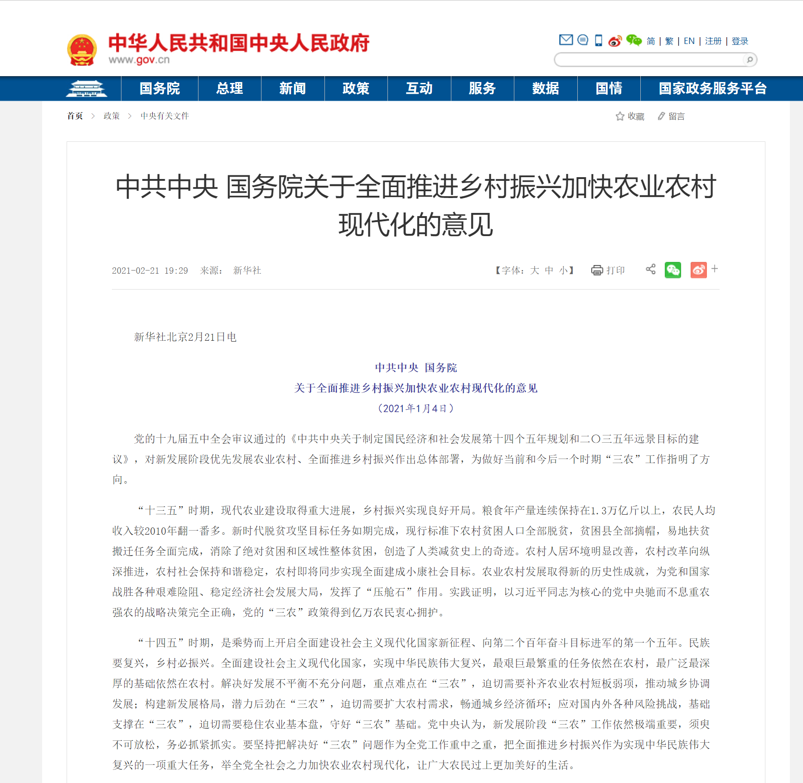
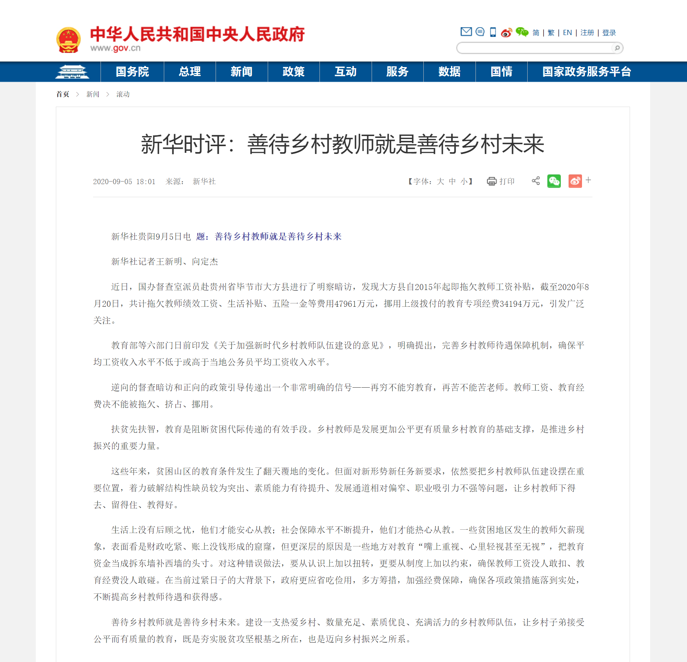
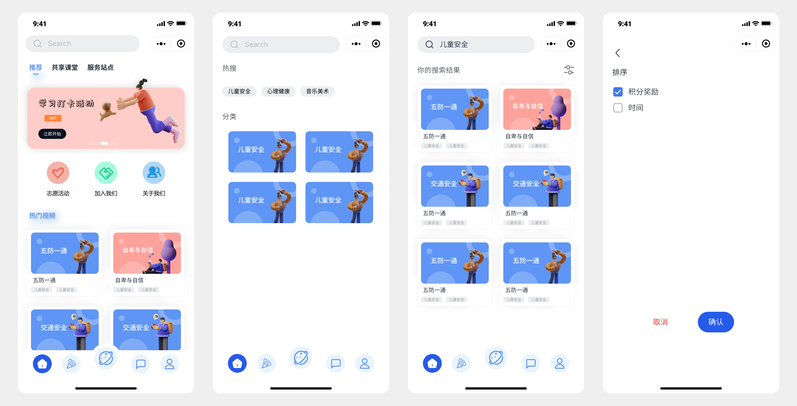
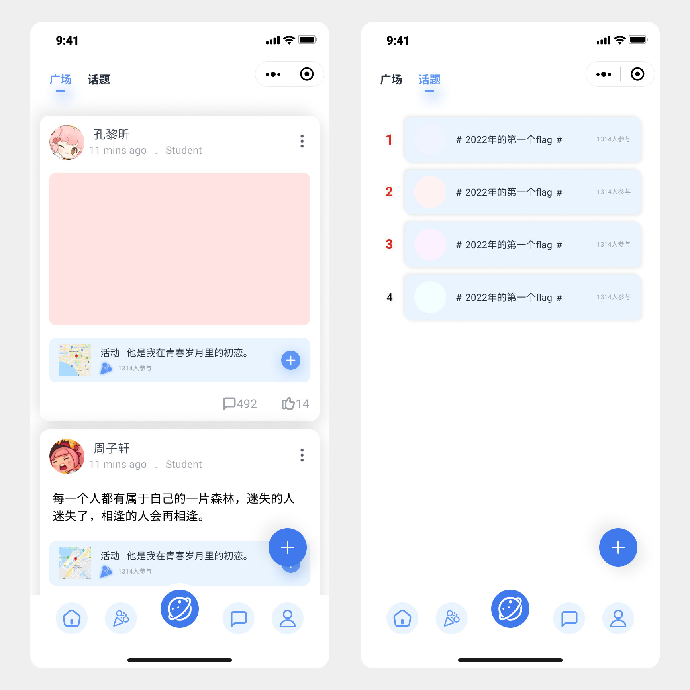
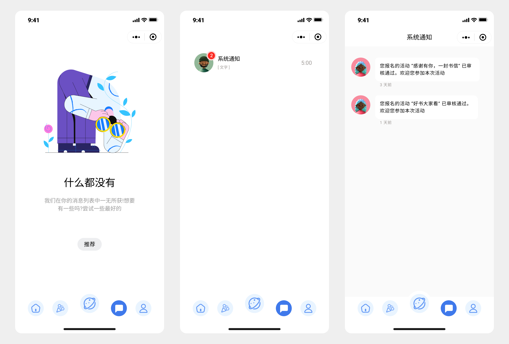
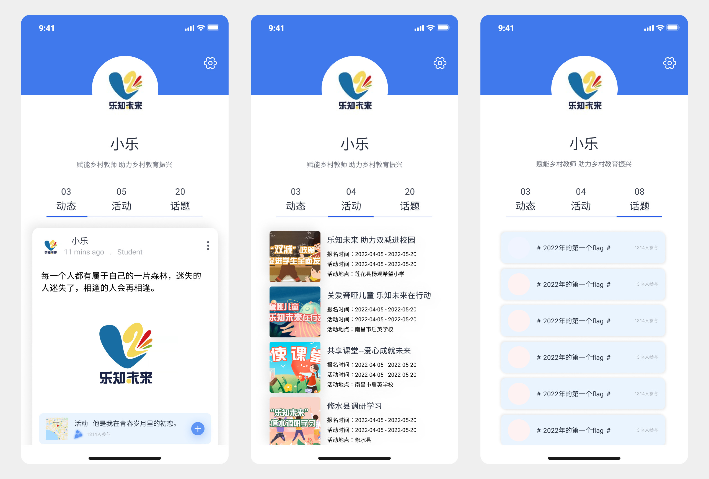

# 乐至未来-智能化志愿服务管理

## 开发背景

**用科技创造社会价值与助力乡村振兴，善待乡村教师就是善待乡村未来**

## 简介

乐知未来”是学生自主发起的公益助学项目。项目团队秉承“**赋能乡村教师 助力乡村教育振兴**”的服务理念，旨在聚焦双减政策背景下的乡村中小学课后服务，通过整合高校和社会资源，助力乡村学校“双减服务”的建设，以落实立德树人根本任务，促进乡村学生全面发展、健康成长。

## 应用场景

**生活服务、社交**

1、志愿服务项目活动发起、报名、审核；志愿者选拔、培训，以及志愿者管理
2、以热图的方式展现志愿者服务活动和服务团队的分布，可实时、直观的展示服务活动情况。
3、便于志愿者报名活动以及团队收集志愿者资料，志愿者可通过小程序功能筛选符合自己且心仪的志愿服务项目进行活动报名
4、给志愿者们提供沟通交流互动的平台，可记录下志愿者生活感动的点点滴滴，利于志愿者之间互相学习、经验交流、激发参与的积极性
5、统计志愿服务时间，记录服务活动以及时长，采取积分制统计形式
6、展示活动风采，进行在线宣传，形式多样
7、提供资源共享的平台，可下载所有课程的官方课件、教案、上课素材，还可观看优秀教师的上课视频，并上传自己的课程资料、上课视频。

## 解决的实际问题

随着志愿者团队的不断壮大，志愿者的管理问题也不容小觑。小程序的开发使得**志愿者管理智能化、规范化、系统化、便捷化**。构建了志愿者报名、选拔、培训、管理的一体的社群化组织管理机制，开通志愿服务活动申报功能，实行志愿服务地域化选择制度；开通平台热图动态展示志愿者小分队分布和服务活动功能，实时跟踪乐知志愿者服务活动情况；开通志愿者个人参与服务活动和工作时长统计功能，根据系统自动积分对志愿者进行评级、评优；开通志愿者论坛、志愿者服务纪录统计等功能，主动公布个人工作成效，对表现优异的志愿者给予相应奖励，较好激发了志愿者的工作积极性，提升了活动开展效率， 并带动了志愿者服务区域的范围扩展和活动影响力的整体提高。

## 产品设计

该小程序的颜色风格为蓝色和白色的搭配，给人沉稳大方的品牌气质。选取固定的颜色在包装和logo设计中，产品形象明显。在整个白色的背景上铺满饱和度较高的蓝色，在整个画面上显得更加明亮、纯粹。

### 首页界面

首页主要有三大模块，可以跳转到搜索页面

#### 推荐

轮播图展示正在进行中的活动，金刚区放置三个图标，对应的功能分别是跳转到活动 tab 、申请加入到志愿团队中、跳转到关于我们的介绍，随后展示的时我们团队在行动过程中的一些活动记录，可以跳转到我们公众号的推文了解详情，底部放置我们的合作伙伴

#### 共享课堂

优秀的教学资源，配套的教程课件，为乡村教师赋能的区域。

#### 服务站点

在地图上可以看见我们团队已经服务过的站点和看看可以开展服务的站点

### 活动界面

活动页面主要是志愿活动、答题活动（未完成）、打卡活动（未完成），还有活动日历，可以看到用户自己参与的活动

### 论坛界面

论坛主要有广场和话题两个模块

#### 广场

志愿者看可以在参与活动之后发表自己的收获和看法，记录自己的志愿生活。

#### 话题

用户可以看到一些热门话题，在自己感兴趣的情况下，会主动了解志愿活动并参与进来。

### 消息界面

主要是系统消息模块，用于系统通知志愿者申请志愿活动审批的结果，用户申请加入志愿者团队的审批结果。

### 我的界面

我的界面主要有用户空间，我的收藏、我的关注、我的成就、每日签到等功能

## 技术实现方案

#### UI设计

工具：Figma

#### 小程序端

工具：微信开发者工具 Stable 1.05.2204250

技术栈：原生小程序+Vant Weapp UI组件

#### 后台服务器端

工具：IntelliJ IDEA 2021.3.1 (Ultimate Edition)

技术栈：Spring Boot2.0框架 、半自动ORM框架MyBatis、使用Maven构建项目 、MySQL8.0 版本作为项目数据库、阿里云OSS文件上传、JWT鉴权认证、JavaMail 发送邮件、JavaTask定时任务

## 寄语

乡村教育振兴离不开坚守一线的教师，“乐知未来”致力于赋能乡村地区的教师，筹社会之资集公共之智，从提升教师的人文素养和专业能力，加强对孩子们的精神关怀和心智成长出发，依托乡村中小学双减课后服务，给孩子们更多改变命运提升生命品质的可能，让“爱”落地生根。
