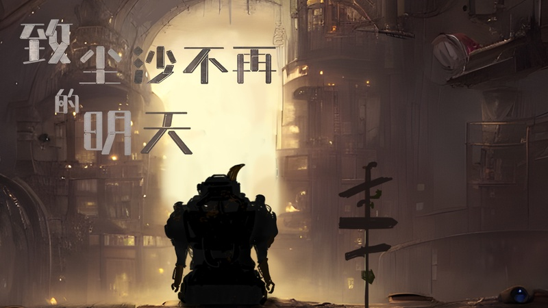

# 致尘沙不在的明天



## 宣传视频

```mdx-code-block

import Bvideo from "@site/src/components/BVideo"

<Bvideo src="//player.bilibili.com/player.html?bvid=BV1qW4y1E7Ni"></Bvideo>

```

## 团队介绍

没有答案队

## 作品介绍

复古机械风格，2D横版剧情向解谜游戏，游戏完整流程约15分钟。 游戏以百年前离开的古人作为寄信者，百年后回到故土的后人作为收信者，期间封存记录讯息的档案馆作为信件载体。玩家将扮演档案馆中的最后一位看守机器人，对场馆进行维护与探索，传承前人留下的信息资料，等待着约定中百年之后的访客们的到来。前人是何所想，是怀着怎样的心态留下这些记录，又是否真的能重新回归、让他们的后人重新启封自己留下的寄语呢？前人是何所想，是怀着怎样的心态留下这些记录，又是否真的能重新回归、让他们的后人重新启封自己留下的寄语呢？ 对看守档案馆的机器人们而言，他们从未有能够思考这些问题的能力，在漫长的时间里所能做的便只有等待，日复一日地进行着清洁、维护，静候着约定中访客们的到来。 于是等岁月流逝真的已过百年，在大多数看守者都已倒在了时间的伟力之下时，最后一台能活动的小机器人依然坚守着前人的遗志，默默将场馆再一次重新维护，即便代价是自己的机体受损、意识关闭，以生命诠释着信念仍在传递、尚未褪色。 但这便是故事的尾声吗...如果它的选择在你手中，结局是否会有所不同呢？

## 制作理念

在审题上，先将“信”作为最为朴素的名词“信件”看待 信件包含基本的四个要素： 寄信者、收信者，还有信件的载体和内容。 它最开始诞生于人们想跨越空间距离、传递信息的需要。 而作为历史传承最为悠久的文明大国，“信”这一意象从古至今都有所出现，以至于传递这一意象的行为本身都成为了一种“寄信”，传承着前辈们的精神内涵。 因而《致尘沙不再的明天》，选择将空间阻隔化为时间阻隔， 以古人作为寄信者，后人作为收信者，档案馆建筑作为载体。 在此基础上设定了一个，文明由于环境原因需举族迁徙至新大陆，在临走前建立起了一栋栋档案馆，用于封存记录档案、以及留给百年后可能重返故土后人的讯息的架空世界观，作为故事背景，而游戏的主要场景便是其中一栋档案馆，也就是在信件的载体内。 从内容来看，由于时间跨度的特殊性，这类时间胶囊传递的除了实际的事物以外。更多的还是以“信”作为载体进行传承的，更为概念化的精神理念，亦可称之为“信念”。 因而当实体物质都已被时间侵蚀破败的时候，在岁月流逝中依然光洁如初、熠熠生辉的精神信念，才更显珍贵。

## 操作指南

角色移动： A(左) D(右) 物品互动： E(进入) Q(退出) 上/下楼梯：W + 空格 场景切换： R 机体检视： F 开/关灯光：L 通过移动、与场景道具交互、拾取使用道具、解开谜题，体验这一段旅程。
