<!-- truncate -->

## 介绍

**最好的 UI 是你没有注意到的 UI**

如果做得好，用户界面将是游戏的关键部分，它隐秘并仔细地融入到您的应用程序中，但是如果做得不好，它可能会令用户感到沮丧并降低游戏体验。

可靠的图形用户界面 (GUI) 是游戏视觉识别的延伸 现代受众渴望与您的应用程序无缝集成的精致、直观的 GUI 无论是显示角色的生命统计数据还是游戏世界的经济，该界面都是玩家获取信息的门户关键信息。

随着 UI 变得越来越复杂，其背后的艺术性也随之提高，UI 设计主要取决于两类专家：

- **UI 艺术家**：他们掌握设计、颜色、形状、排版和布局的基础知识 UI 艺术家为游戏世界的目标受众进行设计。他们对细节的关注促使他们创建“像素完美”的用户界面。
- **用户体验设计师**：他们研究用户行为和最终用户的更广泛需求用户体验设计师控制人们与数字产品交互的方式。他们构建导航流程的目的是让用户体验尽可能直观和愉快。

这些角色与其他 2D 或 3D 艺术家和设计师密切合作，通过这种合作，可以实现更强大、更有效的 UI。

在本指南中，我们将演示 UI 艺术家和设计师如何在 Unity 中构建更好的界面。如果您具有图形设计和数字内容创建 (DCC) 工具背景，您将学习如何将您的创意融入到 Unity 的 UI 系统中如果您'作为一名想要进一步探索界面创建的开发人员，本指南将帮助您使用 Unity 的可用 UI 工作流程锻炼您的设计能力。

这本电子书涵盖了 Unity 中可用的两个 UI 系统的工作流程，但主要重点是适用于 Unity 2021 LTS 及更高版本的 Unity UI Toolkit UI Toolkit 是功能、资源和工具的统一集合，用于跨广泛的环境构建自适应 UI一系列游戏应用程序和编辑器扩展 我们新发布的示例项目受到之前 Dragon Crashers 演示的启发，描述了如何利用 UI Toolkit 的强大功能来实现运行时 UI。

让我们开始

:::info 贡献者

本指南和 UI Toolkit 示例项目的主要贡献者包括 Ludia 首席 UI 艺术家 Michael Desharnais、资深 3D 和视觉效果艺术家、开发人员和教育家 Wilmer Lin 以及 Unity 高级内容营销经理 Eduardo Oriz。平面设计师和独立游戏开发者。

其他重要贡献者包括 Unity UI Toolkit 团队高级技术产品经理 Benoit Dupuis、UI Toolkit 团队高级工程经理 Antoine Lassauzay、Unity 专门从事系统游戏设计的高级技术游戏设计师 Christo Nobbs 和 Stefania Valoroso ，UI Toolkit 团队的高级产品设计师

:::

## 用户界面与游戏设计

### 打造沉浸式体验

### 第四堵墙

### 用户界面设计模式

## UI开发与实施

开发 UI 是来自多个领域的创作者之间的协作，共同努力实现共同的愿景这是一个迭代过程，一路上几乎没有什么里程碑。

通常有许多利益相关者参与该过程在较大的制作中，UI 艺术家可能需要与其他设计师、艺术总监和 UI 程序员密切合作在较小的团队中，其中一些角色会重叠。

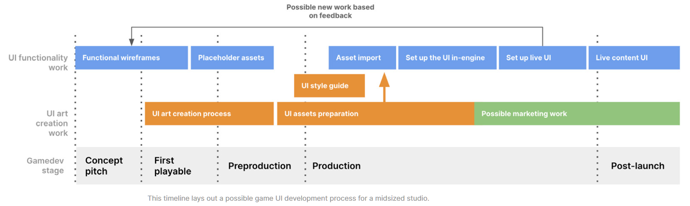

这里的任务通常分为：

- 通过线框图进行 UI 设计
- 艺术资产创建
- 在实际游戏引擎中实现 UI

### 线框图

在线框图期间，UI 团队与游戏设计团队合作，为每个游戏界面布置内容。在大型项目中，具有丰富 UX 设计经验的游戏设计师可以承担此职责。在较小的作品中，此任务通常落在用户界面艺术家。

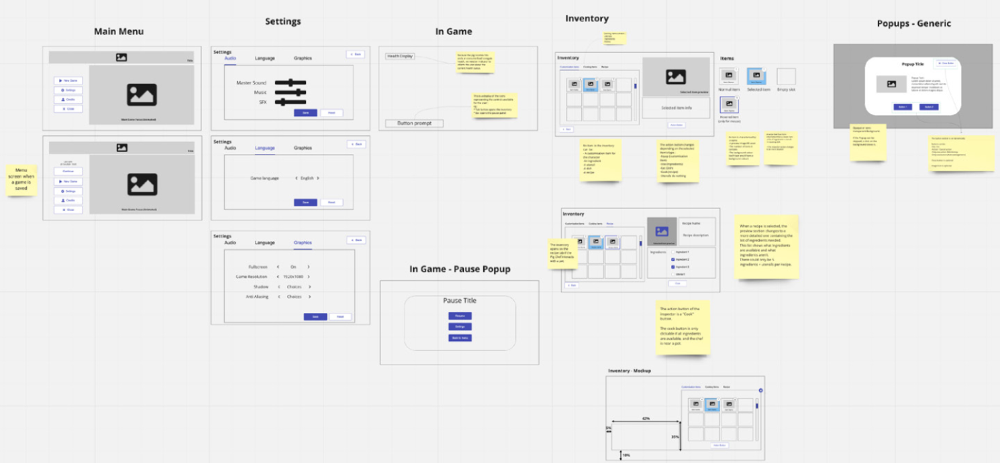

目标是与设计团队对游戏每个功能的愿景保持一致，此时您将验证每个屏幕上的所有功能。此时，您还将制定导航流程，以便您的用户不会陷入无法退出的菜单。

正如游戏开发的大多数其他方面一样，您做出的有关 UI 的决策将由游戏运行的平台驱动，因此请在制作过程的早期选择目标设备。

- 是手机游戏吗？
- 您希望用户以横向模式还是纵向模式玩游戏？
- 您想要支持的最低端设备是什么？

回答这些问题将为您提供一个可使用的基本解决方案。从那里，您可以开始规划如何布局所有游戏界面。

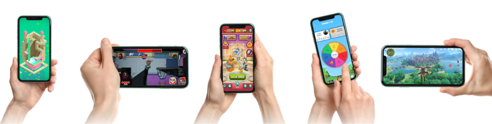

在此阶段，您还需要考虑用户将如何与您的游戏互动，例如，预测他们的手部位置。

如果您正在开发手机游戏，玩家通常会用手指点击屏幕，这可能需要将 UI 元素放置在更靠近屏幕侧面（横向模式）或底部（纵向模式）的位置，以便更容易使用拇指输入。

如果您正在构建控制台游戏，用户通常会使用控制器这可能需要屏幕底部的特定控制菜单，以及对鼠标输入的支持。这些只是可以指导您的线框图的一些细节。

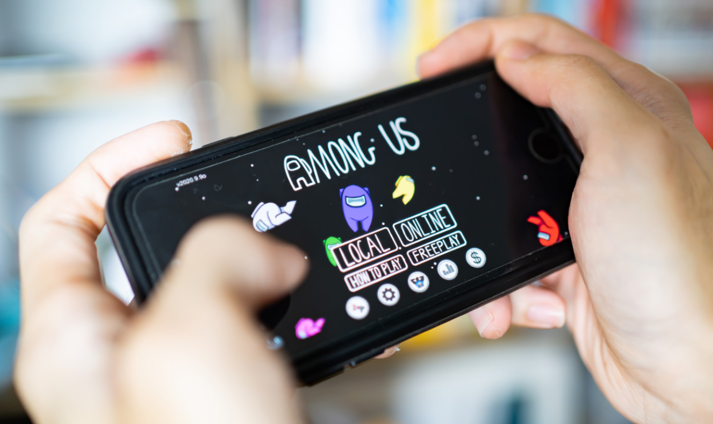

线框图将迫使您考虑 UI 元素的大小在移动游戏制作中，这一点很重要，因为所有内容都必须在小显示屏上可读一些线框图工具，例如 Adobe XD、Figma 和 Miro，允许您直接查看线框在移动设备上这可以帮助您快速预览手机或平板电脑上的交互感觉。

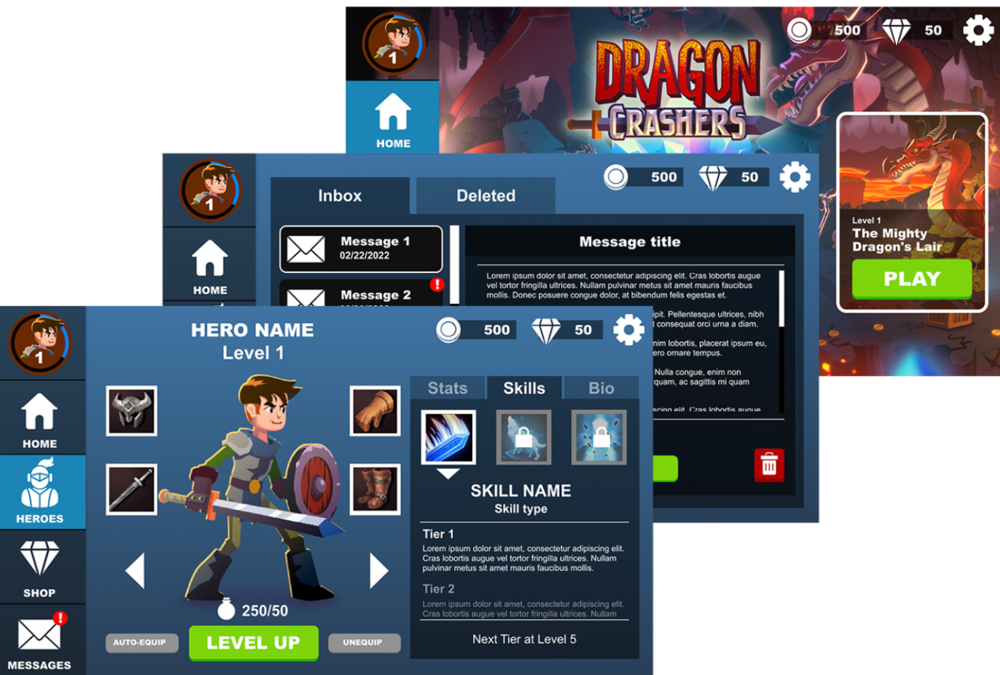

### UI美术创作

与游戏设计中的任何其他元素一样，UI 开发分阶段有机发展以下部分概述了每个阶段涉及的内容

#### 情绪板

在这个初步阶段，您从其他参考文献中收集概念艺术和源材料。情绪板将其组装成拼贴画，作为调整团队的起点。灵感元素可以来自平面设计、电影，甚至产品线。情绪板探索配色方案、风格、字体和布局。

有用的情绪板工具包括 PureRef、Mural、Matboard 和 Evernote 当涉及在线解决方案时，请查看 Behance、Game UI Database、Dribble 或 Pinterest。

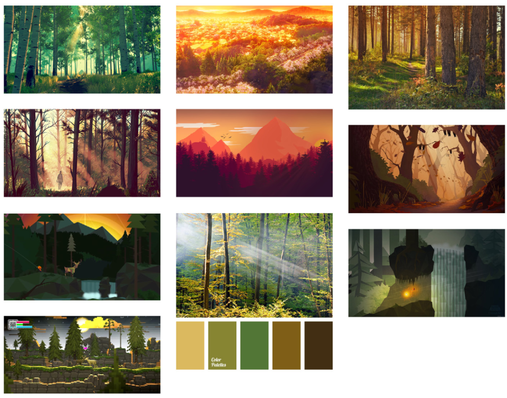

#### UI模型和字体

现在，您可以将 UI 主题应用到一系列模仿游戏背景的关键屏幕上。美术不需要是最终的，但屏幕应该看起来足够精美，可以在玩家面前进行测试。

在定义 UI 风格时考虑游戏的艺术方向很重要请记住，UI 也是游戏品牌和视觉美感的主要部分。

如果您正在制作一款休闲、卡通三消游戏，您可能需要采用更具插图性的方法 同时，逼真的科幻 FPS 可能与极简、平面艺术风格配合得更好 您可以将类似风格的产品与视觉效果进行比较参考。

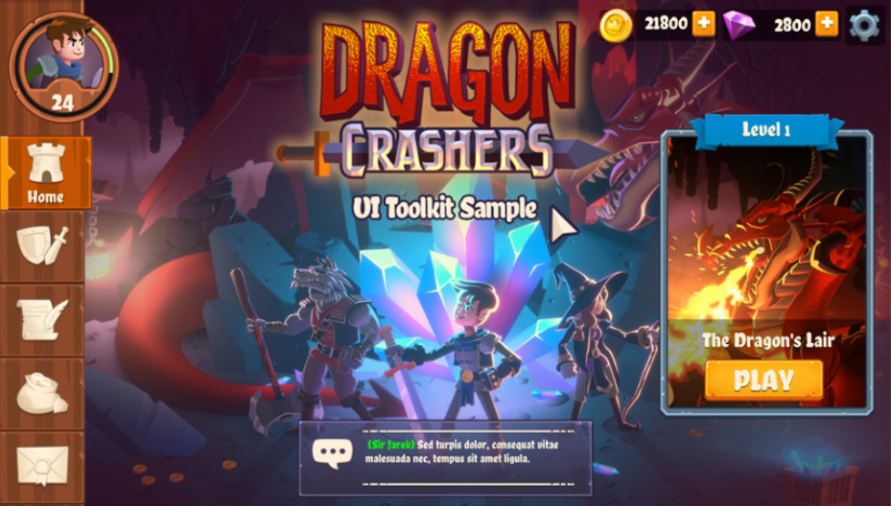

整理图形，使文本和图标脱颖而出视觉层次结构应该引导玩家的眼睛关注每个游戏界面中最重要的东西毕竟，一个好的 UI 应该在视觉上有吸引力，同时也能引导玩家。

每个设备的资产大小以及玩家与其交互的方式自然会有所不同 在台式计算机上具有悬停状态的按钮是有意义的，但在移动设备上不起作用，因为没有悬停状态 同时，大小小型手持设备上的按钮或切换开关需要足够大，以便手指能够与之交互，而不会遮挡其他元素 对于指针而言，这种考虑完全不同

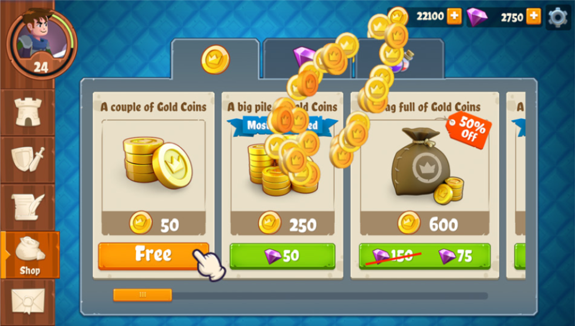

定义你的 UI 风格时，要注意优化避免在游戏中导入数十个巨大的纹理你的 UI 应该能够快速加载和高度响应。

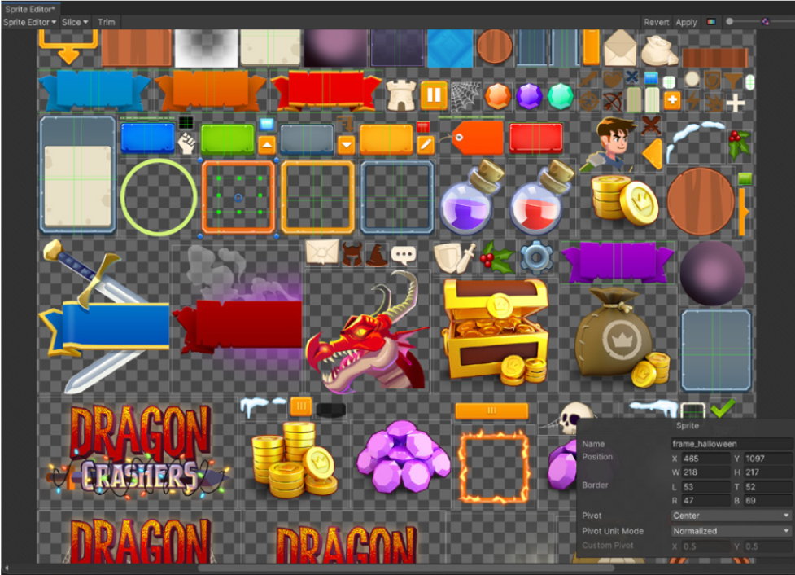

使用尽可能少的纹理创建您的 UI。Unity 提供了平铺等选项，以及为此目的进行的 9 层拉伸。在模拟时使用这些系统您的界面，并实现拉伸渐变或平铺纹理来填充空白空间巧妙地使用对称性可以将纹理大小减少一半。

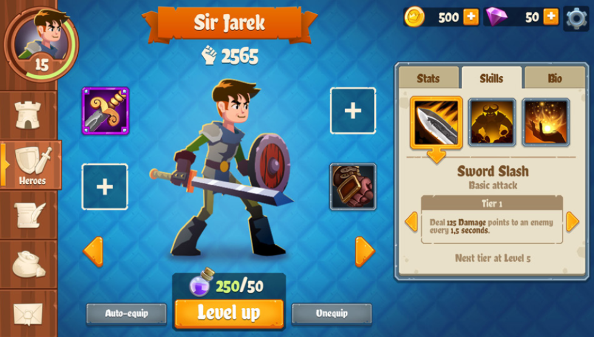

这些流行的 DCC 软件也适合模型：Adobe Photoshop、Adobe Illustrator、Affinity Photo、Affinity Designer 和 Krita 用于访问字体资源的一些网站包括 Dafont、Google Fonts、Typodermic Fonts 和 WhatFontIs

#### 用户界面风格指南

正如您的项目可能有游戏或技术设计文档一样，我们建议您同样维护一份 UI 风格指南。该指南应抓住产品 UI 的精髓，以确保从事项目的美工人员以及新合作者之间的一致性正在入职。

样式指南甚至可以建立向游戏添加新界面的规则，例如，它可能指定调色板和允许的字体（大小和样式）。样式指南还概述了 UI 外观，包括弹出窗口、按钮和图标。

在 Behance 上，您可以从分享《英雄联盟》风格指南的艺术家那里找到灵感，《英雄》、《Apex 英雄》移动版、《毁灭战士》和《往日不再》。

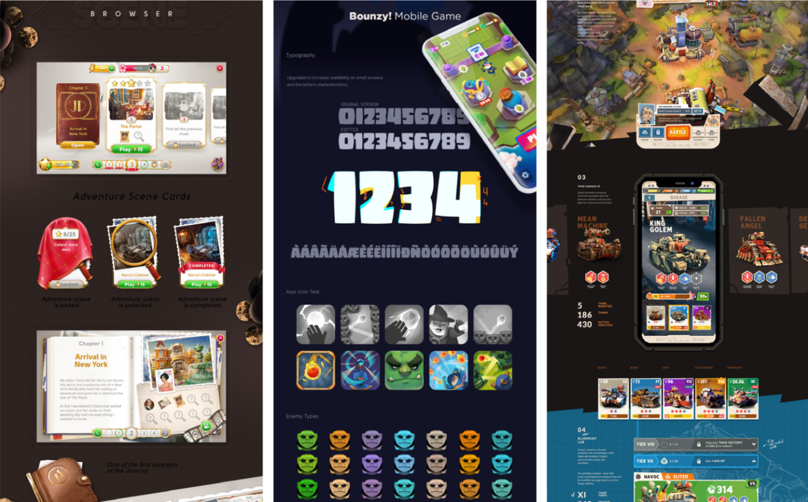

#### UI资产准备

您将在这里花费大量的制作时间，准备视觉元素并将其集成到游戏中，并完善最终的艺术作品以遵循您的目标规范所有资产都需要遵守像素分辨率、纹理预算和文件组织的准则。

将视觉元素减少到最简单的状态。例如，您可能删除静态占位符文本，为实时 UI 中的动态文本元素腾出空间 考虑可以重用的内容：通用按钮、框架或对话框和弹出窗口的背景、导出独特的元素，例如图标，作为单独的对象。

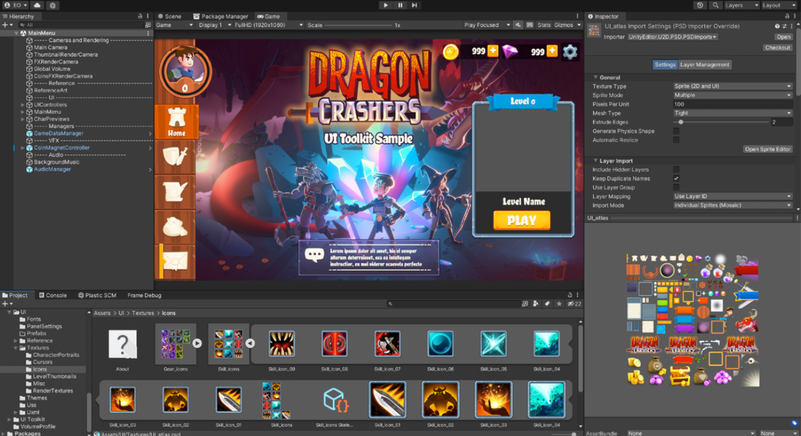

:::tip 缩放视觉元素

请记住，渐变或模糊元素可以以大于 100% 的比例使用，而不会损失太多质量。但是，如果放大超过 115% 左右，非常锐利或详细的元素将看起来像素化

:::

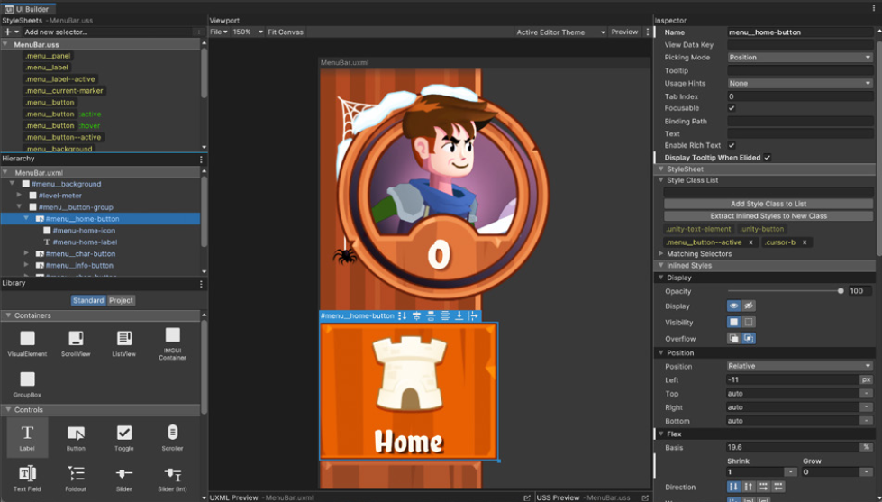

### UI实现工作

在 Unity 中实现 UI 因团队而异，它可以是一个更多的较大团队的专门任务，需要专门的 UI 开发人员，或者直接让 UI 艺术家参与较小团队的流程，如以下部分所述。

#### 功能灰盒

在早期阶段，对 UI 进行灰盒处理类似于对游戏关卡进行灰盒处理，目标是屏蔽 UI 元素并将它们与游戏玩法联系起来。

您通常会在游戏引擎中对 UI 进行灰盒处理，这需要进行实验才能得到正确的灰盒处理最终可以帮助您解决导航流程和布局问题。

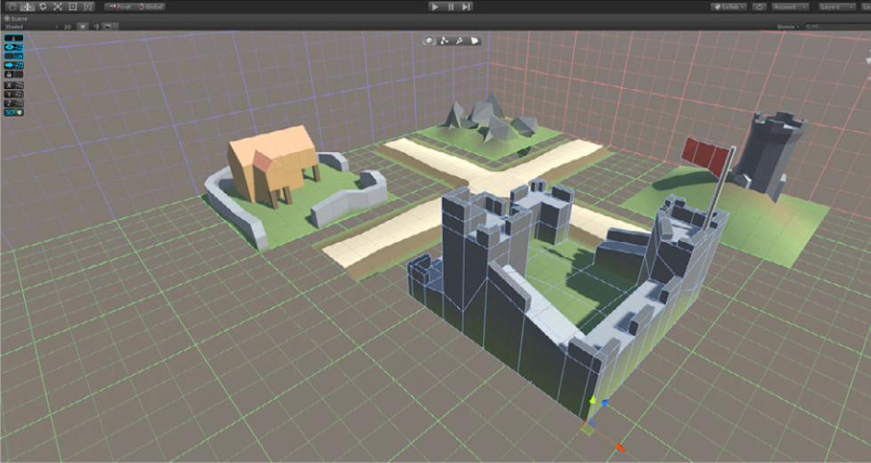

#### 占位资源

在预制作期间，原型需要能够代表最终游戏的资产这些资产便于验证项目里程碑。

重用以前游戏中的资产或将外部资产合并为占位符。Asset Store 提供各种 [GUI 资源](https://assetstore.unity.com/2d/gui?utm_source=demand-gen&utm_medium=pdf&utm_campaign=authoring-optimizing-ui&utm_content=ui-design-ebook)、[图标](https://assetstore.unity.com/3d/gui?utm_source=demand-gen&utm_medium=pdf&utm_campaign=authoring-optimizing-ui&utm_content=ui-design-ebook)、[字体](https://assetstore.unity.com/2d/fonts?utm_source=demand-gen&utm_medium=pdf&utm_campaign=authoring-optimizing-ui&utm_content=ui-design-ebook)和用于此目的的[工具](https://assetstore.unity.com/tools/gui?utm_source=demand-gen&utm_medium=pdf&utm_campaign=authoring-optimizing-ui&utm_content=ui-design-ebook)。如果您需要模拟文本，可以尝试从这个[网站](https://loremipsum.io/ultimate-list-of-lorem-ipsum-generators/)。

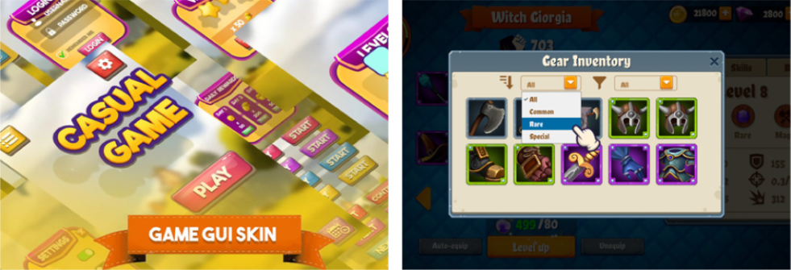

#### 资产导入

准备就绪后，您就可以开始将 UI 艺术资源导入到您的项目中 确保作为一个团队就资源规范、命名约定和文件路径的制作标准达成一致。

一些 Unity 工具可以简化此过程，例如 Sprite Editor、PSD Importer、AssetPostProcessor、Presets 和 Sprite Atlas 下一章将更详细地解释这些工具。

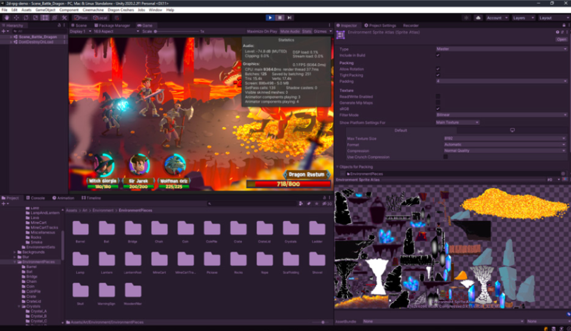

#### 在引擎中设置UI

在 Unity 中，有两个用于创建运行时 UI 的系统：

- Unity UI：随 Unity 4 6 一起发布（2014 年末）
- UI Toolkit：可与 Unity UI 一起使用的新 UI 系统

这两个系统都是为 UI 艺术家设计的所见即所得解决方案，但有一些关键区别：

|           | Unity UI                                                     | UI Toolkit                                                   |
| --------- | ------------------------------------------------------------ | ------------------------------------------------------------ |
| 工作流程  | 基于 GameObject 的 UI 系统                                   | 受Web技术启发的 UI 系统                                      |
| 创作工具  | UI 元素是 Canvas 内的游戏对象，GameObject 他们有一个 Rect Transform 组件，定义相对于其父级的位置和比例 | UXML 文件定义 UI 的布局，USS 文件定义样式。UXML 文件，也称为可视化树，通过 UI 显示在游戏视图中，应用于游戏对象的文档组件 |
| Style样式 | 在 Scene 视图中，创建 UI GameObjects，层次结构并将它们嵌套以形成布局组 | 使用 UI Builder 创建 UI Toolkit 界面，直观地由 UXML 和 USS 文件组成 |
| 主要优点  | 与其他 Unity 系统集成，例如动画、游戏对象，或 3D 空间中的位置 | 性能（保留模式图形）、可扩展性、具有复杂的用户界面、可定制的材料、不同的屏幕尺寸和主题；适用于编辑器 UI 以及运行时用户界面；无纹理界面 |
| 最佳用法  | 更简单的 UI 元素混合在游戏中或满足非常具体的需求，即来自 3D 角色的伤害点，空间或需要物理的 UI 元素 | 推荐用于屏幕覆盖菜单和 HUD 元素                              |

> 请参阅简化的比较图表（文档中提供了深入的图表）[详细查看](https://docs.unity3d.com/Manual/UI-system-compare.html?utm_source=demand-gen&utm_medium=pdf&utm_campaign=authoring-optimizing-ui&utm_content=ui-design-ebook)

UI Toolkit 和 Unity UI 可以在同一个项目中同时工作 我们建议逐步测试 UI Toolkit，让您的 UI 艺术家更熟悉它 然后逐渐用生产艺术品替换您的占位符资源，同时匹配原始 UI 设计 使用模型来指导您。

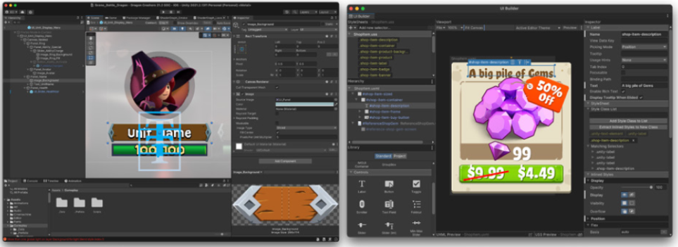

#### 用户界面与输入控件

您可以设置与 UI 控件的一些基本交互 Unity 中的两个 UI 系统以不同的方式处理输入：

- Unity UI 的输入实现通过 Unity 事件系统进行。例如，按钮有一个 OnClick 回调事件，您可以在其中调用内置方法和脚本方法。编辑器中的交互式 UI 对艺术家友好，并且有助于原型设计，但由于项目中的任何人都可以访问它，因此请注意，当不同的团队成员更改同一组件时，可能会发生合并冲突
- UI Toolkit 提供了一个全面的事件系统，将用户交互连接到视觉元素 C## 脚本可以注册可用事件的回调，例如 myVisualElement。RegisterCallBack\<MouseDownEvent\>(myFunction) 将触发，当用户点击鼠标时指定的 myFunction视觉元素。从本质上讲，UI Toolkit 将功能实现与 UI 设计分开。这区分了开发人员和 UI 美术师的角色，使每个团队能够专注于自己的专业虽然 UI 美术师通常不负责设置回调和事件，但他们应该了解如果他们想要灰盒功能设计并可以将其交给 UI 程序员，则需要执行此流程

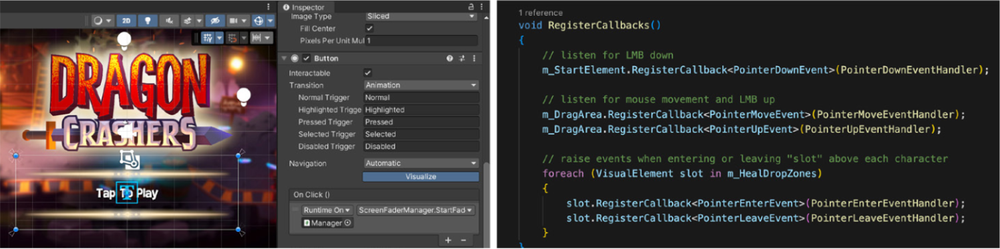

#### 测试UI

您的按钮交互性足够吗？用户知道点击哪里吗？他们是否觉得有必要在商店购买商品？其中一些答案可能并不直观，您需要通过游戏测试来回答它们。

有多种分析可以帮助您跟踪用户行为一些技术可以帮助实现这一点，例如眼动追踪可识别用户对平视显示器或界面中感兴趣的区域的反应。

分析用户行为将使您能够定义可用性趋势，以便您的团队可以确定需要改进的内容 游戏测试资源包括 Playtest Cloud、Antidote、Steam Playtest 和 Playtesting Games。

营销和直播内容UI（未翻译）

## 资产准备

### 目标屏幕分辨率

### Unity的精灵图分辨率

#### 统一单位

#### 2D相机和精灵图尺寸

### 从DCC工具导出图形

#### 从 Adobe Photoshop 导出

#### 从 Adobe Illustrator 导出

#### 从 Affinity Photo 或 Affinity Designer 导出

#### 从 Krita 导出

### 精灵图编辑器和设置

#### 精灵设置

#### Sprite 渲染器与 Canvas 渲染器

### 使用 PSD Importer 加快工作流程

### Sprite图集

#### Sprite图集变体

## Unity UI

### 使用 Unity UI 进行设计

#### 构建块：Canvas

#### 布局和预构建的 UI 元素

#### 自动布局系统

#### 画布缩放器

##### 恒定像素大小

##### 恒定的物理尺寸

##### 随屏幕尺寸缩放

#### 使用图像组件自定义视觉效果

#### 使用 TextMesh Pro 文本

### 可重用的 UI 元素：预制件

#### 创建和编辑预制件

#### 嵌套预制件

#### 预制件变体

### 动画整合

### 使用 Unity UI 进行灰盒测试

## UI  Toolkit：简介和 Flexbox 布局

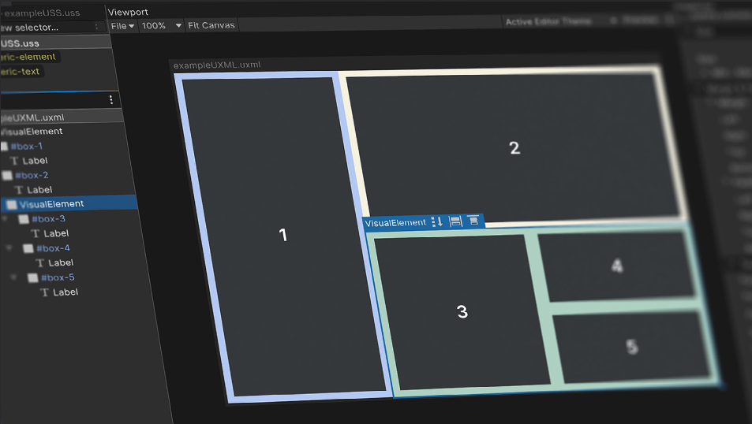

UI Toolkit 是用于在 Unity 2021 LTS 及更高版本中开发运行时 UI 和编辑器扩展的功能、资源和工具的集合。它使设计师和艺术家能够创建、调试和优化用户界面，并控制它们的呈现和交互方式和

UI Toolkit 专为实现最高性能和可重用性而量身定制，其工作流程和创作工具受到标准 Web 技术的启发，如果 UI 设计师和艺术家已经具有设计网页的经验，他们会发现它很熟悉

UI Toolkit 目前用于 Unity 编辑器本身的 UI，许多 Unity 包和功能也有用它制作的界面，运行时支持较新，但它已经用于游戏内 UI，例如 Timberborn作者：Mechanistry，您可以在[电子书末尾](https://app.immersivetranslate.com/pdf/?utm_source=extension&utm_medium=extension&utm_campaign=popup_more#User%20interface%20design%20and%20implementation%20in%20Unity.indd%3A.47757%3A9007)阅读更多相关信息

虽然 UI Toolkit 旨在成为 UI 开发的推荐 UI 系统，但它不包括 Unity 2021 LTS 中 Unity UI 支持的一些功能，这使得后者系统成为某些用例和遗留项目的更合适选择

有关详细信息，请参阅 [Unity 中 UI 系统的比较](https://docs.unity3d.com/Manual/UI-system-compare.html?utm_source=demand-gen&utm_medium=pdf&utm_campaign=authoring-optimizing-ui&utm_content=ui-design-ebook)

### UI 工具包工作流程

使用 UI Toolkit 构建的每个界面都涉及几个协同工作的部分：

- UI 文档 (UXML)：此资源引用 Unity 可扩展标记语言 (UXML) 受 HTML、XAML 和 XML 的启发，它定义用户界面的结构并保存有关布局层次结构的信息 它可以使用内联样式规则和样式进行样式设置床单
  - 通过 Assets > Create > UI Toolkit > UI Document 创建资产。该资源将添加到您的项目文件夹中，然后可以在 UI Builder 中打开该文件夹
- 样式表 (USS)：此资源引用 Unity 样式表 (USS)。通过 HTML 的级联样式表 (CSS)，它包含有关样式属性的级联规则，这些规则可以影响 UXML 的视觉布局。
  - 通过“资源”>“创建”>“UI 工具包”>“样式表”创建此资源。该资源将添加到您的项目文件夹中，然后可以将其添加到 UI Builder 中打开的 UXML 文件中。
- 主题样式表 (TSS)：此资源是 TSS 和 USS 文件的集合，用于确定要使用的面板设置（见下文）

为了在场景视图中正确可视化这些资源，它们需要与以下组件和资源一起使用：

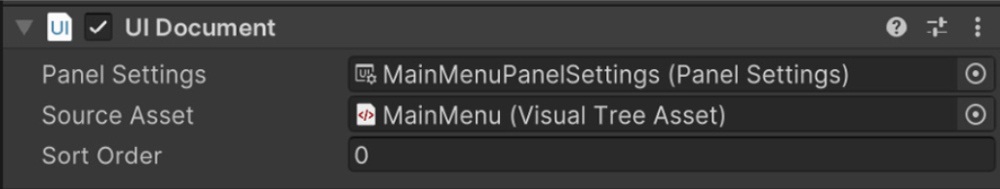

- UI 文档组件：该组件定义 UXML 是什么。显示，并将该 UI Toolkit 资源连接到游戏对象 它可以添加到编辑器层次结构中的游戏对象，并且可以指定要使用的面板设置 排序顺序字段确定此文档相对于使用相同内容的其他 UI 文档的显示方式面板设置
  - 使用检查器中的添加组件菜单将此组件添加到游戏对象，或者在层次结构中右键单击并选择 UI Toolkit > UI Document，这将自动分配面板设置
- 面板设置：此资源定义了 UI 文档组件如何在运行时实例化和可视化。可以有多个面板设置来为 UI 启用不同的样式，例如，如果您的游戏包含 HUD 或小地图，则这些特殊的 UI 可以各自具有自己的面板设置
  - 通过“资源”>“创建”>“UI 工具包”>“面板设置资源”自行创建资源 该资源将添加到您的项目文件夹中，然后可以将其添加到游戏对象上的 UI 文档组件中

一旦保存到 Assets 文件夹，艺术家和设计师就可以使用 UXML 和UI Builder 中的 USS 文件（窗口 > UI Toolkit > UI Builder） UI Builder 是一个可视化工具，可帮助创建者构建和编辑界面，而无需编写代码

与 Unity UI 不同，UI Toolkit 元素不会出现在场景视图中 UI 艺术家将大部分时间花在 UI Builder 中，其中包括在运行时预览游戏视图的选项

### Flexbox基础知识

UI Toolkit 基于 [Yoga](https://yogalayout.com/) 定位视觉元素，Yoga 是一个实现 Flexbox 子集的 HTML/CSS 布局引擎。如果您不熟悉 Yoga 和 Flexbox，本章将帮助您快速了解 UI Toolkit 布局引擎背后的原理

Flexbox 架构非常适合开发复杂、组织良好的布局，考虑一下它的一些优点：

- 响应式 UI：Flexbox 将所有内容组织到盒子或容器网络中，您可以将这些元素嵌套为父元素和子元素，使用简单的规则在屏幕上空间排列它们，孩子们回应自动改变其父容器，响应式布局适应不同的屏幕分辨率和尺寸，让您更轻松地瞄准多个平台
- 有组织的复杂性：样式定义了控制视觉元素的美学价值的简单规则，一种风格可以应用于数百种风格，一次包含多个元素，更改会立即反映在整个 UI 上，这将 UI 设计集中在一致的可重用样式上，而不是致力于单个元素的外观
- 逻辑和设计解耦：UI 布局和样式与代码解耦，这有助于设计人员和开发人员并行工作，而不会破坏依赖关系，然后每个团队都可以专注于他们最擅长的事情

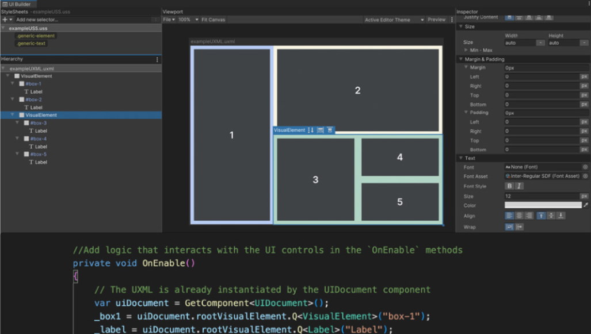

### VisualElement

在 UI Toolkit 中，每个界面的基本构建块是其视觉元素 视觉元素是每个 UI Toolkit 元素（按钮、图像、文本等）的基类 将它们视为 GameObjects 的 UI Toolkit 等价物

一个或多个视觉元素的 UI 层次结构称为视觉树

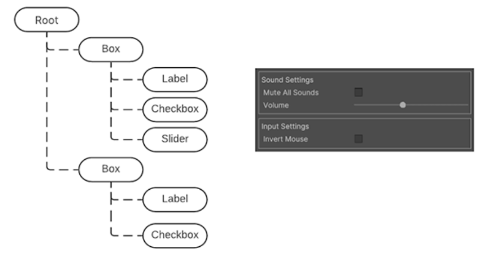

在 UI Toolkit 中，多个视觉元素的组合存储在 UI 文档文件中，扩展名为 uxml UXML 文件包含与层次结构相关的信息，以及其样式和视觉元素的布局

要构建您的第一个 UI Toolkit 界面，请从 Assets 创建一个新的 UI 文档，菜单（创建 > UI 工具包 > UI 文档），从项目窗口打开文件或直接从 UI Builder（窗口 > UI Toolkit > UI Builder）

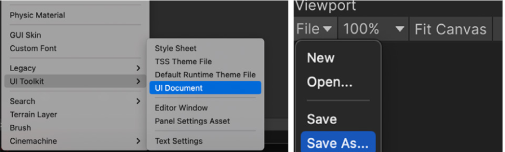

:::tip UI Builder 文档

UI Builder 微型网站包含界面概述，以便您可以更好地熟悉窗口的界面 如果您是 UI Builder 的新手，请参阅入门部分

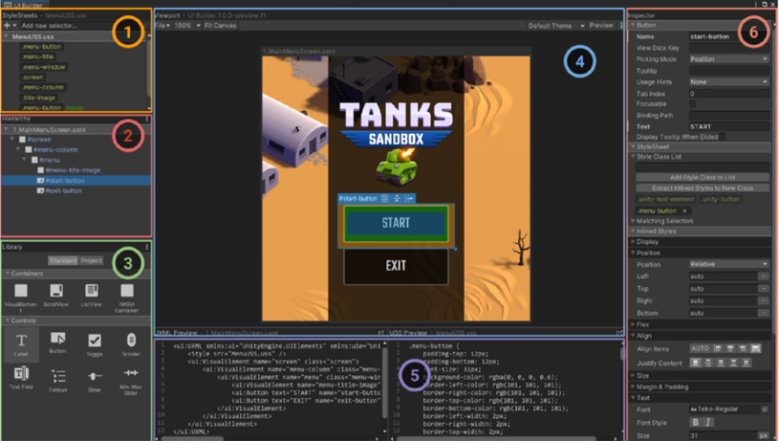

1. 样式表：管理 USS 样式表，其中包含一组用于设置元素样式的规则（请参阅 UI 工具包：样式）
2. 层次结构：在 UXML 文档的 UI 层次结构中选择、重新排序、重新设置父级、管理或添加新元素
3. 库：将新的预定义元素添加到层次结构或从此处实例化其他 UI 文档 (UXML)
4. 视口：直接在画布上预览 UI 文档并以可视方式选择或定位元素
5. 代码预览：预览自动生成的Uxml和Uss代码
6. 检查器：用它来更改所选层次结构元素或选择器的属性和样式属性

要近似运行时 UI，请在层次结构中选择当前加载的 UI 文档 (UXML)，然后选中“匹配游戏视图”。这会将视口调整到您的项目参考分辨率请记住，修改此参数不会影响 UI 文件本身，只会影响可视化

:::

在我们深入研究 UI Toolkit 之前，您需要了解 Flexbox 布局的基础知识，这可以通过 UI Builder 中的基本视觉元素进行演示

您可以将视觉元素从“库”拖动到“层次结构”视图中，并将它们排列成父子关系。在 Flexbox 布局中，修改父项（Flex 容器）会影响其子项（Flex 项）

使用 Flexbox 需要了解如何根据引擎规则在界面中布局元素让我们检查一下 Inspector 中影响可视化树的一些常见设置

### 定位VisualElement

模拟 UI 时，将每个屏幕视为一组单独的视觉元素考虑如何将它们分解为视觉树层次结构

在下面的示例中，一个大的视觉元素可以代替左侧的菜单栏 单独的子视觉元素来代表每个按钮

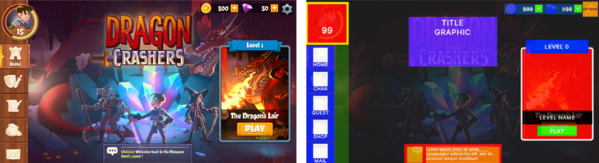

定义子视觉元素时，UI Builder 提供两个位置选项：

- 相对定位：这是新视觉元素的默认设置。子元素遵循父容器的 Flexbox 规则 例如，如果父元素的 Direction 设置为 Row，则子视觉元素从左到右排列自己。相对定位根据以下因素动态调整元素大小和移动元素：
  - 父元素的大小或样式规则：如果修改父元素，元素的 Padding 或 Align > Justify Content 设置，其子元素根据这些更改自行调整
  - 子元素自己的大小和样式规则：如果子视觉元素，有自己的最小或最大尺寸设置，布局引擎也会尝试尊重这些设置。UI Toolkit 处理父元素和子元素之间的任何冲突（例如，最小宽度比其容器宽的子元素会导致溢出）
- 绝对定位：在这里，视觉元素的位置锚定到父容器，类似于 Unity UI 与 Canvases 的工作方式 边距或最大尺寸等规则仍然适用，但它不遵循父容器的 Flexbox 规则 元素覆盖在顶部父容器的。绝对定位的元素可以使用“左”、“上”、“右”和“下”设置作为锚点例如，“右”和“下”的零值将按钮固定到父容器的右下角

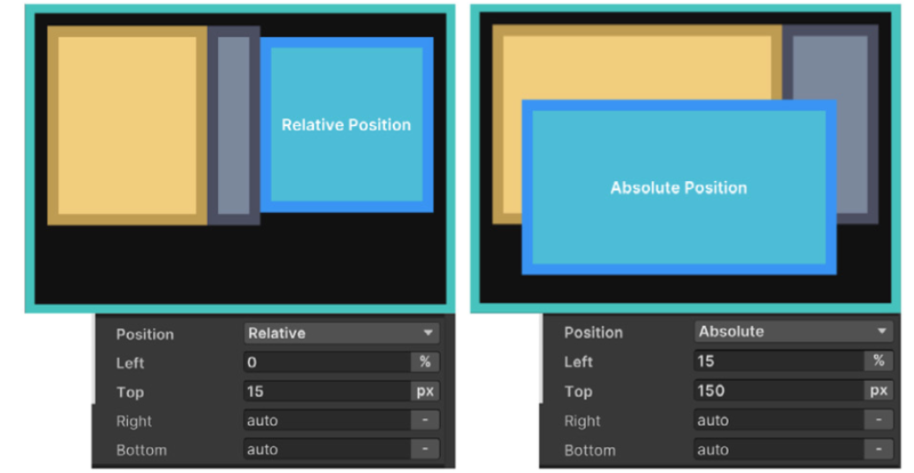

:::tip 定位

您可能会对永久可见、具有复杂分组或包含多个元素的元素使用相对定位

绝对定位对于临时 UI（如弹出窗口）非常有用，可以应用覆盖元素完整高度和宽度的复杂背景，或遵循其他游戏内元素位置的元素（如角色的生命条）

无论是在“绝对”还是“相对”定位中，您都可以使用 Canvas 移动元素并调整其位置

:::

绝对和相对定位影响布局引擎处理父子视觉元素的方式

### 尺寸设置

请记住，视觉元素只是简单的容器默认情况下，它们不会占用任何空间，除非它们被已具有特定大小的其他子元素填充，或者将它们设置为特定的宽度和高度

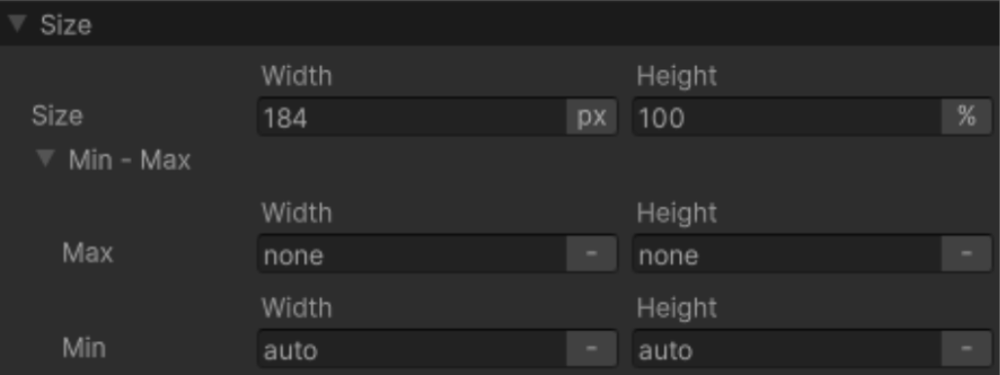

宽度和高度字段定义元素的大小最大宽度和最大高度限制元素可以扩展的程度同样，最小宽度和最小高度限制元素可以收缩的程度这些影响 Flex 设置（如下）如何调整元素的大小基于可用空间

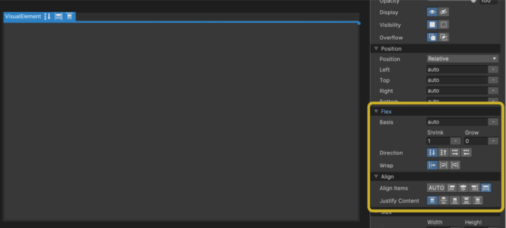

#### Flex设置

使用相对定位时，Flex 设置会影响元素的大小建议您对元素进行试验以直接了解它们的行为

基础是指在发生任何增长或收缩比率操作之前项目的默认宽度和高度：

- 如果 Grow 设置为 1，则该元素将占据所有可用的垂直或父元素中的水平空间
- 如果 Grow 设置为 0，则元素的增长不会超出其当前的基础（或大小）
- 如果 Shrink 设置为 1，则元素将根据需要缩小以适应父元素的可用空间
- 如果Shrink设置为0，则元素不会收缩，必要时会溢出

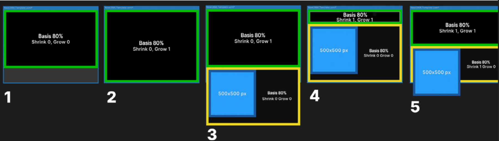

上面的示例显示了 Basis 如何与 Grow 和 Shrink 选项配合使用：

1. 基础为 80% 的绿色元素占据了 80% 的可用空间
2. 将 Grow 设置为 1 允许绿色元素扩展到整个空间
3. 添加黄色元素后，元素会溢出空间 绿色元素恢复到占据 80% 的空间
4. 收缩设置为 1 会使绿色元素收缩以适合黄色元素
5. 这里，两个元素的 Shrink 值为 1 它们同等地收缩以适应可用空间

如您所见，具有以像素表示的固定大小的元素（3-5 中的蓝色框）不会对“Basis”（基础）、“Grow”（增长）或“Shrink”（收缩）设置做出反应

:::tip 计算视觉元素大小

布局引擎结合了 Size 和 Flexbox 设置来确定使用相对定位时每个元素的显示大小计算可视元素的大小需要执行以下操作：

- 布局系统根据宽度计算元素大小和高度属性
- 布局引擎检查父容器中是否有额外的可用空间，或者其子容器是否已经溢出可用空间
- 如果有额外的可用空间，布局系统会查找 Flex/Grow 设置中具有非零值的元素。它根据该因素分配额外的空间，扩展子元素
- 如果子元素溢出可用空间，具有非零 Flex/Shrink 值的元素的大小将相应减小
- 然后会考虑影响元素最终大小的任何其他属性（MinWidth、Flex-Basis 等）
- 布局引擎应用这个最终的、已解析的尺寸

方向设置定义子元素在父级内部的排列方式 层次结构菜单中较高位置的子元素首先出现 层次结构末尾的元素最后出现

换行设置告诉布局系统元素是否应该尝试适合一列或一行（无换行），否则，它们将出现在下一行或下一列（换行或反向换行）

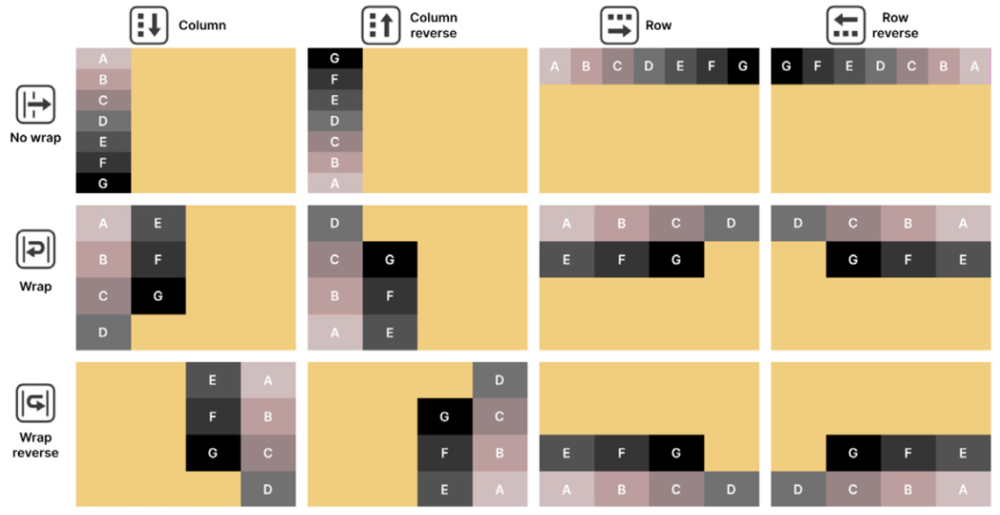

:::

#### Align设置

对齐设置决定子元素如何与其父元素对齐 在父元素中设置“对齐”>“对齐项目”以将子元素对齐到起点、中心或终点 这些选项会影响横轴（垂直于父元素中的行或列）弯曲 > 方向）

“拉伸”选项也可沿横轴工作，但尺寸的“最小值”或“最大值”会限制效果（这是默认设置）。同时，“自动”选项表示布局引擎可以根据尺寸自动选择其他选项之一。其他参数 建议您选择其中一个选项以更好地控制布局，并且主要在特殊用例中使用“自动”选项

转到“对齐”>“内容对齐”以定义布局引擎如何在父元素内分隔子元素。这些元素可以对齐、彼此相邻，或使用可用空间展开。Flex > Grow 和 Flex > Shrink 设置会影响生成的布局

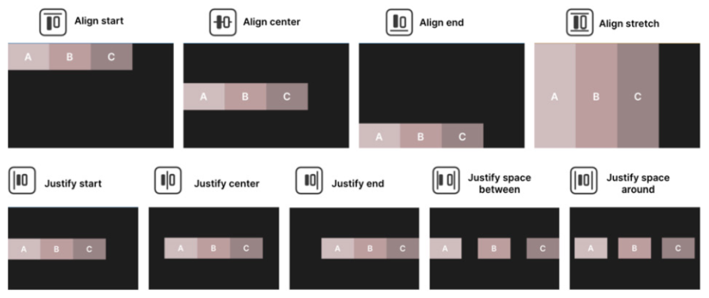

#### Margin和Padding设置

使用边距和填充设置来定义视觉元素及其内容周围的空白区域 Unity 使用标准 CSS 框模型的变体，类似于图表

- 内容空间包含关键的视觉元素（文本、图像、控件等）
- 填充定义内容空间周围但内部的空白区域边界
- 边框定义了填充和边距之间的边界，可以是彩色和圆角的，如果给定厚度，则边框向内扩展
- Margin 与 Padding 类似，但定义了 Border 之外的区域

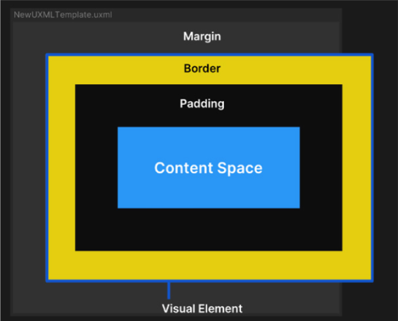

:::tip 边距

在 UI Builder 中，您可以使用“位置”或“边距”设置创建空边距：

- 对于具有相对位置的元素，请使用边距设置
- 对于具有绝对位置的元素，请使用位置设置

在绝对定位中，位置设置中的边距是从父容器的边缘定义的，这也可以方便地将元素锚定到角落例如，在右侧和底部参数中设置零值将元素固定到底部 - Flex 容器的右侧部分

:::

#### 背景和图像

在 UI Toolkit 中，任何视觉元素都可以充当屏幕图像 只需交换背景即可显示纹理或精灵

您可以填充颜色或图像来更改元素的外观这对于线框很有帮助具有对比度的明亮颜色可以显示不同元素彼此相邻的外观以及对其容器中的变化的响应

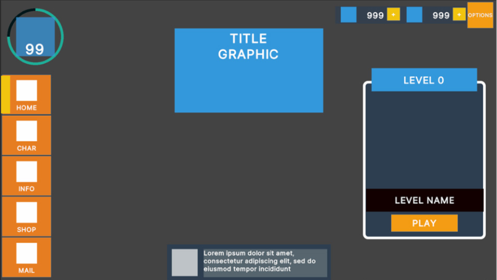

### 可变或固定测量单位

在 UI Builder 中，您将遇到四个定义元素距离和大小的参数：

- 自动：这是大小和位置的默认选项 布局系统，根据父元素和子元素的信息计算元素的值
- 百分比：单位等于元素容器的百分比，并随着父元素的宽度和高度动态变化。使用百分比可以在处理多种格式大小时提供可扩展性。例如，在 1920x1080 像素的父容器中，设置为大小 50% 的子元素将为 960x540 像素。同样，左边距 10% 和顶部边距 20% 表示最左边的 192 像素和最上面的 216 像素
- 像素：此选项对于定位固定分辨率（例如，全高清为 1920 x 1080），或者如果您专门设置以像素为单位的值（例如，5 像素填充边界）非常有用
- 初始：这会将属性设置回默认状态（Unity 自己的默认样式规则），忽略当前的样式值

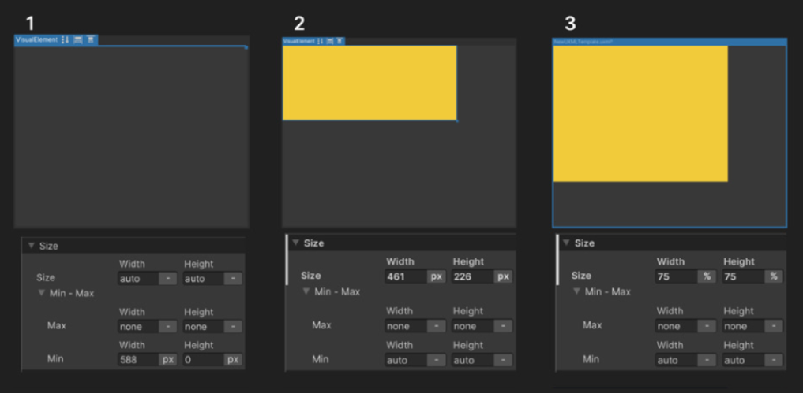

为了同时将缩放规则应用于整个 UI，UI Toolkit 提供了与 Unity UI 中类似的设置，它们可在“面板设置”中找到

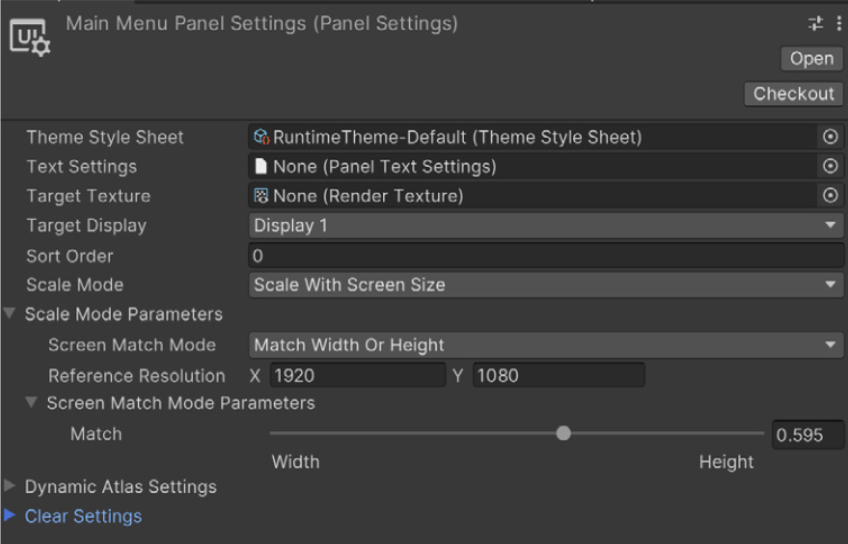

:::tip 像素与百分比

检查器中的许多字段可以设置为以像素 (px) 或百分比 (%) 作为单位像素值是绝对的，而百分比是相对于元素的父元素的

如果您不指定测量单位，UI Toolkit 会假定属性值以像素表示 您可以组合不同的单位来实现您想要的结果。例如，对于较大的值使用百分比，容器元素，而子元素依赖像素。

如果您的目标屏幕具有相似的屏幕比例但不同的分辨率（例如，具有全高清和 4K 分辨率的屏幕），那么使用百分比可能是一个不错的选择。如果您想要描述同时适用于纵向或横向的元素，那么使用百分比也很有帮助相对于屏幕尺寸的模式（想象一个占据左上角 10% 的元素）。如果你有绝对最小值（例如，按钮或边距必须不小于特定宽度），使用像素作为单位。

:::

### 更多资源

UI Toolkit 使用 Yoga 的修改版本，它是 Flexbox 布局引擎的实现。因为 Flexbox 和 Yoga 是 Web 和应用程序中的现有标准开发，网上有各种资源。

可以看看这些文章或页面：

- [运行时的 UI 工具包：获取细分](https://blog.unity.com/technology/ui-toolkit-at-runtime-get-the-breakdown)
- [Yoga 官方文档](https://yogalayout.com/)
- [Flexbox 的 CSS 技巧指南](https://css-tricks.com/snippets/css/a-guide-to-flexbox/)

## UI  Toolkit：样式

### 用户界面生成器

### Canvas 背景

### Viewpoint 设置

### Uss 选择器

#### 重写样式

#### 命名约定

### 动画和特效

#### 过渡动画

### 相机渲染Texture

### Themes

## Unity 字体

### 源字体文件

### 字体资源设置

#### 富文本

#### 文本样式表

### 字体资源变体

### 精灵资产

### 颜色渐变

## 探索 UI Toolkit 示例项目

### 菜单栏

### 主屏幕

### 人物画面

### 库存

### 店铺画面

### 邮件屏幕

### 设置屏幕

### 主菜单

### 游戏画面

### 参考

### 自定义用户界面元素

### Uss 过渡

### UI Toolkit 的下一步是什么
